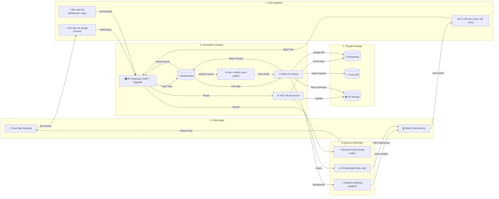
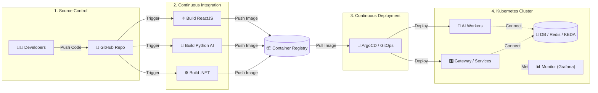
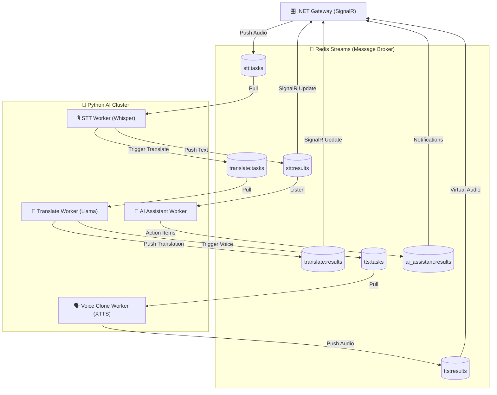
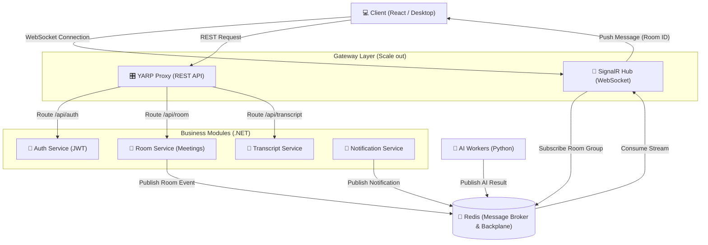

# Kiến trúc WarpTalk x Data Lakehouse

Dựa trên ý tưởng đối chiếu hệ thống WarpTalk với kiến trúc Enterprise Data Lakehouse (như Databricks/Delta Lake), dưới đây là bản vẽ kiến trúc sơ bộ để chúng ta cùng brainstorm. 

Biểu đồ này tuân thủ nguyên tắc **Tách biệt Tính toán và Lưu trữ (Decoupled Compute and Storage)**, đồng thời làm nổi bật khả năng xử lý **Polyglot Persistence** (Đa lưu trữ) và **Diverse Workloads** (Đa dạng tác vụ đầu ra).

## Giải thích luồng dữ liệu theo góc nhìn Lakehouse:

1. **Ingestion (Bơm dữ liệu vào):** .NET Gateway đóng vai trò như một phễu hứng mọi loại data (từ âm thanh real-time đến các thao tác click chuột). Gateway **không trực tiếp tính toán AI** mà chỉ làm nhiệm vụ xác thực, phân loại và lưu trữ tạm thời.
2. **Storage (Lưu trữ như Delta Lake):** Dữ liệu thô lập tức được phân bổ về đúng nơi lưu trữ phù hợp (Postgres cho giao dịch tiền nong, S3 cho file gốc để lưu vết, VectorDB cho các embedding siêu chiều). Tính chất "Lake" thể hiện ở việc chúng ta giữ lại toàn bộ data thô (raw audio, webhook payload).
3. **Compute (Tính toán như Databricks):** Khi có cuộc họp, Gateway đẩy task qua Redis/gRPC. Cụm AI Workers (Python) sẽ được bật lên (hoặc scale out) để kéo dữ liệu từ Storage và Broker về xử lý. Tính toán xong, chúng ghi kết quả ngược lại Storage hoặc trả về Broker rồi rảnh rỗi. Nếu sập Worker, dữ liệu ở Storage vẫn an toàn.
4. **Workloads (Tiêu thụ):** Dữ liệu sau khi xử lý được phục vụ cho 3 mục đích hoàn toàn khác nhau (Real-time stream, Phân tích chuyên sâu, và Lên biểu đồ báo cáo).

---
## Cơ chế Auto-Scale của cụm Python AI Cluster

Điểm sáng giá nhất của kiến trúc này là khả năng mở rộng cụm AI hoàn toàn độc lập nhờ cơ chế giao tiếp qua Message Broker (Redis Streams/gRPC).

1. **Phi trạng thái (Statelessness):** Các Python Workers (STT, LLM, Voice Cloning) không lưu giữ state của cuộc họp. Chúng chỉ có một nhiệm vụ duy nhất: Kéo (pull) 1 chunk audio từ Redis -> Tính toán (bằng GPU) -> Trả kết quả lại Redis.
2. **Consumer Groups (Cân bằng tải tự động):** Các AI worker cùng loại sẽ tham gia vào chung một `Consumer Group` trong Redis. Nếu Gateway đẩy 100 task vào hàng đợi và bạn đang có 5 AI worker, Broker sẽ tự động chia đều task cho 5 worker này (Round-robin) mà không bắt Gateway phải biết IP hay tự điều phối.
3. **Scale theo chiều ngang (Scale-out):** Khi số lượng phòng họp tăng đột biến, lượng task đổ vào hàng đợi (queue) sẽ tăng vọt. Một hệ thống điều phối (như Kubernetes HPA) chỉ cần theo dõi "độ dài của hàng đợi". Queue càng dài -> tự động bật thêm (spawn) các container Python AI mới. Worker mới vừa boot xong sẽ lập tức cắm vào Redis kéo task phụ giúp ngay.
4. **Scale to Zero (Tối ưu chi phí):** Khi tất cả cuộc họp kết thúc, hàng đợi trống không. Orchestrator sẽ tự động tắt sạch cụm AI (vốn ngốn rất nhiều tiền thuê GPU). Trong lúc đó, cụm `.NET Gateway`, `Database` và `React Web` (rất nhẹ và rẻ) vẫn thức 24/7 để phục vụ người dùng đăng nhập và xem lại lịch sử.

> [!TIP]
> **Chốt hạ trước hội đồng:** Nhờ sự tách biệt hoàn toàn Compute (AI) khỏi Control Plane (.NET Gateway), WarpTalk giải quyết được bài toán hóc búa nhất của AI Streaming: **Chịu tải vô hạn khi có hàng nghìn người họp cùng lúc (chỉ cần scale thêm worker), nhưng lại tối ưu chi phí xuống mức 0 cho cụm AI khi hệ thống nhàn rỗi.**

---

## Phụ lục 1: Kiến trúc DevOps Pipeline (CI/CD)

Để triển khai và vận hành mượt mà kiến trúc đồ sộ như trên, hệ thống cần một quy trình tự động hóa (CI/CD) chuẩn mực. Dưới đây là luồng DevOps từ lúc code đến lúc đẩy lên Production (Kubernetes).

---

## Phụ lục 2: Chi tiết luồng dữ liệu của AI Workers (Data Plane)

Biểu đồ này "zoom" kỹ vào cụm `Compute` để thấy rõ cách Gateway và các AI Workers giao tiếp hoàn toàn phi trạng thái (Stateless) thông qua các hàng đợi Redis Streams. 

---

## Phụ lục 3: Kiến trúc Microservices & Luồng Real-time SignalR

Sơ đồ này mô tả chi tiết cách Gateway phân luồng dữ liệu (Routing) đến các Microservices và cách hệ thống quản lý kết nối Real-time (SignalR) với hàng ngàn thiết bị Client thông qua Redis.

