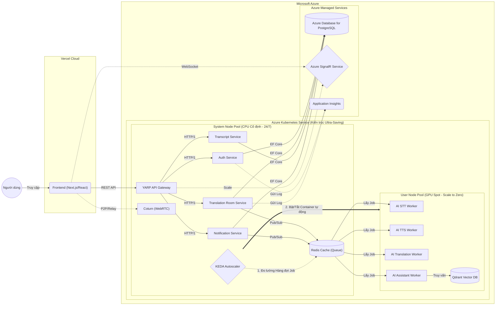

# Sơ đồ Triển khai Kiến trúc Hệ thống (WarpTalk Deployment Architecture)

Dựa trên quyết định chốt phương án **Azure AKS (cho Backend & AI)** và **Vercel (cho Frontend)**, đây là sơ đồ luồng dữ liệu và tổ chức hạ tầng (Infrastructure) chi tiết.

### Chú thích luồng hoạt động (Data Flow):
1. **Truy cập UI:** Người dùng truy cập vào Domain, tải giao diện Frontend siêu tốc từ mạng lưới CDN toàn cầu của **Vercel**.
2. **Gọi API:** Từ Vercel (trình duyệt của User), Frontend gửi các HTTP REST Request đâm thẳng vào địa chỉ Public IP của **YARP API Gateway** đang chạy trên CPU Node Pool của cụm AKS.
3. **Định tuyến (Routing):** Gateway điều phối request tới các .NET Microservices tương ứng (Auth, Translation Room, Transcript). Các Service này lưu/đọc dữ liệu từ **Azure Managed PostgreSQL**.
4. **Xử lý AI Âm thanh (GPU):**
   - Khi có file âm thanh từ Frontend gửi lên, Backend đẩy thông điệp vào **Redis Queue** (nằm ở CPU Pool).
   - Các **AI Workers** (Python) đang túc trực bên cụm GPU Node Pool lập tức "chộp" lấy thông điệp từ Redis, tận dụng sức mạnh card NVIDIA T4 để dịch thuật nhanh nhất có thể.
   - Khi dịch xong, AI Worker đẩy kết quả ngược lại Redis. Backend nhận kết quả và bắn về Frontend qua **Azure SignalR**.
5. **Giám sát (Monitoring):** Toàn bộ log và số liệu hoạt động của hệ thống được đẩy về **Application Insights** để vẽ biểu đồ và cảnh báo lỗi.
