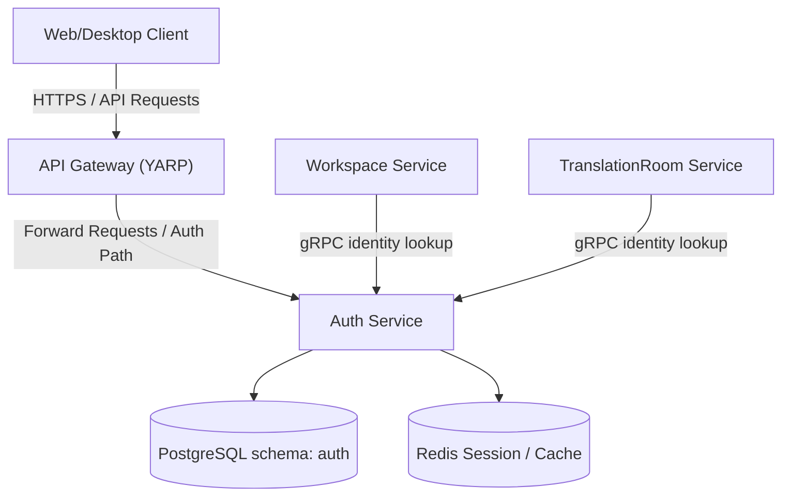
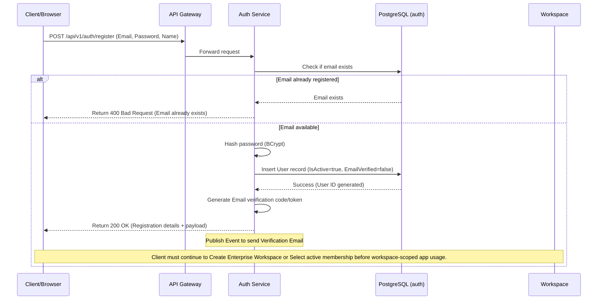
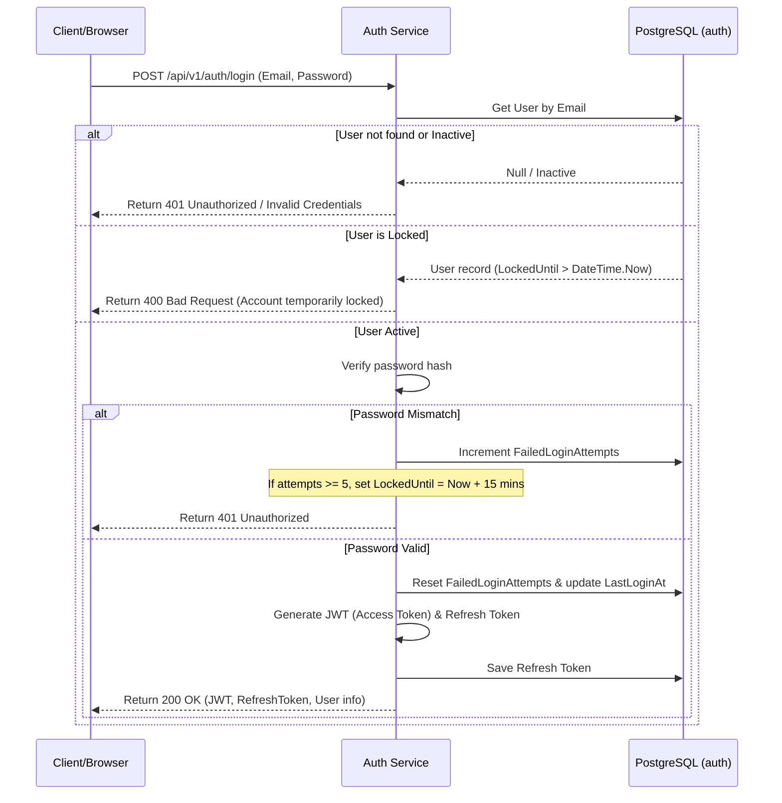
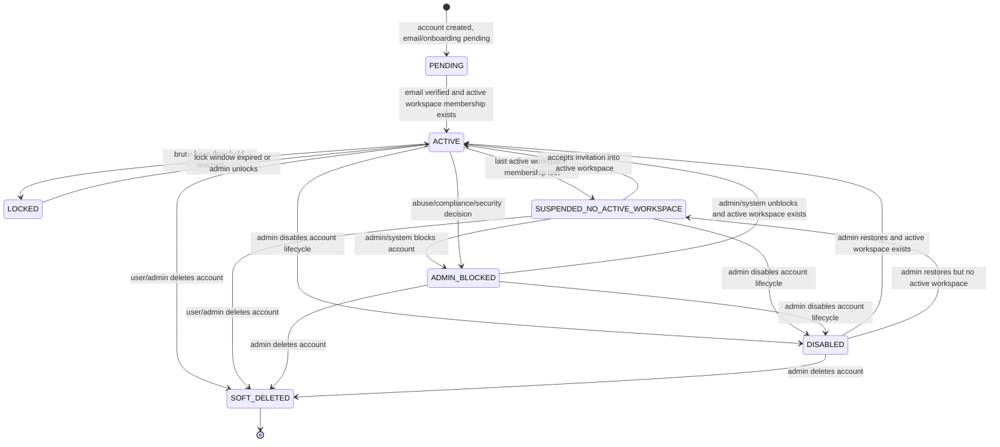
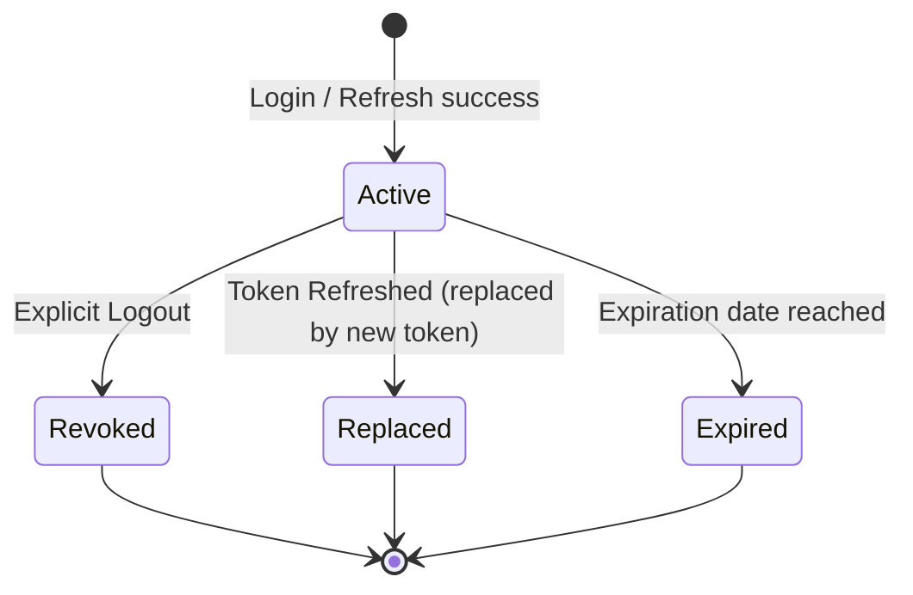

# Auth Module Requirements Overview

**Ngôn ngữ:** Tiếng Việt  
**Phạm vi:** WarpTalk Backend - Auth Service và các tích hợp API Gateway, Workspace, TranslationRoom, Notification  
**Ngày tạo:** 2026-06-13  
**Deliverable song hành:** `auth-software-requirement-specification.docx`

---

## 1. Document control

| Field | Value |
|---|---|
| Title | Auth Module Software Requirement Specification |
| Version | 1.3 |
| Created by | Antigravity AI |
| Last updated | 2026-06-13 |
| Scope | Auth module (Identity, Authentication, Authorization, RBAC) và gRPC/REST interface. |
| Primary source | warptalk-backend/auth + auth-service code inspection + database models. |
| Update rule | Mỗi lần chỉnh sửa tính năng, API, DB hoặc cấu trúc JWT/Session phải cập nhật change log và QA checklist. |

### 1.1 Change log

| Version | Date | Author/AI | Change | Reason |
|---|---|---|---|---|
| 1.0 | 2026-06-13 | Antigravity | Initial Auth SRS and overview | Consolidated Auth specs, endpoints, schema, and diagram specifications. |
| 1.1 | 2026-06-13 | Codex | Enterprise-only account boundary | Clarified that WarpTalk is Enterprise Workspace-only: account identity is global in Auth, but app access requires at least one active Enterprise Workspace membership or an invitation/create-workspace onboarding path. |
| 1.2 | 2026-06-13 | Codex | Workspace-dependent account suspension | Added `SUSPENDED_NO_ACTIVE_WORKSPACE`, separated it from `ADMIN_BLOCKED` and `DISABLED`, and clarified soft-delete-only account lifecycle. |
| 1.3 | 2026-06-13 | Codex | Runtime correction | Corrected Auth runtime from .NET 9 to .NET 10 based on `TargetFramework=net10.0` in Auth projects. |

### 1.2 AI usage log

| Date | AI/Actor | Scope | Work performed | Usage |
|---|---|---|---|---|
| 2026-06-13 | Antigravity | SRS generation | Created Auth overview/SRS from codebase inspection and directory files. | Handled locally via code editor. |
| 2026-06-13 | Codex | Enterprise-only correction | Updated Auth business rules for invited registration, active workspace dependency and account-vs-membership status separation. | Not available from local API telemetry. |
| 2026-06-13 | Codex | Account status taxonomy | Defined Workspace-loss suspension, admin block, disabled and soft-delete semantics. | Not available from local API telemetry. |
| 2026-06-13 | Codex | Runtime verification | Verified Auth project files target `net10.0` and updated technology section. | Not available from local API telemetry. |

### 1.3 Rules for updating this file

- Mọi thay đổi về thuật toán mã hóa mật khẩu, cấu trúc Token, phân quyền RBAC, database schema `auth` phải cập nhật tài liệu này.
- Khi thêm mới hoặc thay đổi các gRPC API của Auth, phải cập nhật mục "Interface nội bộ (gRPC)" và sơ đồ tuần tự (Sequence Diagram).

---

## 2. Review tổng quát

Module Auth (`WarpTalk.AuthService`) là lớp bảo mật trung tâm của hệ thống WarpTalk. Nó chịu trách nhiệm xác thực danh tính người dùng (Authentication), quản lý phiên làm việc (Session/Refresh Token), phân quyền dựa trên vai trò (Role-Based Access Control - RBAC) và cung cấp thông tin định danh cho các dịch vụ downstream thông qua API Gateway hoặc kết nối gRPC nội bộ.

Auth Service hoạt động độc lập theo kiến trúc Microservice, quản lý schema `auth` riêng biệt trong PostgreSQL, đồng thời sử dụng các giao thức bảo mật hiện đại như JWT mã hóa đối xứng (HMAC-SHA256) và tích hợp Google OAuth2 cho đăng nhập một chạm.

Theo định hướng sản phẩm B2B hiện tại, WarpTalk là hệ thống **Enterprise Workspace-only**. Auth Service không tạo hoặc quản lý Personal Workspace. Một `auth.users` record chỉ biểu diễn danh tính toàn cục của người dùng; quyền tồn tại như **active app user** phải được quyết định bởi Workspace Service thông qua active Enterprise Workspace membership. Vì vậy, nếu user mất active workspace cuối cùng, account không bị hard-delete nhưng phải chuyển sang trạng thái `SUSPENDED_NO_ACTIVE_WORKSPACE` và chỉ được dùng luồng giới hạn như nhận/chấp nhận invitation vào workspace active mới.

---

## 3. Scope và out of scope

### In scope

- Đăng ký tài khoản theo mô hình Enterprise-only: bootstrap tài khoản để tạo Enterprise Workspace đầu tiên hoặc đăng ký theo lời mời Workspace (Register Invited).
- Đăng nhập tài khoản bằng Email/Password truyền thống với cơ chế chống Brute-force (khóa tài khoản tạm thời sau N lần nhập sai).
- Đăng nhập thông qua Google OAuth2 (Google Sign-In).
- Cấp phát, gia hạn (Refresh Token) và thu hồi phiên làm việc (Logout).
- Xác thực email (Email Verification) và gửi lại mã kích hoạt.
- Quản lý Hồ sơ người dùng (Profile) và cấu hình cá nhân (Preferred Language, Timezone).
- Phân quyền RBAC (User, Role, Permission) và cung cấp các truy vấn gRPC tốc độ cao cho các dịch vụ khác (Workspace, TranslationRoom).
- Xác định ranh giới account-vs-workspace: Auth quản lý danh tính và trạng thái account; Workspace quản lý active workspace membership, role, membership type và quyền truy cập tenant.

### Out of scope

- Xác thực hai yếu tố (2FA/MFA) qua SMS hoặc Authenticator App (sẽ phát triển ở các pha tiếp theo).
- Tự động đồng bộ hóa hồ sơ với các mạng xã hội khác ngoài Google (Facebook, GitHub...).
- Quản trị toàn hệ thống cấp Platform Admin (sử dụng màn hình quản trị hệ thống riêng ngoài phạm vi App).
- Tự động tạo Personal Workspace hoặc cho phép user dùng app mà không có Enterprise Workspace active.
- Hard-delete account hoặc xóa vật lý user khỏi `auth.users`; mọi xóa account phải là soft-delete để giữ audit.
- Đánh đồng mất workspace cuối cùng với `ADMIN_BLOCKED` hoặc `DISABLED`; đây là trạng thái `SUSPENDED_NO_ACTIVE_WORKSPACE` và có thể tự re-activate qua invitation hợp lệ.

---

## 4. Kiến trúc và công nghệ sử dụng



### Công nghệ chính

- **.NET 10 / ASP.NET Core Web API:** Phát triển RESTful API cho các tác vụ client-facing.
- **Clean Architecture:** Phân tách rõ ràng thành 4 dự án: API, Application, Domain, và Infrastructure.
- **Entity Framework Core + Npgsql:** Quản lý truy cập và di chuyển cơ sở dữ liệu (Migrations) cho PostgreSQL.
- **gRPC Services:** Cung cấp kênh truyền thông nội bộ hiệu năng cao (Protobuf) để giải quyết danh tính người dùng và quyền hạn cho các service downstream.
- **JWT (JSON Web Tokens):** Tạo và xác thực access token có chữ ký số mã hóa đối xứng.

### 4.1 Technology matrix của Auth Subsystem

| Subsystem | Tech component | Usage in Auth Service |
|---|---|---|
| Web API | ASP.NET Core Controllers | REST API endpoints under `/api/v1/auth`, `/api/v1/profile`, `/api/v1/users/settings`. |
| Inter-service | gRPC | `UserServiceGrpc` triển khai Protobuf contract để các service khác gọi kiểm tra định danh. |
| Persistence | EF Core + PostgreSQL | Quản lý schema `auth` lưu thông tin người dùng, mật khẩu hash, phân quyền RBAC và token. |
| Security | BCrypt / Cryptography | Băm mật khẩu người dùng trước khi lưu trữ (Password Hashing) kết hợp Salt. |
| Cache | Redis | Lưu trạng thái Refresh Token thu hồi hoặc blacklist. |

---

## 5. Database Schema

Cơ sở dữ liệu của Auth Service nằm hoàn toàn trên schema `auth` của PostgreSQL để đảm bảo cô lập dữ liệu.

```mermaid
erDiagram
    USERS ||--o{ REFRESH_TOKENS : generates
    USERS ||--o{ USER_ROLES : has
    ROLES ||--o{ USER_ROLES : defines
    ROLES ||--o{ ROLE_PERMISSIONS : contains
    PERMISSIONS ||--o{ ROLE_PERMISSIONS : assigns
    USERS ||--|| USER_SETTINGS : configures

    USERS {
        uuid id PK
        varchar email UK
        varchar password_hash
        varchar full_name
        varchar avatar_url
        varchar phone
        varchar preferred_language
        varchar timezone
        boolean is_active
        boolean is_locked
        int failed_login_attempts
        timestamptz locked_until
        boolean email_verified
        timestamptz email_verified_at
        varchar google_id
        timestamptz last_login_at
        varchar last_login_ip
        timestamptz created_at
        timestamptz updated_at
        timestamptz deleted_at
    }
    REFRESH_TOKENS {
        uuid id PK
        uuid user_id FK
        varchar token UK
        timestamptz expires_at
        timestamptz created_at
        varchar created_by_ip
        timestamptz revoked_at
        varchar revoked_by_ip
        varchar replaced_by_token
    }
    ROLES {
        uuid id PK
        varchar name UK
        varchar description
        timestamptz created_at
    }
    PERMISSIONS {
        uuid id PK
        varchar name UK
        varchar description
        timestamptz created_at
    }
    USER_ROLES {
        uuid user_id PK_FK
        uuid role_id PK_FK
        timestamptz assigned_at
        uuid assigned_by FK
    }
    ROLE_PERMISSIONS {
        uuid role_id PK_FK
        uuid permission_id PK_FK
        timestamptz created_at
    }
    USER_SETTINGS {
        uuid user_id PK_FK
        boolean theme_dark
        boolean email_notifications
        jsonb custom_preferences
    }
```

### 5.1 Danh sách bảng chi tiết

| Bảng | Mục đích | Thuộc tính chính |
|---|---|---|
| `auth.users` | Lưu trữ thông tin tài khoản người dùng chính. | `id` (PK UUID), `email` (Unique), `password_hash`, `google_id`, trạng thái khóa, ngày tạo/sửa/xóa. |
| `auth.refresh_tokens` | Quản lý vòng đời gia hạn Access Token. | `id` (PK UUID), `user_id` (FK), `token` (Unique Hash), `expires_at`, thông tin thu hồi (revocation metadata). |
| `auth.roles` | Danh mục các vai trò trong hệ thống (Owner, Admin, Member...). | `id` (PK UUID), `name` (Unique string), `description`. |
| `auth.permissions` | Danh mục quyền chi tiết (ví dụ: `document:upload`, `room:create`). | `id` (PK UUID), `name` (Unique), `description`. |
| `auth.user_roles` | Bảng liên kết trung gian User và Role (Nhiều - Nhiều). | `user_id` (FK), `role_id` (FK), `assigned_at`. |
| `auth.role_permissions` | Bảng liên kết trung gian Role và Permission (Nhiều - Nhiều). | `role_id` (FK), `permission_id` (FK). |
| `auth.user_settings` | Lưu trữ tùy chọn giao diện và nhận thông báo cá nhân. | `user_id` (PK, FK->users), `theme_dark`, `email_notifications`. |

---

## 6. API và Interface công khai

### 6.1 RESTful API Endpoint (Client-Facing)

Tất cả các endpoint công khai đều được bảo vệ bởi API Gateway tại cổng `5200` và chuyển tiếp đến `auth-service` chạy cổng `5101` nội bộ.

| Method | Route | Yêu cầu xác thực | Mục đích |
|---|---|---|---|
| `POST` | `/api/v1/auth/register` | Không | Bootstrap tài khoản mới bằng Email/Password để tạo Enterprise Workspace đầu tiên. Không được xem là luồng dùng app tự do nếu sau đó user không tạo/chọn được Enterprise Workspace active. |
| `POST` | `/api/v1/auth/register-invited` | Không | Đăng ký tài khoản được mời trực tiếp vào Enterprise Workspace. Email không nhập tự do; Auth xác thực invitation token qua Workspace gRPC và lấy email từ invitation đã phát hành. |
| `POST` | `/api/v1/auth/login` | Không | Đăng nhập tài khoản, trả về AccessToken & RefreshToken. |
| `POST` | `/api/v1/auth/refresh` | Không | Sử dụng Refresh Token để lấy cặp Access/Refresh Token mới. |
| `POST` | `/api/v1/auth/logout` | `[Authorize]` | Thu hồi Refresh Token hiện tại và xóa phiên đăng nhập. |
| `POST` | `/api/v1/auth/resend-verification`| `[Authorize]` | Gửi lại mã/link xác thực email của người dùng. |
| `POST` | `/api/v1/auth/google` | Không | Đăng nhập một chạm thông qua Google ID Token. |
| `GET` | `/api/v1/profile` | `[Authorize]` | Lấy thông tin cá nhân hiện tại. |
| `PUT` | `/api/v1/profile` | `[Authorize]` | Cập nhật thông tin cá nhân (Họ tên, số điện thoại, ảnh đại diện). |
| `GET` | `/api/v1/users/settings` | `[Authorize]` | Lấy cấu hình cá nhân của người dùng. |
| `PUT` | `/api/v1/users/settings` | `[Authorize]` | Cập nhật cấu hình cá nhân (Giao diện tối, tùy chọn email). |

### 6.2 Interface nội bộ (gRPC Services)

Auth Service mở một cổng gRPC tại cổng `50051` để các microservice khác gọi nội bộ nhằm truy vấn dữ liệu định danh của người dùng.

```protobuf
syntax = "proto3";

package warptalk.auth;

service UserService {
  rpc GetUserById (GetUserRequest) returns (GetUserResponse);
  rpc GetUserByEmail (GetUserByEmailRequest) returns (GetUserResponse);
  rpc GetRoleByName (GetRoleByNameRequest) returns (GetRoleResponse);
  rpc GetRoleById (GetRoleByIdRequest) returns (GetRoleResponse);
}

message GetUserRequest {
  string id = 1;
}

message GetUserByEmailRequest {
  string email = 1;
}

message GetUserResponse {
  string id = 1;
  string email = 2;
  string full_name = 3;
  string avatar_url = 4;
  string preferred_language = 5;
}

message GetRoleByNameRequest {
  string name = 1;
}

message GetRoleByIdRequest {
  string id = 1;
}

message GetRoleResponse {
  string id = 1;
  string name = 2;
  string description = 3;
}
```

---

## 7. Web Route Intent

Các router phía Frontend (`warptalk-web`) phục vụ trực tiếp cho Auth module:

* `/login`: Màn hình điền thông tin đăng nhập và tùy chọn Google Sign-in.
* `/register`: Màn hình bootstrap tài khoản mới để tạo Enterprise Workspace đầu tiên; không tự tạo Personal Workspace.
* `/register-invited` hoặc invitation accept route tương đương: Màn hình đăng ký theo lời mời Workspace; email hiển thị readonly/prefill từ invitation preview, user chỉ nhập mật khẩu và thông tin hồ sơ còn thiếu.
* `/forgot-password`: Yêu cầu gửi email khôi phục mật khẩu.
* `/profile/settings`: Nơi người dùng cập nhật hồ sơ cá nhân, ngôn ngữ hiển thị mặc định và chuyển đổi Dark/Light mode.

---

## 8. Main Flows

### 8.1 Flow Đăng ký bootstrap Enterprise Workspace (Register)



### 8.1.1 Flow Đăng ký theo lời mời Enterprise Workspace (Register Invited)

```mermaid
sequenceDiagram
    participant User as Invited User
    participant Web as Web Client
    participant Auth as Auth Service
    participant Workspace as Workspace Service
    participant DB as Auth DB

    User->>Web: Open invitation link
    Web->>Workspace: Preview invitation token
    Workspace-->>Web: Workspace name, masked/prefilled email, role, expiry, accountExists
    alt Account does not exist
        User->>Web: Enter password and profile fields; email is readonly from invitation
        Web->>Auth: POST /api/v1/auth/register-invited (Token, Password, FullName)
        Auth->>Workspace: gRPC VerifyInvitationToken(Token)
        Workspace-->>Auth: Valid invitation with invited email
        Auth->>DB: Create auth.users + user_settings
        Auth->>Workspace: gRPC AcceptInvitation(Token, UserId, Email)
        Workspace-->>Auth: Active workspace membership created/reactivated
        Auth-->>Web: Auth tokens + user profile
    else Account exists
        User->>Web: Login with invited email
        Web->>Workspace: Accept invitation with authenticated identity
        Workspace-->>Web: Active workspace membership created/reactivated
    end
```

### 8.2 Flow Đăng nhập (Login)



---

## 9. State Diagrams

### 9.1 Vòng đời trạng thái account Enterprise-only



### 9.2 Vòng đời của Refresh Token



---

## 10. Use Case Diagram

```mermaid
usecasediagram
    actor Guest
    actor Member
    actor Microservice as Downstream Service (gRPC)

    Guest --> (Bootstrap account for Enterprise Workspace)
    Guest --> (Register from Workspace invitation)
    Guest --> (Login via Email/Password)
    Guest --> (Login via Google OAuth)
    
    Member --> (Accept Workspace invitation)
    Member --> (Select active Enterprise Workspace)
    Member --> (Logout / Terminate Session)
    Member --> (Update Profile)
    Member --> (Manage User Preferences)
    
    Microservice --> (Lookup User Profile by ID/Email)
    Microservice --> (Validate Roles/Permissions)
```

---

## 11. User Requirements

- **Khách vãng lai (Guest):** Mong muốn đăng ký nhanh gọn, có thể đăng nhập bằng tài khoản Google để tiết kiệm thời gian, giao diện đăng ký phản hồi trực quan khi nhập mật khẩu yếu.
- **Thành viên (Member/User):** Mong muốn có thể chỉnh sửa ngôn ngữ giao diện ưa thích và tự động lưu lựa chọn giao diện tối (Dark mode) khi tải lại trang; mong muốn phiên làm việc được duy trì tự động mà không cần đăng nhập lại liên tục (qua Refresh Token).
- **Hệ thống microservice:** Cần xác định nhanh chóng thông tin họ tên, email, ngôn ngữ cấu hình của người dùng để thực thi các nghiệp vụ routing cuộc dịch họp và lưu giữ tệp tin.

---

## 11.1 Enterprise-only Business Rules

| ID | Business rule | Detail |
|---|---|---|
| **BR-AU-ENT-001** | Auth user là identity toàn cục, không phải tenant membership. | `auth.users` lưu danh tính, email, password hash, trạng thái khóa/xóa mềm và hồ sơ cá nhân. Workspace ownership, member role, membership type, active workspace và external scope nằm ở Workspace Service. |
| **BR-AU-ENT-002** | App access yêu cầu active Enterprise Workspace membership. | Sau login, client/gateway phải chọn hoặc xác định active workspace. Nếu user không có active membership trong Enterprise Workspace nào, app shell phải chuyển user tới invitation accept/create Enterprise Workspace onboarding thay vì cho truy cập room/document/artifact. |
| **BR-AU-ENT-003** | Không tồn tại Personal Workspace auto-provision. | Register, Google login hoặc profile creation không được tự sinh Personal Workspace. Workspace phải được tạo qua Workspace Service hoặc được gắn qua invitation lifecycle. |
| **BR-AU-ENT-004** | Register-invited dùng email từ invitation token. | Với user chưa có account, invitation preview hiển thị email được mời ở trạng thái readonly/prefill; request đăng ký chỉ cần token, password và thông tin hồ sơ còn thiếu. Auth gọi Workspace gRPC để verify token trước khi tạo user, sau đó gọi accept invitation để tạo active membership. |
| **BR-AU-ENT-005** | Existing account accept invitation phải có email khớp. | Nếu account đã tồn tại, user phải đăng nhập đúng email được mời rồi accept invitation. Email mismatch, token expired/revoked/replaced hoặc workspace inactive đều bị từ chối bởi Workspace boundary. |
| **BR-AU-ENT-006** | Mất active workspace cuối cùng phải suspend app account. | Khi workspace active cuối cùng của user bị deactivated/soft-deleted hoặc membership active cuối cùng bị removed, Auth phải chuyển account sang `SUSPENDED_NO_ACTIVE_WORKSPACE`. Đây không phải hard-delete và không phải admin block. |
| **BR-AU-ENT-007** | Remove member có thể làm account bị suspend nếu đó là workspace cuối cùng. | Khi internal/external member bị remove khỏi một workspace, Workspace phải kiểm tra user còn active membership trong active Enterprise Workspace nào khác không. Nếu không còn, Auth nhận event/gRPC command để set `SUSPENDED_NO_ACTIVE_WORKSPACE`; nếu còn workspace khác thì account vẫn `ACTIVE`. |
| **BR-AU-ENT-008** | External member vẫn phải có WarpTalk account. | External collaborator phải register/login bằng WarpTalk account để audit, artifact access, token/session và RBAC hoạt động nhất quán. Tuy nhiên quyền của họ luôn bị scope bởi active external membership hoặc meeting/artifact exception, không phải bởi account status đơn thuần. |
| **BR-AU-ENT-009** | Suspended account vẫn có thể nhận và accept invitation. | `SUSPENDED_NO_ACTIVE_WORKSPACE` không chặn email invitation, invitation preview hoặc accept invitation đúng email. Khi accept thành công vào workspace active, Auth chuyển account về `ACTIVE`. |
| **BR-AU-ENT-010** | Admin/system blocked khác suspended. | `ADMIN_BLOCKED` dùng cho abuse, compliance, security hoặc quyết định kick/block của system admin. Account ở trạng thái này không được tự re-activate bằng invitation; phải có admin/system unblock. |
| **BR-AU-ENT-011** | Disabled khác blocked và suspended. | `DISABLED` là vô hiệu hóa lifecycle/account bởi admin hoặc chính sách vận hành, không nhất thiết do vi phạm. Account disabled không được login/accept invitation cho tới khi admin restore. |
| **BR-AU-ENT-012** | Account deletion luôn là soft-delete. | Không hard-delete `auth.users`. Khi xóa account, set `deleted_at`, `deleted_by` và trạng thái/flag tương ứng để chặn login/token, nhưng giữ identity cho audit, meeting history, invitation history và legal trace. |

### 11.2 Enterprise-only account state decision

Auth account status and Workspace membership status must be evaluated together, but not conflated:

| Scenario | Auth account status | Workspace/app access behavior |
|---|---|---|
| User has at least one active Enterprise Workspace membership | `ACTIVE` unless locked/blocked/disabled/deleted by Auth policy. | User can select an active workspace and use permitted workspace-scoped features. |
| User's only workspace becomes inactive/deactivated | `SUSPENDED_NO_ACTIVE_WORKSPACE`. | Full app access is blocked; limited invitation/onboarding route remains available. |
| External member is removed from the only workspace | `SUSPENDED_NO_ACTIVE_WORKSPACE`. | External loses that workspace access; account may accept a future invitation into another active workspace. |
| User has no workspace membership but has a pending invitation | Absent account or `SUSPENDED_NO_ACTIVE_WORKSPACE` if account already exists. | UI routes to invitation preview/accept; new user registers with email readonly from invitation and password input. |
| Admin/system kicks or blocks user for policy/security reason | `ADMIN_BLOCKED`. | Login/token refresh/invitation accept are blocked until admin/system unblock. |
| Admin disables user lifecycle without abuse/security block | `DISABLED`. | Login/token refresh/invitation accept are blocked until admin restore. |
| User is soft-deleted in Auth | `SOFT_DELETED` via `deleted_at`/`deleted_by`; physical row remains. | Login/token refresh/gRPC user lookup should reject or mark deleted regardless of workspace membership. |

### 11.3 Account status taxonomy

| Status | Meaning | Invitation handling | Reactivation path |
|---|---|---|---|
| `PENDING` | Account exists but email verification or required onboarding is not complete. | Can receive invitation; accept may require completing verification/onboarding. | Verify email and obtain active workspace membership. |
| `ACTIVE` | Account has at least one active membership in an active Enterprise Workspace and is not locked/blocked/disabled/deleted. | Can receive and accept invitations according to Workspace rules. | Already active. |
| `SUSPENDED_NO_ACTIVE_WORKSPACE` | Account is retained for audit but has no active membership in any active Enterprise Workspace. | Can receive invitation, preview invitation and accept with matching email. | Accept valid invitation into active workspace or create Enterprise Workspace if bootstrap policy allows. |
| `LOCKED` | Temporary login lock caused by brute-force/failed password threshold. | Invitation email can be sent, but authenticated accept waits until lock expires or admin unlocks. | Lock window expires or admin unlocks. |
| `ADMIN_BLOCKED` | System admin/security/compliance intentionally blocks the account. | Invitation should not reactivate or grant access. | Admin/system unblock only. |
| `DISABLED` | Account lifecycle disabled by admin or operational policy, not necessarily abuse/security. | Invitation should not reactivate or grant access. | Admin restore only; then status becomes `ACTIVE` if active workspace exists, otherwise `SUSPENDED_NO_ACTIVE_WORKSPACE`. |
| `SOFT_DELETED` | Account deleted logically; `auth.users` row remains for audit/history. | No invitation accept/login unless explicit account restore policy exists. | Restore policy, if allowed, must be admin-controlled and audited. |

---

## 12. Functional Requirements (Yêu cầu chức năng)

| ID | Chức năng | Đặc tả yêu cầu chi tiết | Source code/Logic |
|---|---|---|---|
| **FR-AU-001** | Đăng ký bootstrap Enterprise | Đăng ký bằng Email + Mật khẩu + Họ tên để tạo identity ban đầu. Sau khi register, user chưa được dùng workspace-scoped features cho tới khi tạo/chọn được Enterprise Workspace active. Mật khẩu bắt buộc phải băm bằng thuật toán bảo mật trước khi lưu (BCrypt). | `AuthController.Register`, `AuthService.RegisterAsync`, Workspace create/select boundary |
| **FR-AU-002** | Đăng nhập | Xác thực thông tin đăng nhập, cập nhật địa chỉ IP cuối và thiết bị truy cập, ghi nhận thời gian đăng nhập gần nhất. Login chỉ cấp full app session khi account không bị locked/blocked/disabled/deleted và có active Enterprise Workspace membership; nếu account `SUSPENDED_NO_ACTIVE_WORKSPACE` thì chỉ cho limited invitation/onboarding session theo policy. | `AuthController.Login`, `AuthService.LoginAsync`, Workspace eligibility boundary |
| **FR-AU-003** | Khóa tài khoản | Tài khoản sẽ bị khóa tạm thời 15 phút nếu đăng nhập sai mật khẩu liên tiếp 5 lần. | `User.FailedLoginAttempts`, `User.LockedUntil` |
| **FR-AU-004** | Google Sign-In | Cho phép xác thực thông qua Google ID Token, tự động tạo mới tài khoản nếu email đó chưa tồn tại trong hệ thống. | `GoogleAuthController`, `GoogleAuthService` |
| **FR-AU-005** | Refresh Token | Hỗ trợ gia hạn Access Token qua Refresh Token (vòng đời tối đa 7 ngày). Khi một token được dùng để refresh, nó bị đánh dấu là Replaced và sinh token mới. | `TokenController.Refresh`, `TokenService.RefreshTokenAsync` |
| **FR-AU-006** | Đăng xuất | Xóa phiên làm việc hiện tại, vô hiệu hóa Refresh Token tương ứng ở Database và xóa cookie AccessToken ở Client. | `TokenController.Logout`, `TokenService.LogoutAsync` |
| **FR-AU-007** | gRPC Lookup | Cung cấp dịch vụ gRPC lấy thông tin chi tiết người dùng bằng ID hoặc Email cho các microservice khác. | `UserServiceGrpc.GetUserById`, `UserServiceGrpc.GetUserByEmail` |
| **FR-AU-008** | Đăng ký theo Workspace invitation | Với user chưa có account, Auth verify invitation token qua Workspace gRPC, lấy email từ invitation, tạo user, tạo user settings, sau đó gọi Workspace gRPC accept invitation để tạo active membership. Email không được nhập tự do ở request register-invited. | `AuthController.RegisterInvited`, `AuthService.RegisterInvitedAsync`, `IWorkspaceInvitationClient` |
| **FR-AU-009** | Workspace eligibility sync | Auth phải nhận tín hiệu từ Workspace khi user mất active membership cuối cùng hoặc khi accept invitation tạo membership mới. Tín hiệu mất workspace cuối cùng set `SUSPENDED_NO_ACTIVE_WORKSPACE`; tín hiệu join workspace active mới chuyển lại `ACTIVE` nếu account không bị locked/blocked/disabled/deleted. | Proposed Auth/Workspace event or gRPC command boundary |

---

## 13. Functional Test Matrix

| ID | Kiểm thử thành công (Happy Case) | Trường hợp biên (Edge Case) | Kiểm thử thất bại (Unhappy Case) |
|---|---|---|---|
| **FR-AU-001** | Đăng ký bootstrap account với Email và Mật khẩu mạnh, thông tin lưu trữ vào DB đúng schema, trả về thông tin người dùng và token. Sau register, UI tiếp tục yêu cầu tạo/chọn Enterprise Workspace active. | Email đăng ký chứa ký tự in hoa (`Test@Example.com`) -> hệ thống tự động đưa về dạng chữ thường (`test@example.com`) để lưu trữ; user vừa register nhưng chưa có workspace phải thấy onboarding/no-active-workspace state. | Đăng ký với Email đã tồn tại; mật khẩu quá ngắn hoặc thiếu ký tự đặc biệt; thiếu họ tên người dùng; user cố truy cập room/document/artifact khi chưa có active workspace phải bị chặn bởi Workspace/app boundary. |
| **FR-AU-002** | Đăng nhập đúng Email/Password, hệ thống trả về full session khi account `ACTIVE`. Nếu account `SUSPENDED_NO_ACTIVE_WORKSPACE`, chỉ trả limited session hoặc response yêu cầu accept invitation/create workspace theo policy. | Đăng nhập khi tài khoản đang bị khóa tạm thời nhưng thời gian khóa 15 phút đã trôi qua -> hệ thống mở khóa; nếu không còn workspace active thì status vẫn là `SUSPENDED_NO_ACTIVE_WORKSPACE` và không vào app chính. | Đăng nhập sai mật khẩu; account `ADMIN_BLOCKED`, `DISABLED` hoặc `SOFT_DELETED`; cố dùng workspace đã deactivated làm active context phải bị từ chối. |
| **FR-AU-003** | Đăng nhập sai 4 lần liên tiếp, lần thứ 5 nhập đúng mật khẩu -> reset số lần đăng nhập sai về 0, đăng nhập thành công. | Thực hiện đăng nhập sai 5 lần liên tiếp -> cột `LockedUntil` được gán mốc thời gian hiện tại + 15 phút. | Đăng nhập lần thứ 6 ngay lập tức sau khi bị khóa bằng mật khẩu đúng -> hệ thống vẫn từ chối vì tài khoản đang bị khóa tạm thời. |
| **FR-AU-005** | Gửi Refresh Token còn hạn lên endpoint `/refresh` -> nhận lại Token mới và Token cũ bị đánh dấu đã thay thế. | Gửi Refresh Token đã hết hạn lên hệ thống -> Trả về lỗi yêu cầu đăng nhập lại. | Gửi một Refresh Token giả mạo hoặc đã bị thu hồi trước đó -> Trả về lỗi 400 Bad Request và yêu cầu người dùng đăng nhập lại từ đầu. |
| **FR-AU-008** | User chưa có account mở invitation link, email được fill sẵn/readonly từ Workspace preview, user nhập password/full name, Auth tạo account rồi Workspace tạo active membership. | Invitation email có chữ hoa/thường khác nhau nhưng normalize khớp; Workspace accept thành công sau khi Auth user vừa tạo trong transaction. | Token invalid/expired/revoked/replaced; email đã tồn tại nên phải chuyển sang login-then-accept; Workspace gRPC accept fail thì Auth rollback user creation. |
| **FR-AU-009** | Workspace deactivates last active workspace hoặc remove last active member -> Auth status thành `SUSPENDED_NO_ACTIVE_WORKSPACE`; user accept invitation vào workspace active mới -> Auth status về `ACTIVE`. | User còn active membership ở workspace khác thì không suspend; restore từ `DISABLED` nhưng chưa có workspace active thì vào `SUSPENDED_NO_ACTIVE_WORKSPACE`. | `ADMIN_BLOCKED`, `DISABLED`, `SOFT_DELETED` không được tự reactivated bằng invitation; sync event lặp lại phải idempotent. |

---

## 14. Validation and Constraint Traceability (Ràng buộc dữ liệu)

- **Định dạng Email:** Bắt buộc tuân thủ Regex tiêu chuẩn (`^[a-zA-Z0-9._%+-]+@[a-zA-Z0-9.-]+\.[a-zA-Z]{2,}$`).
- **Độ mạnh mật khẩu:** Mật khẩu tối thiểu 8 ký tự, chứa ít nhất 1 chữ hoa, 1 chữ thường, 1 số và 1 ký tự đặc biệt.
- **Ràng buộc duy nhất (Unique Index):**
  - Cột `email` trong bảng `auth.users` phải có chỉ mục duy nhất toàn cục (Global Unique Index) để tránh trùng lặp tài khoản.
  - Cột `token` trong bảng `auth.refresh_tokens` phải là duy nhất.
- **Soft-Delete (Xóa mềm):** Khi xóa tài khoản người dùng, chỉ cập nhật `deleted_at`, `deleted_by` và trạng thái/flag chặn đăng nhập. Không được xóa trực tiếp dòng dữ liệu vật lý để bảo vệ tính toàn vẹn của lịch sử cuộc họp, invitation, audit và dữ liệu thanh toán.
- **Enterprise-only access constraint:** `auth.users.is_active=true` không đủ để dùng app. Mọi workspace-scoped route phải có active Enterprise Workspace membership do Workspace Service xác nhận. Nếu workspace bị inactive/deactivated hoặc membership bị removed, active workspace context phải bị clear/invalidated và request workspace-scoped bị từ chối.
- **Workspace-loss suspension constraint:** Workspace deactivation, soft-delete hoặc remove member cuối cùng không hard-delete account và không dùng `ADMIN_BLOCKED`/`DISABLED`; phải set status nghiệp vụ `SUSPENDED_NO_ACTIVE_WORKSPACE` để chặn app chính nhưng vẫn cho phép invitation/reactivation.
- **External member account rule:** External Member bắt buộc có WarpTalk account để audit và session security, nhưng account đó không đảm bảo quyền truy cập. Khi external bị remove khỏi workspace cuối cùng, account chuyển `SUSPENDED_NO_ACTIVE_WORKSPACE`; nếu còn workspace active khác thì account giữ `ACTIVE`.
- **Blocked vs disabled constraint:** `ADMIN_BLOCKED` là trạng thái cấm truy cập do admin/system vì abuse, compliance hoặc security; `DISABLED` là vô hiệu hóa lifecycle/operational bởi admin/policy. Cả hai khác `SUSPENDED_NO_ACTIVE_WORKSPACE` và không được tự reactivated bằng invitation.
