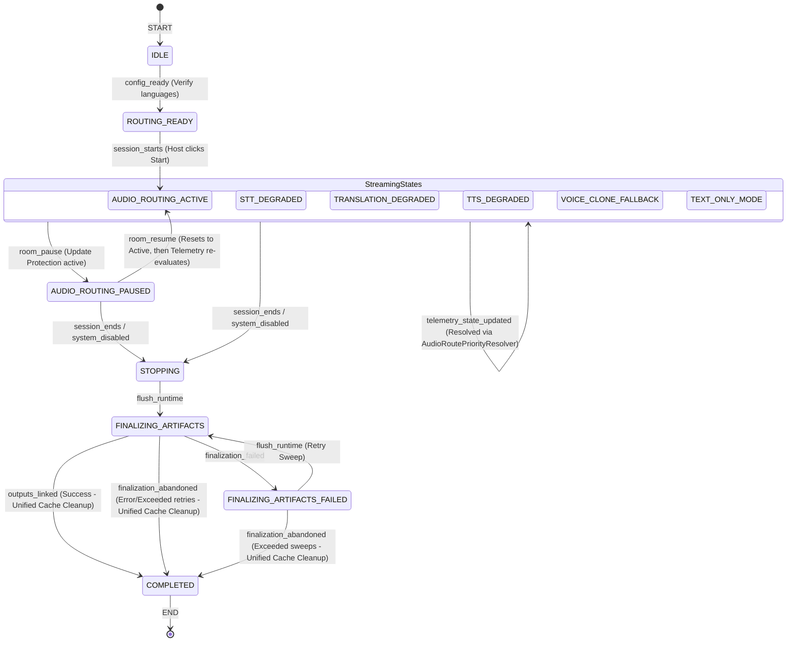
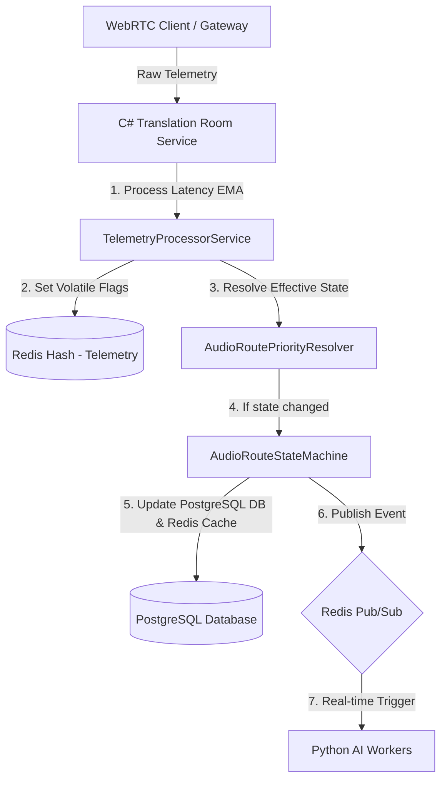

# Specification: Optimized Audio Routing Real-time State Machine with Priority Resolution

## 1. Context & Purpose
This specification defines the optimized real-time Audio Routing state machine for WarpTalk Module 1. It bridges the gap between the formal visual flow and the actual high-performance microservice architecture.

To handle high-frequency events (like latency spikes) without causing database write locks, the architecture divides states into:
1.  **Persistent Canonical Statuses (PostgreSQL):** Core lifecycle states managed by [AudioRouteStateMachine.cs](file:///c:/Users/Admin/Documents/WarpTalk%20-%20Capstone%20Project/warptalk-backend/translation-room/src/WarpTalk.TranslationRoomService.Domain/StateMachines/AudioRouteStateMachine.cs).
2.  **Ephemeral Volatile States (Redis Hash + PubSub):** High-frequency telemetry flags and network status managed by [TelemetryProcessorService.cs](file:///c:/Users/Admin/Documents/WarpTalk%20-%20Capstone%20Project/warptalk-backend/translation-room/src/WarpTalk.TranslationRoomService.Application/BackgroundProcessors/TelemetryProcessorService.cs).
3.  **Dynamic Priority Resolver (`AudioRoutePriorityResolver`):** Computes the effective canonical state in real-time based on the active volatile flags.

---

## 2. Optimized Audio Routing State Diagram

---

## 3. High-Level Technical Architecture & State Resolution

### 3.1. Volatile States in Redis Hash
For each active room, Redis stores granular status flags:
*   `stt_degraded`: `true` if STT latency EMA > 3000ms.
*   `translation_degraded`: `true` if NMT translation latency EMA > 2500ms.
*   `tts_degraded`: `true` if TTS synthesis latency EMA > 6000ms.
*   `voice_clone_status`: `"FALLBACK"` if quota is exhausted or node is offline.
*   `delivery_mode`: `"TEXT_ONLY"` if transport/TTS is completely unavailable.

### 3.2. Priority Resolver Hierarchy
The `AudioRoutePriorityResolver` evaluates volatile flags according to their actual impact on the user output:
1.  **`TEXT_ONLY_MODE` (Priority 1):** Worst case. No voice output is possible. Bypasses TTS and sends plain captions to client UI.
2.  **`VOICE_CLONE_FALLBACK` (Priority 2):** High priority. Custom voice clone failed; falls back immediately to gender-matched generic standard voice.
3.  **`TTS_DEGRADED` (Priority 3):** Synthesis is slow but still delivers audio.
4.  **`TRANSLATION_DEGRADED` (Priority 4):** Translation model is slow; falls back to dictionary/cached terms.
5.  **`STT_DEGRADED` (Priority 5):** STT is slow; worker drops beam size/temperature checks to catch up.
6.  **`AUDIO_ROUTING_ACTIVE` (Priority 6):** Perfectly healthy. All systems running optimally.

---

## 4. Technical Event & Action Definitions

### Event 1: `config ready` (IDLE $\rightarrow$ ROUTING_READY)
*   **Trigger:** Participant configuration, default languages, and translation paths are verified.
*   **C# Component Action:** [TranslationRoomAudioRouteService.cs](file:///c:/Users/Admin/Documents/WarpTalk%20-%20Capstone%20Project/warptalk-backend/translation-room/src/WarpTalk.TranslationRoomService.Application/Services/TranslationRoomAudioRouteService.cs) validates settings and writes active routes to the database.
*   **Redis Operation:** Updates `"translationRoom:{roomId}:audio_routes"` cache and broadcasts `AUDIO_ROUTES_UPDATED`.
*   **Python Worker Reaction:** Workers pre-warm translation models for the room.

### Event 2: `session starts` (ROUTING_READY $\rightarrow$ AUDIO_ROUTING_ACTIVE)
*   **Trigger:** Host clicks "Start Session".
*   **C# Component Action:** Transitions route status to `AUDIO_ROUTING_ACTIVE`.
*   **Redis Operation:** Set cache state and publishes `AUDIO_ROUTES_UPDATED` with `IN_PROGRESS` room status.
*   **Python Worker Reaction:** Workers begin polling audio streams and executing GPU processing.

### Event 3: `room pause` & `room resume` (StreamingStates $\leftrightarrow$ PAUSED)
*   **Trigger:** Host pauses/resumes the session.
*   **C# Component Action:** Transitions status to `PAUSED` / `AUDIO_ROUTING_ACTIVE`.
*   **Telemetry Protection Rule:** During `AUDIO_ROUTING_PAUSED`, telemetry processor updates volatile flags in Redis but is **blocked** from updating PostgreSQL canonical states. This prevents background noise/latency telemetry from corrupting the paused status. On `room_resume`, the database is reset to `AUDIO_ROUTING_ACTIVE`, and the next telemetry sweep calculates the new correct state.
*   **Python Worker Reaction:** Workers drop audio buffers in paused state to conserve GPU memory.

### Event 4: `telemetry_state_updated` (StreamingStates $\rightarrow$ StreamingStates)
*   **Trigger:** Live telemetry sweep computes a new effective status via `AudioRoutePriorityResolver`.
*   **C# Component Action:** Emits a single `telemetry_state_updated` event containing a JSON payload like `{"status": "TRANSLATION_DEGRADED"}`. The state machine parses and transitions PostgreSQL and Redis cache seamlessly.
*   **Benefits:** Bypasses individual high-frequency alerts, avoiding DB locks and reducing pub-sub noise.

### Event 5: `session ends` (StreamingStates/PAUSED $\rightarrow$ STOPPING)
*   **Trigger:** Host ends session or maximum room duration timer expires.
*   **C# Component Action:** Changes route status to `STOPPING`.
*   **Redis Operation:** Sets status cache and publishes `AUDIO_ROUTES_UPDATED` with `ENDED`.
*   **Python Worker Reaction:** Workers flush memory buffers, save persistent transcripts, and exit.

### Event 6: `flush runtime` (STOPPING $\rightarrow$ FINALIZING_ARTIFACTS)
*   **Trigger:** All real-time streams are confirmed as flushed.
*   **C# Component Action:** Background `ArtifactsFinalizationWorker` coordinates compilation of transcripts, summaries, and recordings.

### Event 7: `outputs linked` (FINALIZING_ARTIFACTS $\rightarrow$ COMPLETED)
*   **Trigger:** Artifacts generated successfully and saved to PostgreSQL.
*   **Immediate Cache Cleanup:** Instead of waiting for a 24h TTL, the system executes a **Unified Redis Cache Cleanup** immediately upon transitioning to `COMPLETED`. Both `"translationRoom:{roomId}:transcript"` and `"translationRoom:{roomId}:telemetry"` cache keys are deleted (`db.KeyDeleteAsync`), instantly freeing RAM.

### Event 8: `finalization failed` (FINALIZING $\rightarrow$ FINALIZING_ARTIFACTS_FAILED)
*   **Trigger:** Transient finalization failure (e.g. gRPC service outage) exhausts local retries (default `3` attempts with exponential backoff).
*   **Recovery Sweep:** Background `ArtifactsRecoveryWorker` sweeps the DB every 5 minutes and emits `flush_runtime` to retry.

### Event 9: `finalization abandoned` (FINALIZING/FAILED $\rightarrow$ COMPLETED)
*   **Trigger:**
    1.  **Exhausted Sweeps:** Sweat recovery count reaches `MaxRecoverySweeps` (default `5`).
    2.  **Permanent DB Errors:** Encountering constraint/unique violations (e.g. `DbUpdateException`). The system detects this immediately using **Exception Discrimination** and aborts on the first try.
*   **System Impact:** Gracefully transitions to `COMPLETED` and fires the **Unified Redis Cache Cleanup**, accepting loss of artifacts rather than deadlock/blocking the meeting lifecycle.

---

## 5. Configuration & Recovery Settings Reference

These values are configured in `appsettings.json` under `ArtifactFinalizationSettings` and dictate the dynamic recovery limits:

| Config Property | Default Value | Purpose |
| :--- | :--- | :--- |
| `MaxLocalRetries` | `3` | Local retry attempts inside `ArtifactsFinalizationService.cs` before flagging as `FAILED`. Uses exponential backoff with jitter. |
| `MaxRecoverySweeps` | `5` | Total sweep attempts executed by `ArtifactsRecoveryWorker.cs` before forcing transition to `COMPLETED` via `finalization_abandoned`. |
| `SweepInterval` | `5 minutes` | Sweep cycle duration for checking failed routes. |
| `KeyExpiryTTL` | `24 hours` | Automatic fallback TTL set on remaining telemetry keys if explicit cleanup is bypassed. |
