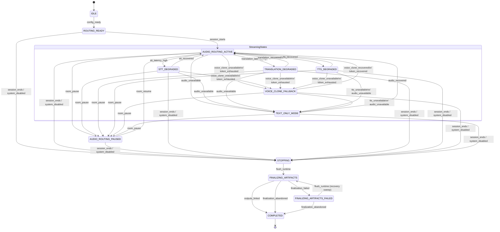

# WarpTalk Audio Routing Runtime Specification (13-State Model)
**Tài Liệu Đặc Tả Kỹ Thuật Runtime Audio Routing WarpTalk**  
*Ngày cập nhật đặc tả: 18/05/2026 21:55:00 (GMT+7)*  
*Trạng thái: Hoàn tất & Được duyệt theo code thực tế (`AudioRouteStateMachine.cs`)*

---

## 1. Biểu Đồ Trạng Thái Hệ Thống (State Diagram)

Dưới đây là biểu đồ chuyển đổi trạng thái hoàn chỉnh, phản ánh chính xác cấu trúc chuyển đổi logic của lớp máy trạng thái `AudioRouteStateMachine` và cơ chế giải quyết độ trễ thời gian thực `AudioRoutePriorityResolver`.

---

## 2. Đặc Tả Chi Tiết 13 Trạng Thái (Status Specifications)

### 1. `IDLE`
*   **Mô tả:** Trạng thái khởi tạo mặc định của luồng định tuyến âm thanh (Audio Route) ngay khi phòng dịch thuật được lập lịch hoặc tạo bản nháp.
*   **PostgreSQL:** Bản ghi route được tạo với giá trị trạng thái là `IDLE`.
*   **Redis:** Chưa tạo các hash map hay kênh Pub/Sub runtime cho route.
*   **Hành vi:** Hệ thống ở chế độ tĩnh, chỉ chờ đợi cấu hình ngôn ngữ của các bên tham gia phòng họp được thiết lập hoàn tất.

### 2. `ROUTING_READY`
*   **Mô tả:** Cấu hình ngôn ngữ gốc (Source) và ngôn ngữ đích (Listen) của các thành viên đã được thiết lập, xác thực và ghi nhận thành công.
*   **PostgreSQL:** Trạng thái route chuyển sang `ROUTING_READY`.
*   **Redis:** Bảng ánh xạ định tuyến âm thanh (Routing Table) dạng JSON được lưu nóng vào Redis Hash `"translationRoom:{roomId}:audio_routes"` để chuẩn bị cho AI Workers kết nối.
*   **Hành vi:** Sẵn sàng kết nối kênh truyền tải âm thanh WebRTC và các dịch vụ AI liên quan.

### 3. `AUDIO_ROUTING_ACTIVE`
*   **Mô tả:** Phiên dịch thuật trực tiếp đang chạy ổn định. Luồng âm thanh dịch từ người nói đến người nghe đạt hiệu năng cao và độ trễ lý tưởng.
*   **PostgreSQL:** Trạng thái canonical lưu là `AUDIO_ROUTING_ACTIVE`.
*   **Redis:** Cập nhật trạng thái trong bộ nhớ cache. Telemetry nhận gói và liên tục kiểm soát các chỉ số độ trễ đầu vào.
*   **Hành vi:** Tất cả AI Workers (STT, NMT, TTS) hoạt động hết công suất. Độ trễ toàn trình (E2E Latency) dưới ngưỡng tối đa.

### 4. `AUDIO_ROUTING_PAUSED`
*   **Mô tả:** Phiên họp tạm dừng theo lệnh của Host. Runtime pipeline tạm ngừng mọi hoạt động suy diễn để tiết kiệm tài nguyên GPU.
*   **PostgreSQL:** Trạng thái được đặt thành `AUDIO_ROUTING_PAUSED`.
*   **Redis:** Đặt cờ trạng thái tạm dừng. AI Workers đưa phòng họp này vào danh sách đen (`self._paused_rooms`) để bỏ qua (drop) lập tức mọi gói âm thanh thô truyền tới.
*   **Hành vi:** Kích hoạt cơ chế **Update Protection Guard** để khóa cứng trạng thái này, ngăn telemetry ghi đè.

### 5. `STT_DEGRADED`
*   **Mô tả:** Trình chuyển đổi giọng nói thành văn bản (STT - Whisper) gặp hiện tượng trễ cục bộ, tốc độ phản hồi trung bình EMA vượt ngưỡng cảnh báo (3000ms).
*   **PostgreSQL:** Canonical state chuyển thành `STT_DEGRADED`.
*   **Redis:** Ghi nhận cờ bay hơi `stt_degraded = true` trong Hash.
*   **Hành vi:** Hệ thống tự động giảm beam size suy diễn trên Worker hoặc tinh chỉnh tham số giải mã để rút ngắn thời gian xử lý, nỗ lực phục hồi trạng thái.

### 6. `TRANSLATION_DEGRADED`
*   **Mô tả:** Dịch vụ dịch thuật máy (NMT) hoặc API dịch ngoài gặp sự cố nghẽn mạng, khiến độ trễ dịch văn bản tăng cao hơn 2500ms.
*   **PostgreSQL:** Trạng thái được hạ cấp xuống `TRANSLATION_DEGRADED`.
*   **Redis:** Ghi nhận cờ `translation_degraded = true`.
*   **Hành vi:** AI translation worker chuyển sang sử dụng bộ nhớ cache dịch thuật cục bộ hoặc hạ cấp xuống từ điển tra cứu nhanh dạng rút gọn.

### 7. `TTS_DEGRADED`
*   **Mô tả:** Thời gian tổng hợp âm thanh giọng nói (TTS) từ văn bản dịch vượt quá 6000ms.
*   **PostgreSQL:** Trạng thái cập nhật thành `TTS_DEGRADED`.
*   **Redis:** Đặt cờ `tts_degraded = true`.
*   **Hành vi:** Tự động giảm tần số lấy mẫu (sample rate) đầu ra của tệp âm thanh để đẩy nhanh tốc độ render dữ liệu âm thanh.

### 8. `VOICE_CLONE_FALLBACK`
*   **Mô tả:** Máy chủ xử lý Voice Clone bị sập, quá tải phần cứng, hoặc người dùng đã sử dụng hết hạn mức (token quota) nhân bản giọng nói được cấp.
*   **PostgreSQL:** Trạng thái chuyển dịch sang `VOICE_CLONE_FALLBACK`.
*   **Redis:** Lưu giá trị `voice_clone_status = "FALLBACK"`.
*   **Hành vi:** AI TTS Worker chuyển đổi ngay lập tức từ XTTS v2 sang sử dụng giọng nói chuẩn mặc định (Edge-TTS) phù hợp giới tính để đảm bảo phiên họp không mất âm thanh.

### 9. `TEXT_ONLY_MODE`
*   **Mô tả:** Sự cố mất kết nối mạng truyền âm WebRTC nghiêm trọng hoặc sập hoàn toàn cả hệ thống TTS/Edge-TTS. Trạng thái suy hao nghiêm trọng nhất.
*   **PostgreSQL:** Trạng thái lưu thành `TEXT_ONLY_MODE`.
*   **Redis:** Đặt giá trị `delivery_mode = "TEXT_ONLY"`.
*   **Hành vi:** Dừng hoàn toàn việc tổng hợp âm thanh (TTS) để tránh lãng phí GPU. Hệ thống tự động chuyển kênh phân phối thời gian thực sang dạng phụ đề văn bản thuần túy hiển thị trên màn hình người dùng.

### 10. `STOPPING`
*   **Mô tả:** Trạng thái chuyển tiếp khi phòng họp kết thúc. Hệ thống đang tiến hành đóng và ngắt kết nối các đường dẫn dữ liệu thời gian thực.
*   **PostgreSQL:** Trạng thái ghi nhận `STOPPING`.
*   **Redis:** Gửi tín hiệu dừng luồng cho các AI Workers liên quan, các Workers tiến hành dọn dẹp các queue cục bộ.
*   **Hành vi:** Chờ đợi gói tin cuối cùng được xử lý để thu gom dữ liệu thô phục vụ hậu kỳ.

### 11. `FINALIZING_ARTIFACTS`
*   **Mô tả:** Tiến trình ngầm đang xử lý tạo và liên kết các tài liệu lưu trữ (bản ghi âm cuộc họp, biên bản dịch thuật, tóm tắt nội dung họp).
*   **PostgreSQL:** Trạng thái hiển thị `FINALIZING_ARTIFACTS`.
*   **Redis:** Trạng thái xử lý hậu kỳ được đẩy vào hàng đợi tác vụ của Background Service.
*   **Hành vi:** Thực hiện xuất file, ghi đĩa dữ liệu và liên kết tệp vật lý thông qua các API chuyên biệt của Backend.

### 12. `FINALIZING_ARTIFACTS_FAILED`
*   **Mô tả:** Tiến trình lưu trữ tài liệu bị lỗi tạm thời do nghẽn cơ sở dữ liệu hoặc không kết nối được dịch vụ gRPC xuất bản dịch ngoài.
*   **PostgreSQL:** Đặt trạng thái `FINALIZING_ARTIFACTS_FAILED`.
*   **Redis:** Khởi tạo biến đếm số lần tự động phục hồi `recovery_attempts`.
*   **Hành vi:** Kích hoạt trình quét phục hồi ngầm (`ArtifactsRecoveryWorker`) thực hiện quét và kích hoạt lại luồng hậu kỳ định kỳ.

### 13. `COMPLETED`
*   **Mô tả:** Trạng thái kết thúc tuyệt đối (Sink State) của vòng đời định tuyến âm thanh phòng họp.
*   **PostgreSQL:** Lưu vĩnh viễn trạng thái `COMPLETED`.
*   **Redis:** **Kích hoạt Unified Redis Cache Cleanup** giải phóng toàn bộ tài nguyên lưu trữ của phòng họp khỏi bộ nhớ RAM ngay lập tức.
*   **Hành vi:** Phòng họp đóng vĩnh viễn, không chấp nhận thêm bất kỳ sự thay đổi trạng thái nào khác.

---

## 3. Đặc Tả Sự Kiện Hệ Thống (Event Triggers)

| Tên Event (`AudioRoutingEventType`) | Trạng thái nguồn | Trạng thái đích | Tác nhân / Điều kiện kích hoạt |
|---|---|---|---|
| `config_ready` | `IDLE` | `ROUTING_READY` | Hệ thống xác thực xong ngôn ngữ các thành viên. |
| `session_starts` | `ROUTING_READY` | `AUDIO_ROUTING_ACTIVE` | Host bấm nút bắt đầu phòng họp. |
| `room_pause` | Bất kỳ Streaming State nào | `AUDIO_ROUTING_PAUSED` | Host bấm nút tạm dừng cuộc họp. |
| `room_resume` | `AUDIO_ROUTING_PAUSED` | `AUDIO_ROUTING_ACTIVE` | Host bấm nút tiếp tục cuộc họp. |
| `stt_latency_high` | `AUDIO_ROUTING_ACTIVE` | `STT_DEGRADED` | Chỉ số trễ trung bình Whisper EMA vượt quá 3000ms. |
| `stt_recovered` | `STT_DEGRADED` | `AUDIO_ROUTING_ACTIVE` | Chỉ số trễ Whisper khôi phục dưới ngưỡng trễ an toàn. |
| `translation_latency_high` | `AUDIO_ROUTING_ACTIVE` | `TRANSLATION_DEGRADED` | Độ trễ NMT dịch máy vượt quá 2500ms. |
| `translation_recovered` | `TRANSLATION_DEGRADED` | `AUDIO_ROUTING_ACTIVE` | Độ trễ dịch máy khôi phục về mức bình thường. |
| `tts_latency_high` | `AUDIO_ROUTING_ACTIVE` | `TTS_DEGRADED` | Trễ tổng hợp giọng nói của XTTS v2 vượt quá 6000ms. |
| `tts_recovered` | `TTS_DEGRADED` | `AUDIO_ROUTING_ACTIVE` | Độ trễ tổng hợp âm TTS khôi phục dưới ngưỡng. |
| `voice_clone_unavailable` | `ACTIVE` / Các degraded state | `VOICE_CLONE_FALLBACK` | Máy chủ XTTS bị sập vật lý hoặc crash trong lúc dịch âm. |
| `token_exhausted` | `ACTIVE` / Các degraded state | `VOICE_CLONE_FALLBACK` | Người dùng sử dụng hết hạn mức nhân bản được phân bổ. |
| `voice_clone_recovered` | `VOICE_CLONE_FALLBACK` | `AUDIO_ROUTING_ACTIVE` | Dịch vụ XTTS kết nối lại thành công. |
| `token_recovered` | `VOICE_CLONE_FALLBACK` | `AUDIO_ROUTING_ACTIVE` | Tài khoản được sạc lại/gia hạn hạn mức token. |
| `tts_unavailable` | `TTS_DEGRADED` / `VOICE_CLONE` | `TEXT_ONLY_MODE` | Sập toàn bộ dịch vụ TTS trung gian, không thể phát giọng. |
| `audio_unavailable` | Bất kỳ Streaming State nào | `TEXT_ONLY_MODE` | Mất kết nối WebRTC Media Gateway, không truyền được âm. |
| `audio_recovered` | `TEXT_ONLY_MODE` | `AUDIO_ROUTING_ACTIVE` | Khôi phục lại kết nối âm thanh và thiết bị phát đầu ra. |
| `session_ends` | Bất kỳ non-terminal state nào | `STOPPING` | Host chủ động bấm nút Kết thúc phòng họp. |
| `system_disabled` | Bất kỳ non-terminal state nào | `STOPPING` | Quản trị viên hệ thống cưỡng bức tắt room hoặc sập nguồn. |
| `flush_runtime` | `STOPPING` / `FINALIZING_FAILED` | `FINALIZING_ARTIFACTS` | Kênh truyền hoàn tất đóng, đẩy luồng ghi tệp tự động. |
| `outputs_linked` | `FINALIZING_ARTIFACTS` | `COMPLETED` | Bản dịch, file ghi âm được lưu trữ và liên kết DB thành công. |
| `finalization_failed` | `FINALIZING_ARTIFACTS` | `FINALIZING_ARTIFACTS_FAILED`| Lỗi mạng tạm thời, lỗi DB ghi tệp trong quá trình hậu kỳ. |
| `finalization_abandoned` | `FINALIZING_ARTIFACTS` / `FAILED` | `COMPLETED` | Quá giới hạn quét tự động (5 lần) hoặc lỗi DB nghiêm trọng. |

---

## 4. Các Cơ Chế Cốt Lõi Hệ Thống

### A. Bộ Giải Quyết Ưu Tiên Suy Hao (AudioRoutePriorityResolver)
Hệ thống sử dụng bộ giải quyết ưu tiên tĩnh để đảm bảo rằng khi một route có nhiều lỗi xảy ra cùng lúc, trạng thái ghi nhận trên PostgreSQL phải là trạng thái gây ảnh hưởng lớn nhất đến trải nghiệm người dùng. Thứ tự ưu tiên từ cao xuống thấp được thiết lập như sau:
$$\text{TEXT\_ONLY\_MODE} > \text{VOICE\_CLONE\_FALLBACK} > \text{TTS\_DEGRADED} > \text{TRANSLATION\_DEGRADED} > \text{STT\_DEGRADED} > \text{AUDIO\_ROUTING\_ACTIVE}$$
*   **Cơ chế hoạt động:** Mỗi khi quét telemetry thô từ Redis, bộ xử lý thu thập toàn bộ các cờ lỗi hiện có, tính toán ra trạng thái ưu tiên cao nhất, sau đó so sánh với DB để quyết định việc ghi trạng thái canonical mới.

### B. Cơ Chế Bảo Vệ Trạng Thái Tạm Dừng (Update Protection Guard)
*   **Bài toán:** Khi phòng bị tạm dừng (`AUDIO_ROUTING_PAUSED`), các gói tin telemetry cũ trôi nổi trên mạng hoặc gói tin rác vẫn có thể gửi lên Redis, nếu không có cơ chế chặn, nó sẽ kích hoạt việc cập nhật trạng thái làm phòng bị chuyển từ `PAUSED` ngược lại `DEGRADED` một cách sai lệch.
*   **Giải pháp:** Khi trạng thái ghi nhận là `AUDIO_ROUTING_PAUSED`, toàn bộ tiến trình ghi trạng thái từ Telemetry Sweep vào PostgreSQL bị **chặn hoàn toàn**. Chỉ khi sự kiện `room_resume` được phát ra, trạng thái được Backend chuyển hướng an toàn về lại `AUDIO_ROUTING_ACTIVE` thì hàng rào bảo vệ mới được dỡ bỏ.

### C. Cơ Chế Thu Hồi Bộ Nhớ Nóng Tức Thì (Unified Redis Cache Cleanup)
*   **Bài toán:** Mỗi phòng họp sinh ra hàng triệu bản dịch thô và gói telemetry lưu tạm trên Redis. Nếu đợi TTL 24 tiếng tự xóa, RAM của Redis (đặc biệt là môi trường Docker dung lượng thấp) sẽ bị tràn và gây sập hệ thống.
*   **Giải pháp:** Ngay khi máy trạng thái chuyển sang trạng thái cuối cùng là `COMPLETED` (bao gồm cả trường hợp hoàn tất thành công lẫn trường hợp lỗi nghiêm trọng buộc phải từ bỏ qua sự kiện `finalization_abandoned`), Backend C# lập tức gọi lệnh xóa nóng `db.KeyDeleteAsync` toàn bộ các key lưu trữ transcript và telemetry của phòng họp đó khỏi RAM Redis, giải phóng dung lượng bộ nhớ ngay tức khắc.

---

## 5. Kịch Bản Vận Hành Thực Tế (Operational Scenarios)

### Kịch Bản 1: Luồng Chạy Hoàn Hảo (Happy Path)
*   **Bước 1:** Phòng họp được tạo và lên cấu hình đầy đủ $\rightarrow$ Hệ thống thiết lập trạng thái route là `IDLE`.
*   **Bước 2:** Bộ kiểm tra ngôn ngữ hoàn tất việc xác thực $\rightarrow$ Phát sự kiện `config_ready` $\rightarrow$ Trạng thái chuyển sang `ROUTING_READY`.
*   **Bước 3:** Host nhấn bắt đầu phiên họp $\rightarrow$ Sự kiện `session_starts` được kích hoạt $\rightarrow$ Chuyển sang `AUDIO_ROUTING_ACTIVE`. Hệ thống bắt đầu truyền âm thanh thời gian thực.
*   **Bước 4:** Phiên họp diễn ra trơn tru. Khi kết thúc, Host nhấn nút kết thúc phòng họp $\rightarrow$ Kích hoạt sự kiện `session_ends` $\rightarrow$ Chuyển sang `STOPPING` để đóng băng luồng dữ liệu.
*   **Bước 5:** Hậu kỳ thu gom toàn bộ file thành công $\rightarrow$ Phát sự kiện `outputs_linked` $\rightarrow$ Chuyển sang trạng thái cuối `COMPLETED` và gọi lệnh **Unified Redis Cache Cleanup** xóa sạch bộ nhớ Redis.

### Kịch Bản 2: Xử Lý Suy Hao Độ Trễ Và Khôi Phục (Telemetry Recovery Loop)
*   **Bước 1:** Phòng đang ở trạng thái `AUDIO_ROUTING_ACTIVE`.
*   **Bước 2:** Hệ thống dịch máy (NMT) đột ngột bị nghẽn mạng, trễ vượt quá 2500ms $\rightarrow$ Telemetry phát hiện và gửi cờ $\rightarrow$ Hệ thống chuyển trạng thái sang `TRANSLATION_DEGRADED`.
*   **Bước 3:** Tiếp đó, máy chủ STT cũng bị quá tải, trễ vượt quá 3000ms $\rightarrow$ Cờ `stt_degraded = true` được bật.
*   **Bước 4:** Áp dụng công thức ưu tiên của `AudioRoutePriorityResolver`: Trễ dịch thuật có mức độ ưu tiên ảnh hưởng cao hơn trễ STT, do đó trạng thái phòng họp vẫn được giữ vững ở mức cảnh báo là `TRANSLATION_DEGRADED` thay vì bị nhảy loạn.
*   **Bước 5:** Dịch vụ mạng phục hồi, độ trễ dịch máy giảm xuống $\rightarrow$ Telemetry gỡ bỏ cờ trễ dịch thuật $\rightarrow$ Lúc này, cờ trễ STT vẫn còn, hệ thống tự động chuyển đổi an toàn sang trạng thái `STT_DEGRADED`.
*   **Bước 6:** STT khôi phục hoàn toàn $\rightarrow$ Tất cả các cờ lỗi được xóa $\rightarrow$ Hệ thống tự động phục hồi luồng âm thanh về trạng thái hoàn hảo `AUDIO_ROUTING_ACTIVE`.

### Kịch Bản 3: Sự Cố Trực Tiếp Và Hạ Cấp Phụ Đề Subtitle (Text-Only Mode)
*   **Bước 1:** Phòng đang ở trạng thái hoạt động `AUDIO_ROUTING_ACTIVE`.
*   **Bước 2:** Bộ Media Server WebRTC của phòng gặp lỗi nghẽn băng thông, không thể truyền phát bất kỳ gói tin âm thanh nào cho người nghe $\rightarrow$ AI Worker nhận diện sự cố âm thanh thô mất kết nối $\rightarrow$ Gửi sự kiện hệ thống `audio_unavailable` lên Redis Stream.
*   **Bước 3:** Backend C# tiêu thụ sự kiện và lập tức chuyển trạng thái sang `TEXT_ONLY_MODE`.
*   **Bước 4:** Ở trạng thái này, AI TTS Worker nhận diện cấu hình đặc biệt $\rightarrow$ Dừng ngay lập tức việc chạy mô hình tạo tiếng nói (TTS) để tiết kiệm GPU, chuyển đổi toàn bộ bản dịch trực tiếp đẩy lên giao diện người dùng dưới dạng phụ đề (Captions) chữ chạy để duy trì thông tin cuộc họp.
*   **Bước 5:** Sự cố WebRTC được khắc phục $\rightarrow$ AI Worker ghi nhận đường truyền âm thanh hoạt động lại $\rightarrow$ Bắn sự kiện `audio_recovered` $\rightarrow$ Hệ thống chuyển đổi mượt mà trở lại `AUDIO_ROUTING_ACTIVE`, tiếp tục phát tiếng dịch.

### Kịch Bản 4: Kịch Bản Paused Và Resume Phòng Họp
*   **Bước 1:** Phòng đang gặp hiện tượng trễ Whisper nặng, trạng thái đang là `STT_DEGRADED`.
*   **Bước 2:** Host nhận thấy cuộc họp cần tạm dừng để chuẩn bị tài liệu $\rightarrow$ Bấm nút Tạm dừng phòng họp $\rightarrow$ Phát sự kiện `room_pause` $\rightarrow$ Chuyển trạng thái sang `AUDIO_ROUTING_PAUSED`.
*   **Bước 3:** Kích hoạt rào chắn **Update Protection**. AI Workers nhận tín hiệu, tự động loại bỏ (drop) toàn bộ các gói âm thanh thô tiếp theo được gửi tới. Các gói telemetry rác gửi trễ lên Redis bị Backend chặn hoàn toàn, không cho phép ghi đè trạng thái `PAUSED` trong cơ sở dữ liệu.
*   **Bước 4:** Host bấm nút Tiếp tục cuộc họp $\rightarrow$ Phát sự kiện `room_resume` $\rightarrow$ Trạng thái lập tức chuyển về `AUDIO_ROUTING_ACTIVE`.
*   **Bước 5:** Kênh truyền âm thanh mở lại, telemetry sweep tiếp theo tính toán lại các chỉ số trễ hiện tại để cập nhật trạng thái suy hao thực tế một cách chính xác.

### Kịch Bản 5: Lỗi Kết Nối Hậu Kỳ Và Phục Hồi Bản Dịch Tạm Thời
*   **Bước 1:** Phòng họp kết thúc $\rightarrow$ Trạng thái chuyển sang `FINALIZING_ARTIFACTS`.
*   **Bước 2:** Trình tạo tài liệu hậu kỳ gọi dịch vụ gRPC `TranscriptService` để kết xuất tệp bản dịch chính thức nhưng gặp sự cố mạng, dịch vụ ngoài không phản hồi $\rightarrow$ Quá số lần thử lại tại chỗ (3 lần) $\rightarrow$ Chuyển trạng thái sang `FINALIZING_ARTIFACTS_FAILED`.
*   **Bước 3:** Trình quét phục hồi ngầm `ArtifactsRecoveryWorker` quét và tìm thấy bản ghi lỗi $\rightarrow$ Tự động lấy bản dịch lưu tạm trong Redis Cache (`TranscriptCacheService`) để tổng hợp và tạo bản ghi tạm thời, đảm bảo người dùng không bị mất trắng dữ liệu cuộc họp.
*   **Bước 4:** Thực hiện liên kết dữ liệu tạm thời thành công $\rightarrow$ Chuyển trạng thái sang `COMPLETED` và giải phóng dung lượng RAM trên Redis.

### Kịch Bản 6: Tự Động Giải Cứu Phòng Họp Kẹt (Sweeper & Abandonment Safeguard)
*   **Bước 1:** Quá trình hậu kỳ gặp sự cố nghiêm trọng (ví dụ: DB PostgreSQL bị lock hoặc trùng khóa ngoại duy nhất) khiến việc ghi file và cập nhật trạng thái liên tục thất bại.
*   **Bước 2:** Trình quét phục hồi `ArtifactsRecoveryWorker` quét bản ghi lỗi định kỳ mỗi 5 phút. Mỗi lần quét thất bại sẽ tăng biến đếm `recovery_attempts` trong Redis lên 1 đơn vị.
*   **Bước 3:** Khi số lần quét chạm ngưỡng tối đa `MaxRecoverySweeps` (5 lần) nhưng vẫn không thể ghi file thành công $\rightarrow$ Trình quét tự động phát ra sự kiện cứu hộ khẩn cấp `finalization_abandoned`.
*   **Bước 4:** Hệ thống chấp nhận từ bỏ việc lưu tệp bị lỗi để tránh làm nghẽn tiến trình của toàn hệ thống, tự động cập nhật trạng thái route về mức cuối cùng `COMPLETED` và gọi cơ chế **Unified Redis Cache Cleanup** dọn dẹp bộ nhớ Redis ngay lập tức để giải phóng RAM cho các cuộc họp khác hoạt động.
