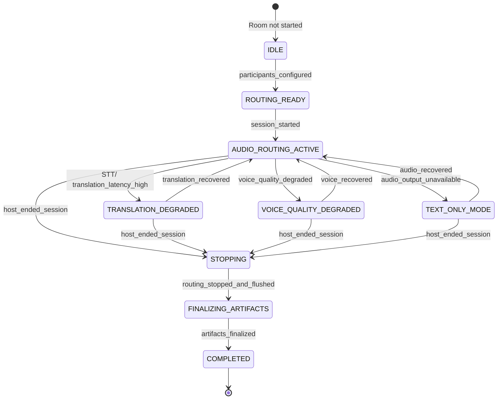

# Audio Routing State Diagram
This document describes the state machine used in the translation room audio routing runtime.

```mermaid
stateDiagram-v2
    [*] --> IDLE : Room not started
    IDLE --> ROUTING_READY : participants_configured
    ROUTING_READY --> AUDIO_ROUTING_ACTIVE : session_started
    
    %% Main active loop and degraded states
    AUDIO_ROUTING_ACTIVE --> TRANSLATION_DEGRADED : STT/ translation_latency_high
    TRANSLATION_DEGRADED --> AUDIO_ROUTING_ACTIVE : translation_recovered
    
    AUDIO_ROUTING_ACTIVE --> VOICE_QUALITY_DEGRADED : voice_quality_degraded
    VOICE_QUALITY_DEGRADED --> AUDIO_ROUTING_ACTIVE : voice_recovered
    
    AUDIO_ROUTING_ACTIVE --> TEXT_ONLY_MODE : audio_output_unavailable
    TEXT_ONLY_MODE --> AUDIO_ROUTING_ACTIVE : audio_recovered
    
    %% Termination sequence
    AUDIO_ROUTING_ACTIVE --> STOPPING : host_ended_session
    TRANSLATION_DEGRADED --> STOPPING : host_ended_session
    VOICE_QUALITY_DEGRADED --> STOPPING : host_ended_session
    TEXT_ONLY_MODE --> STOPPING : host_ended_session
    
    STOPPING --> FINALIZING_ARTIFACTS : routing_stopped_and_flushed
    FINALIZING_ARTIFACTS --> COMPLETED : artifacts_finalized
    
    COMPLETED --> [*]
```
