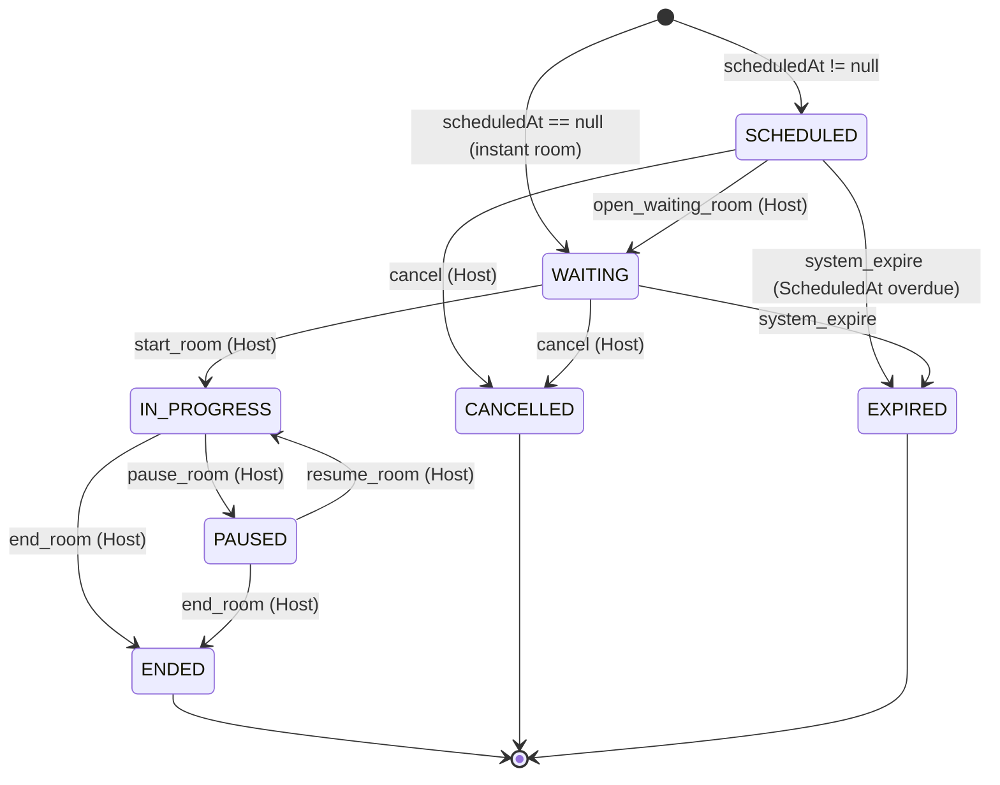
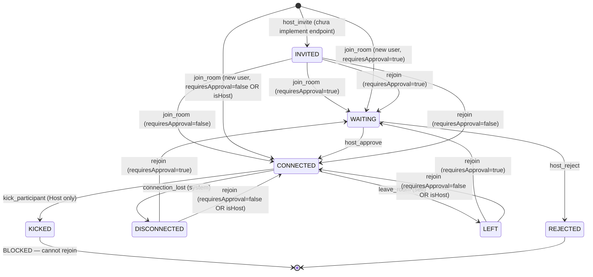

# WarpTalk Translation Room Lifecycle Specification
**Tài Liệu Đặc Tả Kỹ Thuật Vòng Đời Phòng Dịch Thuật (Translation Room)**
*Ngày cập nhật đặc tả: 18/05/2026 22:48:00 (GMT+7)*
*Trạng thái: Hoàn tất & Được duyệt theo code thực tế (`TranslationRoomService.cs`, `TranslationRoomParticipantService.cs`)*

---

## 1. Biểu Đồ Trạng Thái Phòng Dịch Thuật (Room Lifecycle Diagram)

> **Lưu ý quan trọng:** Khi Room chuyển sang `IN_PROGRESS` / `PAUSED` / `ENDED`, hệ thống tự động phát sự kiện tương ứng tới **Audio Routing State Machine** để đồng bộ trạng thái luồng âm thanh.

---

## 2. Biểu Đồ Trạng Thái Participant (Participant Lifecycle Diagram)

> **Lưu ý quan trọng:**
> - `KICKED` là **trạng thái chặn vĩnh viễn**. User bị kick không thể rejoin dù dùng đúng room code.
> - `IsTranslationAudioEnabled` là **thuộc tính riêng biệt**, không làm thay đổi status participant. Host có thể tắt tiếng dịch relay về phía participant mà không kick họ.

---

## 3. Đặc Tả Chi Tiết Trạng Thái Phòng (Room Status Specifications)

### 1. `SCHEDULED`
- **Mô tả:** Phòng đã được tạo với thời gian bắt đầu được lên lịch trong tương lai (`scheduledAt != null`).
- **PostgreSQL:** Status = `SCHEDULED`. `StartedAt` chưa được set.
- **Hành vi:** Chỉ Host có thể thao tác. Cho phép cập nhật Settings, ngôn ngữ. Room code được tạo ngay lập tức nhưng Participant chưa thể tham gia.
- **Settings Lock:** Settings (ngôn ngữ, `requiresApproval`) **có thể chỉnh sửa** ở trạng thái này.

### 2. `WAITING`
- **Mô tả:** Phòng đang mở cửa đón Participant tham gia, nhưng phiên dịch thuật thực sự chưa bắt đầu.
- **PostgreSQL:** Status = `WAITING`. `StartedAt` chưa được set.
- **Hành vi:** Participant có thể join vào. Nếu `requiresApproval = true`, họ sẽ ở trạng thái `WAITING` cho đến khi Host duyệt. Audio Routing routes ở trạng thái `ROUTING_READY`.
- **Settings Lock:** Settings **vẫn có thể chỉnh sửa** ở trạng thái này. Sau khi chuyển sang `IN_PROGRESS`, settings bị khoá (`ErrorSettingsLocked`).

### 3. `IN_PROGRESS`
- **Mô tả:** Phiên dịch thuật đang diễn ra trực tiếp. Âm thanh đang được xử lý qua AI Pipeline.
- **PostgreSQL:** Status = `IN_PROGRESS`. `StartedAt` được ghi nhận lần đầu tiên khi chuyển vào trạng thái này.
- **Audio Routing:** Tự động phát sự kiện `session_starts` → các Audio Routes chuyển từ `ROUTING_READY` sang `AUDIO_ROUTING_ACTIVE`.
- **Hành vi:** AI Workers (STT, NMT, TTS) bắt đầu xử lý luồng âm thanh thời gian thực.

### 4. `PAUSED`
- **Mô tả:** Host tạm dừng phiên họp. AI pipeline ngừng xử lý để tiết kiệm GPU.
- **PostgreSQL:** Status = `PAUSED`.
- **Audio Routing:** Tự động phát sự kiện `room_pause` → **tất cả** Audio Routes trong phòng chuyển sang `AUDIO_ROUTING_PAUSED`. Kích hoạt **Update Protection Guard** trên toàn bộ routes.
- **Hành vi:** AI Workers drop toàn bộ gói âm thanh đến phòng này. Telemetry sweep bị block khỏi việc ghi đè trạng thái `AUDIO_ROUTING_PAUSED`.

### 5. `ENDED`
- **Mô tả:** Phiên họp kết thúc chính thức. Trạng thái terminal.
- **PostgreSQL:** Status = `ENDED`. `EndedAt` và `DurationSeconds` được ghi nhận.
- **Audio Routing:** Tự động phát sự kiện `session_ends` → các Audio Routes chuyển sang `STOPPING` → `FINALIZING_ARTIFACTS` → `COMPLETED`.
- **Hành vi:** Phòng không thể thay đổi trạng thái thêm. Room code được giải phóng để tái sử dụng.

### 6. `CANCELLED`
- **Mô tả:** Host huỷ phòng trước khi phiên họp bắt đầu. Trạng thái terminal.
- **Nguồn:** Chỉ từ `SCHEDULED` hoặc `WAITING`.
- **PostgreSQL:** Status = `CANCELLED`.
- **Hành vi:** Room code được giải phóng. Không trigger Audio Routing events vì phiên chưa từng bắt đầu.

### 7. `EXPIRED`
- **Mô tả:** Phòng đã được lên lịch nhưng không được khai mạc trong thời hạn, hệ thống tự động huỷ. Trạng thái terminal.
- **Nguồn:** Chỉ từ `SCHEDULED` hoặc `WAITING`. Được kích hoạt bởi scheduler tự động (idempotent check).
- **PostgreSQL:** Status = `EXPIRED`.
- **Hành vi:** Tương tự `CANCELLED`. Không trigger Audio Routing events.

---

## 4. Đặc Tả Chi Tiết Trạng Thái Participant

### 1. `INVITED`
- **Mô tả:** User được Host mời tham gia nhưng chưa chủ động join vào phòng. (Endpoint mời chưa được triển khai.)
- **Hành vi:** Khi user tự join bằng room code, bản ghi `INVITED` bị upsert sang `WAITING` hoặc `CONNECTED` theo logic `requiresApproval`.

### 2. `WAITING`
- **Mô tả:** User đã join vào phòng nhưng đang chờ Host duyệt (`requiresApproval = true`).
- **Hành vi:** User hiện diện trong danh sách participant nhưng chưa được nhận âm thanh dịch. Host thấy yêu cầu chờ duyệt.

### 3. `CONNECTED`
- **Mô tả:** Participant đã được xác nhận và đang tham gia phiên dịch thuật tích cực.
- **Hành vi:** Nhận luồng âm thanh/phụ đề dịch thuật theo cấu hình `ListenLanguage`. Nếu `IsTranslationAudioEnabled = false`, vẫn ở trạng thái `CONNECTED` nhưng không nhận audio relay.

### 4. `DISCONNECTED`
- **Mô tả:** Kết nối mạng của participant bị mất đột ngột, không phải do họ chủ động rời.
- **Hành vi:** Participant có thể rejoin. Nếu rejoin thành công, bản ghi bị upsert theo logic `requiresApproval`.

### 5. `LEFT`
- **Mô tả:** Participant chủ động rời phòng bằng cách gọi `LeaveRoomAsync`.
- **Hành vi:** Có thể rejoin tương tự `DISCONNECTED`.

### 6. `KICKED`
- **Mô tả:** Host cưỡng bức đuổi participant khỏi phòng.
- **Hành vi:** **Chặn vĩnh viễn.** Mọi lần thử rejoin với `userId` này đều bị trả về lỗi `403 Forbidden` (`ErrorParticipantKicked`). Host không thể bị kick (guard `ErrorCannotKickHost`).

### 7. `REJECTED`
- **Mô tả:** Host từ chối yêu cầu tham gia của participant đang ở trạng thái `WAITING`.
- **Hành vi:** Hiện tại code service không có endpoint xử lý Approve/Reject riêng biệt — luồng này được dự kiến xử lý qua WebSocket notification hoặc endpoint bổ sung trong tương lai.

---

## 5. Đặc Tả Sự Kiện Hệ Thống (Event Triggers)

### Room Lifecycle Events

| Hành động (API / System) | Trạng thái nguồn | Trạng thái đích | Tác nhân | Audio Routing Event phát đi |
|---|---|---|---|---|
| `CreateRoom` (scheduledAt) | — | `SCHEDULED` | Host | — |
| `CreateRoom` (instant) | — | `WAITING` | Host | — |
| `OpenWaitingRoom` | `SCHEDULED` | `WAITING` | Host | — |
| `StartRoom` | `WAITING` | `IN_PROGRESS` | Host | `session_starts` |
| `PauseRoom` | `IN_PROGRESS` | `PAUSED` | Host | `room_pause` |
| `ResumeRoom` | `PAUSED` | `IN_PROGRESS` | Host | `room_resume` |
| `EndRoom` | `IN_PROGRESS` / `PAUSED` | `ENDED` | Host | `session_ends` |
| `CancelRoom` | `SCHEDULED` / `WAITING` | `CANCELLED` | Host | — |
| `ExpireRoom` | `SCHEDULED` / `WAITING` | `EXPIRED` | System Scheduler | — |
| `UpdateSettings` | `SCHEDULED` / `WAITING` | (giữ nguyên) | Host | — |

### Participant Lifecycle Events

| Hành động (API / System) | Trạng thái nguồn | Trạng thái đích | Tác nhân | Điều kiện |
|---|---|---|---|---|
| `JoinRoom` (new) | — | `WAITING` | Participant | `requiresApproval=true`, !isHost |
| `JoinRoom` (new) | — | `CONNECTED` | Participant | `requiresApproval=false` OR isHost |
| `JoinRoom` (rejoin) | `DISCONNECTED`/`LEFT`/`INVITED` | `WAITING`/`CONNECTED` | Participant | Theo `requiresApproval` |
| `ApproveParticipant` | `WAITING` | `CONNECTED` | Host | — |
| `RejectParticipant` | `WAITING` | `REJECTED` | Host | — |
| `LeaveRoom` | `CONNECTED` | `LEFT` | Participant | — |
| `KickParticipant` | `CONNECTED` | `KICKED` | Host | Không kick được Host |
| `UpdateAudio` | (bất kỳ) | (giữ nguyên) | Host | Chỉ set `IsTranslationAudioEnabled` |
| Connection lost | `CONNECTED` | `DISCONNECTED` | System/WebRTC | — |

---

## 6. Quy Tắc Kinh Doanh Cốt Lõi (Business Rules)

### A. Settings Lock Rule
Room settings (ngôn ngữ nguồn, ngôn ngữ đích, `requiresApproval`) **chỉ có thể thay đổi** khi phòng ở trạng thái `SCHEDULED` hoặc `WAITING`. Sau khi chuyển sang `IN_PROGRESS`, mọi request cập nhật settings đều bị từ chối với lỗi `ErrorSettingsLocked`.

### B. Room Code Reuse Rule
Room code được tạo ngẫu nhiên (12 ký tự, định dạng `xxx-yyyy-zzz`, chỉ chữ thường). Hệ thống kiểm tra trùng lặp với **chỉ các phòng không ở terminal status** (`ENDED`, `CANCELLED`, `EXPIRED`). Điều này đảm bảo room code của phòng đã kết thúc có thể được tái sử dụng mà không gây xung đột.

### C. Language Rejected Input Rule (BR-1.4-007)
Ngôn ngữ bị validation engine từ chối **KHÔNG BAO GIỜ** được lưu vào cơ sở dữ liệu. Validation xảy ra trước bất kỳ thao tác upsert nào lên bảng `participants`.

### D. Dual Source for Language Defaults
Nếu request join/create không cung cấp ngôn ngữ, hệ thống tự động lấy từ **User Settings** của tài khoản (`DefaultSpeakLanguage`, `DefaultListenLanguage`). Nếu User Settings cũng trống, validation sẽ fail với lỗi bắt buộc cung cấp ngôn ngữ.

### E. Audio Routing Coupling Rule (WT-67)
Vòng đời phòng được gắn kết chặt với Audio Routing State Machine:
- `StartRoom` → `session_starts` → tất cả routes: `ROUTING_READY` → `AUDIO_ROUTING_ACTIVE`
- `PauseRoom` → `room_pause` → tất cả routes: bất kỳ streaming state → `AUDIO_ROUTING_PAUSED`
- `ResumeRoom` → `room_resume` → tất cả routes: `AUDIO_ROUTING_PAUSED` → `AUDIO_ROUTING_ACTIVE`
- `EndRoom` → `session_ends` → tất cả routes: bất kỳ state → `STOPPING` → finalization chain

---

## 7. Kịch Bản Vận Hành Thực Tế (Operational Scenarios)

### Kịch Bản 1: Tạo Và Bắt Đầu Phòng Họp Ngay (Instant Room)
1. Host tạo phòng **không có** `scheduledAt` → Phòng vào trạng thái `WAITING`, room code được cấp phát.
2. Ngôn ngữ được lấy từ User Settings nếu không truyền trong request.
3. Participant join bằng room code:
   - Nếu `requiresApproval = false` → vào thẳng `CONNECTED`.
   - Nếu `requiresApproval = true` → vào `WAITING`, Host nhận thông báo duyệt.
4. Host bấm Start → Phòng chuyển sang `IN_PROGRESS`. Audio Routing tự động nhận sự kiện `session_starts`.
5. AI Workers bắt đầu xử lý luồng âm thanh thời gian thực.

### Kịch Bản 2: Tạo Phòng Lên Lịch (Scheduled Room)
1. Host tạo phòng với `scheduledAt` trong tương lai → Phòng vào `SCHEDULED`.
2. Host cập nhật settings (ngôn ngữ, `requiresApproval`) trước giờ họp.
3. Đến giờ, Host gọi `OpenWaitingRoom` → Phòng chuyển sang `WAITING`. Participant bắt đầu join.
4. Nếu Host không khai mạc và thời gian trôi qua → System scheduler gọi `ExpireRoom` → `EXPIRED`.

### Kịch Bản 3: Tạm Dừng Và Tiếp Tục Phòng Họp
1. Phòng đang `IN_PROGRESS`. Host cần ngắt quãng.
2. Host bấm Pause → Phòng chuyển sang `PAUSED`. Audio Routing phát `room_pause` → tất cả routes sang `AUDIO_ROUTING_PAUSED`. **Update Protection** kích hoạt.
3. AI Workers ngừng xử lý gói âm thanh. GPU được giải phóng.
4. Host bấm Resume → Phòng quay lại `IN_PROGRESS`. Audio Routing phát `room_resume` → routes trở về `AUDIO_ROUTING_ACTIVE`.

### Kịch Bản 4: Participant Bị Mất Kết Nối Và Rejoin
1. Participant đang `CONNECTED` bị mất mạng → Hệ thống WebRTC phát hiện ngắt kết nối → Status chuyển sang `DISCONNECTED`.
2. Participant kết nối lại và join lại bằng room code.
3. Hệ thống tìm thấy bản ghi cũ (`DISCONNECTED`) → Upsert lại theo `requiresApproval`:
   - `requiresApproval = false` → trực tiếp `CONNECTED`, tiếp tục nhận âm thanh dịch.
   - `requiresApproval = true` → quay lại `WAITING`, chờ Host duyệt lần nữa.

### Kịch Bản 5: Host Kick Participant Đang Nói Chuyện
1. Phòng đang `IN_PROGRESS`. Một participant gây rối.
2. Host gọi `KickParticipant` → Status của participant đó chuyển sang `KICKED`.
3. Participant bị ngắt kết nối phía client (qua WebSocket notification).
4. Participant thử rejoin bằng room code → Backend phát hiện `KICKED` → trả về `403 Forbidden`. Vĩnh viễn không thể vào lại phòng này.

### Kịch Bản 6: Kết Thúc Phòng Và Finalization
1. Phòng đang `IN_PROGRESS` (hoặc `PAUSED`). Host bấm End.
2. Backend ghi `EndedAt`, tính `DurationSeconds`, chuyển phòng sang `ENDED`.
3. Audio Routing nhận sự kiện `session_ends` → routes chuyển sang `STOPPING` → `FINALIZING_ARTIFACTS`.
4. `ArtifactsFinalizationService` xử lý: tạo file ghi âm, biên bản dịch, tóm tắt.
5. Nếu thành công → routes chuyển sang `COMPLETED` → Redis cache cleanup ngay lập tức.
6. Nếu lỗi → routes chuyển sang `FINALIZING_ARTIFACTS_FAILED` → `ArtifactsRecoveryWorker` quét và retry mỗi 5 phút (tối đa 5 lần) → nếu hết lần → `finalization_abandoned` → `COMPLETED`.
