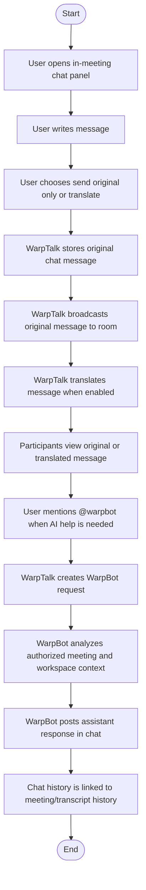

# 069: Build In-Meeting Multilingual Chat with WarpBot

## 1. Description
Implement an in-meeting chat experience similar to Google Meet, with optional multilingual translation and an AI assistant mention flow using `@warpbot`.

This feature allows meeting participants to send text messages during a Translation/Meeting Room session. Each message can be sent as-is or translated into other participants' preferred languages. Users can also mention `@warpbot` in the chat to ask questions about the current meeting context, transcript, decisions, glossary, or workspace knowledge.

## 2. Business Goal
Reduce communication friction during multilingual meetings by supporting both speech translation and text-based multilingual collaboration. Chat becomes a lightweight fallback when audio quality is poor, when users prefer typing, or when participants need AI help without interrupting the live meeting.

## 3. Actors
* **Host**: can view/send chat, moderate chat if needed, and use `@warpbot`.
* **Participant**: can view/send chat and use `@warpbot` based on workspace/room policy.
* **WarpTalk System**: stores messages, translates messages when requested, streams realtime chat events, handles `@warpbot` requests, and enforces permissions.
* **WarpBot**: AI assistant persona invoked inside chat through `@warpbot`.

## 4. Implementation Scope
* Add in-meeting chat panel to meeting/room UI.
* Send and receive realtime chat messages in a room.
* Persist chat messages for meeting history.
* Support message-level translation:
  * Send original only.
  * Send original + translated versions.
  * Auto-display translated text based on viewer language preference.
* Support `@warpbot` mention:
  * User types a message containing `@warpbot`.
  * System creates an assistant request.
  * WarpBot responds into the same chat thread.
* Use meeting/room permissions:
  * Only room participants/host can read/write room chat.
  * Removed/kicked participants cannot continue receiving or sending chat events.
* Support basic moderation:
  * Host can delete/hide inappropriate messages.
  * System keeps audit metadata for moderated messages.
* Add empty/loading/error states in UI.
* Do not use mock messages in production meeting chat.

## 5. Out of Scope
* Full Slack-style threaded chat.
* File attachments.
* Emoji reactions.
* Message search across all workspaces.
* End-to-end encrypted chat.
* AI voice responses from WarpBot.
* Advanced moderation or toxicity detection.

## 6. User Stories
* As a participant, I want to send text messages during a meeting so that I can communicate without interrupting the speaker.
* As a participant, I want to read chat messages in my preferred language so that I can understand multilingual discussion.
* As a host, I want to moderate chat messages so that meeting communication remains professional.
* As a user, I want to mention `@warpbot` in the chat so that I can ask the AI assistant about meeting content, transcript, decisions, or domain context.
* As a host, I want chat history to be saved with the meeting so that it can be reviewed after the meeting.

## 7. Functional Requirements
* **FR-069-001**: System MUST allow authenticated room participants to send chat messages in a live meeting.
* **FR-069-002**: System MUST broadcast new chat messages to all active participants in the same room.
* **FR-069-003**: System MUST persist chat messages with room/meeting reference, sender, language, content, timestamps, and status.
* **FR-069-004**: System MUST support message-level translation when translation is enabled for chat.
* **FR-069-005**: System MUST preserve original message content even when translated content is generated.
* **FR-069-006**: System MUST allow users to toggle between original and translated message view when both are available.
* **FR-069-007**: System MUST detect `@warpbot` mentions and create a WarpBot request linked to the triggering message.
* **FR-069-008**: WarpBot responses MUST be posted back to the room chat as assistant messages.
* **FR-069-009**: WarpBot MUST use only authorized meeting context: current transcript, room metadata, workspace context library, glossary, and approved accessible history.
* **FR-069-010**: System MUST reject chat read/write from users who are not active participants of the room.
* **FR-069-011**: Host MUST be able to hide/delete a chat message from participant view.
* **FR-069-012**: System MUST keep moderation metadata and audit logs for hidden/deleted chat messages.
* **FR-069-013**: Chat history MUST be available from meeting/transcript history when room policy allows it.

## 8. Non-Functional Requirements
* **NFR-069-001**: Normal chat delivery latency SHOULD be under 1 second in local/network-stable conditions.
* **NFR-069-002**: Message translation SHOULD be asynchronous; original message SHOULD appear first if translation is not ready.
* **NFR-069-003**: WarpBot responses MAY be slower than normal chat and MUST show pending/loading state.
* **NFR-069-004**: Chat APIs MUST enforce rate limiting to prevent spam and prompt abuse.
* **NFR-069-005**: Chat content MUST respect workspace retention and privacy policies.
* **NFR-069-006**: AI prompts MUST not expose context from other workspaces.

## 9. Business Rules
* **BR-069-001**: Only active room participants and host can view room chat.
* **BR-069-002**: Only active room participants and host can send room chat messages.
* **BR-069-003**: A kicked/removed/left participant must stop receiving realtime chat events.
* **BR-069-004**: Original message content must always be retained for audit and traceability.
* **BR-069-005**: Chat translation must not overwrite original content.
* **BR-069-006**: Chat translation target language is determined by viewer language preference, room language configuration, or explicit message translation request.
* **BR-069-007**: `@warpbot` can answer only using context accessible within the current room/workspace boundary.
* **BR-069-008**: Host moderation hides/deletes the message from normal participant view but keeps audit metadata.
* **BR-069-009**: Chat history can be attached to transcript/meeting history only when retention policy allows it.
* **BR-069-010**: WarpBot usage consumes AI credits according to workspace billing policy.

## 10. Main Flow

## 11. WarpBot Example Prompts
* `@warpbot summarize the last 5 minutes`
* `@warpbot what decisions have been made so far?`
* `@warpbot explain this technical term`
* `@warpbot is .NET Framework 4.7 still suitable for this project?`
* `@warpbot translate this discussion into Japanese`
* `@warpbot list action items from the current meeting`

## 12. Acceptance Criteria
* User can open chat inside a live meeting.
* User can send a normal message and all active participants receive it realtime.
* User can send a message with translation enabled.
* Original message is visible and persisted.
* Translated message appears when translation result is ready.
* Users can view original/translated version when both exist.
* `@warpbot` mention creates a pending assistant response.
* WarpBot response appears in the chat as an assistant message.
* Non-participant cannot read or send room chat.
* Kicked/removed participant cannot continue sending/receiving chat events.
* Host can hide/delete a message.
* Hidden/deleted messages are not visible to regular participants but remain auditable.
* Chat history is visible from meeting history when policy allows it.

## 13. Output Acceptance (Specify)

**User Story**: As a meeting participant, I want an in-meeting multilingual chat with WarpBot support so that I can communicate by text, understand other languages, and ask AI questions during the meeting.

**Independent Test**: Can be tested independently by creating a meeting, joining as host and participant, sending chat messages with/without translation, invoking `@warpbot`, and verifying realtime delivery, persistence, permissions, and history visibility.

**Acceptance Scenarios**:

1. **Given** a live meeting with host and participant, **When** the host sends a chat message, **Then** the participant receives it in realtime.
2. **Given** chat translation is enabled, **When** a participant sends a Vietnamese message to an English-speaking viewer, **Then** the original message is stored and translated content is shown when ready.
3. **Given** a user sends `@warpbot summarize the discussion`, **When** the assistant finishes processing, **Then** WarpBot posts a response in the same chat.
4. **Given** a kicked participant, **When** that participant sends another chat message, **Then** the system rejects the request.
5. **Given** a host hides a message, **When** participants view the chat, **Then** the hidden message is not visible but audit metadata remains.

## 14. Key Entities
* `meeting.meeting_chat_messages`
* `meeting.meeting_chat_translations`
* `meeting.meeting_chat_assistant_requests`
* `meeting.meeting_chat_moderation_events`
* External references: `translation_room_id`, `meeting_id`, `workspace_id`, `sender_user_id`, `participant_id`, `transcript_id`

## 15. Success Criteria
* Chat works without mock data in production room UI.
* Realtime delivery is stable for host and participants.
* Translation is asynchronous and does not block original message delivery.
* WarpBot can answer based on authorized meeting/workspace context.
* Permissions prevent unauthorized chat access.
* Chat history is persisted and linked to meeting/transcript history.
