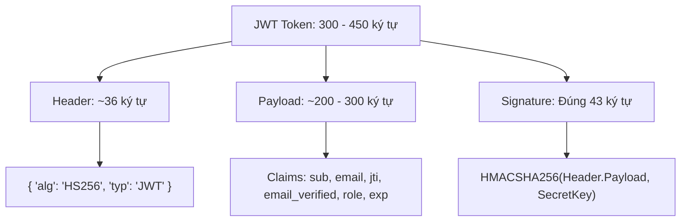
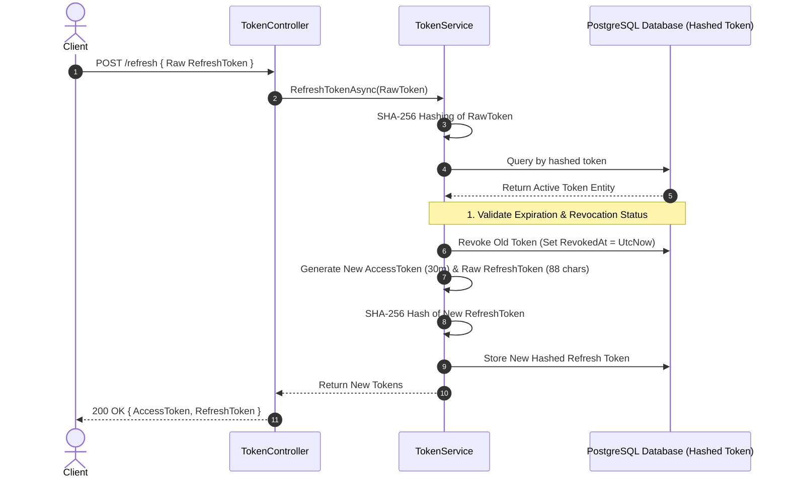

# Đặc tả Kỹ thuật: Cơ chế Bảo mật Password, JWT & Refresh Token trong WarpTalk

Tài liệu này trình bày chi tiết về kiến trúc bảo mật mật khẩu, cơ chế JSON Web Token (JWT) và quy trình quản lý phiên làm việc thông qua Refresh Token Rotation (RTR) trong hệ thống WarpTalk.

---

## 1. Tổng quan về Xác thực trong Hệ thống WarpTalk

Trong kiến trúc phân tán của WarpTalk, bảo mật danh tính là ưu tiên hàng đầu. Khi người dùng đăng ký hoặc đăng nhập thông qua [AuthController.cs](file:///c:/Users/Admin/Documents/WarpTalk%20-%20Capstone%20Project/warptalk-backend/auth/src/WarpTalk.AuthService.API/Controllers/AuthController.cs), mật khẩu của họ tuyệt đối **không bao giờ được lưu dưới dạng văn bản thô (Plain Text)** vào cơ sở dữ liệu PostgreSQL. 

Thay vào đó, hệ thống sử dụng một lớp dịch vụ chuyên biệt là [PasswordHasher.cs](file:///c:/Users/Admin/Documents/WarpTalk%20-%20Capstone%20Project/warptalk-backend/auth/src/WarpTalk.AuthService.Infrastructure/Security/PasswordHasher.cs) thực thi cơ chế **băm mật khẩu một chiều (One-way Hashing)** bảo mật cao trước khi lưu trữ dưới dạng cột `PasswordHash`.

---

## 2. Phân tích Kỹ thuật thuật toán mã hóa mật khẩu của WarpTalk: PBKDF2

Dựa trên mã nguồn của dự án tại [PasswordHasher.cs](file:///c:/Users/Admin/Documents/WarpTalk%20-%20Capstone%20Project/warptalk-backend/auth/src/WarpTalk.AuthService.Infrastructure/Security/PasswordHasher.cs), hệ thống đang áp dụng các thông số kỹ thuật mật mã chuẩn hóa như sau:

```csharp
private const int SaltSize = 16;
private const int HashSize = 32;
private const int Iterations = 100_000;
private static readonly HashAlgorithmName Algorithm = HashAlgorithmName.SHA512;
```

### 2.1. Thuật toán nền tảng: PBKDF2 (Password-Based Key Derivation Function 2)
WarpTalk sử dụng phương thức `Rfc2898DeriveBytes.Pbkdf2` làm nòng cốt. Đây là thuật toán kéo dãn khóa (Key Stretching) dựa trên mật khẩu cực kỳ an toàn, được phát triển để chống lại các cuộc tấn công dò mật khẩu tốc độ cao.

### 2.2. Các đặc điểm kỹ thuật nổi bật:
1. **Salt ngẫu nhiên cường độ cao (16 bytes / 128-bit):**
   * Mỗi mật khẩu khi băm sẽ được sinh một chuỗi muối (Salt) ngẫu nhiên có độ dài 16 bytes thông qua `RandomNumberGenerator.GetBytes(SaltSize)`.
   * Việc này đảm bảo tính độc nhất: **Hai người dùng có cùng mật khẩu thô vẫn sẽ có chuỗi băm lưu trong cơ sở dữ liệu hoàn toàn khác nhau**.
2. **Số vòng lặp kéo dãn khóa lớn (100,000 Iterations):**
   * Thuật toán sẽ thực hiện băm lặp đi lặp lại 100,000 lần liên tục trước khi cho ra kết quả cuối cùng.
   * Số vòng lặp lớn này làm tăng thời gian tính toán của CPU/GPU đối với mỗi lần băm lên một khoảng thời gian nhỏ (vài phần mười giây), gây cản trở và triệt tiêu khả năng bẻ khóa bằng siêu máy tính hoặc GPU chuyên dụng của hacker.
3. **Hàm băm cốt lõi SHA-512:**
   * Thay vì sử dụng SHA-1 hay SHA-256 đã cũ, WarpTalk nâng cấp lên **SHA-512** làm hàm băm nền tảng (`HashAlgorithmName.SHA512`). SHA-512 có không gian tìm kiếm va chạm khổng lồ ($2^{512}$ trạng thái) và tối ưu hóa xử lý cực tốt trên các kiến trúc phần cứng 64-bit hiện đại.
4. **Đầu ra an toàn (32 bytes / 256-bit):**
   * Kích thước chuỗi hash đầu ra là 32 bytes, đảm bảo không gian entropy cực cao, chống lại hoàn toàn các cuộc tấn công va chạm dữ liệu.
5. **Định dạng lưu trữ tự chứa (Self-contained format):**
   * Kết quả trả về có cấu trúc `{Salt_Base64}.{Hash_Base64}` (được phân tách bằng dấu chấm `.`).
   * Cấu trúc này giúp quá trình xác minh mật khẩu tự động lấy được muối (Salt) cũ của người dùng mà không cần phải thiết kế thêm một cột lưu muối riêng biệt trong cơ sở dữ liệu.

---

## 3. Tại sao chọn PBKDF2 kết hợp SHA-512 cho WarpTalk?

Khi thiết kế một hệ thống phần mềm doanh nghiệp chất lượng cao, việc chọn thuật toán băm mật khẩu được cân nhắc dựa trên các tiêu chí so sánh thực tiễn:

| Thuật toán | Ưu điểm | Nhược điểm | Đánh giá |
| :--- | :--- | :--- | :--- |
| **MD5 / SHA-256 thô** | Tốc độ cực nhanh, tốn rất ít CPU. | **Cực kỳ không an toàn**. Hacker có thể thử hàng tỷ mật khẩu mỗi giây bằng GPU và Rainbow Table. | 🔴 **Loại bỏ ngay lập tức**. |
| **BCrypt** | Khả năng cấu hình độ phức tạp tốt, rất phổ biến. | Phụ thuộc vào thư viện bên thứ 3 trong hệ sinh thái `.NET` (như BCrypt.Net), khó audit code bảo mật gốc. | 🟡 **Khá tốt nhưng chưa tối ưu về mặt kiểm soát code**. |
| **Argon2id** | Thuật toán mạnh nhất hiện nay, chống tấn công GPU/ASIC bằng bộ nhớ. | Chưa được hỗ trợ trực tiếp (Native) trong bộ thư viện chuẩn của .NET, yêu cầu cài đặt gói NuGet bên ngoài. | 🟡 **Tốt nhưng tăng độ phức tạp dependency của dự án**. |
| **PBKDF2 (SHA-512)** | **Chuẩn hóa của chính phủ (NIST)**, được Microsoft tích hợp **Native** 100% trong .NET, tốc độ ổn định, độ an toàn cực cao khi kết hợp với SHA-512 và 100k vòng lặp. | Tốn tài nguyên CPU hơn so với băm thông thường (đây là tính năng cố ý để chống brute-force). | 🟢 **Lựa chọn tối ưu nhất cho WarpTalk** (Bảo mật cao, Native, Ổn định và Dễ bảo trì). |

---

## 4. Đặc điểm Bảo mật Nâng cao trong mã nguồn WarpTalk

Mã nguồn [PasswordHasher.cs](file:///c:/Users/Admin/Documents/WarpTalk%20-%20Capstone%20Project/warptalk-backend/auth/src/WarpTalk.AuthService.Infrastructure/Security/PasswordHasher.cs) của chúng ta chứa một kỹ thuật bảo mật cực kỳ tinh tế tại hàm `Verify`:

```csharp
return CryptographicOperations.FixedTimeEquals(inputHash, hash);
```

### 💡 Chống Tấn công Kênh Kề - Tấn công Dựa trên Thời gian (Timing Attack / Side-Channel Attack)
* **Vấn đề nguy hiểm:** Nếu chúng ta so sánh hai mảng byte (chuỗi hash) bằng toán tử so sánh thông thường (`==` hoặc `Equals`), CPU sẽ thực hiện so sánh từng ký tự từ trái qua phải. Ngay khi phát hiện một ký tự sai, CPU sẽ **dừng so sánh ngay lập tức và trả về `false`**.
* **Lỗ hổng:** Hacker chuyên nghiệp có thể gửi hàng nghìn request đăng nhập và sử dụng đồng hồ đo thời gian cực nhạy (độ chính xác mili-giây) để đo thời gian phản hồi của server. Từ đó, hacker có thể mò mẫm ra từng ký tự của chuỗi hash (vì ký tự đúng sẽ làm CPU mất nhiều thời gian xử lý hơn một chút).
* **Giải pháp của WarpTalk:** Hàm `CryptographicOperations.FixedTimeEquals` đảm bảo CPU **luôn luôn duyệt qua toàn bộ các ký tự của chuỗi**, bất kể chuỗi đó đúng hay sai ở ký tự đầu tiên. Điều này khiến thời gian xử lý mọi request so sánh mật khẩu luôn là **HẰNG SỐ (Constant Time)**, triệt tiêu hoàn toàn lỗ hổng Timing Attack.

---

## 5. Giải thích các thuật ngữ chuyên môn liên quan

### 5.1. Băm (Hashing) vs. Mã hóa (Encryption)
* **Mã hóa (Encryption):** Là cơ chế **2 chiều (Two-way)**. Dữ liệu gốc sau khi mã hóa bằng Khóa (Key) có thể được giải mã ngược lại thành dữ liệu ban đầu. Dùng để truyền dữ liệu an toàn trên mạng (như SSL/TLS).
* **Băm (Hashing):** Là cơ chế **1 chiều (One-way)**. Sau khi chuyển đổi mật khẩu thô thành chuỗi băm, **không có bất kỳ cách nào** (kể cả admin hệ thống) có thể giải mã ngược chuỗi băm đó về lại mật khẩu thô. Để xác thực, ta chỉ có cách băm mật khẩu vừa nhập và so sánh hai kết quả băm với nhau.

### 5.2. Muối (Salt)
* Là một chuỗi dữ liệu ngẫu nhiên được sinh ra và cộng thêm vào mật khẩu thô trước khi đưa vào hàm băm. 
* **Tác dụng:** Giúp vô hiệu hóa hoàn toàn các bảng tính toán trước (Rainbow Table). Dù hacker có sở hữu một cơ sở dữ liệu các mật khẩu phổ biến đã được băm sẵn, họ vẫn không thể so khớp vì mỗi user trong hệ thống của bạn có một chuỗi muối hoàn toàn khác nhau.

### 5.3. Kéo dãn khóa (Key Stretching)
* Là kỹ thuật làm cho quá trình băm mật khẩu diễn ra **chậm hơn một cách có chủ đích** thông qua việc lặp lại thuật toán băm nhiều lần (trong WarpTalk là 100,000 lần).
* Việc này không ảnh hưởng đến trải nghiệm của người dùng thật (chỉ mất khoảng 50-100ms để đăng nhập), nhưng lại là ác mộng đối với hacker khi họ muốn thử hàng triệu mật khẩu mỗi giây.

### 5.4. Rainbow Table
* Là một bảng dữ liệu khổng lồ chứa hàng triệu mật khẩu phổ biến kèm theo chuỗi băm tương ứng của chúng đã được tính toán từ trước. Hacker sử dụng bảng này để tra cứu ngược cực nhanh từ chuỗi băm lấy được trong database ra mật khẩu thô của nạn nhân.
* **Salt** là khắc tinh lớn nhất giúp loại bỏ hoàn toàn sự hiệu quả của Rainbow Table.

### 5.5. Tấn công vét cạn (Brute-force Attack) và Tấn công từ điển (Dictionary Attack)
* **Tấn công từ điển (Dictionary Attack):** Hacker thử đăng nhập bằng danh sách các mật khẩu phổ biến nhất thế giới (ví dụ: `123456`, `password`, `admin`...).
* **Tấn công vét cạn (Brute-force Attack):** Hacker sử dụng máy tính thử tất cả các tổ hợp ký tự có thể xảy ra (ví dụ: `aaaaa`, `aaaab`, `aaaac`...) cho đến khi tìm ra mật khẩu đúng.
* **Key Stretching:** Kỹ thuật kéo dãn khóa (tăng độ phức tạp tính toán thông qua số vòng lặp `Iterations`).
* **Timing Attack (Side-Channel Attack):** Tấn công dựa trên thời gian thực thi CPU.

---

## 6. Cơ chế Bảo mật JWT (JSON Web Token) trong WarpTalk

Ngoài mật khẩu, **JWT** là cơ chế bảo mật cốt lõi giúp duy trì trạng thái đăng nhập (Session) và phân quyền của người dùng giữa các microservices một cách không trạng thái (Stateless).

Dựa trên mã nguồn của lớp [JwtTokenGenerator.cs](file:///c:/Users/Admin/Documents/WarpTalk%20-%20Capstone%20Project/warptalk-backend/auth/src/WarpTalk.AuthService.Infrastructure/Security/JwtTokenGenerator.cs), mỗi Access Token sinh ra là một chuỗi mã hóa Base64Url gồm 3 phần phân tách bởi dấu chấm (`.`), có độ dài trung bình từ **300 đến 450 ký tự**:

$$\text{JWT} = \text{Header} \ . \ \text{Payload} \ . \ \text{Signature}$$

### 6.1. Cấu trúc chi tiết của JWT trong hệ thống:



#### A. Phần Đầu - Header (Khoảng 36 ký tự)
* **JSON thô:** `{"alg":"HS256","typ":"JWT"}`
* **Nhiệm vụ:** Định nghĩa loại token là JWT và thuật toán ký mã hóa sử dụng là **HS256** (HMAC sử dụng hàm băm SHA-256).
* **Mã hóa Base64Url:** Luôn luôn cố định là chuỗi **`eyJhbGciOiJIUzI1NiIsInR5cCI6IkpXVCJ9`** (chính xác 36 ký tự).

#### B. Phần Thân - Payload / Claims (Khoảng 200 - 300 ký tự)
Chứa các thông tin định danh (Claims) của người dùng được mã hóa Base64Url. Các claims thực tế trong WarpTalk bao gồm:
* `sub` (Subject): ID người dùng dạng UUID/Guid (ví dụ: `d8b5f3a1-7c9e-4b2a-8f5c-9d7e3a1b5c9e`).
* `email`: Email đăng nhập của tài khoản.
* `jti` (JWT ID): ID duy nhất của mỗi token sinh ra qua `Guid.NewGuid().ToString()`. *Đây là thông số cốt lõi để áp dụng cơ chế chặn Token-level (như Đăng xuất thiết bị).*
* `email_verified`: Trạng thái đã xác thực email hay chưa (`true`/`false`).
* `role` (Role Claims): Danh sách các vai trò của người dùng trong hệ thống (nhập từ bảng quyền).
* `exp` (Expiration Time): Thời gian hết hạn của token (mặc định là `30 phút` kể từ lúc cấp).
* `iss` (Issuer) & `aud` (Audience): Định danh máy chủ cấp và đối tượng sử dụng token.

#### C. Phần Chữ Ký - Signature (Cố định 43 ký tự)
* **Công thức tính:**
  $$\text{Signature} = \text{HMACSHA256} \left( \text{Base64Url}(\text{Header}) + "." + \text{Base64Url}(\text{Payload}), \ \text{SecretKey} \right)$$
* **Bảo mật:** Chữ ký được ký số bằng khóa bí mật đối xứng `Jwt:Secret` (độ dài an toàn tối thiểu 256-bit) lưu trữ trong biến môi trường.
* **Đặc điểm:** Chữ ký HMAC-SHA256 tạo ra một mảng 32 bytes dữ liệu nhị phân. Khi được mã hóa Base64Url, nó **luôn luôn cố định dài đúng 43 ký tự**.

---

## 7. Cơ chế Refresh Token & Refresh Token Rotation (RTR) bảo mật cao

Để duy trì phiên làm việc cho người dùng một cách an toàn mà không cần bắt họ đăng nhập lại liên tục, WarpTalk kết hợp giữa **Access Token ngắn hạn (30 phút)** và **Refresh Token dài hạn (7 ngày)**.

Quy trình quản lý Refresh Token được xử lý nghiêm ngặt tại [TokenService.cs](file:///c:/Users/Admin/Documents/WarpTalk%20-%20Capstone%20Project/warptalk-backend/auth/src/WarpTalk.AuthService.Application/Services/TokenService.cs) với các đặc điểm bảo mật vượt trội sau:



### 7.1. Đặc điểm kỹ thuật sinh Refresh Token
* **Độ ngẫu nhiên cấp độ mã hóa:** Refresh Token được sinh ra thông qua `RandomNumberGenerator.GetBytes(64)` lấy 64 bytes dữ liệu nhị phân ngẫu nhiên bảo mật cao từ hệ điều hành.
* **Độ dài chuỗi thô:** Sau khi mã hóa Base64, chuỗi Refresh Token thô trả về cho client **luôn dài đúng 88 ký tự** (ví dụ: `gT5x8nMb7...==`).

### 7.2. Giải pháp Hăm hóa mật mã trong Cơ sở dữ liệu (Hashed Token Storage)
* **Nguyên tắc bảo mật:** Để tránh việc hacker ăn cắp được dữ liệu database và dùng các refresh token thô đó để mạo danh người dùng, **WarpTalk tuyệt đối không lưu Refresh Token thô vào DB**.
* **Giải pháp:** Trước khi lưu trữ, Refresh Token thô sẽ được băm bằng thuật toán SHA-256 (`TokenHasher.Hash`):
  * Cột `TokenHash` trong PostgreSQL sẽ lưu trữ chuỗi hash SHA-256 này.
  * Khi client gửi Refresh Token thô lên để refresh hoặc logout, hệ thống sẽ thực hiện băm chuỗi thô đó trước rồi mới so khớp với cột `TokenHash` trong Database.

### 7.3. Cơ chế Xoay vòng Refresh Token (Refresh Token Rotation - RTR)
Đây là chốt chặn bảo mật cực kỳ mạnh mẽ để chống lại các cuộc tấn công đánh cắp Refresh Token:
1. **Một lần sử dụng (One-time Use Only):** Mỗi khi client gửi Refresh Token thô lên để xin cấp mới Access Token, hệ thống sẽ lập tức **đánh dấu thu hồi** Token cũ đó trong Database (`RevokedAt = DateTime.UtcNow`).
2. **Cấp mới hoàn toàn (Full Rotation):** Đồng thời, hệ thống tạo và cấp phát một cặp Access Token mới và **một Refresh Token mới tinh** dài 88 ký tự cho client.
3. **Phát hiện tái sử dụng trái phép (Reuse Detection):** 
   * Nếu kẻ trộm đánh cắp được Refresh Token cũ và cố tình gửi yêu cầu Refresh lên.
   * `TokenService` sẽ truy vấn database và phát hiện Token đó đã có giá trị `RevokedAt is not null` (tức là đã từng được xoay vòng).
   * Ngay lập tức, hệ thống sẽ từ chối request với mã lỗi `400 InvalidToken` (`AuthConstants.ErrorInvalidToken`), bảo vệ an toàn tuyệt đối cho người dùng thật.

### 7.4. Cơ chế Đăng xuất (Logout)
* Khi người dùng thực hiện đăng xuất ([Logout](file:///c:/Users/Admin/Documents/WarpTalk%20-%20Capstone%20Project/warptalk-backend/auth/src/WarpTalk.AuthService.API/Controllers/TokenController.cs#L40)), client gửi Refresh Token thô lên.
* Hệ thống tiến hành băm và tìm kiếm Token thực tế trong Database. Nếu khớp, trường `RevokedAt` sẽ được gán bằng `DateTime.UtcNow` để hủy phiên làm việc đó vĩnh viễn phía máy chủ.
