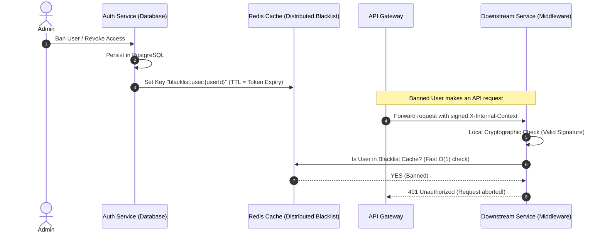

# Feature Specification: Shared Claims Principal & Context Binding Hardening (WT-136)

**Feature Branch**: `feat/auth`  
**Created**: 2026-05-24  
**Status**: Approved  
**Input**: Linear ticket WT-136 - Fix authentication context gaps, token validation, and state lag revocation

---

## 1. Problem Statement

In WarpTalk's distributed microservice architecture, security, identity propagation, and performance must be balanced. While a stateless JWT/gateway model provides massive scalability benefits, our previous implementation left several critical authentication and context gaps:

1. **Broken Downstream Identity Propagation**: The `InternalContextMiddleware` successfully validated the signed internal token, but failed to bind the decrypted `ClaimsPrincipal` to the ASP.NET Core `HttpContext.User`. As a result, downstream API controllers could not read standard identity helpers (`User.GetUserId()`, `User.IsEmailVerified()`), rendering standard `.NET` authorization utilities non-functional.
2. **Missing Token Expiration Checks**: The internal context token validation did not enforce explicit lifetime checks (`ValidateLifetime = true`), leaving downstream services vulnerable to replay attacks using expired internal tokens.
3. **The State Lag (Token Revocation) Trade-off**: Because token validation is stateless and performed in-memory, if a user is **banned, deactivated, or demoted** in the central `AuthService`, their active access tokens remain valid across downstream microservices (like `TranslationRoomService` or `MeetingService`) until they naturally expire (up to 15 minutes). This is a critical security vulnerability for immediate access revocation.

To resolve these security and architectural gaps, WarpTalk requires:
* Enforced lifetime check validation on all gateway tokens.
* Complete integration of `HttpContext.User` propagation across all controllers.
* A high-performance, stateless distributed blacklist mechanism to solve the state lag issue without introducing heavy synchronous database calls on every request.

---

## 2. Technical Decisions & Architectural Boundaries

### 2.1. Local Signature & Lifetime Verification
Downstream services will continue to validate internal context tokens locally in-memory using cryptographic signature checks for maximum performance.
* Explicit validation of token lifetime (`ValidateLifetime = true`) is enforced in the middleware configuration.
* If verification fails, the request is instantly rejected at the middleware level with `401 Unauthorized`.

### 2.2. Standardized User Context Assignment
The resolved principal is mapped to `context.User = principal;` in the HTTP pipeline. This ensures that any downstream controller can natively resolve the current user's ID via the standard `User.GetUserId()` extension method.

### 2.3. Distributed Token Revocation (Blacklist Cache)
To mitigate the **State Lag** vulnerability without calling `AuthService` via synchronous gRPC/database checks on every API request, we use a **Fast Distributed Blacklist Cache (Redis)**:
* **The Flow:**
  1. When an Admin bans a user or changes a role, the `AuthService` marks the state change in the PostgreSQL database.
  2. Simultaneously, `AuthService` publishes a key (e.g., `blacklist:user:{userId}`) to a shared Redis cluster. The key is set with a Time-to-Live (TTL) matching the token's lifetime.
  3. In-flight tokens for that user immediately become useless because the downstream `InternalContextMiddleware` executes a rapid, stateless, `O(1)` check in Redis via a lightweight `ITokenBlacklistService` interface.
  4. If the key exists in Redis, the request is rejected with `401 Unauthorized` instantly.

### 2.4. Environment Security & Credentials Architecture
The shared secret used to sign the `X-Internal-Context` header must never be hardcoded. It is injected dynamically across targets:
* **Local:** Managed securely via `.NET User Secrets` (`secrets.json`).
* **Docker Compose:** Injected as an environment variable via local `.env` files.
* **Production:** Managed securely in enterprise vaults (e.g., AWS Secrets Manager, Azure Key Vault, or Kubernetes Secrets).

---

## 3. User Scenarios & Testing (Prioritized Journeys)

### User Story 1 - Secure Context Decryption & Binding (Priority: P1)
*As a developer, I want all downstream services to natively resolve my identity using standard controller context helpers so that authentication logic is clean and uniform.*

**Acceptance Scenarios**:
1. **Given** a request sent through the API Gateway,  
   **When** it carries a valid cryptographically signed `X-Internal-Context` header,  
   **Then** `InternalContextMiddleware` successfully validates the token, binds it to `HttpContext.User`, and downstream controllers successfully resolve the User ID via `User.GetUserId()`.
2. **Given** an invalid signature or malformed JSON payload (e.g., raw text `{"userId":"admin-id"}`),  
   **When** sent in the `X-Internal-Context` header,  
   **Then** `ValidateToken` throws an exception, the request is instantly rejected with `401 Unauthorized`, and downstream middleware is not executed.
3. **Given** an expired token signature,  
   **When** validated by the middleware,  
   **Then** it is rejected with `401 Unauthorized` due to strict lifetime checks.

---

### User Story 2 - Real-time State Lag Rejection (Priority: P1)
*As an administrator, I want to ban an abusive user and ensure their access is revoked instantly across all chat, translation, and meeting rooms.*

**Acceptance Scenarios**:
1. **Given** a user who has just been banned or signed out,  
   **When** their ID is pushed to the Redis blacklist cache,  
   **Then** all subsequent requests they attempt to make within the token's lifetime are immediately blocked with `401 Unauthorized` by the downstream middleware checks.
2. **Given** a user who is not banned,  
   **When** their ID is checked in the blacklist cache,  
   **Then** the request bypasses the revocation check in `O(1)` time (< 5ms) and succeeds.

---

## 4. Requirements

### Functional Requirements
* **FR-136-001**: Downstream services MUST validate `X-Internal-Context` header signatures locally using a private symmetric shared secret key.
* **FR-136-002**: System MUST validate token lifetimes and reject expired tokens with `401 Unauthorized`.
* **FR-136-003**: System MUST bind the validated principal to `HttpContext.User`.
* **FR-136-004**: System MUST check blacklisted users in Redis (via `ITokenBlacklistService`) and abort with `401 Unauthorized` if banned.
* **FR-136-005**: All credentials and shared secret keys MUST be injected via environment variables rather than hardcoding in source code files.

---

## 5. Success Criteria

### Measurable Outcomes
* **SC-136-001**: Local cryptographic token validation must execute in less than 2ms.
* **SC-136-002**: Blacklist lookup time (Redis query) must execute in less than 5ms.
* **SC-136-003**: 100% of banned or revoked users are blocked instantly across all services within 1 second of action.
* **SC-136-004**: Malformed or forged context headers are rejected 100% of the time with `401 Unauthorized`.

---

## 6. Assumptions
* Downstream services are physically isolated from the internet (only Gateway can call downstream microservices directly).
* Redis is configured and available as a distributed cache in both staging and production environments.
