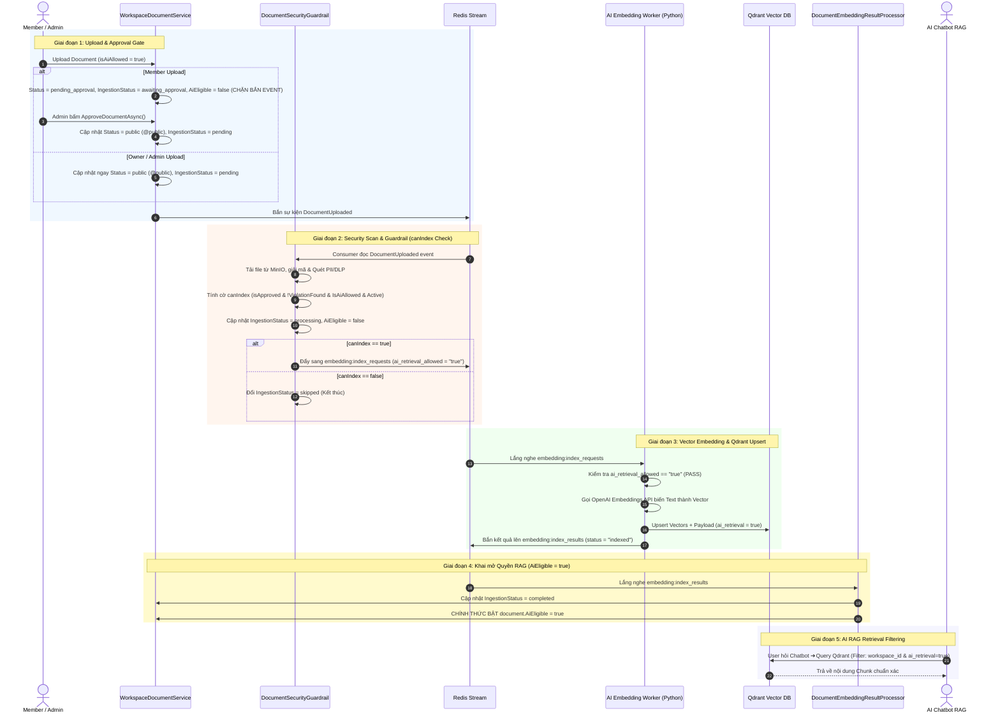

# Feature Specification: Workspace Document Approval & AI Ingestion Lifecycle Workflow (WT-158-Addendum)

**Feature Branch**: `feat/workspace-document-approval-workflow`  
**Created/Updated**: 2026-07-26  
**Status**: Approved & Formally Specified  

---

## 1. Problem Statement & Context

Để tăng cường bảo mật thông tin nội bộ của doanh nghiệp (Enterprise), việc tải lên tài liệu mới cần được kiểm soát chặt chẽ thông qua luồng phê duyệt (**Approval Workflow**) và đồng bộ hóa vòng đời tài liệu với hệ thống AI (AI retrieval boundary, Vector DB embedding invalidation).

### Điểm Kỹ Thuật Cốt Lõi (State Separation Architecture):
Nếu gán trực tiếp `AiEligible = false` trước bước gửi request nạp vector sang AI Worker, Worker Python sẽ tự động **chặn (block)** request do đọc phải cờ `ai_retrieval_allowed = false`. 

Do đó, kiến trúc bắt buộc phải **tách biệt làm 2 cờ riêng biệt**:
1. **`canIndex` (Cờ Kiểm duyệt Nội bộ)**: Kiểm tra an toàn bảo mật (DLP/PII Pass, Approved status, Active retention state) để quyết định có phát tin nhắn `ai_retrieval_allowed = "true"` lên Redis Stream `embedding:index_requests` hay không.
2. **`document.AiEligible` (Cờ Trạng thái RAG Công khai)**: Được giữ bằng `false` trong suốt quá trình xử lý, và **chỉ chính thức chuyển sang `true`** sau khi AI Worker đã tạo vector và upsert thành công vào Qdrant Vector DB (`status = "indexed"`).

---

## 2. Quy trình 5 Giai đoạn Hoạt động Chi tiết (5-Phase Operational Flow)



---

### Giai đoạn 1: Upload & Phê duyệt (Approval Gate)
- **Khi Member Upload**:
  - Dữ liệu lưu mã hóa AES-256 vào MinIO.
  - Cơ sở dữ liệu lưu: `Status = WorkspaceDocumentStatus.pending_approval`, `IngestionStatus = WorkspaceDocumentIngestionStatus.awaiting_approval`, `AiEligible = false`.
  - **Chặn tuyệt đối việc phát sự kiện `DocumentUploaded` sang Redis Stream**. File nằm ở chế độ xem trước an toàn chờ Admin duyệt.
- **Khi Admin/Owner Upload hoặc Bấm Phê duyệt (`ApproveDocumentAsync`)**:
  - Cập nhật DB: `Status = WorkspaceDocumentStatus.@public` (active), `IngestionStatus = WorkspaceDocumentIngestionStatus.pending`, `AiEligible = false`.
  - Phát sự kiện `DocumentUploaded` lên Redis Stream `workspace:document:uploaded`.

---

### Giai đoạn 2: Quét An toàn Bảo mật & Đánh giá `canIndex` (Security Guardrail)
- Worker `DocumentSecurityGuardrailConsumerService` tiêu thụ sự kiện `DocumentUploaded`.
- Tải nội dung từ MinIO, giải mã và thực hiện quét PII (thông tin cá nhân) và DLP (từ khóa cấm).
- Đánh giá cờ nội bộ `canIndex`:
  ```csharp
  var canIndex = document.IsAiAllowed
      && !document.IsRestricted()
      && string.Equals(document.Status, WorkspaceDocumentStatus.@public.ToString(), StringComparison.OrdinalIgnoreCase)
      && string.Equals(document.RetentionState, "active", StringComparison.OrdinalIgnoreCase)
      && !scanResult.ViolationFound;
  ```
- Cập nhật `document.IngestionStatus = processing`, `document.AiEligible = false`.
- **Nếu `canIndex == true`**: Gọi `RedisEmbeddingIndexPublisher.PublishEmbeddingIndexRequestAsync(...)` để phát sự kiện sang Redis Stream `embedding:index_requests` với thuộc tính **`ai_retrieval_allowed = "true"`**.
- **Nếu `canIndex == false`**: Cập nhật `document.IngestionStatus = skipped` và kết thúc luồng.

---

### Giai đoạn 3: Phân đoạn Vector & Lưu Qdrant (AI Embedding Worker)
- Worker Python (`warptalk-ai/embedding_worker`) tiêu thụ tin nhắn từ `embedding:index_requests`.
- Phương thức `_block_reason` kiểm tra `ai_retrieval_allowed == "true"` ➔ Cho phép xử lý.
- Tiến hành phân đoạn văn bản (text chunking), gọi OpenAI `text-embedding-3-small` tạo Vector 1536 chiều.
- Thực hiện Upsert Vector cùng Metadata Payload vào Qdrant Collection `workspace_{workspaceId}`:
  ```json
  {
    "document_id": "...",
    "workspace_id": "...",
    "chunk_id": "...",
    "ai_retrieval": true,
    "retention_state": "active"
  }
  ```
- Phát thông điệp kết quả lên Redis Stream `embedding:index_results` với `status = "indexed"`.

---

### Giai đoạn 4: Khai mở Trạng thái RAG (`AiEligible = true`)
- Background Service .NET (`DocumentEmbeddingIndexResultConsumerService`) tiêu thụ tin nhắn từ `embedding:index_results`.
- Chuyển tiếp cho `DocumentEmbeddingResultProcessor.ProcessResultAsync`:
  - Kiểm tra `status == "indexed"`.
  - Cập nhật `document.IngestionStatus = completed`.
  - **Chính thức bật `document.AiEligible = true`**.
  - Đánh dấu mốc `document.LastIndexedAt = DateTime.UtcNow`.

---

### Giai đoạn 5: Tìm kiếm Ngữ nghĩa RAG (AI Retrieval Boundary)
- Chatbot RAG (`warptalk-ai/ai_assistant_worker/chat_tools.py`) khi thực hiện semantic search sẽ gửi câu hỏi kèm bộ lọc sang Qdrant:
  ```json
  {
    "workspace_id": "workspace_uuid",
    "ai_retrieval": true
  }
  ```
- Qdrant chỉ trả về các vector chunks thuộc tài liệu có `ai_retrieval = true` (vốn đồng bộ với các tài liệu đã đạt `AiEligible = true` và `Status = @public`).

---

## 3. Quy tắc Nghiệp vụ (Business Rules Summary)

| Trạng thái | Member Upload | Admin Upload | Sau khi Admin Approve | Sau khi Qdrant Index Xong |
|---|---|---|---|---|
| `Status` | `pending_approval` | `@public` | `@public` | `@public` |
| `IngestionStatus` | `awaiting_approval` | `pending` | `pending` ➔ `processing` | `completed` |
| `canIndex` (Internal) | `false` | `true` | `true` | `true` |
| `ai_retrieval_allowed` (Redis) | *(Không gửi)* | `"true"` | `"true"` | `"true"` |
| `document.AiEligible` (DB) | `false` | `false` | `false` | **`true`** |

---

## 4. API Contract & Nhật ký (Audit Trail)

### 4.1. Phê duyệt/Từ chối tài liệu
* **Endpoint**: `POST /api/v1/workspaces/{workspaceId}/documents/{documentId}/approve`
* **Request Body**:
```json
{
  "approve": true
}
```

### 4.2. Audit Trail Actions
Mọi thao tác thay đổi vòng đời tài liệu đều được ghi lại vào `WorkspaceDocumentAudits`:
- `UploadDocument`: Tải lên tài liệu.
- `ApproveDocument` / `RejectDocument`: Phê duyệt hoặc từ chối tài liệu.
- `SecurityScanCompleted`: Hoàn tất quét DLP/PII.
- `EmbeddingIndexed`: Hoàn tất nạp Vector vào Qdrant DB.
