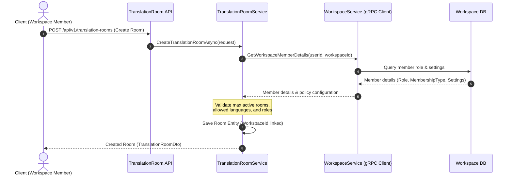

# Feature Specification: Workspace Meeting Governance & Artifact Retention (WT-159)

**Feature Branch**: `feat/workspace-govern-internal-meetings`  
**Created**: 2026-06-08  
**Status**: Proposed  
**Input**: Linear ticket WT-159 - [Enterprise Workspace] Govern native internal meetings and artifacts

---

## 1. Problem Statement & Context

### 1.1. Problem Statement
Trong mô hình B2B của WarpTalk, các cuộc họp nội bộ (native internal meetings) chứa đựng nhiều thông tin nhạy cảm của doanh nghiệp. Việc cho phép người dùng tự do tạo và tham gia các phòng dịch thuật mà không chịu sự kiểm soát của tổ chức (Enterprise Workspace) dẫn đến các rủi ro bảo mật nghiêm trọng:
1. **Thất thoát dữ liệu:** Đối tác ngoài (External Member) hoặc người dùng không thuộc Workspace có thể vô tình hoặc cố ý tham gia vào các cuộc họp nội bộ quan trọng.
2. **Thiếu ranh giới sở hữu:** Các tài nguyên cuộc họp (transcript, audio, summary) không được liên kết trực tiếp với thực thể doanh nghiệp, gây khó khăn cho việc áp dụng chính sách lưu trữ (Retention Policy) và kiểm soát quyền truy cập của doanh nghiệp.
3. **Không đồng bộ cấu hình:** Các thiết lập bảo mật cấp cao của Workspace (như cho phép/cấm Voice Cloning, giới hạn ngôn ngữ dịch, số lượng phòng tối đa) không được áp dụng tự động lên các cuộc họp được tạo.

Để giải quyết vấn đề này, WarpTalk cần triển khai cơ chế quản trị cuộc họp nội bộ (**Meeting Governance**), đảm bảo mọi cuộc họp đều thuộc quyền sở hữu của Workspace, áp dụng chặt chẽ phân quyền thành viên và quản lý vòng đời các tệp kết quả (Artifacts) một cách tối giản và an toàn.

### 1.2. User Story
> **As an** enterprise workspace member,  
> **I want** native internal meeting context, permissions, and artifacts to be governed by my organization,  
> **So that** WarpTalk can support B2B real-time translation workflows for company meetings securely.

### 1.3. B2B Direction
Hệ thống WarpTalk coi cuộc họp nội bộ (native internal meetings) là luồng nghiệp vụ B2B cốt lõi. Cuộc họp thuộc sở hữu và quyền quản lý của **Enterprise Workspace**, không thuộc về cá nhân. 
Các nền tảng của bên thứ ba như Google Meet, Microsoft Teams và Zoom chỉ đóng vai trò là các kênh tích hợp bổ sung (External Integration) và sẽ được xử lý thông qua Virtual Audio Bridge ở các ticket khác; chúng không thay thế và không làm thay đổi luồng cuộc họp nội bộ chính này.

---

## 2. Product Scope & Functional Requirements

### 2.1. Scope (Phạm vi)
* **Workspace Meeting Linkage:** Liên kết chặt chẽ mọi `TranslationRoom` với `WorkspaceId` tương ứng trong cơ sở dữ liệu.
* **Access Control & Permission Validation:** Áp dụng quyền thành viên workspace (Workspace Membership, Role) để quyết định ai được tạo, tham gia và quản trị cuộc họp.
* **Internal Meeting Creation Flow:** Hỗ trợ quy trình tạo cuộc họp trực tiếp từ ngữ cảnh của Workspace (Workspace Context).
* **Document Attachment:** Hỗ trợ liên kết tài liệu từ Workspace (`WorkspaceDocument`) vào cuộc họp làm ngữ cảnh bổ trợ cho AI/RAG hoặc để các thành viên tham khảo.
* **Artifact Linking & Retention:** Liên kết các tệp kết quả (audio, transcript, translated transcript, summary/report) với Workspace và áp dụng chính sách lưu giữ tối giản (Artifact Retention Policy).

### 2.2. Quy tắc Nghiệp vụ (Business Rules)

#### A. Quyền tạo cuộc họp (Create Meeting):
* Quyền tạo cuộc họp được kiểm soát chi tiết cho từng thành viên thông qua cờ **`CanCreateMeetings`** (kiểu boolean) trong bảng `WorkspaceMembers`:
  * Mặc định khi một thành viên gia nhập Workspace:
    * **Internal Member** (Owner, Admin, Member): Được gán mặc định `CanCreateMeetings = true`.
    * **External Member**: Được gán mặc định `CanCreateMeetings = false`.
  * **Workspace Owner / Admin** có toàn quyền tùy chỉnh bật/tắt (toggle) cờ `CanCreateMeetings` này thủ công cho từng Member bất kỳ lúc nào thông qua API quản trị thành viên (`PATCH /api/v1/workspaces/{workspaceId}/members/{memberId}`).
  * Nếu một thành viên có `CanCreateMeetings == false` gửi yêu cầu tạo cuộc họp, hệ thống sẽ trả về lỗi `AccessDenied` (403 Forbidden).

#### B. Quyền tham gia cuộc họp (Join Meeting):
* **Internal Member** thuộc Workspace mặc định được phép tham gia các cuộc họp nội bộ của Workspace đó.
* **External Member** chỉ được phép tham gia nếu thuộc một trong các trường hợp:
  1. Được mời trực tiếp hoặc có tên trong danh sách người tham gia (`participants`) được khai báo khi tạo cuộc họp.
  2. Cuộc họp được cấu hình cho phép đối tác ngoài tham gia thông qua thiết lập `AllowExternalCollaboration == true` của Workspace.
* Người dùng bên ngoài không thuộc Workspace bị cấm tham gia hoàn toàn (Deny-by-default).

#### C. Thiết lập Ngôn ngữ và Tính năng (Language & Voice Settings):
* **Cơ chế Ngôn ngữ (Allowed Languages):**
  * Ngôn ngữ của cuộc họp có thể được chỉ định chi tiết ở cấp độ phòng họp (Room Level) tại thời điểm tạo.
  * Nếu người tạo (Host) không cấu hình ngôn ngữ đích tại Room Level, cuộc họp sẽ tự động kế thừa danh mục ngôn ngữ mặc định (`AllowedTargetLanguages`) từ Workspace.
  * Trong trường hợp Host cấu hình ngôn ngữ cụ thể tại Room Level, danh sách ngôn ngữ đích bắt buộc phải là tập con (subset) của danh mục `AllowedTargetLanguages` được cấu hình tại Workspace (nếu Workspace có cấu hình).
* **Tính năng Voice Cloning (Room-level Permission):**
  * Tính năng Voice Cloning **không** được cấu hình ở phần cài đặt chung của Workspace.
  * Thay vào đó, nó được phân quyền chi tiết ở cấp độ phòng họp (Room Level) thông qua trường `Settings` (`EnableVoiceCloning` - kiểu boolean, mặc định là `true`).
  * **Workspace Owner / Admin** có quyền tùy chỉnh bật/tắt cờ `EnableVoiceCloning` này cho từng cuộc họp cụ thể (ví dụ: thông qua API cập nhật cài đặt phòng họp).
  * Trong trường hợp Voice Cloning bị tắt (do Owner/Admin không cấp quyền cho phòng họp đó) hoặc dịch vụ không khả dụng, hệ thống sẽ tự động fall back về giọng thật (real/raw audio) của người nói mà không chặn kết nối cuộc họp.
* **Giới hạn số lượng phòng:**
  * Kiểm tra số lượng phòng đang hoạt động của Workspace không vượt quá `MaxActiveRooms`.

#### D. Liên kết Tài liệu Workspace (Document Attachment):
* Người tạo cuộc họp hoặc quản trị viên có thể đính kèm các tài liệu của Workspace vào cuộc họp.
* Tài liệu nhạy cảm (`IsSensitive == true`) chỉ được đính kèm bởi người dùng có quyền quản trị tài liệu đó (Owner, Admin, hoặc Document Owner).
* Khi tài liệu được đính kèm vào cuộc họp, hệ thống tự động cho phép các thành viên tham gia cuộc họp truy cập đọc/xem tài liệu này trong suốt thời gian diễn ra cuộc họp và trong Grace Period (ngoại lệ cuộc họp đã thiết lập ở WT-158).

#### E. Chính sách lưu trữ tệp kết quả (Artifact Retention Policy):
* **Phân loại lưu giữ Artifact theo giá trị sử dụng (Utility-Based Retention):**
  * **Transcript & Summary/Report (Loại `TRANSCRIPT_EXPORT` & `SUMMARY_EXPORT`):** Mặc định lưu trữ để tra cứu nội bộ. Thời hạn lưu trữ được tự động tính toán dựa trên cấu hình `ArtifactRetentionDays` của Workspace (mặc định là 30 ngày).
  * **Audio gốc (Raw Audio - Loại `OPTIONAL_RECORDING`):** **KHÔNG lưu mặc định**. Hệ thống chỉ ghi âm và lưu trữ tệp tin âm thanh thô khi cuộc họp được cấu hình yêu cầu lưu (phục vụ đối soát, khiếu nại, chất lượng hoặc compliance của doanh nghiệp). Khi được phép lưu, tệp audio thô sẽ tự động hết hạn và bị xóa sớm sau một khoảng thời gian ngắn (ví dụ: `AudioRetentionDays` - mặc định là 7 ngày) để tối ưu dung lượng và bảo vệ quyền riêng tư.
  * **Metadata cuộc họp:** Được lưu trữ lâu dài trong cơ sở dữ liệu để phục vụ cho mục đích Audit Trail (nhật ký hành động) và quản trị hệ thống của doanh nghiệp. Metadata không bị tự động xóa bởi tiến trình dọn dẹp hàng ngày.
* **Cấu hình phân quyền trên từng loại Artifact (Granular Permissions):**
  * Quyền xem/tải xuống/xóa được áp dụng riêng biệt:
    * **Transcript & Summary:** Cho phép thành viên xem dựa trên cấu hình `ArtifactAccess` của phòng họp (HostOnly, ParticipantsOnly, WorkspaceMembers). Quyền tải xuống/xóa thuộc về Host cuộc họp và Workspace Owner/Admin.
    * **Audio gốc (nếu có lưu):** Chỉ có Host cuộc họp và Workspace Owner/Admin mới được quyền nghe/tải xuống/xóa.
* **Chính sách hết hạn (Expiration Action):**
  * Khi hết hạn lưu giữ (`RetentionUntil < DateTime.UtcNow`), hệ thống chạy ngầm sẽ thực hiện xóa vật lý tệp tin trên Storage Provider (S3/MinIO) để tránh lãng phí bộ nhớ và hạn chế tối đa rủi ro lộ lọt thông tin nhạy cảm. DB record sẽ được cập nhật trạng thái hoặc xóa mềm.
  * Workspace Admin có toàn quyền điều chỉnh thời hạn lưu giữ (`ArtifactRetentionDays`, `AudioRetentionDays`) thông qua trang quản trị cài đặt Workspace.

---

## 3. Technical Decisions & Architectural Boundaries

### 3.1. Phân vùng Dịch vụ & Giao tiếp gRPC (Service Boundaries)
Theo **Constitution Article II**, không thực hiện JOIN database giữa hai service độc lập `WorkspaceService` và `TranslationRoomService`. Giao tiếp đồng bộ bắt buộc phải thực hiện thông qua gRPC.



### 3.2. Quyền truy cập Artifacts của Cuộc họp
Khi cuộc họp kết thúc, các tệp kết quả (`TranslationRoomArtifact`) được tạo ra. Quyền truy cập đọc/tải các tệp này được đánh giá dựa trên cài đặt `ArtifactAccess` của phòng họp:
* `HostOnly`: Chỉ Host (người tạo phòng) có quyền truy cập.
* `ParticipantsOnly`: Chỉ những thành viên thực tế đã tham gia (`TranslationRoomParticipant`) mới có quyền truy cập.
* `WorkspaceMembers`: Toàn bộ Internal Member trong Workspace có quyền truy cập. External Member chỉ được truy cập nếu họ đã tham gia cuộc họp và trong thời gian hiệu lực (Grace Period).

---

## 4. Proposed Database & Proto Changes

### 4.1. Cập nhật file Proto (`shared/WarpTalk.Shared/Protos/workspace.proto`) [NEW]
Tạo mới file proto để cung cấp các dịch vụ gRPC từ `WorkspaceService` cho `TranslationRoomService` gọi sang:

```protobuf
syntax = "proto3";

option csharp_namespace = "WarpTalk.Shared.Protos";

package workspace;

service WorkspaceService {
  rpc GetWorkspaceMemberDetails (GetWorkspaceMemberRequest) returns (GetWorkspaceMemberResponse);
  rpc ValidateMeetingCreation (ValidateMeetingCreationRequest) returns (ValidateMeetingCreationResponse);
}

message GetWorkspaceMemberRequest {
  string workspace_id = 1;
  string user_id = 2;
}

message GetWorkspaceMemberResponse {
  bool is_member = 1;
  string role_name = 2;
  string membership_type = 3; // INTERNAL, EXTERNAL
  bool is_active = 4;
}

message ValidateMeetingCreationRequest {
  string workspace_id = 1;
  string user_id = 2;
  repeated string target_languages = 3;
}

message ValidateMeetingCreationResponse {
  bool is_allowed = 1;
  string error_message = 2;
}
```

### 4.2. Cập nhật thực thể dữ liệu (Data Entity Model)
* **`WorkspaceMember`**:
  * Bổ sung cột `CanCreateMeetings` (boolean, default: `true` cho Internal, `false` cho External).
* **`TranslationRoom`** (đã có trường `WorkspaceId`):
  * Đảm bảo cấu hình Index để tìm kiếm nhanh cuộc họp theo Workspace: `idx_translation_rooms_workspace_id`.
* **`TranslationRoomArtifact`**:
  * Thêm trường `RetentionUntil` (DateTime?) để đánh dấu thời điểm tệp tin tự động hết hạn và bị xóa khỏi hệ thống.
  * Bổ sung Index `idx_room_artifacts_retention` trên trường `RetentionUntil` phục vụ cho background delete job.

---

## 5. Proposed Changes (Phân rã thay đổi theo tệp tin)

### 5.1. [Shared Project]
#### [NEW] [workspace.proto](file:///c:/Users/Admin/Documents/WarpTalk%20-%20Capstone%20Project/warptalk-backend/shared/WarpTalk.Shared/Protos/workspace.proto)
* Khai báo contract gRPC cho dịch vụ Workspace để kiểm tra thông tin thành viên và ràng buộc cấu hình cuộc họp.

### 5.2. [Workspace Service]
#### [NEW] [WorkspaceGrpcService.cs](file:///c:/Users/Admin/Documents/WarpTalk%20-%20Capstone%20Project/warptalk-backend/workspace/src/WarpTalk.WorkspaceService.API/GrpcServices/WorkspaceGrpcService.cs)
* Thực thi các RPC được khai báo trong `workspace.proto`.
* Kiểm tra thông tin thành viên trong bảng `WorkspaceMembers` và trả về vai trò (`role_name`), loại thành viên (`membership_type`) và cờ cho phép tạo cuộc họp (`can_create_meetings`).
* Xác thực các ràng buộc tạo cuộc họp dựa trên `WorkspaceConfiguration` và thông tin thành viên:
  * Kiểm tra cờ `CanCreateMeetings` của thành viên yêu cầu.
  * Số lượng phòng dịch thuật đang chạy không vượt quá `MaxActiveRooms`.
  * Các ngôn ngữ yêu cầu phải thuộc `AllowedTargetLanguages` của Workspace (nếu có cấu hình).

### 5.3. [Translation Room Service]
#### [MODIFY] [TranslationRoomService.cs](file:///c:/Users/Admin/Documents/WarpTalk%20-%20Capstone%20Project/warptalk-backend/translation-room/src/WarpTalk.TranslationRoomService.Application/Services/TranslationRoomService.cs)
* Trong phương thức `CreateTranslationRoomAsync`:
  * Nếu `WorkspaceId` được truyền lên:
    1. Gọi gRPC sang `WorkspaceService` để kiểm tra quyền của `hostId` (kiểm tra cờ `CanCreateMeetings` của thành viên).
    2. Xác thực ngôn ngữ thông qua gRPC `ValidateMeetingCreation` (kế thừa `AllowedTargetLanguages` nếu Host không điền hoặc kiểm tra tính hợp lệ nếu Host tự điền).
    3. Gán `WorkspaceId` vào entity phòng họp.
* Trong phương thức `JoinTranslationRoomAsync`:
  * Nếu phòng họp thuộc một Workspace:
    1. Gọi gRPC sang `WorkspaceService` để kiểm tra thông tin của user yêu cầu join.
    2. Nếu user không thuộc Workspace và không phải là người tham gia được mời đích danh $\rightarrow$ Từ chối tham gia.
    3. Đối với External Member: Kiểm tra xem Workspace có cho phép cộng tác ngoài hay không (`AllowExternalCollaboration`).
* Trong phương thức tạo Artifact (`CreateArtifactAsync` hoặc khi kết thúc cuộc họp):
  * Thiết lập thời hạn lưu giữ `RetentionUntil = DateTime.UtcNow.AddDays(workspaceRetentionDays)` dựa trên cấu hình `ArtifactRetentionDays` nhận được từ Workspace.
#### [NEW] [ArtifactRetentionJob.cs](file:///c:/Users/Admin/Documents/WarpTalk%20-%20Capstone%20Project/warptalk-backend/translation-room/src/WarpTalk.TranslationRoomService.Infrastructure/BackgroundProcessors/ArtifactRetentionJob.cs)
* Tiến trình chạy nền định kỳ quét cơ sở dữ liệu `TranslationRoomArtifacts`.
* Tìm kiếm các bản ghi có `RetentionUntil != null` và `RetentionUntil < DateTime.UtcNow`.
* Thực hiện xóa vật lý tệp tin trên Storage Provider (MinIO/S3) và cập nhật trạng thái bản ghi thành `deleted` hoặc xóa vật lý bản ghi trong DB.

---

## 6. Acceptance Criteria (Tiêu chí Nghiệm thu)

1. **Workspace Scope Constraint**: 
   * Mọi cuộc họp nội bộ được tạo từ Workspace phải lưu đúng `WorkspaceId`.
   * Giao diện và API lấy danh sách cuộc họp của Workspace chỉ trả về các cuộc họp thuộc Workspace đó.
2. **Access Control Enforcement**:
   * Kiểm thử chứng minh External Member **không thể** tạo cuộc họp nội bộ trong Workspace.
   * Kiểm thử chứng minh một tài khoản không thuộc Workspace **không thể** join vào cuộc họp nội bộ (trả về lỗi 403 Forbidden).
   * Kiểm thử chứng minh External Member chỉ join được nếu được mời trước và nằm trong danh sách `participants`.
3. **Workspace Policy Compliance**:
   * Khi cờ `CanCreateMeetings` của thành viên bị tắt bởi Owner/Admin, mọi yêu cầu tạo cuộc họp của thành viên đó sẽ bị từ chối với lỗi 403 Forbidden.
   * Khi chọn ngôn ngữ không thuộc danh sách `AllowedTargetLanguages` của Workspace (trong trường hợp Host chỉ định rõ tại Room Level), API tạo cuộc họp phải báo lỗi validation. Nếu không chỉ định, hệ thống tự động kế thừa cấu hình của Workspace.
   * Tính năng Voice Cloning có thể bật/tắt thoải mái bởi Host tại Room Level và hệ thống tự động fall back về giọng thật nếu dịch vụ không khả dụng.
4. **Artifact Retention Compliance**:
   * Khi cuộc họp kết thúc, Transcript và Summary tự động được gán thời hạn hết hạn `RetentionUntil` dựa trên `ArtifactRetentionDays` của Workspace.
   * Tệp Audio gốc mặc định không được lưu trừ khi Host yêu cầu rõ ràng; nếu lưu, nó được gán thời hạn hết hạn ngắn dựa trên `AudioRetentionDays`.
   * Đảm bảo tiến trình chạy nền dọn dẹp chính xác các tệp hết hạn và metadata cuộc họp vẫn được giữ lại để phục vụ đối soát và audit.
5. **No Database Cross-Joins**:
   * Toàn bộ mã nguồn kiểm tra thành viên và chính sách của Workspace trong dịch vụ Translation Room bắt buộc phải gọi qua gRPC client, không thực hiện truy vấn DB trực tiếp trên schema của Workspace.

---

## 7. Verification Plan

### Automated Tests (Kiểm thử tự động)
* **TranslationRoomService Unit Tests**:
  * Giả lập (Mock) gRPC client của Workspace Service để trả về các kịch bản thành viên/chính sách khác nhau.
  * Test Case 1: Host là Internal Member $\rightarrow$ Tạo cuộc họp thành công.
  * Test Case 2: Host là External Member $\rightarrow$ Trả về lỗi `Forbidden`.
  * Test Case 3: Tạo cuộc họp với ngôn ngữ không được Workspace cho phép $\rightarrow$ Trả về lỗi `ValidationError`.
  * Test Case 4: User ngoài Workspace cố gắng join phòng họp nội bộ $\rightarrow$ Trả về lỗi `Forbidden`.
* **Artifact Retention Background Job Tests**:
  * Viết integration test sử dụng DB ảo: Chèn các bản ghi artifact đã quá hạn (`RetentionUntil` trong quá khứ).
  * Chạy job dọn dẹp và xác thực rằng các file vật lý đã bị xóa khỏi mock storage và DB được cập nhật chính xác.

### Manual Verification (Kiểm thử thủ công)
* Sử dụng Postman để thực hiện luồng:
  1. Tạo Workspace và thiết lập chính sách (ví dụ: cấm Voice Cloning, đặt retention là 1 ngày).
  2. Dùng tài khoản Member thường tạo cuộc họp nội bộ liên kết với WorkspaceId vừa tạo.
  3. Xác thực các thiết lập cuộc họp tuân thủ đúng chính sách của Workspace.
  4. Sau khi kết thúc cuộc họp, kiểm tra trong DB xem trường `RetentionUntil` của các artifact có được tính toán chính xác hay không.
