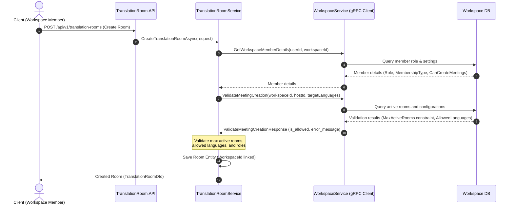

# Feature Specification: Workspace Meeting Governance & Artifact Retention (WT-159)

**Feature Branch**: `feat/workspace-govern-internal-meetings`  
**Created**: 2026-06-08  
**Last Updated**: 2026-06-12  
**Status**: Proposed  
**Input**: Linear ticket WT-159 - [Enterprise Workspace] Govern native internal meetings and artifacts  

---

## 1. Problem Statement & Context

### 1.1. Problem Statement
Trong mô hình B2B của WarpTalk, các cuộc họp nội bộ (native internal meetings) chứa đựng nhiều thông tin nhạy cảm của doanh nghiệp. Việc cho phép người dùng tự do tạo và tham gia các phòng dịch thuật mà không chịu sự kiểm soát của tổ chức (Enterprise Workspace) dẫn đến các rủi ro bảo mật nghiêm trọng:
1. **Thất thoát dữ liệu:** Đối tác ngoài (External Member) hoặc người dùng không thuộc Workspace có thể vô tình hoặc cố ý tham gia vào các cuộc họp nội bộ quan trọng.
2. **Thiếu ranh giới sở hữu:** Các tài nguyên cuộc họp (transcript, summary) không được liên kết trực tiếp với thực thể doanh nghiệp, gây khó khăn cho việc áp dụng chính sách lưu trữ (Retention Policy) và kiểm soát quyền truy cập của doanh nghiệp.
3. **Không đồng bộ cấu hình:** Các thiết lập bảo mật cấp cao của Workspace (như giới hạn ngôn ngữ dịch, số lượng phòng tối đa) không được áp dụng tự động lên các cuộc họp được tạo.

Để giải quyết vấn đề này, WarpTalk cần triển khai cơ chế quản trị cuộc họp nội bộ (**Meeting Governance**), đảm bảo mọi cuộc họp đều thuộc quyền sở hữu của Workspace, áp dụng chặt chẽ phân quyền thành viên và quản lý vòng đời các tệp kết quả (Artifacts) một cách tối giản và an toàn.

### 1.2. User Story
> **As an** enterprise workspace member,  
> **I want** native internal meeting context, permissions, and artifacts to be governed by my organization,  
> **So that** WarpTalk can support B2B real-time translation workflows for company meetings securely.

### 1.3. B2B Direction
Hệ thống WarpTalk coi cuộc họp nội bộ (native internal meetings) là luồng nghiệp vụ B2B cốt lõi. Cuộc họp thuộc sở hữu và quyền quản lý của **Enterprise Workspace**, không thuộc về cá nhân. 
Các nền tảng của bên thứ ba như Google Meet, Microsoft Teams và Zoom chỉ đóng vai trò là các kênh tích hợp bổ sung (External Integration) và sẽ được xử lý thông qua Virtual Audio Bridge; chúng không thay thế và không làm thay đổi luồng cuộc họp nội bộ chính này.

---

## 2. Product Scope & Functional Requirements

### 2.1. Scope (Phạm vi)
* **Workspace Meeting Linkage:** Liên kết chặt chẽ mọi `TranslationRoom` với `WorkspaceId` tương ứng trong cơ sở dữ liệu.
* **Access Control & Permission Validation:** Áp dụng quyền thành viên workspace (Workspace Membership, Role) để quyết định ai được tạo, tham gia và quản trị cuộc họp.
* **Internal Meeting Creation Flow:** Hỗ trợ quy trình tạo cuộc họp trực tiếp từ ngữ cảnh của Workspace (Workspace Context).
* **Document Attachment:** Hỗ trợ liên kết tài liệu từ Workspace (`WorkspaceDocument`) vào cuộc họp làm ngữ cảnh bổ trợ cho AI/RAG hoặc để các thành viên tham khảo (tuân thủ ACL ở WT-158).
* **Artifact Linking & Retention (Lưu ý về Phạm vi):** 
  * **CHỈ** liên kết và áp dụng chính sách lưu trữ cho **Transcript** (Loại `TRANSCRIPT_EXPORT`) và **AI Summary** (Loại `SUMMARY_EXPORT`).
  * > [!IMPORTANT]
    > **Ghi âm cuộc họp (Audio Recording - Loại `OPTIONAL_RECORDING`, raw audio WAV/PCM) NẰM NGOÀI PHẠM VI (OUT OF SCOPE)** của ticket WT-159 này. Hệ thống không lưu trữ, không liên kết và không áp dụng chính sách lưu giữ cho tệp audio ghi âm cuộc họp trong ticket này.

### 2.2. Quy tắc Nghiệp vụ (Business Rules)

#### A. Quyền tạo cuộc họp (Create Meeting):
* Quyền tạo cuộc họp được kiểm soát chi tiết cho từng thành viên thông qua cột **`CanCreateMeetings`** (kiểu boolean) trong bảng `WorkspaceMembers`:
  * Mặc định khi một thành viên gia nhập Workspace:
    * **Internal Member** (Owner, Admin, Member): Được gán mặc định `CanCreateMeetings = true`.
    * **External Member**: Được gán mặc định `CanCreateMeetings = false`.
  * **Workspace Owner / Admin** có toàn quyền tùy chỉnh bật/tắt (toggle) cờ `CanCreateMeetings` này thủ công cho từng Member bất kỳ lúc nào thông qua API quản trị thành viên (`PATCH /api/v1/workspaces/{workspaceId}/members/{memberId}`).
  * Nếu một thành viên có `CanCreateMeetings == false` gửi yêu cầu tạo cuộc họp, hệ thống sẽ trả về lỗi `AccessDenied` (403 Forbidden).

#### B. Quyền tham gia cuộc họp (Join Meeting):
* **Internal Member** thuộc Workspace mặc định được phép tham gia các cuộc họp nội bộ của Workspace đó.
* **External Member** chỉ được phép tham gia nếu thuộc một trong các trường hợp:
  1. Được mời trực tiếp hoặc có tên trong danh sách người tham gia (`participants`) được khai báo khi tạo cuộc họp.
  2. Cuộc họp được cấu hình cho phép đối tác ngoài tham gia thông qua thiết lập `AllowExternalCollaboration == true` của Workspace.
* Người dùng bên ngoài không thuộc Workspace bị cấm tham gia hoàn toàn (Deny-by-default).

#### C. Thiết lập Ngôn ngữ và Tính năng (Language & Room Settings):
* Ngôn ngữ của cuộc họp có thể được chỉ định chi tiết ở cấp độ phòng họp (Room Level) tại thời điểm tạo.
* Nếu người tạo (Host) không cấu hình ngôn ngữ đích tại Room Level, cuộc họp sẽ tự động kế thừa danh mục ngôn ngữ mặc định (`AllowedTargetLanguages`) từ Workspace.
* Trong trường hợp Host cấu hình ngôn ngữ cụ thể tại Room Level, danh sách ngôn ngữ đích bắt buộc phải là tập con (subset) của danh mục `AllowedTargetLanguages` được cấu hình tại Workspace (nếu Workspace có cấu hình).
* **Giới hạn số lượng phòng:**
  * Kiểm tra số lượng phòng đang hoạt động (Status = `WAITING` hoặc `IN_PROGRESS`) của Workspace không vượt quá `MaxActiveRooms`.

#### D. Liên kết Tài liệu Workspace (Document Attachment):
* Người tạo cuộc họp hoặc quản trị viên có thể đính kèm các tài liệu của Workspace vào cuộc họp làm context hỗ trợ dịch thuật/RAG.
* Tài liệu nhạy cảm (`IsSensitive == true`) chỉ được đính kèm bởi người dùng có quyền quản trị tài liệu đó (Owner, Admin, hoặc Document Owner).
* Khi tài liệu được đính kèm vào cuộc họp, hệ thống tự động cho phép các thành viên tham gia cuộc họp truy cập đọc/xem tài liệu này trong suốt thời gian diễn ra cuộc họp và trong Grace Period (theo chính sách WT-158).

#### E. Chính sách lưu trữ tệp kết quả (Artifact Retention Policy):
* **Phân loại lưu giữ Artifact theo giá trị sử dụng (Utility-Based Retention):**
  * **Transcript & Summary/Report (Loại `TRANSCRIPT_EXPORT` & `SUMMARY_EXPORT`):** Mặc định lưu trữ để tra cứu nội bộ. Thời hạn lưu trữ được tự động tính toán dựa trên cấu hình `ArtifactRetentionDays` của Workspace (mặc định là 30 ngày).
  * **Audio gốc (Raw Audio - Loại `OPTIONAL_RECORDING`):** **KHÔNG áp dụng trong ticket này (Out of scope).**
  * **Metadata cuộc họp:** Được lưu trữ lâu dài trong cơ sở dữ liệu để phục vụ cho mục đích Audit Trail (nhật ký hành động) và quản trị hệ thống của doanh nghiệp. Metadata không bị tự động xóa bởi tiến trình dọn dẹp hàng ngày.
* **Cấu hình phân quyền trên từng loại Artifact (Granular Permissions):**
  * Quyền xem/tải xuống/xóa được áp dụng riêng biệt:
    * **Transcript & Summary:** Cho phép thành viên xem dựa trên cấu hình `ArtifactAccess` của phòng họp (HostOnly, ParticipantsOnly, WorkspaceMembers). Quyền tải xuống/xóa thuộc về Host cuộc họp và Workspace Owner/Admin.
* **Chính sách hết hạn (Expiration Action):**
  * Khi hết hạn lưu giữ (`RetentionUntil < DateTime.UtcNow`), hệ thống chạy ngầm sẽ thực hiện xóa vật lý tệp tin trên Storage Provider (S3/MinIO) để tránh lãng phí bộ nhớ và hạn chế tối đa rủi ro lộ lọt thông tin nhạy cảm. DB record sẽ được cập nhật trạng thái `Deleted` hoặc xóa mềm (`DeletedAt` được gán).
  * Workspace Admin có toàn quyền điều chỉnh thời hạn lưu giữ (`ArtifactRetentionDays`) thông qua trang quản trị cài đặt Workspace.

---

## 3. Technical Decisions & Architectural Boundaries

### 3.1. Phân vùng Dịch vụ & Giao tiếp gRPC (Service Boundaries)
Theo **Constitution Article II**, không thực hiện JOIN database giữa hai service độc lập `WorkspaceService` và `TranslationRoomService`. Giao tiếp đồng bộ bắt buộc phải thực hiện thông qua gRPC.



### 3.2. Quyền truy cập Artifacts của Cuộc họp
Khi cuộc họp kết thúc, các tệp kết quả (`TranslationRoomArtifact` gồm Transcript và Summary) được tạo ra. Quyền truy cập đọc/tải các tệp này được đánh giá dựa trên cài đặt `ArtifactAccess` của phòng họp:
* `HostOnly`: Chỉ Host (người tạo phòng) có quyền truy cập.
* `ParticipantsOnly`: Chỉ những thành viên thực tế đã tham gia (`TranslationRoomParticipant`) mới có quyền truy cập.
* `WorkspaceMembers`: Toàn bộ Internal Member trong Workspace có quyền truy cập. External Member chỉ được truy cập nếu họ đã tham gia cuộc họp và trong thời gian hiệu lực (Grace Period).

---

## 4. Proposed Database & Proto Changes

### 4.1. Cập nhật file Proto (`shared/WarpTalk.Shared/Protos/workspace.proto`) [NEW]
Tạo mới file proto để cung cấp các dịch vụ gRPC từ `WorkspaceService` cho `TranslationRoomService` gọi sang:

```protobuf
syntax = "proto3";

option csharp_namespace = "WarpTalk.Shared.Protos";

package workspace;

service WorkspaceService {
  rpc GetWorkspaceMemberDetails (GetWorkspaceMemberRequest) returns (GetWorkspaceMemberResponse);
  rpc ValidateMeetingCreation (ValidateMeetingCreationRequest) returns (ValidateMeetingCreationResponse);
  rpc GetWorkspaceSettings (GetWorkspaceSettingsRequest) returns (GetWorkspaceSettingsResponse);
}

message GetWorkspaceMemberRequest {
  string workspace_id = 1;
  string user_id = 2;
}

message GetWorkspaceMemberResponse {
  bool is_member = 1;
  string role_name = 2;
  string membership_type = 3; // INTERNAL, EXTERNAL
  bool is_active = 4;
  bool can_create_meetings = 5;
}

message ValidateMeetingCreationRequest {
  string workspace_id = 1;
  string user_id = 2;
  repeated string target_languages = 3;
}

message ValidateMeetingCreationResponse {
  bool is_allowed = 1;
  string error_message = 2;
}

message GetWorkspaceSettingsRequest {
  string workspace_id = 1;
}

message GetWorkspaceSettingsResponse {
  int32 artifact_retention_days = 1;
  bool allow_external_collaboration = 2;
}
```

### 4.2. Cập nhật thực thể dữ liệu (Data Entity Model)
* **`WorkspaceMember`** (thuộc Workspace Service):
  * Bổ sung cột `CanCreateMeetings` (boolean, default: `true` cho Internal, `false` cho External).
* **`TranslationRoom`** (thuộc Translation Room Service - đã có trường `WorkspaceId`):
  * Đảm bảo cấu hình Index để tìm kiếm nhanh cuộc họp theo Workspace: `idx_translation_rooms_workspace_id`.
* **`TranslationRoomArtifact`** (thuộc Translation Room Service):
  * Thêm trường `RetentionUntil` (DateTime?) để đánh dấu thời điểm tệp tin tự động hết hạn và bị xóa khỏi hệ thống.
  * Bổ sung Index `idx_room_artifacts_retention` trên trường `RetentionUntil` phục vụ cho background delete job.

---

## 5. Detailed Implementation Steps (Từng bước Handle chi tiết)

### Bước 1: Database Migrations
#### 1.1. Workspace Service DB Schema Migration
* Tạo một file migration mới trong dự án `WarpTalk.WorkspaceService.Infrastructure` để cập nhật bảng `workspace.workspace_members`:
  * Thêm cột `can_create_meetings` (kiểu dữ liệu `boolean`, giá trị mặc định là `true`).
  * Thực hiện script bổ sung dữ liệu: Cập nhật các bản ghi hiện tại của thành viên có `membership_type = 'EXTERNAL'` thành `can_create_meetings = false`.
* Đăng ký cấu hình Entity Framework Core mapping cho `WorkspaceMember` map cột `can_create_meetings`.

#### 1.2. Translation Room Service DB Schema Migration
* Tạo một file migration mới trong dự án `WarpTalk.TranslationRoomService.Infrastructure` để cập nhật bảng `translation_room.translation_room_artifacts`:
  * Thêm cột `retention_until` (kiểu dữ liệu `timestamp with time zone`, nullable).
  * Tạo index `idx_room_artifacts_retention` trên cột `retention_until` và `deleted_at` (hỗ trợ truy vấn nhanh các bản ghi hết hạn chưa bị soft delete).

---

### Bước 2: Khai báo Contract gRPC (Shared project)
* Tạo mới file proto `workspace.proto` tại `shared/WarpTalk.Shared/Protos/workspace.proto` với đầy đủ định nghĩa service như ở mục 4.1.
* Cập nhật file dự án `WarpTalk.Shared.csproj` để khai báo sinh mã nguồn gRPC cho file `workspace.proto` mới.
* Rebuild dự án `WarpTalk.Shared` để sinh tự động các Class Client/Base tương ứng trong C#.

---

### Bước 3: Triển khai gRPC Service phía Workspace Service
* Tạo lớp `WorkspaceGrpcService` kế thừa từ `WorkspaceService.WorkspaceServiceBase` trong thư mục `GrpcServices` của dự án `WarpTalk.WorkspaceService.API`.
* Đăng ký Service này vào DI container trong `Program.cs` thông qua phương thức `app.MapGrpcService<WorkspaceGrpcService>()`.
* Triển khai chi tiết các phương thức:
  1. `GetWorkspaceMemberDetails`:
     * Đọc `WorkspaceId` và `UserId` từ request.
     * Query dữ liệu `WorkspaceMember` từ Database.
     * Trả về kết quả: `is_member`, `role_name`, `membership_type`, `is_active`, `can_create_meetings`.
  2. `ValidateMeetingCreation`:
     * Kiểm tra xem thành viên yêu cầu có tồn tại và cờ `can_create_meetings == true` hay không. Nếu không, trả về `is_allowed = false` kèm thông báo lỗi thích hợp.
     * Truy vấn cấu hình `MaxActiveRooms` từ Workspace settings. Đếm số lượng phòng họp đang hoạt động thuộc `WorkspaceId` đó ở `TranslationRoom` (trạng thái `WAITING` hoặc `IN_PROGRESS`). Nếu số lượng phòng hiện tại đạt hoặc vượt quá giới hạn, trả về từ chối.
     * So sánh danh sách `target_languages` gửi lên có nằm trong tập `AllowedTargetLanguages` của Workspace hay không. Nếu có ngôn ngữ nằm ngoài danh sách được phép, trả về từ chối.
  3. `GetWorkspaceSettings`:
     * Truy vấn thông tin cấu hình của Workspace để trả về `artifact_retention_days` (để tính toán thời gian lưu giữ) và `allow_external_collaboration`.

---

### Bước 4: Tích hợp gRPC Client & Ràng buộc logic trong Translation Room Service

#### 4.1. Cấu hình gRPC Client
* Trong `Program.cs` hoặc file cấu hình DI của `TranslationRoomService`, đăng ký gRPC Client `WorkspaceService.WorkspaceServiceClient` trỏ tới địa chỉ của Workspace Service.

#### 4.2. Logic Tạo Cuộc họp (`CreateTranslationRoomAsync`)
* Khi nhận yêu cầu tạo phòng:
  * Nếu `WorkspaceId` có giá trị:
    1. Gọi gRPC `GetWorkspaceMemberDetails` để xác minh host có thuộc Workspace và có cờ `can_create_meetings = true`.
    2. Gọi gRPC `ValidateMeetingCreation` truyền `workspace_id`, `host_id`, và các ngôn ngữ đích được chọn.
    3. Nếu kết quả trả về `is_allowed = false`, ném lỗi `AccessDeniedException` hoặc `ValidationException` để controller map về mã lỗi HTTP tương ứng (403/400).
    4. Nếu host không chọn ngôn ngữ đích, tự động kế thừa `AllowedTargetLanguages` từ thông tin trả về của Workspace.
    5. Lưu thực thể `TranslationRoom` có liên kết `WorkspaceId`.

#### 4.3. Logic Tham gia Cuộc họp (`JoinTranslationRoomAsync`)
* Khi một user gửi yêu cầu tham gia phòng họp:
  * Nếu phòng họp có liên kết `WorkspaceId`:
    1. Gọi gRPC `GetWorkspaceMemberDetails` để kiểm tra thông tin user join.
    2. Nếu không thuộc workspace và không nằm trong danh sách `participants` được chỉ định khi tạo phòng $\rightarrow$ Từ chối với lỗi 403 Forbidden.
    3. Nếu là External Member: Kiểm tra xem Workspace settings có cho phép cộng tác ngoài hay không (`allow_external_collaboration`). Nếu không, từ chối.

---

### Bước 5: Áp dụng Chính sách Lưu giữ Artifact khi Kết thúc Cuộc họp
* Sửa đổi phương thức xử lý lưu giữ trong `ArtifactsFinalizer.cs` (thuộc Infrastructure):
  * **LOẠI BỎ hoàn toàn việc xử lý ghi âm thô (Recording - Loại `OPTIONAL_RECORDING`) ra khỏi luồng xử lý**. File audio gốc sẽ không được finalize hay lưu trữ bản ghi artifact nữa.
  * Chỉ tiến hành finalize song song cho **Transcript** (`FinalizeTranscriptAsync`) và **Summary** (`FinalizeSummaryAsync`).
  * Gọi gRPC `GetWorkspaceSettings` sang `WorkspaceService` bằng `WorkspaceId` của phòng họp kết thúc để lấy giá trị `ArtifactRetentionDays`.
  * Tính toán thời gian hết hạn:
    ```csharp
    var retentionDays = workspaceSettings.ArtifactRetentionDays > 0 
        ? workspaceSettings.ArtifactRetentionDays 
        : 30; // default 30 days
    var retentionUntil = DateTime.UtcNow.AddDays(retentionDays);
    ```
  * Gán giá trị `RetentionUntil = retentionUntil` cho hai bản ghi Artifact của Transcript và Summary trước khi lưu vào DB.
  * Bản ghi metadata của Artifact được lưu xuống Database (`translation_room.translation_room_artifacts`) với trạng thái `Active`.

---

### Bước 6: Background Worker dọn dẹp các Artifact hết hạn
* Tạo lớp `ArtifactRetentionJob` thừa kế `BackgroundService` hoặc chạy dưới dạng Cron Job định kỳ (ví dụ: mỗi ngày một lần vào lúc 0h) trong dự án `WarpTalk.TranslationRoomService.Infrastructure`.
* Logic thực thi của Job:
  1. Quét DB lấy danh sách các Artifact (chỉ thuộc loại `TRANSCRIPT_EXPORT` và `SUMMARY_EXPORT`) có `RetentionUntil < DateTime.UtcNow` và `DeletedAt == null`.
  2. Với từng Artifact hết hạn:
     * Gọi Storage Provider để thực hiện xóa vật lý tệp tin markdown của Transcript hoặc Summary trên hệ thống lưu trữ (S3/MinIO/Local Storage).
     * Cập nhật bản ghi trong DB: Thiết lập `DeletedAt = DateTime.UtcNow`, `DeletedBy` hệ thống, và cập nhật trạng thái `Status = "Deleted"`.
     * Ghi Log Audit Trail phục vụ mục đích kiểm toán doanh nghiệp.

---

## 6. Acceptance Criteria (Tiêu chí Nghiệm thu)

1. **Scope Constraint (Giới hạn Phạm vi)**:
   * Chỉ có Transcript (`TRANSCRIPT_EXPORT`) và Summary (`SUMMARY_EXPORT`) được áp dụng `RetentionUntil` và xử lý dọn dẹp bởi Background Job.
   * Bản ghi Recording (`OPTIONAL_RECORDING`) hoàn toàn không được tạo hoặc lưu trữ trong phạm vi của ticket này.

2. **Workspace Meeting Linkage & Policies**:
   * Khi tạo phòng dịch thuật gắn với `WorkspaceId`:
     * User tạo phải là thành viên Workspace và có cờ `CanCreateMeetings == true` (nếu không $\rightarrow$ Trả về 403 Forbidden).
     * Số lượng phòng đang hoạt động không vượt giới hạn `MaxActiveRooms` của Workspace.
     * Ngôn ngữ được chọn phải là tập con của ngôn ngữ cho phép từ cấu hình Workspace (nếu không $\rightarrow$ Trả về 400 Bad Request).
   * Khi join phòng:
     * Chặn triệt để user bên ngoài Workspace tham gia phòng họp nội bộ trừ khi được cấu hình `AllowExternalCollaboration` hoặc được mời trực tiếp trong danh sách `participants`.

3. **Artifact Retention Enforcement**:
   * Khi kết thúc cuộc họp, Transcript và Summary tự động được gán `RetentionUntil` bằng thời điểm hiện tại cộng với số ngày được cấu hình trong `ArtifactRetentionDays` của Workspace.
   * Background Job chạy định kỳ quét sạch các file vật lý của Transcript và Summary đã quá hạn, chuyển trạng thái DB sang `Deleted` và ghi nhận nhật ký xóa.

4. **No Database Cross-Joins**:
   * Toàn bộ logic giao tiếp giữa Workspace Service và Translation Room Service được thực hiện thông qua gRPC Client, tuyệt đối không dùng Entity Framework hoặc raw SQL để kết hợp hay query trực tiếp qua lại giữa các database/schema.

---

## 7. Business Rules and User Stories (Future/Proposed, Linear WT-159 Aligned)

Trạng thái: Future/Proposed before implementation. Các business rule dưới đây phải được đưa vào SRS Workspace và UI Workspace để thống nhất hành vi trước khi implement code.

Nguồn: Linear WT-159 định hướng B2B: native internal meetings là workflow B2B chính, thuộc quyền governance của Enterprise Workspace; third-party platforms chỉ là optional integration path, không thay thế native internal meeting. Acceptance criteria yêu cầu meeting organization-scoped, permission rules cho create/join/view/manage artifacts, artifacts linked back to workspace, và third-party integration documented as optional.

| Business Rule | User story | Acceptance scenarios |
|---|---|---|
| BR-159-001 - Native internal meetings are workspace-owned | Là enterprise workspace member, tôi muốn mọi native internal meeting thuộc đúng organization/workspace để permissions, transcript và artifact không bị rời khỏi tenant. | Given room is created from workspace context, When persisted, Then room stores WorkspaceId; Given listing workspace rooms, Then only rooms of that workspace are returned. |
| BR-159-002 - Meeting creation is controlled by membership and CanCreateMeetings | Là Owner/Admin, tôi muốn bật/tắt quyền tạo meeting cho từng member để kiểm soát meeting governance. | Given Internal Member has `CanCreateMeetings=true`, When create room, Then allow if policies pass; Given member has false or External default false, Then reject 403. |
| BR-159-003 - Join meeting is denied by default outside workspace | Là enterprise owner, tôi muốn người ngoài workspace không thể join internal meeting trừ khi được mời hợp lệ. | Given user not workspace member and not explicit participant, When join internal room, Then deny; Given invited external participant and external collaboration allowed, Then allow according to room policy. |
| BR-159-004 - Workspace language policy bounds room languages | Là workspace admin, tôi muốn allowed target languages của workspace giới hạn ngôn ngữ trong meeting để quản lý chi phí và compliance. | Given host chooses languages subset of workspace allowed list, Then allow; Given host chooses unsupported language, Then validation error; Given host omits target languages, Then inherit workspace defaults. |
| BR-159-005 - Workspace documents attached to meetings follow WT-158 access rules | Là host, tôi muốn đính kèm tài liệu workspace cho meeting nhưng không làm lộ tài liệu nhạy cảm. | Given document is sensitive, When attach to room, Then only authorized Owner/Admin/Document Owner can attach; Given participant accesses attached doc, Then access follows meeting exception/grace period. |
| BR-159-006 - Transcript and summary retention is workspace-governed | Là enterprise admin, tôi muốn transcript/summary sau cuộc họp được lưu theo `ArtifactRetentionDays` để tra cứu nội bộ và tự dọn khi hết hạn. | Given meeting ended, Then transcript/summary get RetentionUntil from workspace settings; Given RetentionUntil is past, Then cleanup worker deletes physical files and marks DB record Deleted. |
| BR-159-007 - Raw recording is out of scope for this ticket | Là privacy reviewer, tôi muốn không tạo/lưu recording mặc định trong phạm vi WT-159 để giảm rủi ro dữ liệu nhạy cảm. | Given meeting ends, Then no `OPTIONAL_RECORDING` artifact is created by this flow; Given future recording feature is approved, Then it must have separate BR, consent, retention and audit rules. |
| BR-159-008 - Artifact access is granular by artifact type | Là host/Owner/Admin, tôi muốn quyền xem/tải/xóa transcript/summary phụ thuộc room access và role để bảo vệ dữ liệu nhạy cảm. | Given artifact access is ParticipantsOnly, Then only participants can view; Given user is Owner/Admin/Host, Then management actions are shown according to policy. |
| BR-159-009 - Retention cleanup preserves audit metadata | Là compliance reviewer, tôi muốn artifact hết hạn được xóa khỏi storage nhưng metadata/audit vẫn đủ để đối soát. | Given expired transcript/summary, When retention job runs, Then storage object is deleted and DB state updated; Given audit metadata exists, Then it remains available for review. |
| BR-159-010 - Workspace/TranslationRoom boundary uses gRPC, no cross-service DB join | Là backend engineer, tôi muốn TranslationRoom gọi Workspace qua gRPC để validate membership/policy thay vì join DB schema workspace trực tiếp. | Given create/join room needs workspace policy, When service validates, Then it calls Workspace gRPC/client; Given direct Workspace DB query in TranslationRoom, Then implementation fails architecture review. |
| BR-159-011 - Workspace deletion cascades to active meetings | Là enterprise owner, tôi muốn khi workspace bị xóa, mọi live meeting đang diễn ra phải bị force-terminate để tránh rò rỉ dữ liệu hoặc lãng phí tài nguyên. | Given workspace is soft-deleted, When event is published, Then TranslationRoomService forcefully ends all IN_PROGRESS meetings of that workspace; Given members are in room, Then they are disconnected. |
| BR-159-012 - Meeting resource quota follows Workspace subscription | Là system admin, tôi muốn số người tối đa trong phòng dịch và các tính năng AI bị giới hạn bởi Subscription Tier của Workspace để kiểm soát chi phí. | Given Workspace is on Basic Tier, When participant limit exceeded, Then reject join; Given workspace runs out of STT/TTS credits during meeting, Then trigger graceful degradation or block features. |
| BR-159-013 - Realtime member eviction on workspace removal | Là workspace admin, tôi muốn khi một thành viên bị xóa khỏi workspace, họ lập tức bị ngắt kết nối khỏi các cuộc họp nội bộ đang tham gia. | Given member M is IN_PROGRESS in meeting, When Admin removes M from workspace, Then realtime signal disconnects M's stream; Given M tries to rejoin, Then reject. |
| BR-159-014 - Meeting creation rate limiting protects workspace quota | Là billing admin, tôi muốn giới hạn số lượng cuộc họp được tạo mỗi giờ bởi một người dùng để chống lạm dụng (abuse) hệ thống. | Given member calls create meeting API, When rate limit exceeds threshold, Then reject with 429 Too Many Requests; Given normal usage, Then allow. |

---

## 8. Verification Plan

### Automated Tests (Kiểm thử tự động)
* **Workspace Service Tests**:
  * Unit test cho `WorkspaceGrpcService` kiểm tra các kịch bản trả về của `GetWorkspaceMemberDetails` và `ValidateMeetingCreation`.
* **TranslationRoom Service Tests**:
  * Unit test cho `TranslationRoomService` mock gRPC client của Workspace Service:
    * Test Case 1: Host có quyền `CanCreateMeetings` $\rightarrow$ Tạo cuộc họp thành công.
    * Test Case 2: Host bị tắt quyền `CanCreateMeetings` $\rightarrow$ Trả về lỗi `AccessDeniedException`.
    * Test Case 3: Chọn ngôn ngữ ngoài danh mục cho phép $\rightarrow$ Trả về lỗi validation.
    * Test Case 4: User ngoài không được mời join phòng họp nội bộ $\rightarrow$ Trả về lỗi forbidden.
* **Artifact Retention Background Job Tests**:
  * Viết Integration Test khởi tạo môi trường DB ảo, chèn các bản ghi Artifact có `RetentionUntil` trong quá khứ.
  * Kích hoạt chạy job dọn dẹp, xác thực rằng file vật lý tương ứng được yêu cầu xóa khỏi Storage Provider (Mock Storage) và trạng thái DB được cập nhật thành `Deleted` với trường `DeletedAt` khác null.

### Manual Verification (Kiểm thử thủ công)
1. Sử dụng công cụ API Client (Postman) tạo Workspace, thêm thành viên và tùy chỉnh settings (`ArtifactRetentionDays = 1` ngày, tắt cờ `CanCreateMeetings` của một Member cụ thể).
2. Dùng tài khoản Member bị tắt quyền gửi request tạo cuộc họp $\rightarrow$ Xác nhận trả về lỗi 403 Forbidden.
3. Dùng tài khoản hợp lệ tạo cuộc họp $\rightarrow$ Xác nhận thành công và room có liên kết `WorkspaceId`.
4. Gọi API kết thúc cuộc họp $\rightarrow$ Kiểm tra bảng `translation_room.translation_room_artifacts` xem bản ghi Transcript và Summary có trường `RetentionUntil` được tính bằng thời gian hiện tại + 1 ngày hay không. Đảm bảo không có tệp Recording/Audio nào được tạo.
5. Kiểm tra file vật lý đã được upload lên MinIO/S3.
6. Chỉnh sửa thủ công cột `RetentionUntil` của Transcript và Summary về thời điểm trong quá khứ. Chạy offline background worker `ArtifactRetentionJob` và kiểm tra:
   * File vật lý tương ứng trên MinIO/S3 đã bị xóa hoàn toàn.
   * Bản ghi trong DB cập nhật status thành `Deleted` và lưu `DeletedAt`.
