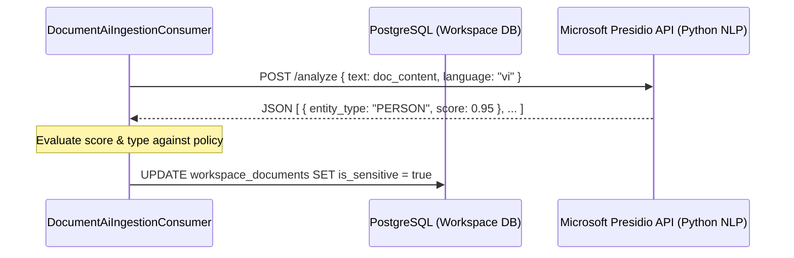

# Spec: Tech Debt — Transitioning from C# Regex PII Scanner to Microsoft Presidio NLP API

**Date**: 2026-06-07  
**Status**: proposed  
**Classification**: Tech Debt  
**Linear Ticket**: WT-159-TD  

---

## 1. Problem Statement & Context

Trong giai đoạn phát triển hiện tại, hệ thống nạp tài liệu (`DocumentAiIngestionConsumerService` trong Workspace Service) sử dụng bộ quét biểu thức chính quy (Regex) trực tiếp trong C# để phát hiện PII (như email, số điện thoại) và các từ khóa nhạy cảm (DLP). 

Mặc dù giải pháp Regex tự đóng gói (self-contained) này giúp tối ưu hóa hiệu năng phát triển cục bộ và không yêu cầu hạ tầng phức tạp, nó có các giới hạn nghiêm trọng sau:
1. **Không thể nhận dạng thực thể động (Dynamic Entities)**: Không thể phát hiện tên người, địa chỉ, tên tổ chức nhạy cảm vì chúng không có định dạng cố định (pattern).
2. **Hạn chế ngôn ngữ (Multilingual constraints)**: Việc viết regex cho nhiều ngôn ngữ khác nhau (Tiếng Việt, Tiếng Anh, Tiếng Nhật,...) là bất khả thi và dễ bỏ sót hoặc nhận diện sai (false positives/negatives).

Để sẵn sàng cho việc đưa lên Production (Release), hệ thống cần chuyển đổi sang gọi API của dịch vụ chuyên dụng **Microsoft Presidio NLP API** chạy bên cạnh cụm AI Service (`warptalk-ai`).

---

## 2. Proposed Solution & Architecture

Khi chuyển sang Production, bộ quét Regex hiện tại sẽ được thay thế bằng một Client giao tiếp mạng (HTTP hoặc gRPC Client) gửi yêu cầu phân tích dữ liệu sang dịch vụ **Microsoft Presidio Analyzer**.



### 2.1. Hạ tầng Presidio (Infrastructure)
* Dựng container `presidio-analyzer` (Python/Docker) sử dụng các mô hình ngôn ngữ hỗ trợ NLP như `spaCy` hoặc `HuggingFace Transformers` để xử lý tiếng Việt/tiếng Anh.

### 2.2. Triển khai C# Presidio Client
* Xây dựng `IPiiScanner` interface thay cho hàm quét Regex hiện tại.
* Implement `PresidioHttpScanner` sử dụng `IHttpClientFactory` cấu hình với chính sách phục hồi (Polly Retry/Circuit Breaker) để gửi request sang Presidio API.
* Request Payload:
  ```json
  {
    "text": "Nội dung tài liệu...",
    "language": "vi",
    "score_threshold": 0.6
  }
  ```
* Response Parser:
  ```json
  [
    {
      "start": 12,
      "end": 25,
      "entity_type": "PERSON",
      "score": 0.85,
      "analysis_explanation": null
    }
  ]
  ```

---

## 3. Graceful Degradation & Fail-Safe

Để bảo đảm tính sẵn sàng của hệ thống khi dịch vụ ngoài (Presidio) gặp sự cố:
* **Fallback về C# Regex**: Nếu cuộc gọi API sang Presidio bị lỗi (Timeout, HTTP 500) sau khi chạy hết các lượt Retry của Polly:
  * Hệ thống tự động kích hoạt bộ quét Regex nội bộ dự phòng (Fallback Regex Scanner) để lọc bớt Email/Số điện thoại.
  * Đánh dấu `IsSensitive = true` nếu tài liệu có các từ khóa DLP nhạy cảm hoặc ghi nhận cảnh báo trong Audit Log để Admin kiểm tra lại.
