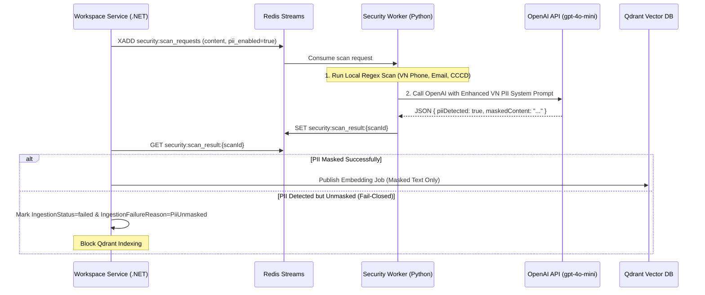

# Spec: Tech Debt — Multi-Language PII Masking & Security Worker Fail-Closed Policy

**Date**: 2026-08-18  
**Status**: proposed  
**Classification**: Tech Debt / Security Enhancement  
**Linear Ticket**: WT-519  

---

## 1. Problem Statement & Context

Trong hệ thống xử lý tài liệu Pre-Ingestion (`DocumentSecurityGuardrailConsumerService` và `security_worker`), các tài liệu chứa dữ liệu nhạy cảm cá nhân (PII) đăng tải trên môi trường Production (ví dụ: `PII_Policy_Violation_Test_Data.docx`) gặp vấn đề không được mask tự động trước khi nạp vào Qdrant Vector DB.

Nội dung nợ kỹ thuật bao gồm:
1. **System Prompt PII chỉ hỗ trợ mẫu Tiếng Anh chuẩn**: Thiếu các định dạng PII Tiếng Việt đặc thù (CCCD 12 chữ số, CMND 9/12 số, SĐT Việt Nam `03x/05x/07x/08x/09x`, Mã số thuế, Họ tên Việt Nam).
2. **Lỗi Fail-Open khi Masking Thất bại**: Khi OpenAI trả về kết quả quét chứa PII nhưng không mask được văn bản, hệ thống Backend vẫn coi văn bản đó là hợp lệ (`canIndex = true`) và lưu văn bản chưa mask vào Vector DB.
3. **Thiếu Lớp Quét Regex Nhanh (Local Fast-Path)** cho các PII cố định trong `security_worker`.

---

## 2. Architecture & Design Solution

---

## 3. Action Items

- [x] Tạo ticket WT-519 trên Linear gán cho Nhi Ngô (`Todo`).
- [x] Tạo nhánh `fix/wt-519-pii-masking-security-worker` từ `development`.
- [ ] Cập nhật `warptalk-ai/security_worker/scanners.py` bổ sung prompt PII tiếng Việt & quy tắc bảo toàn văn bản.
- [ ] Thêm Local Regex Scanner cho SĐT VN, Email, CCCD 12 số tại Python worker.
- [ ] Cập nhật Backend `DocumentSecurityGuardrailConsumerService.cs` áp dụng quy tắc Fail-Closed khi PII bị rò rỉ hoặc unmasked.
