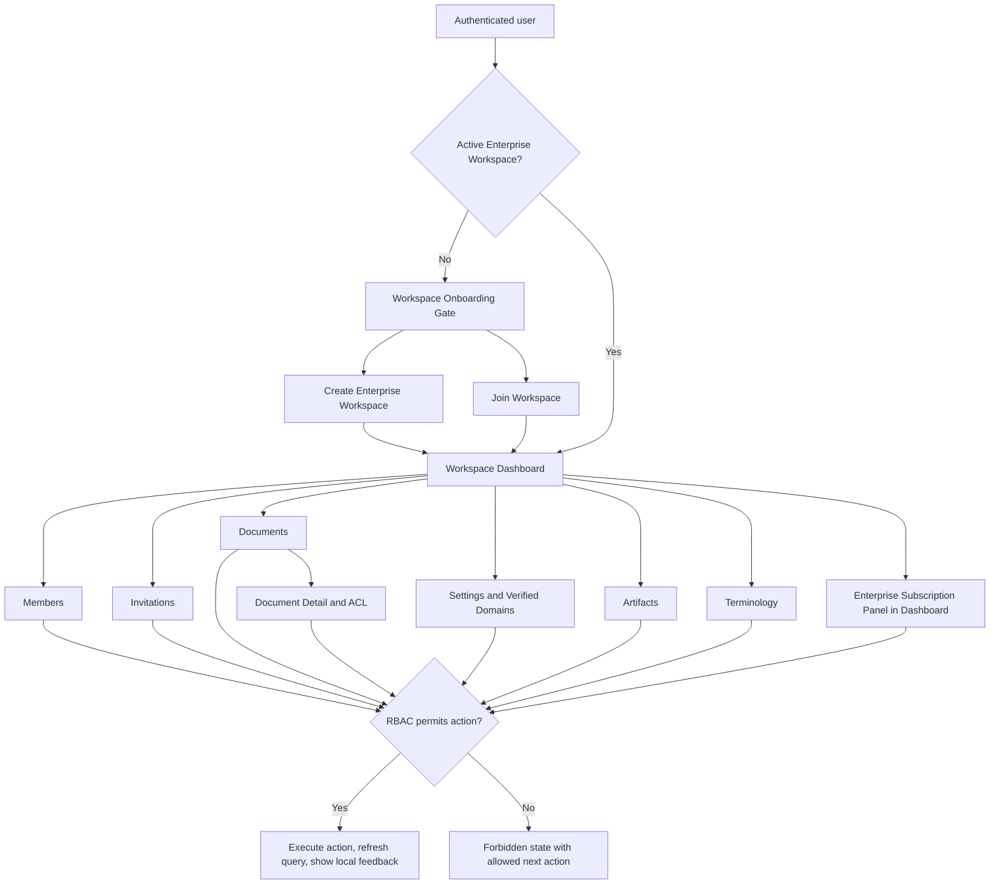

# Workspace UI Screen Specifications

**Version**: 1.3  
**Date**: 2026-06-12  
**Scope**: Workspace-specific screens for Enterprise Workspace schema and governance.

## Source and design rules

- Source of truth: Workspace UI Google Doc `1xObm3bnGcMPOx71I2u-XC4VdNG886pvJlyj7TFshLAQ`.
- Design skills referenced: `warptalk-web/.agents/skills/linear-ui-skills`, `shadcn-layouts`, `nextjs-app-router-patterns`, `shadcn`, `tailwind-design-system`.
- Do not derive screen behavior from the current `warptalk-web` implementation.
- Use `warptalk-web/.agents/resources/frontend_backend_mapping.md` only for API-routing/non-functional mapping awareness.

## Shared screen rules

- Primary surface is dark B2B operational UI, not marketing/hero UI.
- Use Inter, 4px spacing grid, 6px/8px radius, 1px borders, explicit focus ring and accessible labels.
- Use full-height app shell with `h-dvh`, `min-h-0` for scroll containers and role-aware route guards.
- Every screen must specify loading, empty, error, forbidden and success states.
- Icon-only actions require `aria-label`; destructive actions require confirmation dialog.
- Every screen must define RBAC variants for Owner, Admin, Member and External Member.
- Every screen must define its local screen flow so the UI behavior is reviewable without opening the global SRS.

## Workspace screen flow

## Screen files

| File | Screen |
|---|---|
| `workspace-create-demo-implementation.md` | Detailed implementation plan for the full-screen onboarding gate and create workspace demo flow |
| `workspace-dashboard.md` | Workspace operational dashboard including Enterprise subscription and usage panel |
| `workspace-members.md` | Member directory and role/ownership management |
| `workspace-invitations.md` | Invitation list/create/preview/accept |
| `workspace-documents.md` | Document library and approval queue |
| `workspace-document-detail-acl.md` | Document detail, ACL, sensitive state and audit |
| `workspace-settings-domains.md` | Settings, verified domains and governance policy |
| `workspace-artifacts.md` | Post-meeting transcript/summary artifact governance |
| `workspace-terminology.md` | Workspace glossary / terminology |
