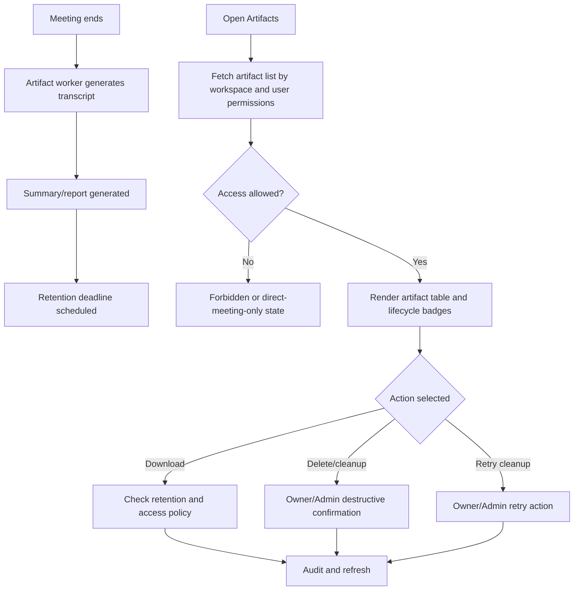

# Screen: Artifacts

## Goal

Let workspace users inspect post-meeting transcript and summary artifacts by permission, sensitivity and retention state.

## Screen flow

## Workspace schema touched

| Entity | Fields shown or affected |
|---|---|
| `translation_room.translation_room_artifacts` | artifact records linked to workspace/room |
| `workspace.workspaces.settings` | `ArtifactRetentionDays` and governance settings |
| `workspace.workspace_document_audits` | sensitive artifact access audit if artifacts are mirrored as documents |

## Artifact types

- Transcript export.
- Summary/report export.
- Action items/decisions if generated from summary.
- Raw recording is out of scope for WT-159 and must not appear as default saved artifact.

## RBAC screen variants

| Role | Screen behavior |
|---|---|
| Owner | Full artifact list, retention policy visibility, delete/cleanup retry and access review. |
| Admin | Operational artifact management except Owner-only retention policy changes. |
| Host/Internal participant | Can see artifacts for hosted or participated meetings when policy allows. |
| Member | Can see workspace artifacts only when permission grants access. |
| External Member | Can see only artifacts for meetings they participated in and only within allowed grace/policy window. |

## Requirement baseline behavior

- Show generation timeline after meeting ends: transcript -> summary -> retention scheduled.
- Show expired state and prevent download when `RetentionUntil` has passed.
- Show cleanup status: active, expiring soon, deleted, cleanup failed/retry required.
- External Member can only see artifacts for meetings they participated in and only within allowed grace/policy window.
