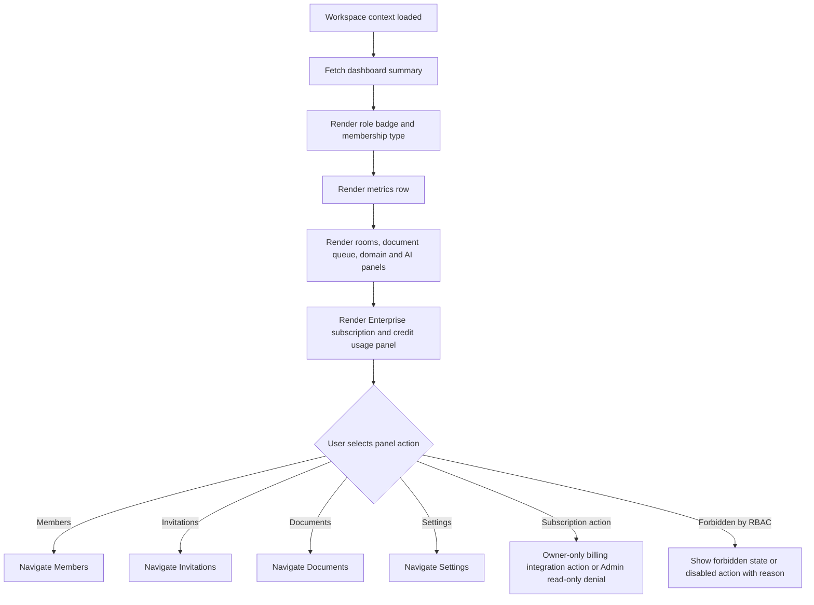

# Screen: Workspace Dashboard

## Goal

Provide an operational summary for Enterprise Workspace activity, governance alerts, Enterprise subscription usage and implementation readiness.

## Screen flow

## Workspace schema touched

| Entity | Fields shown or affected |
|---|---|
| `workspace.workspaces` | `name`, `slug`, `settings`, `allow_external_collaboration`, `require_verified_domain_for_internal` |
| `workspace.workspace_members` | active count, role distribution, external count |
| `workspace.workspace_invitations` | pending count |
| `workspace.workspace_documents` | active/pending/sensitive counts |
| `workspace.workspace_document_audits` | recent sensitive access count |
| external billing schema/service | Enterprise subscription status, credits, usage and invoices where integration exists |

## Layout

- Header: workspace name, active role badge, membership type badge.
- Metrics row: active members, pending invitations, active rooms, documents pending approval, artifacts expiring soon.
- Main panels: recent rooms, document governance queue, domain alerts, AI ingestion health.
- Right rail: settings health, Enterprise subscription/credits summary and governance readiness checklist.

## Role behavior

| Role | Visible capability |
|---|---|
| Owner | All governance controls and rollout checklist. |
| Admin | Operational alerts, invitations, members, documents and settings except Owner-only toggles. |
| Member | Read-only workspace summary and own resources. |
| External Member | Restricted dashboard or forbidden, depending direct resource grants. |

## RBAC screen variants

| Role | Screen behavior |
|---|---|
| Owner | Full dashboard with governance, domains, Enterprise subscription panel, document approval, artifact retention and owner-only actions. |
| Admin | Operational dashboard with members, invitations, documents, read-only Enterprise subscription usage and settings except Owner-only controls. |
| Member | Read-only dashboard focused on own rooms, permitted documents and permitted artifacts. |
| External Member | Restricted direct-resource dashboard; hides internal counts, directory summary and governance health. |

## Requirement baseline behavior

- Show WT-159 meeting governance readiness: `CanCreateMeetings`, `MaxActiveRooms`, allowed languages, artifact retention.
- Show WT-157 domain verification readiness: unverified/disabled domains and external collaboration state.
- Show WT-158 document approval readiness: pending approval, failed ingestion and sensitive documents.
- Show Enterprise plan and credit usage in Dashboard only; no standalone Billing route is required while the product has one Enterprise subscription plan.
- Owner can see subscription management affordances where billing integration allows; Admin sees read-only operational usage; Member/External do not see billing controls.
