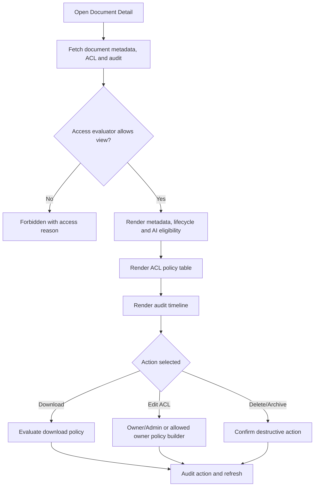

# Screen: Document Detail and ACL

## Goal

Show a single workspace document, its lifecycle, sensitive/AI state, access policies and audit history.

## Screen flow

## RBAC screen variants

| Role / subject | Screen behavior |
|---|---|
| Owner | Full metadata, ACL policy builder, audit timeline, delete/archive and sensitive access review. |
| Admin | Operational ACL and audit controls except Owner-only policy overrides. |
| Document owner | Can manage own document where workspace policy permits; cannot bypass deny/security rules. |
| Member | Can view/download only when evaluator allows; ACL and audit mutation controls are hidden. |
| External Member | Direct exception view only within allowed meeting/document policy window; no ACL builder or full audit panel. |

## Workspace schema touched

| Entity | Fields shown or affected |
|---|---|
| `workspace.workspace_documents` | metadata, lifecycle, owner/uploader, sensitivity, AI eligibility |
| `workspace.workspace_document_access_policies` | subject type/key, effect, permission, status |
| `workspace.workspace_document_audits` | upload/view/download/delete/policy actions |

## Layout

- Header: filename, status badges, owner/uploader, primary action.
- Metadata panel: type, source, size, retention, storage provider pointer, AI eligibility.
- ACL panel: policy table with deny-overrides explanation.
- Audit panel: timeline of sensitive actions.

## Requirement baseline behavior

- Add policy builder for `SubjectType=Role`, `MembershipType`, `User`.
- Show conflict preview: DENY match wins over ALLOW.
- Show meeting exception preview when source type is meeting artifact and external participant is within grace period.
