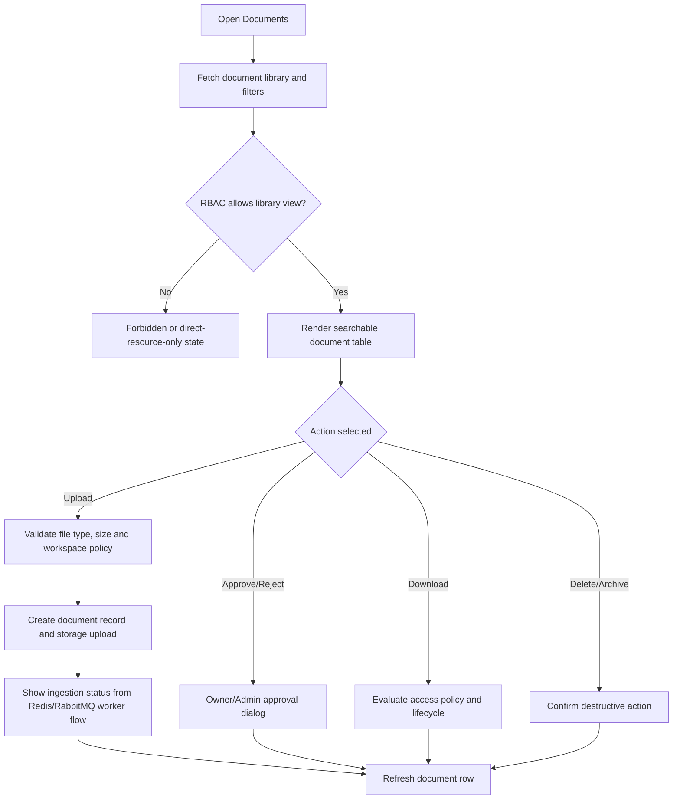

# Screen: Documents

## Goal

Let workspace users upload, search and access internal documents while surfacing approval, ingestion, sensitivity and retention states.

## Screen flow

## RBAC screen variants

| Role | Screen behavior |
|---|---|
| Owner | Full library, upload, approval queue, policy summary, delete/archive and retry ingestion controls. |
| Admin | Operational library with upload, approval, retry and management controls except Owner-only policy changes. |
| Member | Can search/view/download allowed documents; upload may enter pending approval; management is limited to own documents where policy allows. |
| External Member | No library-wide list by default; only direct meeting/document exception routes are visible when explicitly granted. |

## Workspace schema touched

| Entity | Fields shown or affected |
|---|---|
| `workspace.workspace_documents` | `file_name`, `document_type`, `status`, `ingestion_status`, `is_sensitive`, `ai_eligible`, `storage_key`, `retention_until`, `deleted_at` |
| `workspace.workspace_document_access_policies` | access summary and policy count |
| `workspace.workspace_document_audits` | recent sensitive actions |

## Actions

| Action | Role/policy | UI rule |
|---|---|---|
| Upload | Active member; file policy applies | Owner/Admin upload can become active; Member upload may become pending approval. |
| Approve/reject | Owner/Admin | Show reason field for rejection. |
| Download | Access evaluator allows | Block pending/sensitive/denied states with exact reason. |
| Delete/archive | Owner/Admin/document owner where allowed | Destructive confirmation required. |
| Search/filter | Authorized users | Filter by status, ingestion, sensitivity, type, owner. |

## Requirement baseline behavior

- Approval queue is first-class: pending approval, rejected, failed ingestion and retry states.
- Show AI retrieval boundary: deleted/archived/not completed/not eligible documents are not used by AI.
- Show RabbitMQ/Redis async status only as operational indicator, not as user-editable state.
