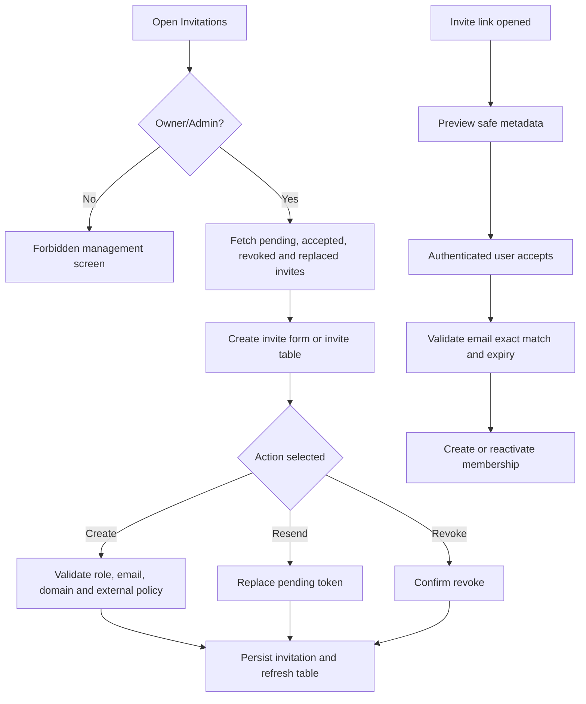

# Screen: Invitations

## Goal

Let Owner/Admin create, list, revoke, resend and track Enterprise Workspace invitations; let invited users preview and accept safely.

## Screen flow

## RBAC screen variants

| Role / context | Screen behavior |
|---|---|
| Owner | Can create internal/external invitations, resend, revoke and inspect invitation status history. |
| Admin | Can create/revoke/resend within workspace policy; cannot invite Owner role and external invites remain Member-only. |
| Member | No invitation management screen; may accept an invitation only through token preview flow when email matches. |
| External Member | No invitation management screen; token preview is the only invitation-related screen. |
| Invited user | Sees workspace, inviter, target email, role and expiry; token hash is never displayed. |

## Workspace schema touched

| Entity | Fields shown or affected |
|---|---|
| `workspace.workspace_invitations` | `email`, `role_id`, `membership_type`, `status`, `expires_at`, `accepted_at`, `revoked_at`, `replaced_by_invitation_id` |
| `workspace.workspace_verified_domains` | domain validation for internal invitations |
| `workspace.workspace_members` | membership created/reactivated on accept |

## Actions and states

| Action | UI behavior |
|---|---|
| Create internal invite | Validate verified domain, role Admin/Member only. |
| Create external invite | Require external collaboration enabled; role must be Member. |
| Preview invite | Show safe workspace/inviter/role metadata; never show token hash. |
| Accept invite | Require authenticated email exact match; show email mismatch error clearly. |
| Revoke invite | Confirmation dialog; status becomes Revoked. |
| Resend invite | Old pending token becomes Replaced; newest token is active. |

## Requirement baseline behavior

- Add domain policy hint in invite form: verified, unverified, public domain rejected, duplicate enterprise domain.
- Add admin-review copy for external collaborator approval when policy requires manual approval.
- Internal invite accept must surface the Internal Home Workspace conflict when the invited account is already `Internal` in another domain-verified Enterprise Workspace; the same account may still accept an external invitation when policy allows it.
