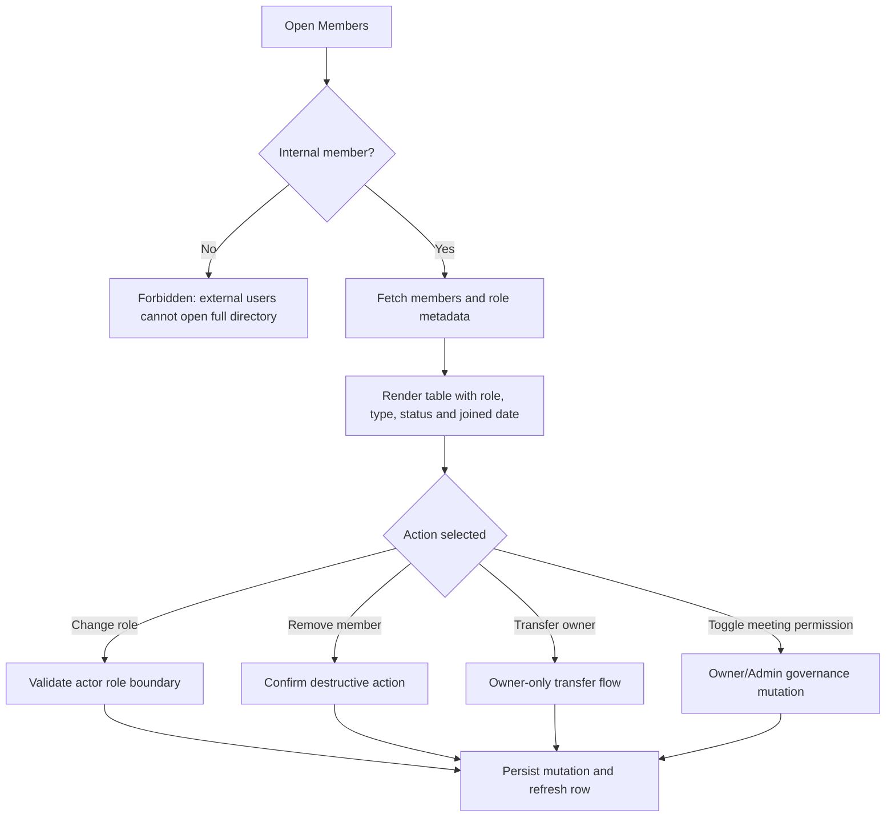

# Screen: Members

## Goal

Let internal users inspect active members and let Owner/Admin manage role, removal and ownership with code-enforced boundaries.

## Screen flow

## Workspace schema touched

| Entity | Fields shown or affected |
|---|---|
| `workspace.workspace_members` | `user_id`, `role_id`, `membership_type`, `status`, `joined_at`, `removed_at`, `removed_by` |
| `workspace.workspaces` | `owner_id`, `settings` policy values |

## Actions

| Action | Allowed roles | Business rule |
|---|---|---|
| List members | Internal Owner/Admin/Member | External Member cannot open full directory. |
| Change role | Owner/Admin with limits | Admin cannot manage Owner, another Admin or promote Member to Admin. |
| Remove member | Owner/Admin with limits; self-leave for Member/Admin | Soft delete, preserve audit/history. |
| Transfer ownership | Owner only | Target must be active non-external member. |
| Toggle `CanCreateMeetings` | Owner/Admin | WT-159 meeting governance. |

## RBAC screen variants

| Role | Screen behavior |
|---|---|
| Owner | Can transfer ownership, remove/change role within business rules, invite members and update meeting-creation permission. |
| Admin | Can manage operational members within restrictions; cannot manage Owner, another Admin or ownership transfer. |
| Member | Can view internal directory if policy allows; cannot mutate roles, remove others or invite users. |
| External Member | Cannot open full member directory; sees forbidden state with back-to-dashboard or resource route action. |

## States

- Loading: table skeleton with search/filter controls disabled.
- Empty: no active members except caller should not happen; show recovery alert.
- Error: preserve table data and show retry near failed action.
- Forbidden: external member sees explicit directory boundary message.
- Success: changed row updates without full route reload.

## Requirement baseline behavior

- Add per-member `CanCreateMeetings` control.
- Add internal/external filters and governance column for meeting creation permission.
