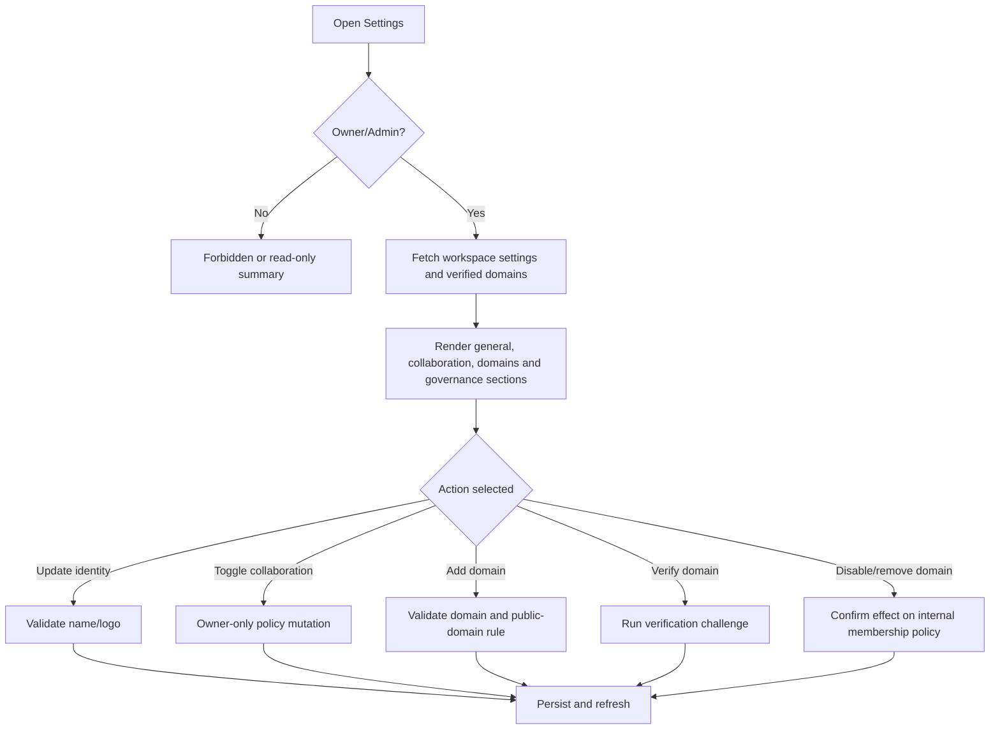

# Screen: Settings and Verified Domains

## Goal

Let Owner/Admin configure workspace identity, collaboration policy, verified domains and governance settings.

## Screen flow

## Workspace schema touched

| Entity | Fields shown or affected |
|---|---|
| `workspace.workspaces` | `name`, `logo_url`, `settings`, `allow_external_collaboration`, `require_verified_domain_for_internal`, `allow_subdomains` |
| `workspace.workspace_verified_domains` | `domain`, `status`, `verification_token`, `verified_at`, `disabled_at` |

## Sections

- General: name, logo, slug display.
- Collaboration: allow external collaboration, require verified domain, allow subdomains.
- Verified domains: add/verify/disable/remove domain.
- Meeting governance: max active rooms, allowed target languages, artifact retention days.
- AI/document policy: default PII/DLP/AI usage policy.

## Role behavior

- Owner can update all settings.
- Admin can update operational settings but cannot change Owner-only external collaboration toggle.
- Member/External Member cannot update settings.

## RBAC screen variants

| Role | Screen behavior |
|---|---|
| Owner | Full settings, verified domains, external collaboration, retention and governance policy controls. |
| Admin | Operational settings and domain workflows where allowed; Owner-only external toggle and billing-linked policy are read-only. |
| Member | No settings mutation; may see limited read-only workspace identity if linked from dashboard. |
| External Member | Settings route is hidden or forbidden. |

## Requirement baseline behavior

- Domain verification method cards: DNS TXT, email challenge or admin-approved challenge.
- Active verified domain uniqueness is enforced by the backend/table `workspace.workspace_verified_domains`; duplicate active company domains across Enterprise Workspaces must return a field-level domain conflict.
- Domain revocation warning: new internal joins blocked; existing exceptions require migration policy.
- **Pending-invitation impact warning (BR-140-014).** Before saving a change that tightens access policy — revoking a verified domain, turning `RequireVerifiedDomainForInternal` on, turning `AllowExternalCollaboration` off, turning `AllowSubdomains` off — the screen must show how many currently `PENDING` invitations the change would make unacceptable, and list the affected email addresses. The Owner confirms with that count in front of them.
- Invitations broken by such a change stay `PENDING`; they are not auto-expired or auto-revoked, so they stay visible in the invitations list for the Owner to revoke or re-issue deliberately. The error the invitee sees at accept time names the setting that changed.
- Loosening a policy never retroactively upgrades anyone (BR-140-015): verifying a domain later does not turn an existing External member, or a pending External invitation, into Internal.
- Verified domains live in `workspace.workspace_verified_domains` and nowhere else. A `VerifiedDomains` array in the workspace settings JSON is a display artefact and must not take part in any policy decision — treating it as live policy is what made three pending invitations on `testworkspace` permanently unacceptable (WT-179).
- WT-159 settings are part of the Workspace UI requirement baseline.
