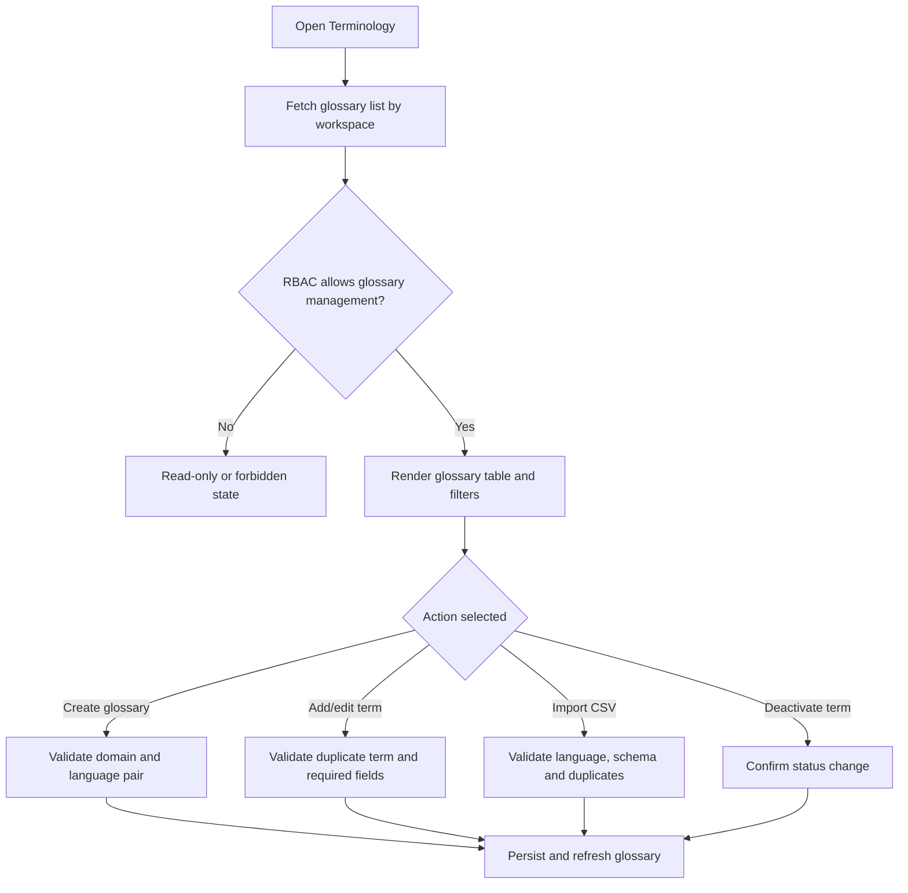

# Screen: Terminology

## Goal

Let workspace managers maintain business terminology so translation and AI prompts use consistent domain vocabulary.

## Screen flow

## RBAC screen variants

| Role | Screen behavior |
|---|---|
| Owner | Full glossary create/edit/import/export/deactivate. |
| Admin | Full operational glossary management unless workspace policy reserves it for Owner. |
| Member | Read/use visible glossary terms; management controls hidden. |
| External Member | No glossary management; direct meeting UI may show applied term behavior without exposing glossary records. |

## Workspace schema touched

| Entity | Fields shown or affected |
|---|---|
| `workspace.workspace_knowledge_glossaries` | `business_domain`, `source_language`, `target_language`, `term`, `preferred_translation`, `definition`, `usage_note`, `status` |

## Actions

- Create glossary.
- Add/edit/deactivate term.
- Import/export CSV.
- Filter by domain and language pair.

## Requirement baseline behavior

- Show prompt-adapter readiness: active terms only, workspace-scoped, no duplicate same domain/source/target/term.
- Show validation before import: unsupported language, duplicate term, malformed CSV.
