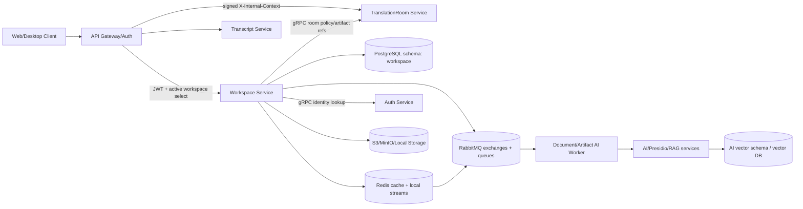
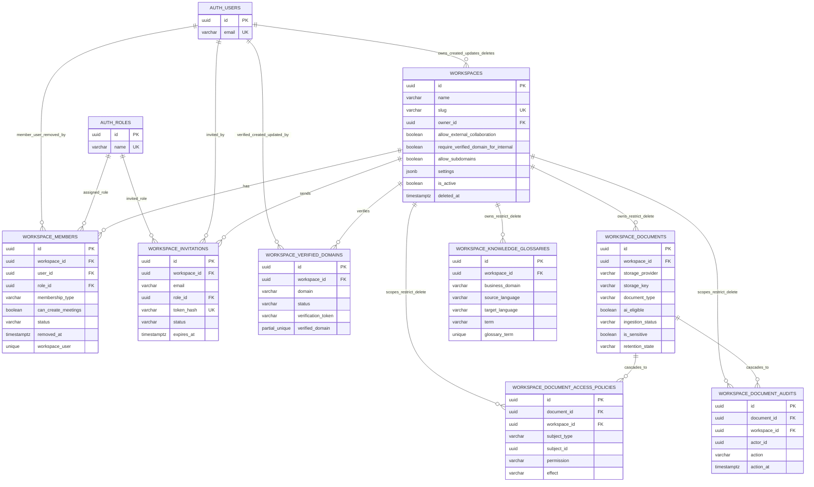
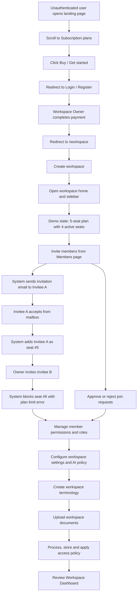
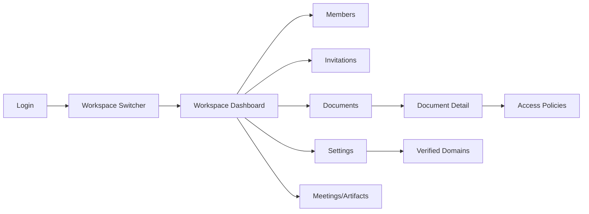
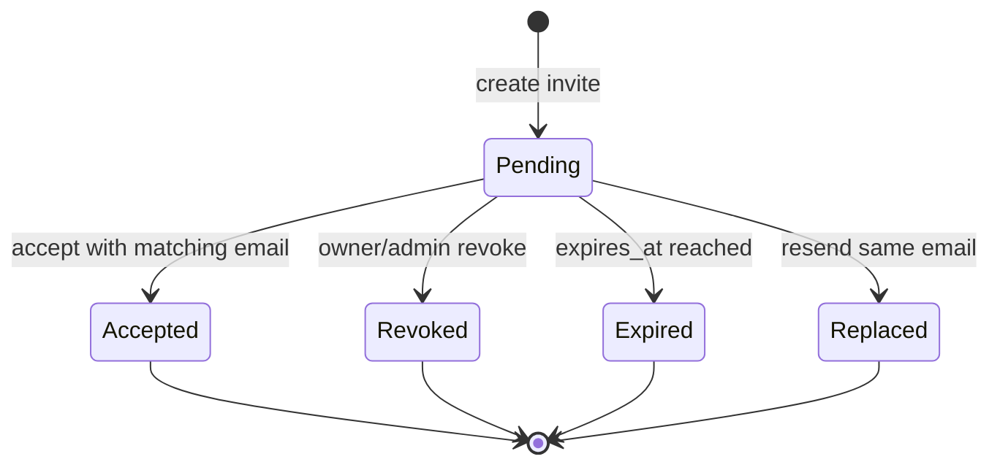
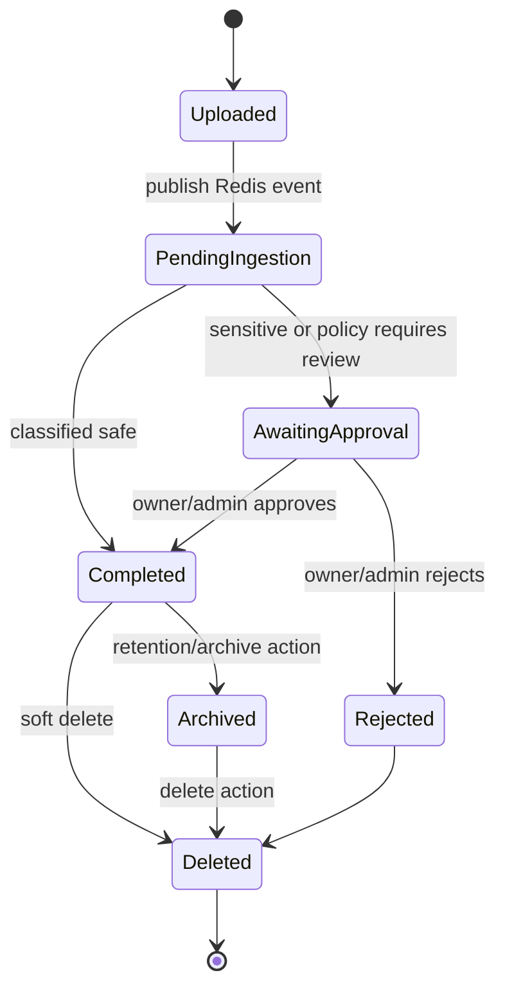
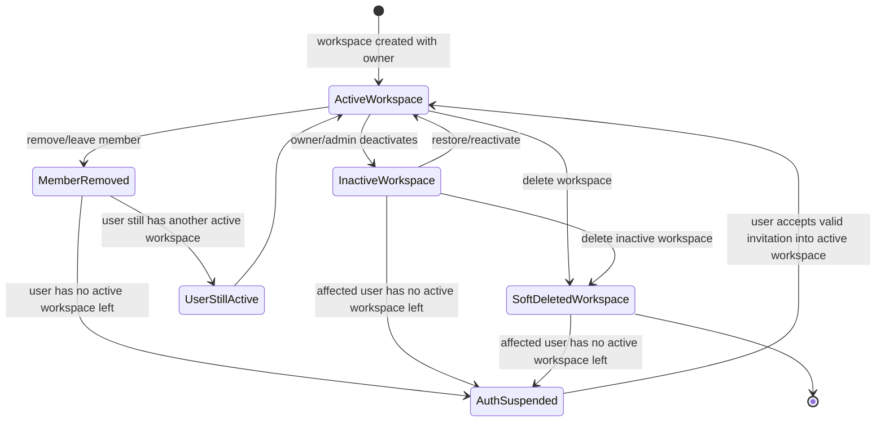
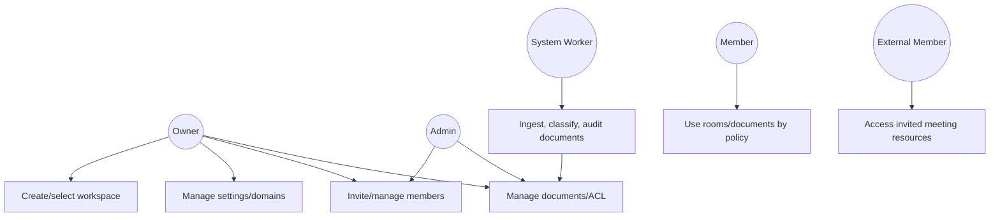

# Workspace Module Requirements Overview

**Ngôn ngữ:** Tiếng Việt  
**Phạm vi:** WarpTalk Backend - Workspace Service và các tích hợp Auth, TranslationRoom, Transcript, AI/Document ingestion  
**Ngày tạo:** 2026-06-11  
**Deliverable song hành:** `workspace-software-requirement-specification.docx`

## 1. Document control

| Field | Value |
|---|---|
| Title | Workspace Module Software Requirement Specification |
| Version | 2.2 |
| Created by | Ngô Xuân Hạnh Nhi |
| Last updated | 2026-06-15 |
| Scope | Workspace module only, cross-checked with backend, UI source-of-truth, selected web non-functional references, AI and infrastructure references. |
| Primary source | warptalk-backend/specs + warptalk-infrastructure/scripts/init-db.sql + Workspace UI Google Doc source-of-truth. |
| Update rule | Every material edit must update changelog, scope impact, source references and QA checklist. |

### 1.1 Change log

| Version | Date | Author/AI | Change | Reason |
|---|---|---|---|---|
| 1.0 | 2026-06-11 | Codex | Initial Workspace SRS and overview | Consolidated workspace specs into MD/DOCX with diagrams. |
| 1.1 | 2026-06-11 | Codex | ERD and document-control enhancement | Regenerated ERD from infrastructure init-db.sql; added changelog, AI usage tracking, technology matrix, web route intent, limitations and QC checklist. |
| 1.2 | 2026-06-11 | Codex | Enterprise-only correction | Updated overview, business rules and use cases to match current Workspace Service code: Enterprise Workspace only, no non-enterprise workspace flows. |
| 1.3 | 2026-06-11 | Codex | Functional testing and UI split | Added author, per-functional happy/edge/unhappy cases, API/Application/Domain/Infrastructure mapping, Redis+RabbitMQ messaging, and separate Workspace UI spec. |
| 1.4 | 2026-06-11 | Codex | RabbitMQ and artifact flow clarification | Clarified Redis+RabbitMQ workflow using RabbitMQ official concepts and added WT-159 post-meeting artifact handling flow to module deliverables only. |
| 1.5 | 2026-06-11 | Codex | Functional/Business/NFR separation | Clarified section boundaries and added source traceability from workspace specs plus Workspace Service code for Functional Requirements and Business Rules. |
| 1.6 | 2026-06-12 | Codex | Future/proposed scope and BR user stories | Added business-rule user stories to workspace specs and captured future/proposed Workspace governance scope in SRS before implementation. |
| 1.7 | 2026-06-12 | Codex | Testing and validation traceability | Expanded happy/edge/unhappy testing details from workspace tests, validation/constraints and backend test toolchain. |
| 1.8 | 2026-06-12 | Antigravity | Workspace Dashboard Spec & Purge Cleanup | Added Workspace Dashboard specification and removed purged status from workspace lifecycle. |
| 1.9 | 2026-06-12 | Antigravity | Detailed Functional Specs & Usecase Diagram Update | Added detailed specifications for all FRs (FR-WS-001..026) and updated UML Use Case diagram. |
| 2.0 | 2026-06-12 | Codex | Meeting creator permission data decision | Added decision to persist per-member meeting creation permission as workspace_members.can_create_meetings instead of Workspace settings JSONB allow/deny lists. |
| 2.1 | 2026-06-13 | Codex | Enterprise-only account eligibility | Added active workspace dependency rules, Auth suspension sync and soft-delete-only account/workspace lifecycle alignment. |
| 2.2 | 2026-06-15 | Codex | Internal home workspace clarification | Clarified that WarpTalk is multi-workspace, but a user can be Internal in at most one domain-verified Enterprise Workspace; duplicate active verified domains are enforced by backend/table constraints. |

### 1.2 AI usage log

| Date | AI/Actor | Scope | Work performed | Usage |
|---|---|---|---|---|
| 2026-06-11 | Codex | SRS generation | Created Workspace overview/SRS from workspace specs and code inspection. | Not available from local API telemetry; record manually if platform reports usage. |
| 2026-06-11 | Codex | SRS revision | Added ERD standards research, physical ERD from init-db.sql, Google Doc-aligned control sections and technology matrix. | Not available from local API telemetry; record manually if platform reports usage. |
| 2026-06-11 | Codex | Enterprise-only revision | Corrected Workspace SRS/spec BR and use cases according to current code: single Enterprise Workspace model. | Not available from local API telemetry; record manually if platform reports usage. |
| 2026-06-11 | Codex | Functional/UI revision | Expanded Workspace backend functional testing matrix and separated UI screen specification from backend SRS. | Not available from local API telemetry; record manually if platform reports usage. |
| 2026-06-11 | Codex | RabbitMQ/artifact revision | Updated module deliverables to use RabbitMQ terminology and added WT-159 artifact post-meeting flow. | Not available from available telemetry; record manually. |
| 2026-06-11 | Codex | Functional/BR/NFR revision | Separated Functional, Business Rule and Non-functional scopes. | Not available from local API telemetry; record manually if platform reports usage. |
| 2026-06-12 | Codex | Future/proposed revision | Added future/proposed Workspace governance requirements. | Not available from local API telemetry; record manually if platform reports usage. |
| 2026-06-12 | Codex | Testing revision | Reviewed workspace/tests, WorkspaceDbContext constraints, validation services and backend test tooling. | Not available from local API telemetry. |
| 2026-06-12 | Antigravity | Dashboard & Soft Delete Spec | Integrated detailed dashboard specifications and updated the deactivation lifecycle. | Not available from local API telemetry. |
| 2026-06-12 | Antigravity | Detailed FR Specifications & UML Use Case | Added detailed specification sections for all FRs (FR-WS-001..026) and updated PIL and Mermaid use case diagrams. | Not available from local API telemetry. |
| 2026-06-12 | Codex | Meeting creator permission decision | Documented why can_create_meetings belongs to workspace_members and why JSONB settings allow/deny userId lists are not selected. | Not available from local API telemetry. |
| 2026-06-13 | Codex | Enterprise-only account eligibility | Added business rules for last active workspace loss, Auth `SUSPENDED_NO_ACTIVE_WORKSPACE` sync and invitation-based reactivation. | Not available from local API telemetry. |
| 2026-06-15 | Codex | Internal home workspace clarification | Captured grill-with-docs decision for multi-workspace membership and verified-domain uniqueness. | Not available from local API telemetry. |

### 1.3 Rules for updating this file

- Mọi thay đổi có ảnh hưởng requirement, API, DB, UI, AI worker hoặc infrastructure phải cập nhật change log.
- Mỗi lần AI/agent chỉnh sửa tài liệu hoặc code liên quan module Workspace phải thêm dòng AI usage log nếu có số liệu usage.
- Nếu thay đổi DB, phải cập nhật ERD, bảng entity, relationship, index/delete behavior và rollback/cleanup note.
- Nếu thay đổi API, phải cập nhật route table, DTO/contract notes, happy/unhappy case và web adapter impact.

## 2. Review tổng quát

**Resolved membership decision (2026-06-15):** WarpTalk is a multi-workspace product. A single account may belong to many Enterprise Workspaces, but the account may be `Internal` in at most one domain-verified Enterprise Workspace. Additional cross-organization memberships must be `External`. Active verified-domain uniqueness is enforced by backend checks and the `workspace.workspace_verified_domains` table/partial unique constraint, so one active verified domain cannot be shared by multiple Enterprise Workspaces.

Module Workspace là lớp tenant boundary Enterprise của WarpTalk. Workspace phân tách dữ liệu, thành viên, meeting, transcript, document library, billing context và policy AI theo từng tổ chức. Code hiện tại chỉ có mô hình Enterprise Workspace; toàn bộ hành vi workspace được điều khiển bằng Owner/Admin/Member, `MembershipType` Internal/External, verified domains và workspace settings. Module hiện được thiết kế theo hướng microservice/Clean Architecture, sử dụng schema `workspace` trong PostgreSQL, Redis cho active context/cache/event stream, gRPC để lấy identity từ Auth Service và để phối hợp policy với TranslationRoom Service.

Workspace có hai nhóm hành vi chính:

- **Collaboration boundary:** tạo/chọn Enterprise Workspace, quản lý member, invitation, verified domain và external collaborator.
- **Knowledge & governance boundary:** quản lý document library, ACL, audit, AI guardrails, encryption/local storage, meeting governance và artifact retention.

## 3. Scope và out of scope

### In scope

- Workspace creation, listing, detail, settings và active workspace selection.
- Enterprise Workspace creation, listing, detail, settings và active workspace selection.
- Member management, invitation lifecycle, role/ownership rules.
- Enterprise verified domains và external collaboration.
- Workspace document library, access policy, audit, AI ingestion/guardrails, local encryption.
- Workspace governance cho room creation, language policy, artifact access/retention.

### Out of scope

- Non-enterprise workspace type hoặc tự động chuyển đổi giữa các loại workspace.
- Tự động migrate transcript/artifact giữa các workspace.
- Custom role nâng cao ngoài Owner/Admin/Member/External Member.
- Implement code mới; tài liệu này chỉ đặc tả yêu cầu và tổng hợp hiện trạng/spec liên quan.

## 4. Kiến trúc và công nghệ sử dụng

### Công nghệ chính

- **.NET 10 / ASP.NET Core Web API:** REST API và gRPC endpoint của Workspace Service.
- **Clean Architecture:** API, Application, Domain, Infrastructure tách lớp.
- **PostgreSQL + EF Core/Npgsql:** lưu schema `workspace`, UUID v7, JSONB settings/policies.
- **Redis + RabbitMQ:** Redis dùng cho active workspace cache/local stream bridge; RabbitMQ dùng cho durable document/artifact event delivery, publisher confirms, consumer acknowledgements, retry và dead-letter.
- **gRPC:** lookup identity từ Auth Service, validate workspace/member/policy với TranslationRoom Service.
- **JWT + signed internal context:** xác thực user và chống spoof workspace context qua downstream headers.
- **S3/MinIO/Local Storage:** lưu binary document; local provider cần encryption AES-256-CBC + HMAC-SHA512.
- **AI/RAG/Presidio direction:** AI Service/vector schema xử lý chunk/vector/PII; Workspace chỉ giữ source metadata và guardrail flags.

### 4.1 Technology matrix theo subsystem

| Subsystem | Topic | Technology | Workspace usage |
|---|---|---|---|
| Backend | Language/runtime | C#, .NET 10 | WorkspaceService API/Application/Domain/Infrastructure projects. |
| Backend | API | ASP.NET Core Controllers, JWT auth | REST endpoints under /api/v1/workspaces. |
| Backend | Inter-service | gRPC | Auth identity lookup, TranslationRoom policy/artifact integration. |
| Backend | Persistence | EF Core, Npgsql, PostgreSQL | schema workspace; UUID v7; JSONB settings/policies. |
| Backend | Messaging/cache | Redis distributed cache + RabbitMQ | Redis handles active workspace cache/local stream bridge; RabbitMQ handles durable document ingestion delivery, retry and dead-letter. |
| Backend | Unit testing | xUnit 2.9.3, Microsoft.NET.Test.Sdk 17.14.1 | Implemented in workspace/tests/WarpTalk.WorkspaceService.Tests for service, controller, middleware, ACL and ingestion behavior. |
| Backend | Mocking | NSubstitute 5.3.0 | Used by Workspace unit tests to isolate repositories, UnitOfWork, cache/event publisher, Auth client and URL provider. |
| Backend | Integration testing | Microsoft.AspNetCore.Mvc.Testing 10.0.0, Testcontainers.PostgreSql 4.0.0 | Used for Workspace invitation integration tests with real PostgreSQL container and WebApplicationFactory. |
| Backend | Coverage | coverlet.collector 6.0.4 | Collects coverage from dotnet test runs for Workspace test project. |
| Backend | API smoke/E2E | Postman collections, optional Newman runner | Backend-level postman collections live under test/postman; Workspace module should add collection coverage for create/select/invite/member/document flows. |
| Web | Framework | Next.js App Router, React | Workspace dashboard, terminology, billing, rooms/artifacts surfaces. |
| Web | Data access | Axios/TanStack Query pattern | Workspace adapters should mirror backend response contracts. |
| Web | Realtime | SignalR client | Room/meeting events; workspace pages consume downstream state. |
| Web | UI/RBAC | Role-aware routing required | Owner/Admin/Member/External surfaces must be separated. |
| AI | Ingestion | Redis Stream workers + RabbitMQ consumers | Document upload/archive/delete events; AI eligibility, sensitivity classification, retry and dead-letter handling. |
| AI | PII/DLP | Regex scanner now; Presidio target | Production transition to Presidio NLP API with fallback scanner. |
| AI | RAG/vector | AI schema/vector store | Workspace stores source metadata only; chunks/vector points live in AI domain. |
| AI | Provider normalization | Worker boundary normalization | Backend/UI must not depend on provider-specific raw output. |
| Infrastructure | Runtime | Docker Compose | Service orchestration for backend dependencies. |
| Infrastructure | Database | PostgreSQL, PgBouncer | init-db.sql defines workspace physical schema and indexes. |
| Infrastructure | Cache/messaging | Redis + RabbitMQ | Redis for cache/local streams/pub-sub/backplane; RabbitMQ for durable event delivery, retry and dead-letter. |
| Infrastructure | Observability | Prometheus, Grafana, Seq/OpenTelemetry collector | Logs/traces/metrics should include workspace_id where relevant. |
| Infrastructure | Backups | PostgreSQL/Qdrant backup scripts | Document metadata and vector data require coordinated backup policy. |

### 4.2 Test toolchain đã dùng/áp dụng cho backend

| Tool | Location | Workspace usage |
|---|---|---|
| xUnit 2.9.3 | workspace/tests/WarpTalk.WorkspaceService.Tests/*.cs | Primary automated unit/integration test framework for Workspace backend. |
| Microsoft.NET.Test.Sdk 17.14.1 | Workspace test csproj | Runs tests through dotnet test and Visual Studio test runner. |
| NSubstitute 5.3.0 | Workspace service/controller tests | Mocks repositories, UnitOfWork, cache/event publisher and external service clients. |
| Microsoft.AspNetCore.Mvc.Testing 10.0.0 | Integration/BaseIntegrationTest.cs | Hosts Workspace API in-memory through WebApplicationFactory for integration scenarios. |
| Testcontainers.PostgreSql 4.0.0 | Integration/BaseIntegrationTest.cs | Starts isolated PostgreSQL for invitation integration tests and schema-backed verification. |
| coverlet.collector 6.0.4 | Workspace test csproj | Coverage collection for CI/local dotnet test runs. |
| Postman 12.x collections | test/postman | Manual/E2E API smoke tests; current backend collections exist for auth/notification/translationroom/transcript and should be extended for Workspace. |
| Newman-compatible workflow | planned CI usage | Recommended CLI runner for Postman collections so Workspace API smoke tests can run in CI. |

## 5. Database

### 5.1 ERD modeling rules applied

Tài liệu này dùng ERD ở mức **physical data model** vì mục tiêu là phản ánh schema PostgreSQL có thể triển khai từ `warptalk-infrastructure/scripts/init-db.sql`. Theo nguyên tắc ERD phổ biến, entity là bảng, attribute là cột, primary key định danh entity, foreign key thể hiện quan hệ, và cardinality thể hiện một-một/một-nhiều/nhiều-nhiều. Với crow's-foot/Mermaid, `||--o{` được đọc là một bản ghi phía trái có thể liên kết không hoặc nhiều bản ghi phía phải. Các quan hệ được vẽ theo FK vật lý; với cột workspace_id ở schema khác nhưng không có FK vật lý, tài liệu ghi chú ở boundary/interface thay vì vẽ như FK cứng.

| Entity | Mục đích | Trường chính |
|---|---|---|
| `workspace.workspaces` | Root tenant | id PK, slug UK, owner_id FK->auth.users, settings JSONB, soft-delete fields |
| `workspace.workspace_members` | Membership assignment | id PK, workspace_id FK, user_id FK->auth.users, role_id FK->auth.roles, can_create_meetings boolean, UNIQUE(workspace_id,user_id) |
| `workspace.workspace_invitations` | Invitation token lifecycle | id PK, workspace_id FK, role_id FK->auth.roles, invited_by FK->auth.users, token_hash UK |
| `workspace.workspace_verified_domains` | Enterprise domain verification | id PK, workspace_id FK, domain, status, verification_token, partial unique index on verified domain |
| `workspace.schema_migrations` | Workspace schema migration audit | id PK, migration_key UK, checksum, status, started/completed timestamps |
| `workspace.workspace_documents` | Document library metadata | id PK, workspace_id FK ON DELETE RESTRICT, storage fields, AI/retention/sensitivity fields |
| `workspace.workspace_document_access_policies` | Document ACL | id PK, document_id FK ON DELETE CASCADE, workspace_id FK ON DELETE RESTRICT, subject/effect/permission |
| `workspace.workspace_document_audits` | Compliance audit trail | id PK, document_id FK ON DELETE CASCADE, workspace_id FK ON DELETE RESTRICT, actor/action metadata |
| `workspace.workspace_knowledge_glossaries` | Workspace terminology | id PK, workspace_id FK ON DELETE RESTRICT, UNIQUE(workspace_id,business_domain,source_language,target_language,term) |

### 5.2 Physical relationship table

| Parent | Child | Parent cardinality | Child cardinality | FK / behavior |
|---|---|---:|---:|---|
| `auth.users` | `workspace.workspaces` | 1 | 0..N | owner_id, created_by, updated_by, deleted_by |
| `workspace.workspaces` | `workspace.workspace_members` | 1 | 0..N | workspace_id |
| `auth.users` | `workspace.workspace_members` | 1 | 0..N | user_id, removed_by |
| `auth.roles` | `workspace.workspace_members` | 1 | 0..N | role_id |
| `workspace.workspaces` | `workspace.workspace_invitations` | 1 | 0..N | workspace_id |
| `auth.roles` | `workspace.workspace_invitations` | 1 | 0..N | role_id |
| `auth.users` | `workspace.workspace_invitations` | 1 | 0..N | invited_by |
| `workspace.workspaces` | `workspace.workspace_verified_domains` | 1 | 0..N | workspace_id |
| `auth.users` | `workspace.workspace_verified_domains` | 1 | 0..N | verified_by, created_by, updated_by |
| `workspace.workspaces` | `workspace.workspace_documents` | 1 | 0..N | workspace_id ON DELETE RESTRICT |
| `workspace.workspaces` | `workspace.workspace_document_access_policies` | 1 | 0..N | workspace_id ON DELETE RESTRICT |
| `workspace.workspace_documents` | `workspace.workspace_document_access_policies` | 1 | 0..N | document_id ON DELETE CASCADE |
| `workspace.workspaces` | `workspace.workspace_document_audits` | 1 | 0..N | workspace_id ON DELETE RESTRICT |
| `workspace.workspace_documents` | `workspace.workspace_document_audits` | 1 | 0..N | document_id ON DELETE CASCADE |
| `workspace.workspaces` | `workspace.workspace_knowledge_glossaries` | 1 | 0..N | workspace_id ON DELETE RESTRICT |

### Nguyên tắc database

- Mọi dữ liệu nghiệp vụ phải scope bởi `workspace_id` khi thuộc workspace.
- Workspace không hard-delete; record dùng `is_active`, `deleted_at`, `deleted_by`.
- Document soft-delete/archive không tự động xóa audit trail.
- Workspace schema không lưu AI chunks; vector/chunk thuộc AI domain.
- Không cross-join DB giữa Workspace và service khác; dùng gRPC/client boundary.

### 5.3 ADR: Quyền tạo meeting theo từng member

| Decision | Option | Rationale |
|---|---|---|
| Selected | `workspace.workspace_members.can_create_meetings` boolean | Quyền tạo meeting là thuộc tính của membership trong một workspace; dễ query, dễ audit, dễ trả về qua DTO/gRPC và không phình JSONB settings. |
| Rejected | `workspace.settings.AllowedRoomCreatorUserIds` / `DisallowedRoomCreatorUserIds` JSONB arrays | Không phù hợp cho per-member permission quy mô lớn: JSONB phình theo số member, khó truy vấn ngược, dễ stale userId khi remove/reinvite và phải deserialize settings khi check quyền. |
| Default | Internal member true, External member false | Owner/Admin/Member nội bộ được tạo meeting theo policy mặc định; External không được tạo meeting trừ khi có quyết định policy riêng sau này. |
| Enforcement | TranslationRoom validates through Workspace boundary | Create-room flow phải gọi Workspace API/gRPC để kiểm tra active membership, can_create_meetings, max active rooms và allowed languages; không cross-service DB join. |
| Migration | Add non-null boolean column with backfill | Thêm migration: column default false hoặc true có kiểm soát; backfill internal active members true, external false; removed members vẫn denied theo status/removed_at. |

## 6. API và interface công khai

| Method | Route | Mục đích |
|---|---|---|
| POST | `/api/v1/workspaces` | Tạo workspace và bootstrapping Owner |
| GET | `/api/v1/workspaces` | List workspace theo pagination/search |
| GET | `/api/v1/workspaces/{id}` | Xem chi tiết workspace nếu là member |
| POST | `/api/v1/workspaces/{id}/select` | Chọn active workspace context |
| GET/PUT | `/api/v1/workspaces/{id}/settings` | Xem/cập nhật workspace settings |
| GET | `/api/v1/workspaces/{workspaceId}/members` | List active members |
| DELETE | `/api/v1/workspaces/{workspaceId}/members/{userId}` | Remove/leave workspace bằng soft-delete |
| PUT | `/api/v1/workspaces/{workspaceId}/members/{userId}/role` | Đổi role member |
| PATCH | `/api/v1/workspaces/{workspaceId}/members/{userId}/meeting-permission` | Owner/Admin bật/tắt quyền tạo meeting per member bằng can_create_meetings |
| POST | `/api/v1/workspaces/{workspaceId}/members/transfer-ownership` | Transfer ownership |
| POST | `/api/v1/workspaces/{workspaceId}/invitations` | Tạo invite |
| GET | `/api/v1/workspaces/{workspaceId}/invitations` | List invite |
| DELETE | `/api/v1/workspaces/{workspaceId}/invitations/{invitationId}` | Revoke invite |
| GET | `/api/v1/workspaces/invitations/preview` | Preview invite an toàn không cần JWT |
| POST | `/api/v1/workspaces/invitations/accept` | Accept invite |
| POST/GET | `/api/v1/workspaces/{workspaceId}/documents` | Upload/list documents |
| GET/PATCH/DELETE | `/api/v1/workspaces/{workspaceId}/documents/{documentId}` | Xem/cập nhật metadata/xóa mềm document |
| POST | `/api/v1/workspaces/{workspaceId}/documents/{documentId}/approve` | Approve/reject ingestion/sensitive decision |
| GET | `/api/v1/workspaces/{workspaceId}/documents/{documentId}/download` | Download sau khi qua ACL |
| POST/GET/DELETE | `/api/v1/workspaces/{workspaceId}/documents/{documentId}/policies` | Quản lý access policies |

### Interface nội bộ

- **Auth gRPC:** resolve user/role snapshot, kiểm tra identity metadata khi list member/invitation.
- **TranslationRoom gRPC/client:** validate member/policy khi tạo room, join room và xử lý artifact retention.
- **Redis Stream + RabbitMQ:** Workspace publish document/artifact upload/delete/archive event; Redis giữ local stream/cache bridge, RabbitMQ đảm nhiệm durable async delivery qua exchange/queue/binding, retry và dead-letter cho worker.

### 6.3 RabbitMQ messaging workflow

| Step | Activity | Workspace usage | RabbitMQ rule |
|---:|---|---|---|
| 1 | Publish domain event | Workspace Application publishes `DocumentUploaded`, `DocumentDeleted`, `ArtifactCreated`, or `ArtifactRetentionExpired` through an application event publisher after DB metadata is committed. | Use publisher confirms so the publisher knows RabbitMQ accepted the message; if confirm fails, record retry/audit without rolling back committed metadata. |
| 2 | Route through exchange | RabbitMQ receives the message at a durable topic exchange such as `workspace.events`. | Use routing keys such as `workspace.document.uploaded`, `workspace.document.deleted`, `workspace.artifact.created`, `workspace.artifact.retention_expired`. |
| 3 | Bind queues | Queues bind to the exchange by routing key: `ai.document-ingestion`, `ai.embedding-invalidation`, `artifact.retention`, `audit.workspace-events`. | Bindings decide which consumers receive each event; avoid direct service-to-service coupling. |
| 4 | Consume with manual ack | AI/artifact workers consume from queues with manual acknowledgements. | Ack only after idempotency check, DB update and downstream side effects succeed. Nack/reject failed poison messages without requeue after retry limit. |
| 5 | Control concurrency | Consumers use prefetch/concurrency limit so document parsing, AI scanning and artifact cleanup do not overload CPU, storage or AI providers. | Prefetch must be tuned separately for document ingestion and artifact cleanup. |
| 6 | Retry transient failures | Transient storage/AI/network failures are retried with bounded attempts. | Use retry queues or delayed retry strategy; event payload must include eventId, documentId/artifactId, workspaceId and occurredAt for idempotency. |
| 7 | Dead-letter permanent failures | Messages rejected after retry limit, expired by TTL, or exceeding delivery limit are routed to a dead-letter exchange/queue. | DLQ is monitored by ops; record failure reason and expose ingestion/artifact status as failed/requires_action. |
| 8 | Reconcile state | Scheduled reconciliation job compares DB records with queue/audit state to catch lost or stuck events. | Metadata remains source of truth; RabbitMQ is delivery mechanism, not system of record. |
- **Signed internal context:** Gateway/Auth truyền UserId, ActiveWorkspaceId, Role đã ký cho downstream services.

## 7. Web route intent

| Route | Audience | Intent |
|---|---|---|
| `/workspace/dashboard` | Workspace manager/owner | Usage, members, rooms, governance overview. |
| `/workspace/terminology` | Workspace manager/owner | Glossary and terms by business domain. |
| `/workspace/billing` | Workspace owner | Plan, credits, usage and transactions. |
| `/rooms` | Host/workspace | Workspace-scoped room list. |
| `/rooms/[id]/artifacts` | Host/workspace | Transcript, summary and export artifacts under workspace policy. |
| `/internal/dashboard` | Internal admin | Tenants, platform health, AI operations; not a workspace member surface. |
| `/internal/ai-ops` | Internal admin | AI pipeline monitoring and operational review. |

UI implementation rule: UI phải phân biệt TranslationRoom, MeetingRoom và Workspace Resource; workspace routes cần route guard theo Owner/Admin/Member/External thay vì chỉ kiểm tra token tồn tại. Chi tiết screen behavior, layout, button, loading/empty/error/success state và UI acceptance checklist được tách riêng tại [`workspace-ui-specification.md`](workspace-ui-specification.md), lấy Google Doc UI Mainflow làm source of truth và không dựa vào implementation hiện tại của `warptalk-web`.

## 8. Main flow

## 9. Screen flow

## 10. State diagrams

### Invitation lifecycle

### Document ingestion/access lifecycle

### Workspace and Auth eligibility lifecycle

## 11. Use case diagram

## 12. User requirements

| User group | User requirement |
|---|---|
| Account user | Có thể tạo, tham gia và chọn active Enterprise Workspace; hệ thống không tự tạo workspace cá nhân mặc định. |
| Owner | Quản trị settings, domains, invitations, members, roles, ownership, documents, ACL và billing-related policy. |
| Admin | Quản trị vận hành members/invitations/settings cơ bản và documents theo policy, nhưng không quản lý Owner/billing/delete workspace. |
| Member | Sử dụng room, transcript, artifact, document theo workspace policy; có thể xem directory khi được phép và rời workspace hợp lệ. |
| External Member | Chỉ truy cập tài nguyên được mời trực tiếp, không thấy dữ liệu nội bộ hoặc quản trị workspace. |
| System worker | Ingest/classify documents, publish audit/AI state và tuân thủ policy workspace. |

## 13. Functional requirements

Functional requirements chỉ mô tả hành vi hệ thống có thể quan sát hoặc kiểm thử được. Các requirement dưới đây được tổng hợp từ WT-139/140/141/157/158/159 và đối chiếu với code hiện tại của Workspace Service ở API controllers, Application services, Domain entities/rules và Infrastructure repositories/cache/event worker. Các thuộc tính chất lượng như bảo mật, hiệu năng, availability, accessibility được tách riêng ở phần Non-functional Requirements.

| ID | Area | Requirement | Source from specs/code |
|---|---|---|---|
| FR-WS-001 | Workspace | Người dùng đã xác thực có thể tạo Enterprise Workspace và được gán Owner trong cùng transaction. | WT-139; code: WorkspacesController.CreateWorkspace, WorkspaceService.CreateWorkspaceAsync, WorkspaceRepository, WorkspaceMemberRepository |
| FR-WS-002 | Workspace | Hệ thống MUST NOT tự tạo workspace cá nhân mặc định hoặc phân nhánh workspace type; workspace hiện tại là Enterprise tenant boundary. | WT-139-AC; code: không có WorkspaceType enum/column, không có personal workspace auto-provision flow |
| FR-WS-003 | Workspace | Danh sách workspace phải có phân trang, tìm kiếm và chỉ trả về workspace mà user là thành viên active. | WT-139; code: WorkspacesController.GetWorkspaces, WorkspaceService.GetWorkspacesAsync, WorkspaceRepository.GetWorkspacesForUserAsync |
| FR-WS-004 | Workspace | Người dùng phải chọn active workspace trước khi dùng room, transcript, billing hoặc tài nguyên workspace. | WT-139/AC; code: WorkspacesController.SelectWorkspace, WorkspaceService.SelectWorkspaceAsync, WorkspaceCacheService Redis |
| FR-WS-005 | Security | Gateway/Auth phải truyền workspace context nội bộ có chữ ký cho downstream services. | WT-139; code/interface: active workspace context, Redis cache/session, downstream signed context contract |
| FR-WS-006 | Invitation | Owner/Admin chỉ được mời thành viên vào Enterprise Workspace theo verified-domain và external-collaboration policy. | WT-140/157; code: WorkspaceInvitationsController, WorkspaceInvitationService.InviteMemberAsync |
| FR-WS-007 | Invitation | Invitation có các trạng thái pending, accepted, revoked, expired, replaced; resend thay thế token cũ. | WT-140; code: WorkspaceInvitation entity/status enum, Preview/Accept/Revoke/List invitation flows |
| FR-WS-008 | Invitation | Accept invitation yêu cầu email đăng nhập khớp tuyệt đối với email được mời. | WT-140; code: WorkspaceInvitationService.AcceptInvitationAsync email/token validation |
| FR-WS-009 | Member | Member list hỗ trợ phân trang/tìm kiếm và chỉ hiện member active, với hạn chế riêng cho External Member. | WT-141/157; code: WorkspaceMembersController.GetMembers, WorkspaceMemberService.ListMembersAsync |
| FR-WS-010 | Member | Remove member là soft-delete, lưu RemovedAt/RemovedBy và không xóa lịch sử audit/billing/meeting. | WT-141; code: WorkspaceMemberService.RemoveMemberAsync, WorkspaceMember.RemovedAt/RemovedBy |
| FR-WS-011 | Member | Workspace luôn phải còn ít nhất một active Owner; chặn owner cuối cùng rời, bị remove hoặc bị demote. | WT-141; code: CountActiveOwnersAsync, ChangeMemberRoleAsync, TransferOwnershipAsync |
| FR-WS-012 | Enterprise | A user can belong to many Enterprise Workspaces, but can be `Internal` in at most one domain-verified Enterprise Workspace; other cross-organization memberships must be `External`. | WT-157; code: WorkspaceHelper.IsUserInternalMemberOfAnyEnterpriseWorkspaceAsync, verified-domain repositories |
| FR-WS-013 | Enterprise | Membership type do inviter chọn, không do hệ thống suy ra từ domain (BR-140-011). Domain policy chỉ quyết định lựa chọn nào **hợp lệ**: `Internal` yêu cầu domain đã verified khi `RequireVerifiedDomainForInternal=true` (và domain public thì không bao giờ hợp lệ), `External` yêu cầu `AllowExternalCollaboration=true` và role `Member`. Lựa chọn không hợp lệ bị **từ chối**, không bị đổi sang loại khác. | WT-157, WT-352; code: WorkspaceInvitationPolicy.ValidateAsync (dùng chung cho create và accept path) |
| FR-WS-014 | Enterprise | External Member không được quản trị workspace và chỉ xem tài nguyên meeting mà họ là participant. | WT-157/159; code: MembershipType.External checks, ListMembers external guard, DocumentAccessEvaluator |
| FR-WS-015 | Document | Workspace Document Library lưu metadata, storage pointer, document type, AI flags, retention và audit data. | WT-158; code: WorkspaceDocumentsController.UploadDocument, WorkspaceDocumentService.UploadDocumentAsync |
| FR-WS-016 | Document | Document ACL dùng deny-overrides; explicit deny thắng allow, sensitive document deny-by-default. | WT-158; code: DocumentAccessEvaluator.EvaluateAccessAsync, WorkspaceDocumentAccessPolicyRepository |
| FR-WS-017 | Document | Document pending/awaiting approval chỉ Owner/Admin/Uploader/Document Owner được truy cập. | WT-158-Approval/AI; code: WorkspaceDocumentService.ApproveDocumentAsync |
| FR-WS-018 | Document | Tài liệu bị archive/delete không được dùng làm context cho AI/RAG. | WT-158/DB-AI; code: DeleteDocumentAsync, OutboxWorkspaceDocumentEventPublisher delete/archive events |
| FR-WS-019 | Document | Upload chỉ chấp nhận PDF, DOCX, TXT và meeting artifacts theo chính sách kích thước/extension. | WT-158; code: UploadDocumentRequest, WorkspaceDocumentHelper.GenerateStorageKey, WorkspaceDocument metadata |
| FR-WS-020 | Security | Local storage provider phải mã hóa AES-256-CBC và xác thực HMAC-SHA512 với key dẫn xuất theo workspace. | Local Encryption spec; code-boundary: local storage provider requirement, workspace-derived crypto metadata |
| FR-WS-021 | AI | Document ingestion phát sự kiện qua Redis Stream kết hợp RabbitMQ, phân loại sensitive/AI eligibility và audit kết quả. | WT-158-AI/PII/RabbitMQ; code: IWorkspaceDocumentEventPublisher, OutboxWorkspaceDocumentEventPublisher, DocumentAiIngestionConsumerService; target: RabbitMQ durable delivery |
| FR-WS-022 | Meeting | TranslationRoomService kiểm tra member/policy workspace qua gRPC, không cross-join DB. | WT-159; code/interface: TranslationRoom client boundary, no cross-service DB join |
| FR-WS-023 | Meeting | Workspace policy kiểm soát max active rooms, allowed target languages và artifact retention. | WT-159; code/spec: WorkspaceSettingsDto/WorkspaceConfiguration, room/artifact policy contract |
| FR-WS-024 | Glossary | Workspace-level glossary hỗ trợ business_domain để AI/translation dùng đúng ngữ cảnh phòng ban. | DB/AI Guardrails; schema: workspace_knowledge_glossaries, AI/translation prompt adapter boundary |
| FR-WS-025 | Workspace | Cung cấp API lấy số liệu thống kê tổng hợp của Workspace (Dashboard Stats) bao gồm thành viên, tài liệu, glossary, credit và phòng họp. | Specs; code: WorkspaceDashboardController.GetStats, WorkspaceDashboardService, TranslationRoomGrpcClient |
| FR-WS-026 | Workspace | Cung cấp API lấy danh sách nhật ký hoạt động (Dashboard Activities) hỗ trợ tìm kiếm, phân trang và lọc theo hành động. | Specs; code: WorkspaceDashboardController.GetActivities, WorkspaceDashboardService, WorkspaceDocumentAuditRepository |
| FR-WS-027 | Meeting governance | Owner/Admin có thể bật/tắt quyền tạo meeting cho từng workspace member bằng cột `workspace_members.can_create_meetings`; TranslationRoom phải validate cờ này qua Workspace boundary trước khi tạo room. | WT-159 decision; target code: WorkspaceMember.CanCreateMeetings, WorkspaceMemberService toggle, TranslationRoom workspace validation boundary |

### 13.1 Functional implementation plan

| ID | Function | Implementation plan |
|---|---|---|
| FR-WS-001 | Create workspace | Controller nhận request/JWT; service validate user/domain/name; tạo workspace, slug, Owner membership trong UnitOfWork transaction; publish/cache invalidation sau commit; test rollback khi member insert fail. |
| FR-WS-002 | Enterprise-only workspace | Không thêm WorkspaceType/Personal flow; giữ routes create/list/select Enterprise; audit code để không có auto-provision personal workspace; test account mới không tự có workspace. |
| FR-WS-003 | List workspaces | Repository query theo active membership và workspace active; thêm search/page/pageSize validation; DTO trả role/membership type; test removed member và pagination edge. |
| FR-WS-004 | Select active workspace | Validate membership active; resolve role từ Auth; ghi active context vào Redis; trả context DTO; refresh cache khi role/membership đổi; test stale membership/cache lỗi. |
| FR-WS-005 | Signed workspace context | Middleware tạo/verify signed internal context gồm userId/workspaceId/role/membership; reject spoof/expired signature; downstream chỉ tin signed context, không tin client header. |
| FR-WS-006 | Invitation email delivery | Owner/Admin gọi invite API; service validate role, email, domain/external policy; sinh raw token một lần, lưu token_hash; commit invitation; gọi Email/Notification client gửi email trực tiếp tới receiver với invite link; lưu trạng thái delivery/audit; nếu email fail thì invitation vẫn pending nhưng trả warning/retry state. |
| FR-WS-007 | Invitation lifecycle | Model hóa Pending/Accepted/Revoked/Expired/Replaced; resend tạo token mới và mark pending cũ Replaced trong transaction; list/filter status; scheduled/preview expiry check; test revoke/accept race. |
| FR-WS-008 | Accept invitation | Preview/accept hash raw token; validate pending, not expired, exact email match, internal enterprise rule; tạo hoặc reactivate member; mark invite Accepted; test email mismatch/expired/duplicate. |
| FR-WS-009 | List members | Controller gọi service với query; service chặn External; repository list active hoặc manager view tùy role; map user profile/role từ Auth; mask fields nếu cần; test search/page/forbidden. |
| FR-WS-010 | Remove member | Service validate caller Owner/Admin/self-leave; chặn Admin remove Owner và last Owner; set RemovedAt/RemovedBy/Status; invalidate member/workspace context; test soft-delete history. |
| FR-WS-011 | Ownership and role guard | Implement ChangeRole/TransferOwnership transaction; resolve Owner/Admin/Member roleIds; chặn last Owner demote/leave; target transfer phải active internal; test missing role and external target. |
| FR-WS-012 | Internal home workspace constraint | Helper query active internal memberships; enforce in create/accept internal invite; external membership does not block the internal-home rule when policy allows it; test mixed memberships. |
| FR-WS-013 | External collaboration | Settings expose AllowExternalCollaboration; invite form gửi `membershipType` do inviter chọn; server validate lựa chọn đó bằng **một hàm dùng chung cho create và accept path**; external chỉ khi enabled và role Member; Owner-only toggle external setting; test disabled/non-member role/public domain/subdomain. |
| FR-WS-014 | External member boundary | Centralize MembershipType.External guards in member/settings/document/artifact services; allow direct meeting-resource exception only; test directory/settings/document denial. |
| FR-WS-015 | Document library metadata | Upload endpoint creates metadata/storage key/status; Owner/Admin active, Member pending approval; audit upload; publish event only after commit; test invalid workspace/member. |
| FR-WS-016 | Document ACL evaluator | Implement evaluator order: document exists, member active, pending/sensitive checks, explicit DENY, explicit ALLOW, default rules, external meeting exception; unit test each branch. |
| FR-WS-017 | Document approval | Approve/reject endpoint Owner/Admin only; pending-only transition; approve sets active + ingestion pending + publish event; reject records reason + aiEligible false; audit both. |
| FR-WS-018 | Archive/delete AI boundary | Soft-delete/archive updates DeletedAt/DeletedBy/AiEligible false; publish invalidation to Redis/RabbitMQ; AI worker removes vector points; test event fail does not rollback metadata. |
| FR-WS-019 | Upload validation | Add validation for extension, mime, size, filename, source type; normalize extension lowercase; reject oversized/unsupported; keep storage metadata consistent. |
| FR-WS-020 | Local encryption | Storage provider encrypts AES-256-CBC and signs HMAC-SHA512; verify MAC before decrypt; store key/version metadata; test corrupt ciphertext/HMAC/key missing. |
| FR-WS-021 | AI ingestion messaging | After DB commit publish workspace document events; Redis handles cache/local stream bridge, RabbitMQ durable delivery/retry/DLQ; worker idempotently updates ingestion/sensitivity. |
| FR-WS-022 | TranslationRoom boundary | Expose Workspace validation client/gRPC response with membership, role, membershipType, can_create_meetings; TranslationRoom calls before create/join; no DB cross-join. |
| FR-WS-023 | Meeting policy settings | Workspace settings DTO includes max active rooms, allowed languages, retention; service validates Owner/Admin update; room/artifact services consume through boundary/cache. |
| FR-WS-024 | Glossary | Add CRUD/import/export service over workspace_knowledge_glossaries; enforce unique domain/source/target/term; expose active terms to AI/translation adapter. |
| FR-WS-025 | Dashboard stats | Dashboard service aggregates workspace DB counts and TranslationRoom gRPC metrics; cache stats in Redis TTL <= 5 min; Owner/Admin only; degrade gracefully on gRPC fail. |
| FR-WS-026 | Dashboard activities | Query audit/activity sources scoped by workspaceId; support search/filter/pagination; include settings/member/sensitive document actions; Owner/Admin only. |
| FR-WS-027 | Member meeting permission | Migration adds can_create_meetings; mapper/DTO expose field; Owner/Admin toggle endpoint updates active member; TranslationRoom create-room check rejects false; tests cover internal/external/removed cases. |

## 14. Functional test matrix

| ID | Happy case | Edge case | Unhappy case |
|---|---|---|---|
| FR-WS-001 | Tạo Enterprise Workspace với name hợp lệ, domain công ty hợp lệ, Auth trả user/Owner role; response có workspace id/slug và member Owner. | Tên có dấu/khoảng trắng sinh slug ổn định; slug trùng được ResolveSlugCollision; RequireVerifiedDomainForInternal=true nhưng request không truyền domain thì dùng domain email người tạo. | Name rỗng, user không tồn tại, email user sai format, public domain, domain đã verify ở workspace khác, user đã là internal ở enterprise khác, thiếu Owner role. |
| FR-WS-002 | Đăng ký/login user không tự phát sinh workspace cá nhân; chỉ khi gọi create workspace mới có workspace. | User thuộc nhiều workspace chỉ thấy danh sách workspace mình là active member; active workspace chưa chọn thì downstream yêu cầu chọn workspace. | Không được xuất hiện endpoint/DB field/flow tạo personal workspace mặc định hoặc workspace type ngoài Enterprise. |
| FR-WS-003 | List workspace trả đúng page/pageSize/search và chỉ gồm workspace user còn active member. | Search không dấu/có dấu, page vượt total trả empty page hợp lệ, member removed không còn thấy workspace. | User chưa auth, repository lỗi, query page/pageSize không hợp lệ, workspace soft-delete/inactive không được lộ. |
| FR-WS-004 | User chọn workspace mình là active member; cache lưu workspace id, role, membership type. | Role đổi sau lần select cần cache được refresh khi select lại; membership type xác định theo verified domain/settings. | User không phải member, member đã removed, workspace không tồn tại, Redis/cache lỗi phải trả lỗi rõ hoặc không làm sai context. |
| FR-WS-005 | Gateway/Auth truyền internal workspace context đã ký cho downstream; service downstream đọc UserId/WorkspaceId/Role. | Context hết hạn hoặc role vừa đổi phải bị refresh theo session policy. | Client tự spoof header workspace context, chữ ký sai, workspace mismatch hoặc missing active workspace đều bị từ chối. |
| FR-WS-006 | Owner/Admin mời internal/external theo policy; pending invitation có token raw chỉ dùng để gửi email trực tiếp cho receiver, token_hash lưu DB. | Resend cùng email làm pending cũ thành REPLACED; email mới được gửi trực tiếp tới receiver; language email fallback theo preferred language rồi workspace default rồi en. | Member mời user, Admin assign Owner, external disabled, external non-Member role, internal domain chưa verified, membershipType sai, Email service fail thì invite vẫn pending và cần retry/delivery warning. |
| FR-WS-007 | Pending invite accept thành ACCEPTED; revoke thành REVOKED; resend thành REPLACED; expired token thành EXPIRED khi kiểm tra. | Preview pending nhưng ExpiresAt đã qua trả currentStatus EXPIRED; revoked/replaced giữ audit trạng thái. | Accept token ACCEPTED/REVOKED/EXPIRED/REPLACED bị reject với InvalidState. |
| FR-WS-008 | Authenticated user có email trùng invited email accept thành công và tạo workspace member. | Email so khớp case-insensitive; user đã có preferred language không ảnh hưởng accept. | Email mismatch, token rỗng, token hash không tìm thấy, user email claim thiếu, đã là member, internal member đã thuộc enterprise khác khi policy yêu cầu. |
| FR-WS-009 | Internal Owner/Admin list members thấy email, role, status; Internal Member thấy danh sách active phù hợp policy. | Search theo tên/email, role name cache theo roleId, page vượt total trả empty. | External Member gọi list directory bị Forbidden; user không active member; workspace không tồn tại. |
| FR-WS-010 | Owner/Admin remove Member soft-delete: RemovedAt/RemovedBy/Status=Removed; removed member mất quyền truy cập. | Member/Admin tự leave thành công; remove user đã removed trả not found. | Member remove người khác, Admin remove Owner, target không tồn tại, repository save lỗi. |
| FR-WS-011 | Workspace còn nhiều Owner thì một Owner có thể demote/leave theo rule; transfer ownership đổi OwnerId và role. | Current owner sau transfer bị chuyển Admin; target active non-external member thành Owner. | Last Owner leave/demote bị reject; transfer bởi non-owner; target external/removed/non-member; thiếu role Owner/Admin trong Auth. |
| FR-WS-012 | Internal invite/create enforces one Internal Home Workspace when verified-domain policy is active. | External membership in another workspace does not block the internal-home rule when policy allows it. | User already Internal in another domain-verified Enterprise Workspace is rejected for a second Internal membership. |
| FR-WS-013 | Inviter chọn `External` thì lưu External kể cả khi domain đã verified; chọn `Internal` thì phải qua domain check. | `AllowSubdomains=true` áp dụng ở **cả** create-time và accept-time — hai path dùng chung một hàm match domain. | External disabled, external role Admin/Owner, public domain chọn Internal (error code riêng), subdomain khi AllowSubdomains tắt. |
| FR-WS-014 | External Member chỉ truy cập tài nguyên meeting/document được grant trực tiếp và không quản trị workspace. | External tham gia nhiều enterprise workspace vẫn giữ membership boundary riêng. | External xem directory/settings/policies/toàn bộ artifacts bị reject. |
| FR-WS-015 | Upload document lưu metadata, storage key, owner/uploader, status/ingestion status, audit upload. | Owner/Admin upload active+pending ingestion; Member upload pending approval+awaiting approval. | Workspace inactive/deleted, user không phải member, file metadata thiếu, save DB lỗi. |
| FR-WS-016 | Evaluate ACL với explicit allow cho view/download trả success khi không có deny. | Nhiều policy cùng lúc: deny thắng allow; owner/admin override theo rule quản trị nếu policy cho phép. | Explicit deny, sensitive default deny, pending ingestion với member thường, policy subject mismatch. |
| FR-WS-017 | Owner/Admin approve pending document: status active, ingestion pending, AiEligible true, publish event. | Reject pending document: status rejected, AiEligible false, audit reject. | Approve document không pending, non-owner/admin approve, document không thuộc workspace, deleted document. |
| FR-WS-018 | Delete/archive document set DeletedAt/DeletedBy/AiEligible=false và publish invalidation event. | Download/list sau delete không trả document; audit vẫn giữ. | AI/RAG dùng document deleted/archived, delete bởi non-owner/non-doc-owner, delete document không tồn tại. |
| FR-WS-019 | Upload accepted extension/size theo policy và tạo storageKey đúng workspace/document. | Tên file dài/ký tự đặc biệt vẫn lưu metadata an toàn; extension normalize lower-case. | Unsupported extension, quá size, missing fileName/storage metadata, content type giả mạo. |
| FR-WS-020 | Local storage encrypt-then-MAC, verify HMAC trước decrypt, trả plaintext chỉ khi MAC hợp lệ. | Rotate key theo workspace cần đọc được version cũ nếu có metadata version. | HMAC sai, key thiếu, ciphertext corrupt, timing leak khi compare MAC. |
| FR-WS-021 | DocumentUploaded event được publish qua Redis Stream và chuyển tiếp/đồng bộ với RabbitMQ cho worker AI; worker cập nhật ingestion status. | Redis tạm lỗi không rollback metadata; RabbitMQ retry/dead-letter giữ event idempotent. | Worker fail scan thì document fail-safe: IsSensitive=true, AiEligible=false, ingestion failed. |
| FR-WS-022 | TranslationRoom gọi Workspace boundary để validate member/policy trước create/join room. | Workspace policy thay đổi giữa lúc room setup cần validate lại trước start. | TranslationRoom cross-join DB workspace, missing workspace context, external host tạo internal meeting. |
| FR-WS-023 | Workspace policy chặn max active rooms/target language ngoài allow-list và áp retention cho artifacts. | Room scheduled chuyển live gần giờ vẫn check policy hiện tại. | Inactive workspace, language không allowed, max active rooms exceeded, retention missing cho artifact sensitive. |
| FR-WS-024 | Workspace glossary theo business_domain/source/target/term ảnh hưởng AI/translation context. | Duplicate term khác target_language hợp lệ; inactive term không đưa vào prompt. | Duplicate cùng workspace/domain/source/target/term, unsupported language, user thiếu quyền quản lý glossary. |
| FR-WS-027 | Owner/Admin bật `can_create_meetings=true` cho một Internal Member; TranslationRoom validate thành công và cho tạo room nếu các policy khác pass. | Admin/Owner tắt quyền của một Member nhưng không đổi role; member vẫn xem tài nguyên được phép nhưng không tạo meeting. | External default false, removed member, non-owner/admin toggle, hoặc member có `can_create_meetings=false` tạo room đều bị 403. |

### 14.1 Validation and constraint traceability

| Area | Source | Constraint / validation rule |
|---|---|---|
| Workspace creation | WorkspaceService.CreateWorkspaceAsync; WorkspaceDbContext.workspaces | Name is required; creator user/email must exist and be valid; public domains cannot be verified; verified domain cannot already belong to another workspace; slug is unique; workspace creates Owner membership atomically. |
| Active workspace selection | WorkspaceService.SelectWorkspaceAsync; WorkspaceCacheService; InternalContextMiddleware | Caller must be active member; selected context is stored in Redis/cache; signed internal context must have valid signature, non-expired token and non-blacklisted user. |
| Settings/domain update | WorkspaceService.UpdateWorkspaceSettingsAsync; WorkspaceConfiguration | Settings payload JSON must parse; Owner/Admin required; AllowExternalCollaboration mutation is Owner-only; public domains rejected; active verified-domain uniqueness must hold through `workspace.workspace_verified_domains`. |
| Invitation | WorkspaceInvitationService; WorkspaceInvitationValidator; WorkspaceDbContext.workspace_invitations | Email format valid; membershipType must be Internal/External; external collaboration must be enabled for External; External can only use Member role; internal requires verified domain when policy requires; token hash unique; pending-only revoke. |
| Invitation accept/preview | WorkspaceInvitationService.AcceptInvitationAsync/PreviewInvitationAsync | Token required; token hash must match; status must be pending; ExpiresAt not passed; authenticated email must match invited email; internal user cannot join a second domain-verified Enterprise Workspace as Internal when rule applies. |
| Members/ownership | WorkspaceMemberService; WorkspaceDbContext.workspace_members | Requester must be active member; External cannot list directory; Owner/Admin required for mutation; cannot remove/change Owner by Admin; cannot leave/demote last Owner; transfer target must be active internal member. |
| Meeting creator permission | WorkspaceMemberService; WorkspaceDbContext.workspace_members | Owner/Admin may toggle can_create_meetings per active member; Internal default true; External default false; removed members are denied regardless of flag; do not store per-user allow/deny lists in workspace.settings JSONB. |
| Document upload/approval | WorkspaceDocumentService; WorkspaceDbContext.workspace_documents | Caller must be active member; Owner/Admin upload active while Member upload pending approval; pending-only approval/rejection; document keeps workspace_id, storage key/provider, status and ingestion status. |
| Document ACL/access | DocumentAccessEvaluator; WorkspaceDocumentAccessPolicy | Document must exist; caller must be active workspace member; pending ingestion blocks non-owner/non-admin/non-doc-owner; deny overrides allow; sensitive document default deny; External requires meeting exception within grace period. |
| Document audit/events | WorkspaceDocumentService; UnitOfWork.AuditAsync; OutboxWorkspaceDocumentEventPublisher | Upload/approve/reject/delete/policy changes audit action metadata; delete soft-deletes and transactionally enqueues invalidation. |
| AI ingestion | DocumentAiIngestionConsumerService; WorkspaceConfiguration.AiUsagePolicy | Document policy overrides workspace policy; workspace policy fallback applies; scanner failure is fail-safe: mark sensitive/not AI eligible and do not crash worker. |
| Database constraints | WorkspaceDbContext | workspace_members unique(workspace_id,user_id); invitations token_hash unique; `workspace.workspace_verified_domains` enforces active verified-domain uniqueness with a partial unique constraint; glossary unique(workspace_id,business_domain,source_language,target_language,term); document FKs restrict/cascade as modeled. |

### 14.2 Existing implemented test coverage

| Test suite | Scope | Covered cases |
|---|---|---|
| WorkspaceServiceTests | Create workspace | Success bootstrap Owner; name empty; user already internal elsewhere; enterprise verified domains; duplicate domain; no domain; custom domains; public domain. |
| WorkspaceServiceTests | List/select/detail/settings | Paginated list; select saves cache; select non-member forbidden; get by id member/non-member/not found; settings parse/default; update settings Owner/Admin; non-manager forbidden; public domain rejected. |
| WorkspacesControllerTests | Workspace API mapping | 201 create; 400 validation; 200 list/detail/select/settings; 403 for non-member and unauthorized settings update. |
| WorkspaceMemberServiceTests | Member list/mutation | Member list success; External list forbidden; Owner/Admin see removed/banned; non-member forbidden; owner removes member; admin cannot remove Owner; last Owner cannot leave; owner leaves when another Owner exists. |
| WorkspaceMemberServiceTests | Role/ownership | Owner promotes member; Admin cannot demote Owner; last Owner cannot demote self; non-owner cannot transfer; new owner not member/external rejected; valid transfer succeeds. |
| WorkspaceMemberServiceTests | Meeting creator permission target | Should add tests for Owner/Admin toggling can_create_meetings, non-manager forbidden, External default false, removed member denied and TranslationRoom validation returns false. |
| WorkspaceMembersControllerTests | Member controller mapping | Paginated list, remove member and change role controller success mapping. |
| WorkspaceInvitationServiceTests | Invite lifecycle | Invite success; resend replaces old pending; external disabled rejected; external non-Member role rejected; token not found; email mismatch; expired invite; internal already belongs elsewhere rejected; external joins multiple workspaces; valid accept succeeds; preview masks email; internal user can join another workspace as external; cannot join another as internal. |
| WorkspaceInvitationIntegrationTests | Invitation integration | Preview valid token with accountExists; accept valid user; internal enterprise conflict forbidden; workspace without verified domains succeeds. |
| WorkspaceDocumentServiceTests | Documents | Member upload pending approval; Admin upload active and publishes event; approve publishes; reject does not publish; download succeeds when access allowed; delete soft-deletes and publishes; get policies paginated; policy list access denied. |
| DocumentAccessEvaluatorTests | ACL evaluation | Document not found; non-member denied; pending ingestion blocks regular member; pending allows admin; deny overrides allow; allow policy grants; sensitive default deny; internal non-sensitive default allow; External requires meeting exception and grace period; policy management by role/document owner. |
| DocumentAiIngestionConsumerServiceTests | AI ingestion | PII marks sensitive/not eligible; DLP keyword marks sensitive/not eligible; document policy fallback to workspace settings; exception fail-safe does not crash. |
| WorkspaceConfigurationTests | Workspace settings | Safe defaults; normalize null/invalid JSON; retain valid values; serialize/deserialize AI policy with language-specific rules. |
| InternalContextMiddlewareTests | Signed context | Valid signed header binds context/user; invalid signature, expired token and blacklisted user return unauthorized; no header passes without context. |
| SlugGeneratorTests | Slug helper | ASCII, punctuation, whitespace, C#/.NET and Vietnamese diacritics normalized; collision appends suffix. |

### 14.3 Predicted additional test cases before/while implementing next scope

| ID | Case | Condition | Expected result |
|---|---|---|---|
| TC-PRED-001 | Workspace create transaction rollback | Repository/member add fails after workspace insert attempt. | No workspace without Owner membership remains committed; transaction rolls back and returns controlled error. |
| TC-PRED-027 | Meeting creator permission toggle | Owner/Admin toggles can_create_meetings for target active member. | Field persists on workspace_members; DTO/gRPC returns updated value; TranslationRoom create-room check allows only when true. |
| TC-PRED-002 | Concurrent workspace creation same domain | Two users create Enterprise Workspace with same verified domain concurrently. | Only one verified domain reaches verified status; the other receives domain registered/unique constraint handling. |
| TC-PRED-003 | Slug collision high suffix | Many existing slugs share same base. | ResolveSlugCollision appends deterministic suffix and does not loop indefinitely. |
| TC-PRED-004 | Select workspace after membership removal | User selected workspace, then Owner removes user. | Next protected call/cache refresh rejects removed member and clears/invalidates active context. |
| TC-PRED-005 | Settings Owner-only external toggle | Admin sends payload changing AllowExternalCollaboration with other valid fields. | Request fails without partially applying forbidden toggle. |
| TC-PRED-006 | Invitation revoke race with accept | Owner revokes pending invitation while invited user accepts token. | Only one terminal state wins; no accepted membership from revoked token. |
| TC-PRED-007 | Invitation resend race | Two resend requests for same email execute concurrently. | Only latest pending token remains valid; older pending is replaced and token_hash uniqueness holds. |
| TC-PRED-008 | Email/domain normalization | Invite/Create receives mixed-case email/domain and trailing spaces. | Domain comparison is normalized; duplicates/public-domain checks still trigger. |
| TC-PRED-009 | Member role mutation stale role ids | Auth role lookup misses Admin/Owner role or returns stale role id. | Service returns validation error; no member role changes are persisted. |
| TC-PRED-010 | Owner transfer persistence | Owner transfers ownership then old Owner tries Owner-only action. | Old Owner no longer has Owner-only permission; new Owner can perform Owner-only action. |
| TC-PRED-011 | Document event publish failure | Document metadata saved but Redis/RabbitMQ publish fails. | Document state is not lost; ingestion status shows failed/requires_action or event retry is scheduled/audited. |
| TC-PRED-012 | Duplicate document policy | Same subject/permission/effect is added twice. | Service should reject duplicate or keep idempotent single effective policy; evaluator result remains deterministic. |
| TC-PRED-013 | Conflicting group/user policy | MembershipType Internal allow but specific user deny. | Deny-overrides returns AccessDeniedByPolicy. |
| TC-PRED-014 | External meeting exception boundary | External participant accesses meeting document exactly at grace-period boundary. | Define inclusive/exclusive boundary and assert consistent result; after boundary must deny. |
| TC-PRED-015 | Sensitive document owner path | Document owner is regular Member and document is sensitive. | Owner/document owner can manage/view only according to intended override; non-owner Member denied. |
| TC-PRED-016 | Retention expired document download | Document retention_state expired but storage object still exists. | Download denied and AI eligibility false even if physical file remains. |
| TC-PRED-017 | AI policy invalid JSON | Document AiUsagePolicy contains invalid JSON. | Worker logs warning and falls back to workspace policy or fail-safe default without crashing. |
| TC-PRED-018 | RabbitMQ idempotent redelivery | Same DocumentUploaded event delivered twice. | Worker processes idempotently; no duplicate audit/vector indexing side effects. |
| TC-PRED-019 | Postman Workspace smoke flow | Run create workspace -> invite -> accept -> list members -> upload document -> approve -> download. | Collection validates HTTP status, response code, workspace_id continuity and cleanup/negative cases. |
| TC-PRED-020 | gRPC boundary unavailable | Auth/TranslationRoom gRPC dependency times out. | Workspace returns controlled error, does not default to allow and logs dependency failure with correlation/workspace context. |

## 15. Layer implementation matrix

| ID | API layer | Application layer | Domain layer | Infrastructure layer |
|---|---|---|---|---|
| FR-WS-001 | POST /api/v1/workspaces nhận CreateWorkspaceRequest, lấy UserId từ JWT, trả ApiErrorResponse khi fail. | WorkspaceService.CreateWorkspaceAsync validate name/user/email/domain, sinh slug, resolve Owner role, tạo Workspace+Owner member trong transaction. | Workspace, WorkspaceMember, WorkspaceVerifiedDomain, EmailAddress, WorkspaceConfiguration, WorkspaceMemberRole.Owner. | WorkspaceRepository, WorkspaceMemberRepository, generic repository verified_domains, UnitOfWork, AuthIdentityGrpcClient, PostgreSQL workspace schema. |
| FR-WS-002 | Không expose route personal/default workspace; routes chỉ tạo/list/select Enterprise Workspace. | Service không gọi auto-provision personal workspace; logic chỉ chạy khi explicit create/select. | Không có WorkspaceType enum/column; Enterprise behavior qua Workspace settings và MembershipType. | DB không có workspace_type; migration/schema chỉ lưu workspaces, members, invitations, verified_domains. |
| FR-WS-003 | GET /api/v1/workspaces nhận GetWorkspacesQuery page/pageSize/search. | WorkspaceService.GetWorkspacesAsync gọi repository theo user active membership, map role từ Auth. | Workspace active membership, WorkspaceMember.RemovedAt, role vocabulary. | WorkspaceRepository.GetWorkspacesForUserAsync, EF Core query, pagination trên PostgreSQL. |
| FR-WS-004 | POST /api/v1/workspaces/{id}/select. | SelectWorkspaceAsync xác thực active member, resolve role/membership type, set active workspace cache. | MembershipType Internal/External, WorkspaceConfiguration verified-domain rules. | WorkspaceCacheService dùng Redis; repository đọc workspace/member; AuthIdentityGrpcClient resolve user/role. |
| FR-WS-005 | API/Gateway nhận JWT và downstream dùng internal signed context, không nhận client spoof context. | Middleware/context service chuẩn hóa UserId/ActiveWorkspaceId/Role cho downstream calls. | IWorkspaceContext contract, role/membership vocabulary. | Redis/session cache active workspace, shared middleware, signing/verifier config. |
| FR-WS-006 | POST /api/v1/workspaces/{workspaceId}/invitations. | WorkspaceInvitationService.InviteMemberAsync validate inviter role, email, membershipType, domain/external policy, token hash. | WorkspaceInvitation, InvitationStatus.PENDING/REPLACED, MembershipType, EmailAddress. | WorkspaceInvitationRepository, WorkspaceMemberRepository, verified_domain repository, AuthIdentityGrpcClient, UnitOfWork. |
| FR-WS-007 | GET/DELETE invitation endpoints và accept/preview endpoints trả trạng thái phù hợp. | List/Revoke/Preview/Accept methods chuyển trạng thái PENDING/ACCEPTED/REVOKED/EXPIRED/REPLACED. | InvitationStatus enum, WorkspaceInvitation.CheckAndHandleExpirationAsync. | WorkspaceInvitationRepository by token hash/email/workspace, PostgreSQL persistence. |
| FR-WS-008 | POST /api/v1/workspaces/invitations/accept lấy UserId và Email claim. | AcceptInvitationAsync hash token, validate status/expiry/email/domain/internal-elsewhere, tạo member và update invite. | WorkspaceMember invitation member, MembershipType, EmailAddress, InvitationStatus.ACCEPTED. | WorkspaceInvitationRepository.GetByTokenHashAsync, WorkspaceMemberRepository.AddAsync, UnitOfWork transaction. |
| FR-WS-009 | GET /api/v1/workspaces/{workspaceId}/members. | WorkspaceMemberService.ListMembersAsync reject external caller, filter/search/page, mask email for non-admin members. | WorkspaceMemberStatus, MembershipType.Internal, role extension IsOwnerOrAdmin. | WorkspaceMemberRepository, WorkspaceRepository, AuthIdentityGrpcClient role/user lookup. |
| FR-WS-010 | DELETE /api/v1/workspaces/{workspaceId}/members/{userId}. | RemoveMemberAsync handles self-leave, owner/admin removal, last-owner guard, soft-delete fields. | WorkspaceMember.RemovedAt/RemovedBy/Status, WorkspaceMemberStatus.Removed. | WorkspaceMemberRepository.CountActiveOwnersAsync, UnitOfWork SaveChanges. |
| FR-WS-011 | PUT role endpoint và POST transfer-ownership endpoint. | ChangeMemberRoleAsync validates Admin/Member target roles and admin limits; TransferOwnershipAsync enforces owner-only and non-external target. | Workspace.OwnerId, WorkspaceMember.RoleId, role extension Owner/Admin/Member, MembershipType.External. | WorkspaceRepository.Update, WorkspaceMemberRepository, Auth role lookup via gRPC, UnitOfWork. |
| FR-WS-012 | Create/accept/invite APIs surface validation errors for Internal Home Workspace conflict. | WorkspaceHelper.IsUserInternalMemberOfAnyEnterpriseWorkspaceAsync used during create/accept internal flows. | MembershipType.Internal, verified-domain policy. | WorkspaceMemberRepository/verified domain queries over PostgreSQL. |
| FR-WS-013 | Invitation APIs nhận `membershipType` từ client và expose `GET /workspaces/{id}/invitations/policy` cho invite form; settings APIs expose AllowExternalCollaboration. | InviteMemberAsync và WorkspaceInvitationAcceptanceProcessor cùng gọi WorkspaceInvitationPolicy.ValidateAsync; UpdateSettings enforces Owner-only external collaboration change. | MembershipType do inviter chọn; policy đọc cột `AllowExternalCollaboration`/`RequireVerifiedDomainForInternal`, **không** đọc `VerifiedDomains` trong settings JSON. | Bảng `workspace.workspace_verified_domains` là nguồn sự thật duy nhất cho verified domains; WorkspaceInvitationRepository. |
| FR-WS-014 | Member/document/settings endpoints gate external visibility. | ListMembers rejects external; document access evaluator applies external boundary; settings update requires Owner/Admin. | MembershipType.External, WorkspaceDocument ACL policy and role constants. | Repositories + DocumentAccessEvaluator, audit tables for sensitive access. |
| FR-WS-015 | POST /api/v1/workspaces/{workspaceId}/documents. | UploadDocumentAsync validates workspace/member, creates document state, saves metadata, audits, publishes event for owner/admin. | WorkspaceDocument status/ingestion status, confidentiality flags, storage key convention. | WorkspaceDocumentRepository, UnitOfWork.AuditAsync, OutboxWorkspaceDocumentEventPublisher, URL provider. |
| FR-WS-016 | GET/download/policy endpoints call service/evaluator before returning document. | DocumentAccessEvaluator.EvaluateAccessAsync computes permission with deny-overrides and defaults. | WorkspaceDocumentAccessPolicy, WorkspaceDocumentPermissions, sensitive/pending status. | WorkspaceDocumentAccessPolicyRepository, WorkspaceDocumentRepository. |
| FR-WS-017 | POST /documents/{documentId}/approve. | ApproveDocumentAsync validates Owner/Admin and pending status, updates active/rejected state, publishes ingestion event when approved. | WorkspaceDocumentStatus.pending_approval/active/rejected, IngestionStatus.pending. | WorkspaceDocumentRepository, OutboxWorkspaceDocumentEventPublisher, UnitOfWork audit. |
| FR-WS-018 | DELETE /documents/{documentId} and list/get/download filters. | DeleteDocumentAsync soft-deletes, disables AI eligibility, publishes delete event, audits. | WorkspaceDocument.DeletedAt/DeletedBy/AiEligible, audit action constants. | WorkspaceDocumentRepository, Redis Stream + RabbitMQ bridge for invalidation, audit table. |
| FR-WS-019 | UploadDocumentRequest DTO carries file metadata; API rejects bad model state when validation is added. | WorkspaceDocumentHelper.GenerateStorageKey and request mapper normalize document metadata. | WorkspaceDocument fileName/fileExtension/storageKey/documentType fields. | Storage provider boundary, PostgreSQL document metadata, future object storage adapter. |
| FR-WS-020 | Download endpoint returns signed/download URL or metadata after access check. | Storage service must encrypt/decrypt local files around document download/upload boundary. | Workspace-derived key metadata, confidentiality level. | Local storage provider AES-256-CBC + HMAC-SHA512, key configuration, constant-time MAC compare. |
| FR-WS-021 | Upload/approve/delete APIs trigger publish operations but do not expose RabbitMQ internals. | IWorkspaceDocumentEventPublisher abstraction publishes document events; background consumer processes ingestion asynchronously. | Document event names DocumentUploaded/Deleted/Archived; ingestion status state machine. | Redis Stream for local stream/cache and RabbitMQ for durable cross-service delivery, consumer group, retry/dead-letter. |
| FR-WS-022 | Workspace gRPC/client endpoints provide policy/member validation for TranslationRoom. | Application client boundary validates workspace member, allowed languages, room limits. | Workspace policy constants/settings, role/membership rules. | TranslationRoomGrpcClient, AuthIdentityGrpcClient, no cross-service DB join. |
| FR-WS-023 | Workspace settings API exposes policy values consumed by room/artifact services. | UpdateWorkspaceSettingsAsync validates Owner/Admin and Admin external-collaboration limitation. | WorkspaceConfiguration max rooms/languages/retention/external collaboration. | WorkspaceRepository JSONB settings, Redis active context/cache invalidation as needed. |
| FR-WS-024 | Terminology/glossary UI/API should operate under workspace manager permission. | Application should validate duplicate terms, language pair, active/inactive lifecycle before AI use. | WorkspaceKnowledgeGlossary unique key workspace_id+business_domain+source_language+target_language+term. | workspace_knowledge_glossaries table, AI/translation prompt adapter boundary. |
| FR-WS-027 | PATCH /api/v1/workspaces/{workspaceId}/members/{userId}/meeting-permission nhận boolean canCreateMeetings; gRPC/member validation endpoint trả can_create_meetings cho TranslationRoom. | WorkspaceMemberService validate caller Owner/Admin, target active member, external default false; TranslationRoom boundary reject khi false. | WorkspaceMember.CanCreateMeetings là per-membership permission, độc lập với role; role vẫn quyết định quyền quản trị. | Migration thêm workspace_members.can_create_meetings boolean NOT NULL; EF Core mapping; index tùy chọn (workspace_id, can_create_meetings) nếu cần list creator. |

## 16. Business rules

Business rules là các ràng buộc quyết định nghiệp vụ mà service phải enforce khi xử lý workspace. Phần này không trộn với Non-functional Requirements: nếu một dòng mô tả security/performance/availability chung thì nằm ở NFR; nếu dòng đó quyết định ai được làm gì, trạng thái nào hợp lệ, dữ liệu nào bị chặn hoặc quan hệ nào bắt buộc thì nằm ở Business Rules. Danh sách dưới đây được tổng hợp từ specs và đối chiếu với code WorkspaceService, WorkspaceInvitationService, WorkspaceMemberService, WorkspaceDocumentService và DocumentAccessEvaluator.

| ID | Rule | Source from specs/code |
|---|---|---|
| BR-WS-001 | Workspace module hiện chỉ có Enterprise Workspace; không tồn tại non-enterprise workspace type hoặc workspace-type branching. | WT-139/AC + code: không có workspace type branch trong Workspace domain/model |
| BR-WS-002 | Enterprise Workspace luôn có ít nhất một Owner và có thể có Owner/Admin/Member với MembershipType Internal hoặc External. | WT-141/157 + code: WorkspaceMember role/membership type, owner guard |
| BR-WS-003 | Owner có quyền quản trị cao nhất; Admin quản trị vận hành nhưng không quản lý Owner, billing hoặc delete workspace. | WT-141 + code: role extension IsOwner/IsAdmin/IsOwnerOrAdmin |
| BR-WS-004 | Admin không được quản lý Owner, không đổi role của Admin khác và không promote Member lên Admin theo logic service hiện tại. | WT-141 + code: WorkspaceMemberService.ChangeMemberRoleAsync admin restrictions |
| BR-WS-005 | Invitation cho cùng email đang pending khi resend phải làm token cũ thành replaced và cấp token mới. | WT-140 + code: WorkspaceInvitationService resend/replaced token logic |
| BR-WS-006 | Verified domain phải so khớp theo exact domain equality; subdomain chỉ hợp lệ khi cấu hình cho phép. | WT-157 + code: EmailAddress/domain matching, verified domain settings |
| BR-WS-007 | External Member mặc định không thấy directory nội bộ, settings, document, transcript hoặc artifact toàn workspace. | WT-157 + code: external member guard in member/settings/document access flows |
| BR-WS-008 | External meeting exception chỉ cho truy cập tài nguyên của meeting họ tham gia trong grace period cấu hình. | WT-159 + spec: meeting artifact participant/grace-period policy |
| BR-WS-009 | Document ACL áp dụng deny-overrides và default deny cho sensitive/external/pending ingestion. | WT-158 + code: DocumentAccessEvaluator deny-overrides/default deny logic |
| BR-WS-010 | Document Owner hoặc Workspace Owner/Admin mới được chỉnh policy, metadata nhạy cảm và trạng thái approval. | WT-158 + code: WorkspaceDocumentService metadata/policy/approval checks |
| BR-WS-011 | Không hard-delete workspace; workspace inactive/soft-delete vẫn giữ khóa ngoại và audit trail. | WT-139/141 + code/schema: IsActive/DeletedAt/DeletedBy soft-delete pattern |
| BR-WS-012 | Không duplicate AI chunks trong workspace schema; vector documents/chunks thuộc AI schema/service. | DB/AI Guardrails + infrastructure schema: chunks/vector belong to AI service/schema |
| BR-WS-013 | Chỉ người dùng có vai trò Owner hoặc Admin mới có quyền truy cập Dashboard thống kê và nhật ký hoạt động của Workspace. | Workspace role requirements; code: WorkspaceDashboardController RBAC guards |
| BR-WS-014 | Dữ liệu trên Dashboard phải được lọc tuyệt đối theo WorkspaceId hoạt động hiện tại để tránh rò rỉ dữ liệu chéo giữa các tenant. | Tenant isolation policy; code: IWorkspaceContext.WorkspaceId enforcement |
| BR-WS-015 | Các số liệu về phòng họp dịch thuật phải được truy vấn từ TranslationRoom Service qua gRPC, không truy vấn trực tiếp cơ sở dữ liệu. | Microservice database boundary; code: TranslationRoomGrpcClient integration |
| BR-WS-016 | Nhật ký hoạt động (Activity Logs) trên Dashboard chỉ ghi nhận và hiển thị các hành động cấu hình hệ thống, thay đổi thành viên và tài liệu nhạy cảm. | Dashboard audit policy; code: WorkspaceDashboardService log filtering |
| BR-WS-017 | Quyền tạo meeting là thuộc tính của membership; hệ thống dùng `workspace_members.can_create_meetings` cho per-member override, không dùng danh sách userId allow/deny trong `workspace.settings` JSONB. | WT-159 design decision: quyền tạo meeting theo từng member cần query/audit/validate trực tiếp trên workspace_members |
| BR-WS-018 | Một user chỉ được xem là active app user khi có ít nhất một active membership trong một Enterprise Workspace đang active. | Enterprise-only account principle; Workspace active membership is the source of truth for app eligibility |
| BR-WS-019 | Khi workspace bị deactivated/soft-deleted, Workspace Service phải clear/invalidate active context liên quan và xác định user nào mất active workspace cuối cùng để báo Auth chuyển `SUSPENDED_NO_ACTIVE_WORKSPACE`. | Workspace deactivation lifecycle; Auth account status sync requirement |
| BR-WS-020 | Remove/leave member luôn là soft-delete membership; sau mutation phải kiểm tra target user còn active workspace khác không. Nếu không còn, Workspace báo Auth suspend app account thay vì hard-delete hoặc admin-block. | Workspace member soft-delete lifecycle; Auth suspension sync requirement |
| BR-WS-021 | Accept invitation vào workspace active có thể re-activate account `SUSPENDED_NO_ACTIVE_WORKSPACE`, nhưng không được tự re-activate account `ADMIN_BLOCKED`, `DISABLED` hoặc soft-deleted. | Invitation lifecycle + Auth account status taxonomy |
| BR-WS-022 | Mọi xóa workspace, member, document và account liên quan governance phải là soft-delete; không hard-delete dữ liệu phục vụ audit/history/legal trace. | Soft-delete-only governance policy across Workspace/Auth audit boundaries |

### 16.1 Business rule implementation plan

| ID | Rule area | Implementation plan |
|---|---|---|
| BR-WS-001 | Enterprise-only | Keep domain model without workspace_type; reject/avoid personal workspace routes; regression test no personal auto-provision. |
| BR-WS-002 | Owner/Admin/Member membership | Use roleId from Auth and MembershipType field on workspace_members; validate active owner count in member mutations. |
| BR-WS-003 | Owner/Admin boundary | Implement role extension checks in application services; keep Owner-only actions separate from Admin actions. |
| BR-WS-004 | Admin restrictions | In ChangeMemberRole/RemoveMember reject Admin managing Owner/Admin or promoting Member to Admin; test each negative branch. |
| BR-WS-005 | Invitation resend | When resend same email, mark previous pending invite Replaced, create new token_hash, send new email, old token invalid. |
| BR-WS-006 | Verified domain equality | Normalize email/domain; exact match unless allow_subdomains true; public domains rejected; duplicate verified domain blocked by repository/index. |
| BR-WS-007 | External workspace visibility | Apply External guard in members/settings/documents/artifacts routes and UI; return Forbidden with explicit reason. |
| BR-WS-008 | External meeting exception | Document/artifact evaluator checks participant membership and grace period via TranslationRoom boundary before allowing direct resource access. |
| BR-WS-009 | Document deny-overrides | Evaluator processes DENY before ALLOW and sensitive/default deny; policy tests assert DENY wins. |
| BR-WS-010 | Document policy mutation | Only document owner or Owner/Admin can update metadata/policy/approval; audit each policy mutation. |
| BR-WS-011 | Soft-delete workspace | Use is_active/deleted_at/deleted_by and filter active records; do not cascade-delete history/audit. |
| BR-WS-012 | AI chunks outside workspace DB | Workspace stores metadata/source policy only; publish events to AI service for vector/chunk operations. |
| BR-WS-013 | Dashboard RBAC | DashboardController/Service verifies Owner/Admin using internal context before stats/activities queries. |
| BR-WS-014 | Tenant isolation | Every query includes workspaceId from active context/path; tests assert cross-workspace data is not returned. |
| BR-WS-015 | TranslationRoom metrics boundary | Dashboard and meeting policy calls use TranslationRoom gRPC/client; no direct DB query to TranslationRoom schema. |
| BR-WS-016 | Activity log scope | Activity service filters to settings/member/sensitive document actions; exclude noisy non-governance events. |
| BR-WS-017 | Meeting creator permission storage | Persist per-member permission in workspace_members.can_create_meetings; do not implement settings JSONB userId allow/deny arrays; expose via DTO/gRPC and enforce at create-room. |
| BR-WS-018 | Active app user eligibility | Workspace query/gRPC endpoint must be able to answer whether a user has at least one active membership in an active Enterprise Workspace; Auth uses this to decide ACTIVE vs SUSPENDED_NO_ACTIVE_WORKSPACE. |
| BR-WS-019 | Workspace deactivation sync | On workspace deactivation/soft-delete, mark workspace inactive/deleted_at, clear Redis active contexts, publish WorkspaceDeactivated/UserWorkspaceEligibilityChanged events or call Auth gRPC for affected users. |
| BR-WS-020 | Member removal sync | Remove/leave sets status/removed_at/removed_by, invalidates target active context, then checks remaining active memberships; if zero, request Auth set SUSPENDED_NO_ACTIVE_WORKSPACE. |
| BR-WS-021 | Invitation reactivation | AcceptInvitation creates/reactivates membership only when workspace is active and invitation is valid; after success notify Auth to reactivate suspended account, but reject if Auth reports ADMIN_BLOCKED/DISABLED/SOFT_DELETED. |
| BR-WS-022 | Soft-delete only | Keep deleted_at/deleted_by/status fields for workspace/member/document; never physically delete rows needed for FK, audit, meeting history, invitation history or legal trace. |
| BR-WS-023 | Internal home workspace | A user account has at most one Internal Home Workspace. Backend create/accept-invite flows reject any second Internal membership into a domain-verified Enterprise Workspace, while External memberships remain allowed when workspace policy permits them. |
| BR-WS-024 | Active verified-domain uniqueness | `workspace.workspace_verified_domains` is the authority for company-domain ownership. Backend/domain repository checks and the partial unique constraint for active verified domains prevent duplicate active verified domains across Enterprise Workspaces. |

## 17. Non-functional requirements

Non-functional requirements chỉ mô tả thuộc tính chất lượng và ràng buộc vận hành: security, privacy, performance, availability, compliance, maintainability, scalability, integrity, cryptography và UI quality. Không đưa luồng nghiệp vụ, role permission hoặc state transition vào phần này; các nội dung đó nằm ở Functional Requirements hoặc Business Rules.

| ID | Area | Requirement |
|---|---|---|
| NFR-WS-001 | Security | Tất cả endpoint yêu cầu JWT hợp lệ, trừ invitation preview an toàn không lộ token hash. |
| NFR-WS-002 | Security | Downstream services chỉ tin workspace context nội bộ đã ký, không tin header do client tự gửi. |
| NFR-WS-003 | Privacy | Không lộ dữ liệu workspace khác; mọi query phải scope theo workspace_id và active membership. |
| NFR-WS-004 | Performance | List workspace/member/document dùng phân trang; DB query mục tiêu dưới 50ms cho list cốt lõi. |
| NFR-WS-005 | Availability | Redis/RabbitMQ/AI ingestion failure không làm mất metadata upload; lỗi worker phải retry/audit/dead-letter được. |
| NFR-WS-006 | Compliance | Sensitive document view/download/delete phải ghi audit action, actor, IP, user agent, metadata. |
| NFR-WS-007 | Maintainability | Workspace Service không cross-join database của Auth/TranslationRoom; dùng gRPC/client boundary. |
| NFR-WS-008 | Scalability | Document ingestion chạy bất đồng bộ qua Redis Stream kết hợp RabbitMQ với prefetch/concurrency limit, retry và dead-letter để tránh nghẽn CPU/AI. |
| NFR-WS-009 | Integrity | Mọi workspace tạo mới phải có Owner; mọi document phải có workspace_id và storage metadata hợp lệ. |
| NFR-WS-010 | Cryptography | Local encrypted file phải verify HMAC trước khi decrypt và dùng constant-time compare. |
| NFR-WS-011 | Frontend security | Workspace UI phải kế thừa security header pattern từ web: X-Frame-Options DENY, X-Content-Type-Options nosniff, Referrer-Policy strict-origin-when-cross-origin. |
| NFR-WS-012 | Frontend performance | Workspace UI phải dùng request timeout, loading skeleton, pagination và cache immutable cho static assets; không block thao tác chính vì panel phụ tải chậm. |
| NFR-WS-013 | Frontend resilience | Workspace UI phải preserve form input sau network error, dùng retry rõ ràng, refresh-token queue để tránh nhiều request refresh đồng thời và redirect login khi session hết hạn. |
| NFR-WS-014 | Frontend accessibility | Workspace UI phải có label cho form fields, keyboard reachable controls, aria/status cho loading/error/success và không chỉ dựa vào màu để biểu thị trạng thái. |
| NFR-WS-015 | Testability | Workspace backend requirement phải có automated test trace bằng xUnit/Microsoft.NET.Test.Sdk, NSubstitute cho service/controller isolation, Testcontainers PostgreSQL cho integration, coverlet.collector cho coverage và Postman/Newman-compatible collection cho API smoke/regression. |
| NFR-WS-016 | Regression control | Mỗi thay đổi validation/constraint phải cập nhật unit test tương ứng và ít nhất một negative case cho API hoặc integration boundary. |
| NFR-WS-017 | Performance | API lấy thống kê dashboard stats phải phản hồi trong thời gian dưới 100ms. |
| NFR-WS-018 | Performance | Sử dụng Redis distributed cache cho dữ liệu gRPC và stats với TTL tối đa 5 phút để bảo vệ downstream services. |
| NFR-WS-019 | Security | Kiểm tra quyền truy cập (RBAC) Dashboard tại API Gateway và ứng dụng backend dựa trên internal context. |

## 18. Artifact post-meeting flow

| Step | Activity | Data affected | Edge/unhappy handling |
|---|---|---|---|
| 1. End room | Host ends Translation Room; room status becomes ENDED and no new audio chunks should be accepted. | TranslationRoom status and participant status. | Reject late audio or route to ignored/degraded audit path. |
| 2. Generate transcript | Transcript service finalizes transcript segments and translations. | transcript.transcripts, transcript_segments, transcript_translations. | If transcript fails, artifact timeline shows failed and retry is available for Host/Admin. |
| 3. Generate summary/report | AI assistant creates summary, decisions, action items, risks and open questions using normalized transcript data. | summary/report artifact metadata plus model metadata. | If summary fails, transcript remains available; summary can be retried without reopening room. |
| 4. Create artifact records | System creates artifact records for transcript export, summary export and optional recording. | translation_room.translation_room_artifacts or equivalent artifact table. | Raw audio is not stored by default; only store when room policy explicitly enables recording. |
| 5. Apply workspace retention | RetentionUntil is calculated from Workspace ArtifactRetentionDays; raw audio uses shorter AudioRetentionDays. | RetentionUntil, artifact type, workspace settings. | Missing retention policy falls back to safe default and raises governance warning. |
| 6. Apply access policy | ArtifactAccess controls HostOnly, ParticipantsOnly or WorkspaceMembers; External Member access is limited to direct participant scope/grace period. | artifact access metadata, room participants, workspace membership. | Unauthorized users see locked/request-access state; sensitive access is audited. |
| 7. Publish artifact events | ArtifactCreated/ArtifactRetentionScheduled events are published via Redis/RabbitMQ for downstream indexing, notification and cleanup scheduling. | RabbitMQ event payload, Redis cache invalidation if needed. | Publish failure does not delete artifact metadata; reconciliation job retries. |
| 8. User views artifacts | Ended page shows generation timeline; Artifacts page shows Transcript, Summary, Action Items and Files tabs. | artifact status, download URL, retention date. | Not ready shows progress; failed shows retry; expired shows no longer available. |
| 9. Retention cleanup | Background job scans expired artifacts, deletes physical file from storage and soft-deletes/updates DB state while keeping audit metadata. | storage object, artifact status, audit trail. | Storage delete failure is retried and surfaced in ops queue; metadata is not silently removed. |
| 10. Audit and traceability | View/download/delete/retention actions write audit metadata with actor, workspaceId, artifactId, IP/user-agent when available. | audit table/log events. | Audit write failure must be logged and retried for sensitive artifacts. |

## 19. Happy case / unhappy case

| ID | Use case | Actor | Happy case | Unhappy case |
|---|---|---|---|---|
| UC-01 | Tạo và chọn Workspace | Authenticated User | User gửi create workspace, hệ thống sinh slug, tạo workspace và owner membership trong transaction, sau đó user select workspace. | Tên không hợp lệ, slug conflict không xử lý được, hoặc user select workspace không phải member thì bị từ chối. |
| UC-02 | Mời và chấp nhận thành viên | Owner/Admin, Invited User | Owner/Admin tạo invite, email nhận link, user preview invite, đăng nhập đúng email và accept. | Role Owner, email mismatch, token expired/revoked/replaced, internal domain không hợp lệ hoặc external disabled đều bị từ chối. |
| UC-03 | Quản lý thành viên và ownership | Owner/Admin/Member | Owner/Admin list member, đổi role, remove member; member/admin tự leave khi hợp lệ. | Admin quản lý Owner, owner cuối cùng rời/demote/remove, user ngoài workspace gọi API đều bị từ chối. |
| UC-04 | Cộng tác với External Member | Owner/Admin, External Member | Admin mời email ngoài domain, hệ thống ép role External Member; external tham gia meeting được chỉ định. | External bị chặn settings, directory nội bộ, document/transcript/artifact ngoài scope meeting. |
| UC-05 | Upload, phân loại và truy cập document | Owner/Admin/Member, Worker | User upload document, Workspace lưu metadata, publish Redis event, worker ingestion phân loại AI/sensitive, ACL quyết định truy cập. | File sai định dạng/quá size, document pending với member thường, explicit deny hoặc sensitive default deny đều bị chặn. |
| UC-06 | Governance cho meeting và artifact | Host, Workspace Service, TranslationRoom Service | TranslationRoom gọi Workspace gRPC để validate member, allowed languages, max active rooms; artifact nhận retention policy. | Host external không được tạo internal meeting, language ngoài policy hoặc workspace inactive thì bị từ chối. |

## 20. Current limitations and cleanup notes

| Priority | Limitation / cleanup note |
|---|---|
| High | Workspace SRS now treats Workspace Service as present in backend code, but older system spec notes a prior mismatch where workspace APIs were implied by infrastructure. Keep this as a regression check when branches diverge. |
| High | Full RBAC must be enforced consistently in backend and web middleware; web token-presence checks are not enough for Workspace surfaces. |
| High | Redis stream contracts between Gateway/AI/Transcript must remain canonical before workspace document ingestion expands. |
| Medium | Artifact retention and deletion workers need end-to-end verification against workspace policy. |
| Medium | Response contracts across services should be standardized before web adapters depend on new workspace endpoints. |
| Medium | Encoding issues in legacy specs/comments should be cleaned so Vietnamese requirements remain readable. |
| Low | Status casing should be standardized across backend DTOs, database values and web adapters. |

## 21. Future / proposed Workspace scope

Các mục dưới đây được đưa vào đặc tả trước khi implement để tạo business rule, user story, UI behavior và acceptance criteria rõ ràng. Trạng thái future/proposed không có nghĩa là code hiện tại đã hoàn tất; nó là baseline thiết kế cho implementation tiếp theo.

| ID | Capability | Description | Status | Source |
|---|---|---|---|---|
| FP-WS-001 | Verified domain lifecycle | Owner/Admin manages add, verify, enable, disable and remove company domains; unmanaged or revoked domains cannot grant internal access. | Future/partially specified | Linear WT-157 B2B Direction + spec 157 |
| FP-WS-002 | Domain verification edge cases | Public domains, duplicate verified enterprise domains, disabled domains and existing non-matching members require explicit validation/migration behavior. | Future/proposed hardening | Linear WT-157 acceptance criteria |
| FP-WS-003 | Document-to-AI boundary | Workspace stores document metadata and AI eligibility while vector/chunk processing remains in AI service/schema; deleted/archived documents are excluded from retrieval. | Future/proposed AI expansion | Linear WT-158 B2B Direction + spec 158 |
| FP-WS-004 | Document approval and sensitive workflow | Member uploads can require Owner/Admin approval before active ingestion; sensitive/default-deny/pending-ingestion states must be visible in API and UI. | Future/proposed before broader rollout | WT-158 approval addendum + AI guardrails |
| FP-WS-005 | Native internal meeting governance | Workspace governs who can create/join internal meetings, max active rooms, allowed languages and member-level CanCreateMeetings. | Future/proposed before implementation | Linear WT-159 + spec 159 |
| FP-WS-006 | Meeting document attachment | Host/Admin can attach workspace documents to meetings only when document ACL and sensitive rules permit; participants receive time-bound access by meeting exception. | Future/proposed before implementation | WT-159 + WT-158 |
| FP-WS-007 | Post-meeting artifact lifecycle | Transcript and summary artifacts are linked to workspace, receive RetentionUntil from ArtifactRetentionDays and are deleted by retention job when expired. | Future/proposed before implementation | Linear WT-159 + spec 159 |
| FP-WS-008 | Raw recording exclusion | WT-159 scope does not create/store optional raw recording by default; any future recording feature needs separate consent, retention, audit and access rules. | Future/proposed privacy guard | Spec 159 updated scope |
| FP-WS-009 | No cross-service DB joins | TranslationRoom must validate workspace member/policy through Workspace gRPC/client boundary rather than querying workspace schema directly. | Future/proposed architecture rule | Linear WT-159 acceptance criteria |
| FP-WS-010 | UI future surfaces | Workspace UI must expose domain verification, document approval, meeting governance and artifact retention states before backend rollout to support implementation planning. | Future/proposed UI spec | Workspace UI spec + web .agents skills |

### 21.1 Business rule to user story trace

| Ticket | Business rules | User story summary | Acceptance source |
|---|---|---|---|
| WT-139 | BR-139-001..005 | Authenticated user creates/selects Enterprise Workspace; Owner membership and active context are explicit. | Create/select workspace through real contracts; owner/membership bootstrap; downstream context contract. |
| WT-140 | BR-140-001..010 | Owner/Admin invites teammates/collaborators; invited user previews/accepts with exact email identity. | Pending/accepted/revoked/expired/invalid/duplicate states and secure token storage are defined. |
| WT-141 | BR-141-001..008 | Owner/Admin manages members while preserving active Owner and soft-delete history. | Permission denied, self-removal, owner protection and missing-member cases are defined. |
| WT-157 | BR-157-001..007 | Enterprise owner manages verified domains and separates Internal from External collaboration. | Admin manages domains; unmanaged domains rejected; verification/revocation edge cases documented. |
| WT-158 | BR-158-001..008 | Workspace member uploads/accesses company knowledge safely under ACL, retention and AI boundary. | Document CRUD/read contracts testable; permission, missing file, unsupported type and retention states handled. |
| WT-159 | BR-159-001..010 | Workspace governs native internal meetings and transcript/summary artifacts as future/proposed scope. | Meetings organization-scoped; permissions for create/join/artifacts; artifacts linked to workspace; third-party optional. |

## 22. Quality control checklist

| Area | Checklist item |
|---|---|
| Requirement | Every new workspace behavior has FR/BR/NFR and at least one happy/unhappy case. |
| API | Endpoint has request validation, typed success response and typed error response. |
| Security | Auth, role and workspace membership policy are explicit; external member scope is tested. |
| Data | Migration/DB changes include rollback note, indexes, FK/delete behavior and seed/default impact. |
| Performance | List endpoints use bounded pagination and documented indexes. |
| AI | Redis stream key/field names match canonical schema and have fallback/ retry behavior. |
| Web | API adapters, route guards and TypeScript types are updated when backend contract changes. |
| Observability | Logs/audits include user_id, workspace_id, document_id/room_id where available. |
| Docs | Changelog, AI usage log and source traceability are updated in this SRS. |

## 23. Definition of done

| Area | Done criterion |
|---|---|
| Backend | Workspace API compiles, validates requests, enforces Owner/Admin/Member/External rules and has unit/integration tests. |
| Database | workspace schema migration matches ERD, preserves audit history and avoids unsafe cascade deletes except document-owned ACL/audit rows. |
| Web | Workspace dashboard, members, invitations, documents, terminology and billing surfaces map to real API contracts. |
| AI | Document ingestion, sensitivity classification, AI eligibility and vector invalidation are observable and retry-safe. |
| Infrastructure | PostgreSQL, Redis, storage and observability services are configured; backups cover metadata and vector dependencies. |
| Security | Signed internal context, JWT auth, document ACL and external meeting exception are tested with negative cases. |

## 24. Acceptance criteria tổng hợp

- Tạo workspace thành công luôn tạo Owner membership trong cùng transaction.
- Hệ thống không expose non-enterprise workspace flows hoặc workspace-type branching.
- Enterprise Workspace luôn còn ít nhất một Owner active.
- Invite chỉ accept được khi token hợp lệ và email đăng nhập khớp email được mời.
- External Member không truy cập workspace settings, directory nội bộ hoặc tài nguyên ngoài meeting scope.
- Document ACL deny-overrides hoạt động đúng cho explicit deny, sensitive, external và pending ingestion.
- Document upload sai extension/size hoặc bị policy chặn phải trả lỗi rõ ràng.
- Redis/RabbitMQ ingestion failure không làm mất document/artifact metadata và phải audit/retry/dead-letter được.
- TranslationRoom không truy vấn trực tiếp workspace DB; validate qua gRPC/client boundary.
- Quyền tạo meeting per member phải đọc từ `workspace_members.can_create_meetings`; không dùng JSONB `settings` để lưu danh sách userId allow/deny.
- Artifact retention được tính từ workspace settings và cleanup không xóa metadata audit bắt buộc.

## 25. Traceability nguồn spec

| Source | Path | Nội dung dùng để tổng hợp |
|---|---|---|
| WT-139 | [../139-workspace-creation-selection/spec.md](../139-workspace-creation-selection/spec.md) | Workspace creation, listing, selection, active context |
| WT-139-AC | [../139-workspace-creation-selection/workspace-types-and-role-permissions-acceptance-criteria.md](../139-workspace-creation-selection/workspace-types-and-role-permissions-acceptance-criteria.md) | Enterprise workspace role, membership type and permission matrix |
| WT-140 | [../140-workspace-invitations/spec.md](../140-workspace-invitations/spec.md) | Invitation lifecycle and email/token rules |
| WT-141 | [../141-workspace-members/spec.md](../141-workspace-members/spec.md) | Member listing, role changes, soft-delete, ownership protection |
| WT-157 | [../157-workspace-enterprise-external-collaboration/spec.md](../157-workspace-enterprise-external-collaboration/spec.md) | Enterprise verified domains and external collaborator isolation |
| WT-158 | [../158-workspace-document-access-policy/spec.md](../158-workspace-document-access-policy/spec.md) | Document metadata, ACL precedence, external access boundary |
| WT-158-Approval | [../158-workspace-document-access-policy/spec-approval-workflow.md](../158-workspace-document-access-policy/spec-approval-workflow.md) | Document ingestion approval workflow |
| WT-158-AI | [../158-workspace-document-access-policy/spec-ai-guardrails.md](../158-workspace-document-access-policy/spec-ai-guardrails.md) | AI guardrails and policy inheritance |
| WT-158-Logic | [../158-workspace-document-access-policy/handled-document-logic.md](../158-workspace-document-access-policy/handled-document-logic.md) | Document handling and access decision logic |
| WT-159 | [../159-workspace-govern-internal-meetings-artifacts/spec.md](../159-workspace-govern-internal-meetings-artifacts/spec.md) | Meeting governance, artifact retention, gRPC boundary |
| DB/AI Guardrails | [../feat-2026-06-03-update-db-for-build-library-and-ai-guardrails.md](../feat-2026-06-03-update-db-for-build-library-and-ai-guardrails.md) | Document library database and AI context boundary |
| Local Encryption | [../feat-2026-06-07-local-document-encryption-aes256.md](../feat-2026-06-07-local-document-encryption-aes256.md) | Local storage encryption using workspace-derived keys |
| Identity Enrichment | [../refactor-2026-06-04-workspace-identity-enrichment-approach-1.md](../refactor-2026-06-04-workspace-identity-enrichment-approach-1.md) | Auth identity snapshots and service boundary |
| PII Presidio TD | [../techdebt-2026-06-07-pii-presidio-api-transition.md](../techdebt-2026-06-07-pii-presidio-api-transition.md) | Future PII scanner transition to Presidio |
| System Spec Reference | [reference-google-doc.txt](reference-google-doc.txt) | Document control, technology stack, limitations, QC checklist, DoD pattern |
| UI Mainflow Source | [https://docs.google.com/document/d/1xObm3bnGcMPOx71I2u-XC4VdNG886pvJlyj7TFshLAQ/edit?tab=t.0](https://docs.google.com/document/d/1xObm3bnGcMPOx71I2u-XC4VdNG886pvJlyj7TFshLAQ/edit?tab=t.0) | Workspace governance screen behavior, UI rules, loading/empty/error/success states and cross-page rules |
| Workspace UI Spec | [workspace-ui-specification.md](workspace-ui-specification.md) | Separated UI specification for Workspace screens based on UI Mainflow Source, not warptalk-web implementation |
| RabbitMQ Official | [https://www.rabbitmq.com/docs](https://www.rabbitmq.com/docs) | Messaging workflow, exchanges, queues, consumers, acknowledgements, publisher confirms and dead-letter exchanges |
| Infrastructure DB | [../../../warptalk-infrastructure/scripts/init-db.sql](../../../warptalk-infrastructure/scripts/init-db.sql) | Physical PostgreSQL schema and workspace foreign keys |
| ERD Guidelines - Lucidchart | [https://www.lucidchart.com/pages/er-diagrams](https://www.lucidchart.com/pages/er-diagrams) | ERD concepts: entities, attributes, keys, relationships, cardinality, physical model guidance |
| ERD Syntax - Mermaid | [https://mermaid.js.org/syntax/entityRelationshipDiagram.html](https://mermaid.js.org/syntax/entityRelationshipDiagram.html) | Crow's-foot ERD notation used for Markdown diagram source |
| Workspace Unit/Integration Tests | [../../workspace/tests/WarpTalk.WorkspaceService.Tests](../../workspace/tests/WarpTalk.WorkspaceService.Tests) | Implemented xUnit/NSubstitute/Testcontainers coverage for Workspace service, controllers, ACL, ingestion and middleware. |
| Backend Postman Collections | [../../test/postman](../../test/postman) | Backend-level manual/E2E API collections and environment used for API smoke/regression verification. |
