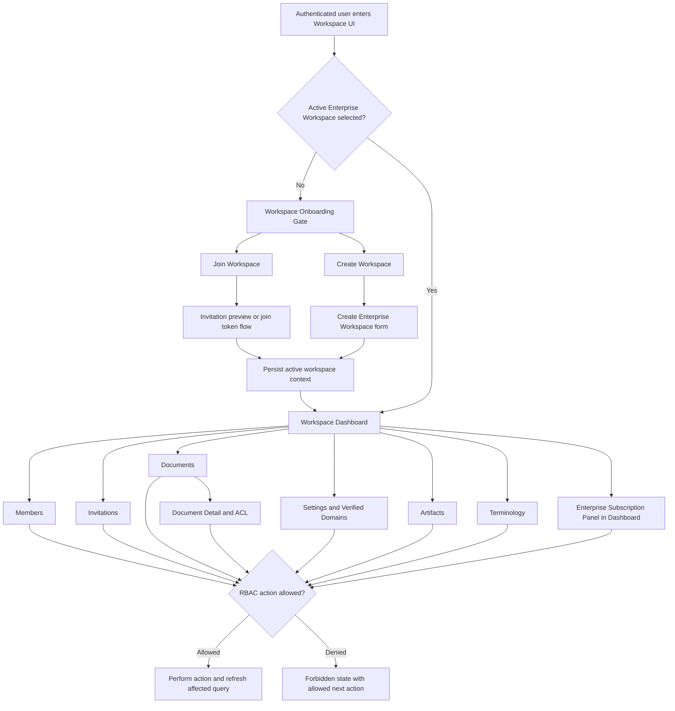
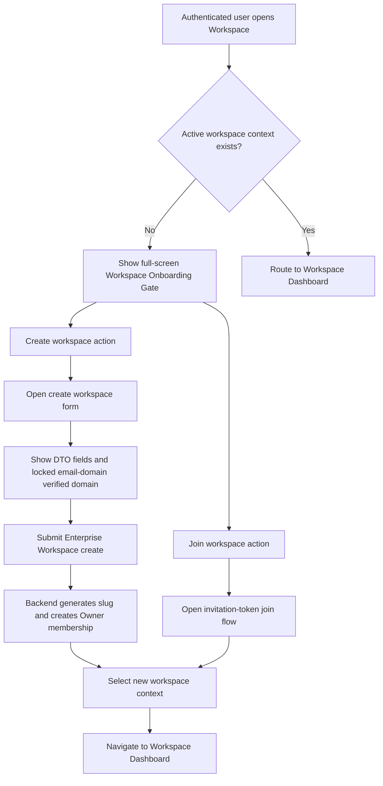
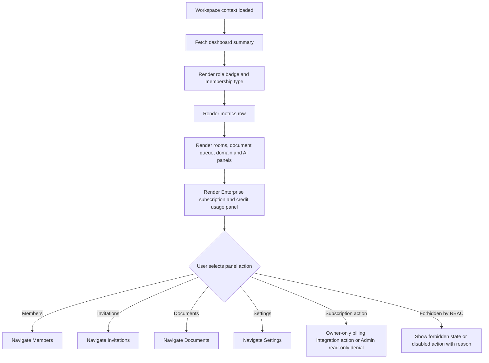
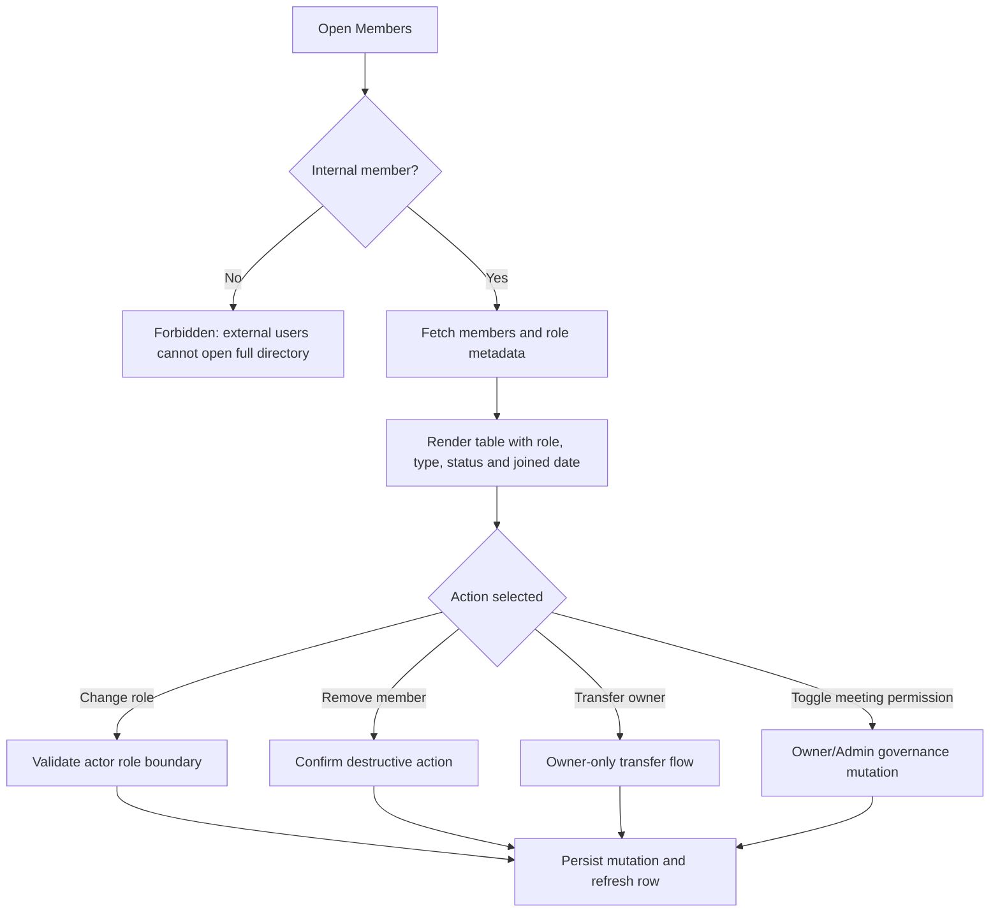
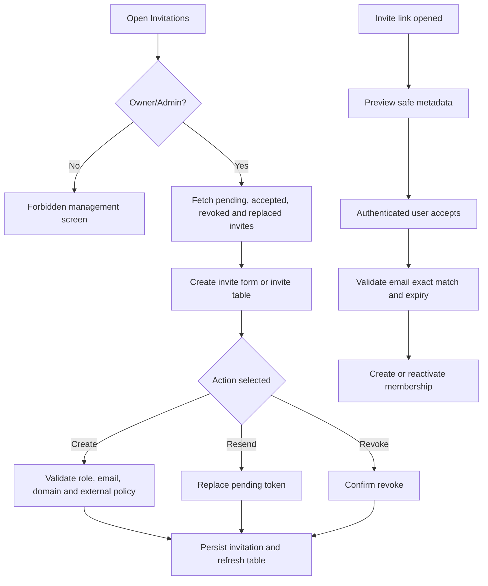
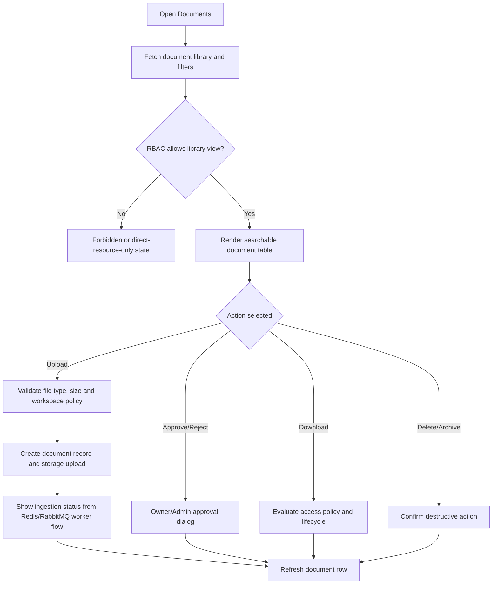
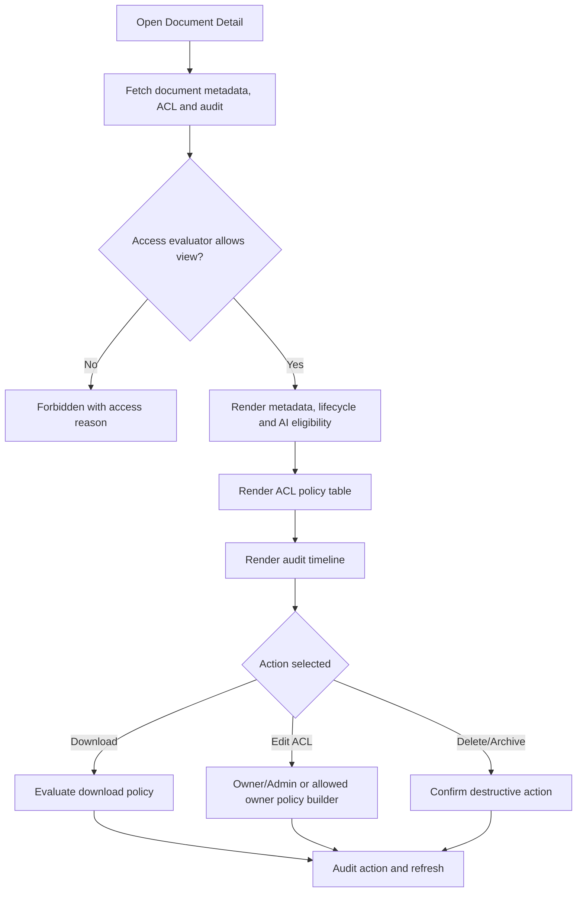
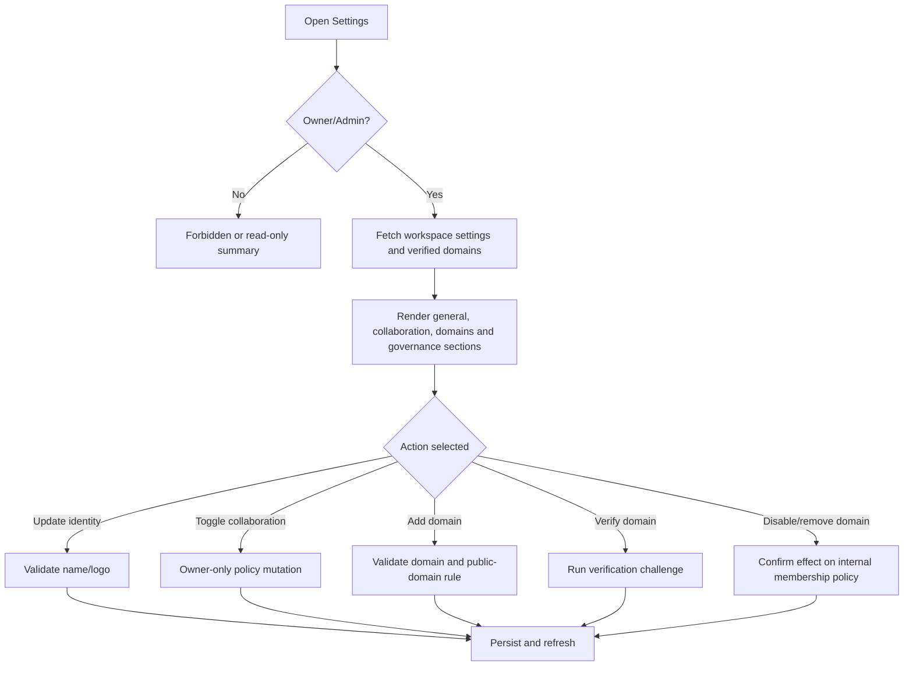
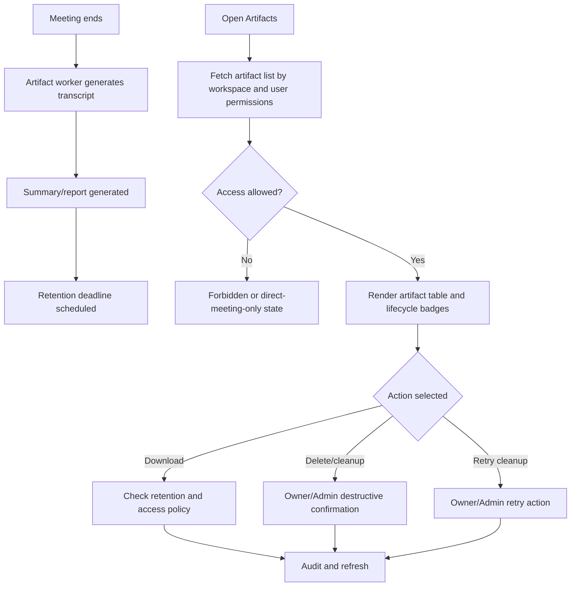
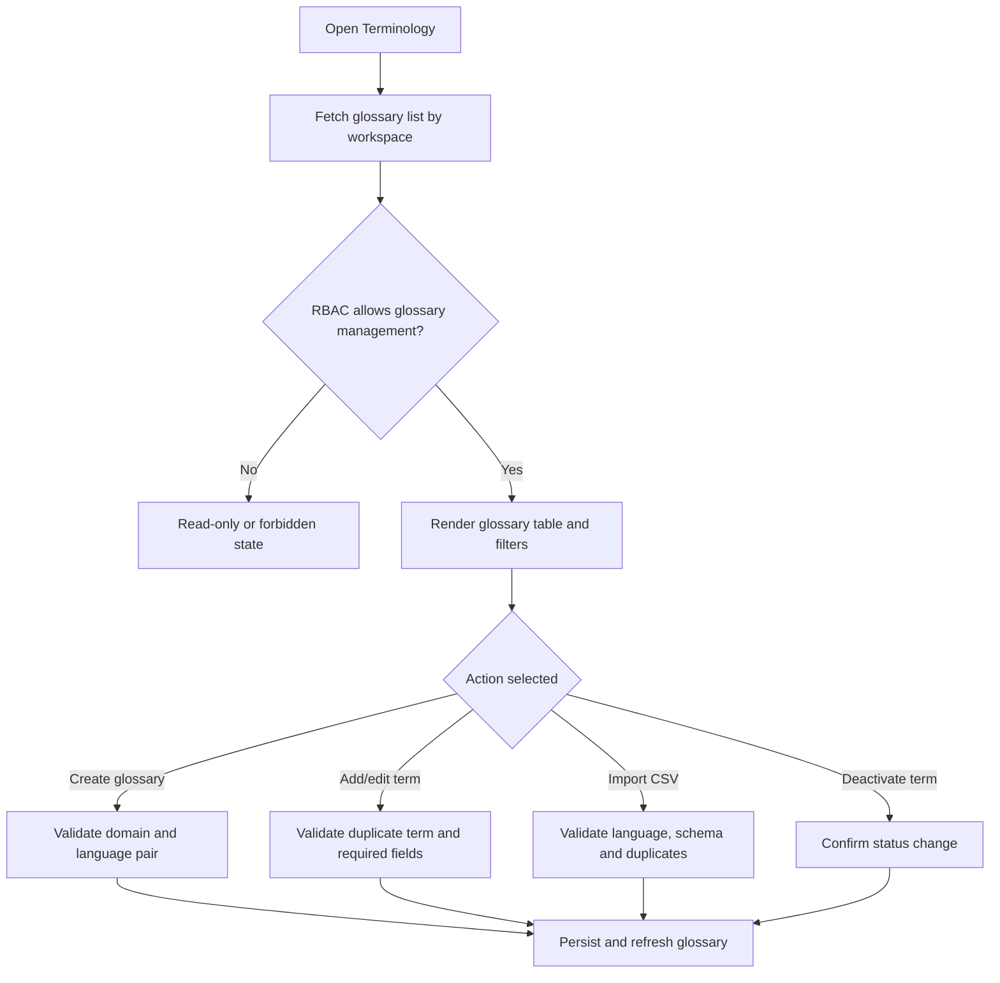

# Workspace UI Software Requirement Specification

**Module**: Workspace  
**Created by**: Ngô Xuân Hạnh Nhi  
**Version**: 1.6  
**Date**: 2026-06-15  
**Source of truth**: https://docs.google.com/document/d/1xObm3bnGcMPOx71I2u-XC4VdNG886pvJlyj7TFshLAQ/edit?tab=t.0  
**Implementation note**: UI behavior in this file is not derived from `warptalk-web`. The web repository is referenced only for non-functional patterns such as security headers, request timeout, token refresh queue, loading/error handling and static asset caching.  
**Design/implementation skill sources**: `warptalk-web/.agents/skills/linear-ui-skills`, `shadcn-layouts`, `nextjs-app-router-patterns`, `shadcn`, `shadcn-ui`, `tailwind-design-system`, `vercel-react-best-practices`, and `warptalk-web/.agents/resources/frontend_backend_mapping.md`.

---

## 0. UI Technology Overview, System Baseline and Non-functional Governance

Phần này là kim chỉ nam bắt buộc cho toàn bộ Workspace UI. Khi implement screen Workspace, engineer/AI phải ưu tiên các rule này trước khi tự tạo pattern mới. `warptalk-web` không phải source of truth về behavior screen, nhưng các skills trong `warptalk-web/.agents/skills` và `warptalk-web/.agents/skills/shadcn/agents` là source of truth cho UI system, component composition, accessibility, layout và non-functional behavior.

### 0.0 Technology overview

| Area | Technology / language | Workspace UI requirement |
|---|---|---|
| Programming language | TypeScript 5 | All Workspace UI code, adapters, DTO mapping and form schemas must be typed; avoid untyped `any` for API responses and RBAC decisions. |
| UI runtime | React 19.2.4 | Screens must be componentized by route, panel and reusable UI state; use client components only where browser state/events are required. |
| Web framework | Next.js 16.2.7 App Router | Workspace routes use App Router conventions, route-level guards, loading/error boundaries and stable nested layouts. |
| Styling | Tailwind CSS 4 | Use CSS-first semantic tokens, `@theme`, `@custom-variant dark`, `cn()`, `gap-*`, `size-*` and no raw color overrides. |
| Component system | shadcn 4.1.0, shadcn/ui patterns, Base UI/Radix-compatible primitives | Use existing primitives for Button, Form, Table, Dialog, Sheet, AlertDialog, Tabs, Badge, Empty, Skeleton, Tooltip and Popover before custom markup. |
| Form/validation | react-hook-form 7.72.0, zod 4.3.6, @hookform/resolvers | Workspace forms must have schema validation, inline errors, disabled submit during mutation and backend error summary. |
| Data fetching/cache | @tanstack/react-query 5.95.2, axios 1.13.6 | Use typed API adapters, timeout/retry policy, query invalidation after mutations and token-refresh queue. |
| Realtime/event UI | @microsoft/signalr 10.0.0 | Room/artifact/notification state can update live when backend events exist; UI must still support polling/refetch fallback. |
| Icons | Phosphor Icons 2.1.10, lucide-react 1.14.0 | Workspace operational screens must follow the current Meeting UI convention and prefer `@phosphor-icons/react/dist/ssr` for screen actions, status, media, members, documents and settings icons. `lucide-react` is allowed only for already-shared legacy components; do not mix both libraries inside one new Workspace screen unless a shared component already owns the icon. Icon-only actions require `aria-label`. |
| Feedback | sonner 2.0.7 | Use toast for successful async feedback; validation and server errors still appear near the field/action. |
| State management | zustand 5.0.12, React Query cache | Active workspace context, shell state and lightweight UI preferences can use store; server state remains query/cache driven. |
| Date/time | date-fns 4.4.0 | Expiry, retention, joined date and audit timestamps must render consistently with timezone awareness. |
| Motion | motion 12.39.0, GSAP only when explicitly needed | Workspace operational UI uses minimal motion only; no layout-property animation or decorative animation. |
| Build/lint | ESLint 9, Next ESLint config | SRS acceptance requires lint-clean UI code and no disabled accessibility rules without justification. |

### 0.0.1 Meeting UI style alignment

Workspace UI must follow the visual language that is already stable in the Meeting module of `warptalk-web`, especially these files:

| Meeting UI reference | Style rule to apply to Workspace |
|---|---|
| `src/app/(app)/rooms/page.tsx` | Use Linear-style dense list/timeline surfaces: compact rows, 11-13px metadata text, status dots, hover `bg-accent/50`, thin `border-border/40` separators, and semantic status colors such as `status-in-progress`, `status-waiting`, `status-scheduled`, `status-ended`, `status-error`. |
| `src/app/(app)/rooms/[id]/page.tsx` | Use operational detail pages with clear title block, property pills, metadata rows, tabs, right-side contextual panels and compact action buttons. Preferred tokens are `bg-canvas`, `bg-surface-1`, `bg-surface-2`, `text-ink`, `text-ink-muted`, `border-border/50`, `border-border/60`. |
| `src/app/(app)/rooms/[id]/setup/page.tsx` | For focused flows, use centered max-width panels, `rounded-[8px]`, `shadow-linear`, `bg-surface-1`, `border-border`, icon controls sized around `size-10`, and minimal transform/opacity animation. |
| `src/components/rooms/create-room-dialog.tsx` | Use shadcn Dialog/Popover/Command/Calendar/Switch, `sonner` feedback, Phosphor icons, compact labels, pill selectors, and direct mutation feedback. Workspace create/invite/settings dialogs should reuse this interaction density. |
| `src/app/globals.css` | Use semantic Tailwind v4 tokens instead of raw colors. Required baseline: Inter, `--canvas`, `--surface-1`, `--surface-2`, `--surface-3`, `--ink`, `--ink-muted`, `--border`, `--hairline`, `--primary #5e6ad2`, radius `8px`. |

Implementation constraints:

- New Workspace screens must not copy the older prototype style found in `rooms/[id]/ended` and `rooms/[id]/artifacts` where raw `neutral-*`, generic `Card`, and `rounded-2xl` are still used.
- Lists, tables and audit timelines must feel like the current Meeting list: dense, scannable, with row-level actions revealed predictably and without oversized cards.
- Detail pages must follow the current Meeting detail pattern: title and status at top, property pills/metadata rows, tabs for subviews, and a contextual side panel only when it improves scanning.
- Dialogs for create workspace, invite member, manage role, upload document, approve ingestion and change settings must follow `CreateRoomDialog` density: compact sections, explicit labels, visible disabled/loading state, local inline error and `sonner` success/failure feedback.
- Use Phosphor icon weights intentionally: `regular` for navigation/list icons, `bold` for primary action emphasis, `duotone` only for empty/completion states.
- Prefer `rounded-[6px]` or `rounded-[8px]` for buttons, inputs and panels; use `rounded-full` only for status pills, avatars, tiny counters and language/status chips.
- Keep page composition operational. No hero section, no marketing copy, no decorative gradients, no nested cards inside cards.

### 0.1 Skill and library authority

| Source | Applies to | Mandatory rule for Workspace UI |
|---|---|---|
| `linear-ui-skills` | Visual system | Operational B2B UI, Inter, semantic light/dark tokens, 4px grid, compact density, 6px/8px radius, 1px borders, no marketing hero layout. |
| `shadcn` | Component governance | Use existing shadcn/ui components before custom markup; compose components, do not reinvent primitives. |
| `shadcn-ui` | Component installation/selection | Use Button, Form, Input, Select, Table, Dialog, Sheet, Popover, DropdownMenu, Tabs, Badge, Alert, Empty, Skeleton, Tooltip and sonner according to screen need. |
| `shadcn/rules/forms.md` | Forms and validation | Forms use `FieldGroup` + `Field`; controls use `aria-invalid`, `data-invalid`, disabled state and inline error description. |
| `shadcn/rules/composition.md` | Component structure | Dialog/Sheet/Drawer require title; Select/Dropdown/Command items live inside group; Empty/Alert/Skeleton/Badge/Separator are preferred over custom markup. |
| `shadcn/rules/icons.md` | Icons | Use icon objects and `data-icon`; icon-only buttons require `aria-label`; do not use string icon lookups. |
| `shadcn/rules/styling.md` | Styling | Use semantic tokens, `cn()`, `gap-*`, `size-*`, `truncate`; avoid raw Tailwind colors and manual dark overrides. |
| `tailwind-design-system` | Tokens and responsive system | Tailwind v4 CSS-first tokens with `@theme`, semantic colors, `@custom-variant dark`, OKLCH where applicable, no arbitrary values when token can exist. |
| `nextjs-app-router-patterns` | Routing/data boundaries | Workspace screens use App Router conventions, route-level guards, server/client boundary clarity and explicit loading/error states. |
| `vercel-react-best-practices` | Runtime quality | Avoid avoidable re-render, use passive/event cleanup patterns, defer expensive work, and do not express render logic in `useEffect`. |

### 0.2 Required component mapping

| UI need | Required component/pattern |
|---|---|
| Primary or secondary action | `Button` with semantic variant and icon object when needed. |
| Destructive confirmation | `AlertDialog`, never plain `confirm()`. |
| Workspace forms | `Form` + `FieldGroup` + `Field` + `FieldLabel` + correct control. |
| Search input with action icon | `InputGroup` + `InputGroupInput` + `InputGroupAddon`. |
| 2-7 option mode selector | `ToggleGroup`, not manual active `Button` loop. |
| Tables/lists | `Table`, `Badge`, pagination, filter/search row, stable skeleton row geometry. |
| Empty state | `Empty`, not a custom card. |
| Loading state | `Skeleton` with stable dimensions, not ad hoc `animate-pulse` blocks. |
| Status/severity | `Badge` variants + text; never color-only status. |
| Inline warning/error | `Alert` near affected action. |
| Toast feedback | `sonner` toast for completed async action. |
| Details side panel | `Sheet`; full focused mutation flow uses `Dialog`. |
| Tabs | `TabsTrigger` inside `TabsList`; content regions labelled and keyboard reachable. |

### 0.3 Non-functional baseline

| ID | Requirement | Detail |
|---|---|---|
| UI-SYS-NFR-001 | Auth/session resilience | Private Workspace routes require authenticated session, handle refresh-token queue, redirect login only after refresh fails and preserve current form/list state where safe. |
| UI-SYS-NFR-002 | Role-aware route guard | Owner/Admin/Member/External Member visibility must be enforced in navigation, actions and row-level controls; forbidden page must state allowed next action. |
| UI-SYS-NFR-003 | Accessibility | All forms have labels, icon-only buttons have `aria-label`, dialogs/sheets/drawers have titles, focus indicator is visible, keyboard navigation works for table actions and filters. |
| UI-SYS-NFR-004 | Visual consistency | Inter font, 4px grid, semantic light/dark tokens, 6px/8px radius, 1px borders, compact density and B2B operational surface are mandatory. |
| UI-SYS-NFR-005 | Component composition | Use shadcn component composition rules; no raw empty state, raw separator, custom badge, missing group wrapper or missing dialog title. |
| UI-SYS-NFR-006 | Data density and stability | Tables/lists must keep stable dimensions across loading, empty, filtered and error states; no layout shift when badges/actions change. |
| UI-SYS-NFR-007 | Error locality | Validation and server errors appear near the affected field/action; global toast alone is not enough for failed forms or destructive actions. |
| UI-SYS-NFR-008 | Performance | Avoid layout-property animation, heavy blur/backdrop-filter, unnecessary `will-change`, and `useEffect` for render-only derivation. |
| UI-SYS-NFR-009 | Reduced motion | Any animation must use `transform`/`opacity`, finish within 200ms for interaction feedback and respect `prefers-reduced-motion`. |
| UI-SYS-NFR-010 | Security headers/cache | Workspace UI inherits web NFR for strict security headers, timeout/retry behavior and immutable caching for build-hashed static assets. |

---

## 1. UI Principles

Workspace UI is an operational B2B product surface. It must be dense, token-based, clear and role-aware. It must not look like a marketing landing page.

- Use the current Meeting UI semantic canvas and surface tokens with thin borders.
- Use restrained lavender-blue/primary accent.
- Keep buttons at 8px radius; avoid overly rounded pill controls.
- Use icon buttons for copy, invite, search, download, settings, delete and retry.
- Use tables/lists for operational data, with filters, search, row actions and pagination.
- Every page must define loading, empty, error, success and forbidden states.
- UI must distinguish `Workspace Owner` from `Host` of a Translation Room.
- UI must not invent entities, states or database concepts outside WarpTalk vocabulary.
- UI must treat WarpTalk as multi-workspace with one Internal Home Workspace per account: a user may select many Enterprise Workspaces, but may be `Internal` in at most one domain-verified Enterprise Workspace; other cross-organization memberships are `External`.
- UI must display duplicate active verified-domain errors returned by the backend/table `workspace.workspace_verified_domains` near the domain field instead of trying to determine domain ownership locally.
- When no active workspace context exists, UI must render a full-screen Workspace Onboarding Gate without workspace sidebar/topbar. The gate offers `Join workspace` and `Create workspace`; the create demo flow locks the verified domain to the signed-in user's email domain.

---

## 2. Workspace Navigation

### Page order

```text
/workspace/dashboard
  -> /workspace/members
  -> /workspace/invitations
  -> /workspace/rooms
  -> /workspace/artifacts
  -> /workspace/terminology
  -> /workspace/documents
  -> /workspace/settings
```

### Navigation rules

| Condition | UI behavior |
|---|---|
| No active workspace selected | Show full-screen Workspace Onboarding Gate with `Join workspace` and `Create workspace`; no sidebar/topbar. |
| User is External Member | Hide internal directory/settings/admin tabs; show only resources explicitly allowed. |
| User is Member | Show dashboard/rooms/artifacts/documents if permitted; hide member mutation, invitations and settings actions. |
| User is Admin | Show operational management except Owner-only controls such as external collaboration toggle and ownership transfer. |
| User is Owner | Show all workspace governance controls. |
| Forbidden route | Do not render blank page; show forbidden state with allowed action: back dashboard, request access or login as another user. |

### Screen flow



---

## 3. Shared Components

### Workspace header

Information:

- Workspace name.
- Workspace slug or short identifier.
- Current role.
- Membership type: Internal or External.
- Plan/status summary if available.

Actions:

- Switch workspace.
- Create room.
- Invite member, Owner/Admin only.
- Settings, Owner/Admin only.

States:

- Loading: skeleton for name, role badge and action buttons.
- Error: retry button, no destructive action.
- Forbidden: show role/access reason.

### Status badges

Use consistent labels:

- Member status: Active, Removed, Pending.
- Invitation status: Pending, Accepted, Revoked, Expired, Replaced.
- Document status: Active, Pending approval, Rejected, Archived, Deleted.
- Ingestion status: Awaiting approval, Pending, Processing, Completed, Failed.

### Forms

Every form must include:

- Field label.
- Required marker.
- Inline validation.
- Disabled submit while submitting.
- Backend error summary.
- Preserve user input after network failure.

---

## 4. Screen: Workspace Onboarding Gate and Create Workspace Demo

### Goal

Let an authenticated user without active workspace context choose between joining an existing workspace and creating a new Enterprise Workspace for the demo flow.

### Layout

- `/workspace`: full-screen onboarding gate with no sidebar/topbar, signed-in account identity, `Join workspace` action and `Create workspace` action.
- `/workspace/create`: focused create form; verified domain is derived from signed-in email and displayed read-only.
- `/workspace/join`: invitation-token entry or placeholder route for join-by-invite.
- No workspace table, search, pagination or right-rail create form in the zero-active-context demo path.

### Actions

- Join workspace by invitation token.
- Create Enterprise Workspace.

### Happy case

1. User opens `/workspace` with no active workspace context.
2. UI renders the full-screen Workspace Onboarding Gate.
3. User chooses `Create workspace`.
4. UI opens `/workspace/create`.
5. UI shows backend DTO fields, with verified domain locked to the signed-in email domain.
6. UI calls `POST /api/v1/workspaces`.
7. UI calls `POST /api/v1/workspaces/{id}/select` for the created workspace.
8. Active workspace context updates and user is redirected to `/workspace/dashboard`.

### Edge cases

- User email missing/invalid: disable create and show account identity error.
- User email uses public domain: disable domain-verified create and direct user to join by invitation.
- User submits while mutation is pending: disable duplicate submit.

### Unhappy cases

- API returns unauthorized: redirect login.
- Duplicate active verified domain: show inline domain conflict near the locked domain row.
- User already has an Internal Home Workspace: show form-level conflict.
- API/network error: preserve form input and show retry.

---

## 5. Screen: Workspace Dashboard

### Goal

Provide owner/manager an operational overview of tenant activity, usage and governance alerts.

### Layout

- Header: workspace name, Enterprise plan summary, primary action.
- Metrics row:
  - Rooms this month.
  - Minutes translated.
  - Credits remaining.
  - Summaries generated.
  - Active members.
- Main:
  - Recent rooms.
  - Artifact governance alerts.
  - Terminology coverage.
  - Usage trend.
  - Enterprise subscription and credit usage summary.
- Right rail:
  - Enterprise subscription warning.
  - Pending invitations.
  - AI health.

### Actions

- Create room.
- Invite member.
- Manage terminology.
- View subscription and usage panel in Dashboard.
- View documents.

### Role behavior

| Role | Visible capability |
|---|---|
| Owner | All metrics and governance actions. |
| Admin | Operational metrics, invitations, terminology, documents and read-only Enterprise subscription summary; no Owner-only subscription/external-collaboration mutation. |
| Member | Read-only operational summary if permitted. |
| External Member | Restricted dashboard or forbidden state, depending policy. |

### Unhappy cases

- No workspace selected.
- User lacks manager permission.
- Enterprise subscription usage data unavailable.
- Data loading failed.
- AI health unavailable.

---

## 6. Screen: Members

### Goal

Let internal users view workspace members and let Owner/Admin manage role, removal and ownership.

### Information

- Member name/email.
- Role.
- Membership type: Internal or External.
- Status.
- Joined date.
- Last activity, if available.

### Actions

- Invite member, Owner/Admin.
- Change role, Owner/Admin with code-enforced limits.
- Remove member.
- Transfer ownership, Owner only.
- Search/filter.

### Role rules

- External Member cannot open full member directory.
- Owner can change Admin/Member roles, remove non-owner members and transfer ownership.
- Admin cannot manage Owner, cannot change another Admin role and cannot promote Member to Admin.
- Member can view directory only when Internal; cannot mutate.

### Happy case

1. Owner opens Members.
2. UI loads member list with pagination.
3. Owner searches a member.
4. Owner changes role or removes member.
5. List refreshes and row status updates.

### Edge cases

- Last Owner attempts to leave or demote self: show blocking explanation.
- Removed member appears only in admin audit/history view, not active list.
- Role lookup temporarily fails: show fallback label and retry.

### Unhappy cases

- External Member opens page: forbidden state.
- Admin tries to remove Owner: forbidden.
- Target member already removed: refresh and show stale row message.
- Network error during mutation: preserve table state and show retry.

---

## 7. Screen: Invitations

### Goal

Let Owner/Admin manage pending invitations and let invited users preview/accept invitation safely.

### Information

- Invited email, masked where public preview.
- Role.
- Membership type.
- Status.
- Invited by.
- Expiration time.
- Last resend time.

### Actions

- Create invite.
- Resend invite.
- Revoke invite.
- Preview invite by token.
- Accept invite by token.

### Rules

- Owner/Admin can invite.
- Admin cannot assign Owner.
- External invitation requires external collaboration enabled and role Member.
- Internal invitation requires verified domain when workspace policy requires it.
- Accept requires exact authenticated email match.

### Test states

| Case | Expected UI |
|---|---|
| Pending invite | Show revoke/resend actions. |
| Expired invite | Disable accept and show expired message. |
| Replaced invite | Show invite superseded message. |
| Email mismatch | Show forbidden identity-bound message. |
| External disabled | Show policy error in invite form. |

---

## 8. Screen: Documents

### Goal

Let workspace members upload, view and govern document library under ACL, approval and AI guardrail policy.

### Information

- Document name.
- File type/size.
- Status.
- Ingestion status.
- Sensitivity/confidentiality.
- Uploaded by.
- Owner.
- Retention date.
- Access level or policy summary.

### Actions

- Upload document.
- Approve/reject pending document, Owner/Admin.
- Download.
- Edit metadata, Owner/Admin/document owner.
- Manage access policy, Owner/Admin/document owner where allowed.
- Delete document.

### Happy case

1. Owner uploads document.
2. UI shows document as active and ingestion pending.
3. Worker processes event.
4. UI updates status to completed.
5. User downloads document if access evaluator allows.

### Edge cases

- Member upload creates pending approval state.
- Sensitive document defaults to restricted.
- Ingestion failure shows failed status and does not expose AI eligibility.

### Unhappy cases

- Unsupported file type/size.
- Explicit deny policy.
- Pending document accessed by non-owner/non-admin.
- Document deleted/retention expired.
- Download URL generation failed.

---

## 9. Screen: Terminology

### Goal

Manage workspace-level glossary so AI/translation uses correct business vocabulary.

### Information

- Glossary name.
- Business domain.
- Source language.
- Target language.
- Term count.
- Active/inactive.

Term table:

- Source term.
- Preferred translation.
- Definition.
- Usage note/context.
- Priority.
- Status.

### Actions

- Create glossary.
- Add term.
- Import CSV.
- Export.
- Edit.
- Deactivate.

### Happy case

Manager adds term `ARR` with preferred translation; translation prompt/model adapter uses that term in the same workspace/domain/language pair.

### Unhappy cases

- Duplicate term in same workspace/domain/source/target.
- Unsupported language.
- CSV invalid.
- User lacks permission.

---

## 10. Screen: Artifacts

### Goal

Let workspace users inspect room artifacts by permission, sensitivity and retention.

### Information

- Artifact list by room.
- Type.
- Owner/room.
- Sensitivity.
- Retention date.
- Access level.
- Consent required.
- Status.

### Filters

- Room.
- Type.
- Status.
- Contains raw audio.
- Retention expiring soon.
- Confidentiality.

### Actions

- Download.
- Review access.
- Delete.
- Extend retention.
- Request consent.

### Rules

- Sensitive artifact requires audit.
- Raw audio/video artifact requires stricter permission.
- Expired retention must not expose download.

---

## 11. Screen: Settings

### Goal

Let Owner/Admin manage workspace settings with Owner-only boundaries for external collaboration.

### Sections

- General: name, logo, default language.
- Collaboration: allow external collaboration, require verified domain, allow subdomains.
- Verified domains: domain list, status, verification method.
- Governance: retention, allowed languages, active room limits.
- AI policy: PII/DLP toggles and guardrail keywords.

### Role rules

- Owner can update all settings.
- Admin can update operational settings but cannot change `AllowExternalCollaboration`.
- Member and External Member cannot update settings.

### Unhappy cases

- Public domain verification attempt.
- Domain already verified by another workspace.
- Admin changes external collaboration toggle.
- Invalid settings payload.

---

## 12. UI Non-functional Requirements

| ID | Requirement | Source |
|---|---|---|
| UI-NFR-001 | Every private Workspace route must verify authenticated session before rendering sensitive data; if token refresh fails, redirect to login and do not flash stale workspace data. | warptalk-web api client pattern |
| UI-NFR-002 | Concurrent 401 responses must queue behind one refresh request to avoid token-refresh storms; failed refresh clears protected state and shows controlled login redirect. | warptalk-web api client pattern |
| UI-NFR-003 | API requests must use timeout/retry affordance; failed mutations preserve user input/table state and show retry near the affected form or row. | warptalk-web api client pattern + UI source |
| UI-NFR-004 | Workspace route guards must evaluate role and membership type: Owner, Admin, Member, External Member. Hidden actions must not be reachable through direct route or stale UI state. | Workspace SRS + UI source |
| UI-NFR-005 | Security headers must include X-Frame-Options DENY, X-Content-Type-Options nosniff and strict referrer policy; Workspace screens must not use iframe-friendly assumptions. | warptalk-web next.config pattern |
| UI-NFR-006 | Static assets are cacheable with immutable policy only when build hash guarantees freshness; runtime workspace data must not be cached as static asset. | warptalk-web next.config pattern |
| UI-NFR-007 | Every operational table/list must include structural `Skeleton`, `Empty`, error state, forbidden state, row actions, search/filter and pagination when item count can grow. | shadcn composition + UI source |
| UI-NFR-008 | Forms must use `FieldGroup`/`Field`, labels, inline errors, `aria-invalid`, `data-invalid`, disabled/loading submit and backend error summary. | shadcn forms |
| UI-NFR-009 | Dialog/Sheet/Drawer must include accessible title; destructive actions use `AlertDialog`; success/failure feedback uses `sonner` plus local state update. | shadcn composition |
| UI-NFR-010 | UI must not rely only on color for status; use text labels, `Badge`, icon+text where needed and accessible contrast >= 4.5:1. | Linear UI + accessibility |
| UI-NFR-011 | Visual system must use Meeting-aligned B2B operational surfaces, Inter, 4px grid, 6px/8px radius, 1px borders, semantic light/dark tokens and compact density. | linear-ui-skills + tailwind-design-system + current Meeting UI |
| UI-NFR-012 | Tailwind usage must prefer semantic tokens and `cn()`; no raw color overrides, no `space-x/space-y` when `gap-*` is possible, no `w-* h-*` for square controls when `size-*` exists. | shadcn styling + Tailwind |
| UI-NFR-013 | Animation must be minimal, optional, <= 200ms for feedback, use only transform/opacity and respect `prefers-reduced-motion`. | linear-ui-skills |
| UI-NFR-014 | Workspace app shell must use `h-dvh`, `min-h-0` scroll containers and stable table/card dimensions to avoid broken full-height layouts. | linear-ui-skills + shadcn-layouts |
| UI-NFR-015 | Empty/loading/error/forbidden/success states are required per screen and must be specified before implementation; no screen may render blank state for unavailable data. | UI source-of-truth |

---

## 13. Acceptance Checklist

- Page order is clear.
- Each page has one primary action.
- Each page has loading, empty, error, success and forbidden state.
- Buttons match role and status.
- Data displayed maps to Workspace/Translation/Billing/Artifact domain.
- State transition is valid.
- Happy case works end to end.
- At least five unhappy cases are handled for complex flows.
- Permission restrictions are visible and enforced.
- UI style matches the current Meeting UI operational product system.
- No invented entity/state outside WarpTalk vocabulary.

---

## 14. Per-screen Markdown Specifications

Mỗi màn hình Workspace có file Markdown riêng để AI hoặc engineer implement UI theo đúng screen, schema, role rule, state, screen flow và requirement baseline. Nội dung dưới đây không chỉ là bảng tổng hợp; từng đặc tả screen được đưa trực tiếp vào DOCX để reviewer không cần mở file phụ.

| Screen | File | Purpose |
|---|---|---|
| Workspace create demo implementation | [`ui-screens/workspace-create-demo-implementation.md`](ui-screens/workspace-create-demo-implementation.md) | Step-by-step implementation contract for the full-screen onboarding gate and create workspace demo flow. |
| Workspace Dashboard | [`ui-screens/workspace-dashboard.md`](ui-screens/workspace-dashboard.md) | Operational overview and governance readiness. |
| Members | [`ui-screens/workspace-members.md`](ui-screens/workspace-members.md) | Member directory, role, ownership and `CanCreateMeetings`. |
| Invitations | [`ui-screens/workspace-invitations.md`](ui-screens/workspace-invitations.md) | Invitation create/list/preview/accept/revoke/resend. |
| Documents | [`ui-screens/workspace-documents.md`](ui-screens/workspace-documents.md) | Document library, approval queue, ingestion and AI eligibility. |
| Document Detail / ACL | [`ui-screens/workspace-document-detail-acl.md`](ui-screens/workspace-document-detail-acl.md) | Document lifecycle, deny-overrides policy and audit. |
| Settings / Domains | [`ui-screens/workspace-settings-domains.md`](ui-screens/workspace-settings-domains.md) | Workspace settings, verified domains and governance policy. |
| Artifacts | [`ui-screens/workspace-artifacts.md`](ui-screens/workspace-artifacts.md) | Post-meeting transcript/summary retention and cleanup states. |
| Terminology | [`ui-screens/workspace-terminology.md`](ui-screens/workspace-terminology.md) | Workspace glossary and language pair terms. |
| Dashboard subscription panel | [`ui-screens/workspace-dashboard.md`](ui-screens/workspace-dashboard.md) | Enterprise subscription context is embedded in Dashboard; no separate Billing screen because the app has one Enterprise plan. |

### 14.1 Workspace Onboarding Gate and Create Workspace Demo

#### Goal

Let an authenticated user without active workspace context either join by invitation or create a demo Enterprise Workspace with a backend-safe, locked verified domain.

#### Screen flow



#### RBAC screen variants

| Role / context | Screen behavior |
|---|---|
| Authenticated user with no active context | Sees full-screen gate with `Join workspace` and `Create workspace`; workspace-scoped navigation remains unavailable. |
| Authenticated user with active context | Opening `/workspace` routes to `/workspace/dashboard` in demo scope. |
| Public-email user | Cannot create a domain-verified Internal Home Workspace; user is directed to join by invitation. |
| User already Internal elsewhere | Backend conflict is shown as Internal Home Workspace conflict; user may still use external memberships via invite flow. |

#### Workspace schema touched

| Entity | Fields shown or affected |
|---|---|
| `workspace.workspaces` | `id`, `name`, `slug`, `logo_url`, `is_active`, `created_at` |
| `workspace.workspace_members` | created Owner/Internal membership for the creator |
| `workspace.workspace_verified_domains` | derived email domain, `status=verified`, active-domain uniqueness validation |

#### Layout

- App shell: no workspace sidebar/topbar until active context exists.
- Gate: current account, two primary actions, compact operational copy.
- Create route: centered focused form, DTO preview panel, locked verified-domain row.
- Join route: token input or invitation-link handoff.

#### Actions

| Action | Role | API intent | UI rule |
|---|---|---|---|
| Join workspace | Authenticated user | Invitation preview/accept flow | Token-based route; no workspace sidebar before accepted context. |
| Create Enterprise Workspace | Authenticated business-email user | `POST /api/v1/workspaces` | Inline validation; locked email-domain error stays near verified domain row. |
| Select newly created workspace | Created Owner member | `POST /api/v1/workspaces/{id}/select` | Disable duplicate submit and persist active context before dashboard navigation. |

#### States

- Loading: full-screen centered progress with stable panel geometry.
- Empty/no context: show onboarding gate, no marketing hero and no workspace list/table.
- Error: preserve form input and show retry near the failed action.
- Forbidden: redirect to login when auth expired.
- Success: selected workspace context updates and route goes to `/workspace/dashboard`.

#### Requirement baseline behavior

- If verified domain enforcement is configured during create, UI must explain internal enterprise membership constraint before submit.
- If user already has an Internal Home Workspace, show clear conflict copy from backend: the account can still select external memberships, but cannot create or join a second domain-verified Enterprise Workspace as `Internal`.
- Duplicate active verified domains are backend-owned validation errors from `workspace.workspace_verified_domains`; render them inline near the domain field.
- Demo create flow must not allow arbitrary verified-domain editing because backend currently marks submitted domains as verified immediately with `VerificationMethod = system`.

### 14.2 Workspace Dashboard

#### Goal

Provide an operational summary for Enterprise Workspace activity, governance alerts and implementation readiness.

#### Screen flow



#### Workspace schema touched

| Entity | Fields shown or affected |
|---|---|
| `workspace.workspaces` | `name`, `slug`, `settings`, `allow_external_collaboration`, `require_verified_domain_for_internal` |
| `workspace.workspace_members` | active count, role distribution, external count |
| `workspace.workspace_invitations` | pending count |
| `workspace.workspace_documents` | active/pending/sensitive counts |
| `workspace.workspace_document_audits` | recent sensitive access count |
| external billing schema/service | Enterprise subscription status, credits, usage, invoices where integration exists |

#### Layout

- Header: workspace name, active role badge, membership type badge.
- Metrics row: active members, pending invitations, active rooms, documents pending approval, artifacts expiring soon.
- Main panels: recent rooms, document governance queue, domain alerts, AI ingestion health.
- Right rail: settings health, Enterprise subscription/credits summary and governance readiness checklist.

#### Role behavior

| Role | Visible capability |
|---|---|
| Owner | All governance controls and rollout checklist. |
| Admin | Operational alerts, invitations, members, documents and settings except Owner-only toggles. |
| Member | Read-only workspace summary and own resources. |
| External Member | Restricted dashboard or forbidden, depending direct resource grants. |

#### RBAC screen variants

| Role | Screen behavior |
|---|---|
| Owner | Full dashboard with governance, domains, Enterprise subscription panel, document approval, artifact retention and owner-only actions. |
| Admin | Operational dashboard with members, invitations, documents, read-only Enterprise subscription usage and settings except Owner-only controls. |
| Member | Read-only dashboard focused on own rooms, permitted documents and permitted artifacts. |
| External Member | Restricted direct-resource dashboard; hides internal counts, directory summary and governance health. |

#### Requirement baseline behavior

- Show WT-159 meeting governance readiness: `CanCreateMeetings`, `MaxActiveRooms`, allowed languages, artifact retention.
- Show WT-157 domain verification readiness: unverified/disabled domains and external collaboration state.
- Show WT-158 document approval readiness: pending approval, failed ingestion and sensitive documents.
- Show Enterprise plan and credit usage in Dashboard only; no standalone Billing route is required while the product has one Enterprise subscription plan.
- Owner can see subscription management affordances where billing integration allows; Admin sees read-only operational usage; Member/External do not see billing controls.

### 14.3 Members

#### Goal

Let internal users inspect active members and let Owner/Admin manage role, removal and ownership with code-enforced boundaries.

#### Screen flow



#### Workspace schema touched

| Entity | Fields shown or affected |
|---|---|
| `workspace.workspace_members` | `user_id`, `role_id`, `membership_type`, `status`, `joined_at`, `removed_at`, `removed_by` |
| `workspace.workspaces` | `owner_id`, `settings` policy values |

#### Actions

| Action | Allowed roles | Business rule |
|---|---|---|
| List members | Internal Owner/Admin/Member | External Member cannot open full directory. |
| Change role | Owner/Admin with limits | Admin cannot manage Owner, another Admin or promote Member to Admin. |
| Remove member | Owner/Admin with limits; self-leave for Member/Admin | Soft delete, preserve audit/history. |
| Transfer ownership | Owner only | Target must be active non-external member. |
| Toggle `CanCreateMeetings` | Owner/Admin | WT-159 meeting governance. |

#### RBAC screen variants

| Role | Screen behavior |
|---|---|
| Owner | Can transfer ownership, remove/change role within business rules, invite members and update meeting-creation permission. |
| Admin | Can manage operational members within restrictions; cannot manage Owner, another Admin or ownership transfer. |
| Member | Can view internal directory if policy allows; cannot mutate roles, remove others or invite users. |
| External Member | Cannot open full member directory; sees forbidden state with back-to-dashboard or resource route action. |

#### States

- Loading: table skeleton with search/filter controls disabled.
- Empty: no active members except caller should not happen; show recovery alert.
- Error: preserve table data and show retry near failed action.
- Forbidden: external member sees explicit directory boundary message.
- Success: changed row updates without full route reload.

#### Requirement baseline behavior

- Add per-member `CanCreateMeetings` control.
- Add internal/external filters and governance column for meeting creation permission.

### 14.4 Invitations

#### Goal

Let Owner/Admin create, list, revoke, resend and track Enterprise Workspace invitations; let invited users preview and accept safely.

#### Screen flow



#### RBAC screen variants

| Role / context | Screen behavior |
|---|---|
| Owner | Can create internal/external invitations, resend, revoke and inspect invitation status history. |
| Admin | Can create/revoke/resend within workspace policy; cannot invite Owner role and external invites remain Member-only. |
| Member | No invitation management screen; may accept an invitation only through token preview flow when email matches. |
| External Member | No invitation management screen; token preview is the only invitation-related screen. |
| Invited user | Sees workspace, inviter, target email, role and expiry; token hash is never displayed. |

#### Workspace schema touched

| Entity | Fields shown or affected |
|---|---|
| `workspace.workspace_invitations` | `email`, `role_id`, `membership_type`, `status`, `expires_at`, `accepted_at`, `revoked_at`, `replaced_by_invitation_id` |
| `workspace.workspace_verified_domains` | domain validation for internal invitations |
| `workspace.workspace_members` | membership created/reactivated on accept |

#### Actions and states

| Action | UI behavior |
|---|---|
| Create internal invite | Validate verified domain, role Admin/Member only. |
| Create external invite | Require external collaboration enabled; role must be Member. |
| Preview invite | Show safe workspace/inviter/role metadata; never show token hash. |
| Accept invite | Require authenticated email exact match; show email mismatch error clearly. |
| Revoke invite | Confirmation dialog; status becomes Revoked. |
| Resend invite | Old pending token becomes Replaced; newest token is active. |

#### Requirement baseline behavior

- Add domain policy hint in invite form: verified, unverified, public domain rejected, duplicate enterprise domain.
- Add admin-review copy for external collaborator approval when policy requires manual approval.
- Internal invite accept must surface the Internal Home Workspace conflict when the invited account is already `Internal` in another domain-verified Enterprise Workspace; external invitation accept remains allowed when policy allows it.

### 14.5 Documents

#### Goal

Let workspace users upload, search and access internal documents while surfacing approval, ingestion, sensitivity and retention states.

#### Screen flow



#### RBAC screen variants

| Role | Screen behavior |
|---|---|
| Owner | Full library, upload, approval queue, policy summary, delete/archive and retry ingestion controls. |
| Admin | Operational library with upload, approval, retry and management controls except Owner-only policy changes. |
| Member | Can search/view/download allowed documents; upload may enter pending approval; management is limited to own documents where policy allows. |
| External Member | No library-wide list by default; only direct meeting/document exception routes are visible when explicitly granted. |

#### Workspace schema touched

| Entity | Fields shown or affected |
|---|---|
| `workspace.workspace_documents` | `file_name`, `document_type`, `status`, `ingestion_status`, `is_sensitive`, `ai_eligible`, `storage_key`, `retention_until`, `deleted_at` |
| `workspace.workspace_document_access_policies` | access summary and policy count |
| `workspace.workspace_document_audits` | recent sensitive actions |

#### Actions

| Action | Role/policy | UI rule |
|---|---|---|
| Upload | Active member; file policy applies | Owner/Admin upload can become active; Member upload may become pending approval. |
| Approve/reject | Owner/Admin | Show reason field for rejection. |
| Download | Access evaluator allows | Block pending/sensitive/denied states with exact reason. |
| Delete/archive | Owner/Admin/document owner where allowed | Destructive confirmation required. |
| Search/filter | Authorized users | Filter by status, ingestion, sensitivity, type, owner. |

#### Requirement baseline behavior

- Approval queue is first-class: pending approval, rejected, failed ingestion and retry states.
- Show AI retrieval boundary: deleted/archived/not completed/not eligible documents are not used by AI.
- Show RabbitMQ/Redis async status only as operational indicator, not as user-editable state.

### 14.6 Document Detail and ACL

#### Goal

Show a single workspace document, its lifecycle, sensitive/AI state, access policies and audit history.

#### Screen flow



#### RBAC screen variants

| Role / subject | Screen behavior |
|---|---|
| Owner | Full metadata, ACL policy builder, audit timeline, delete/archive and sensitive access review. |
| Admin | Operational ACL and audit controls except Owner-only policy overrides. |
| Document owner | Can manage own document where workspace policy permits; cannot bypass deny/security rules. |
| Member | Can view/download only when evaluator allows; ACL and audit mutation controls are hidden. |
| External Member | Direct exception view only within allowed meeting/document policy window; no ACL builder or full audit panel. |

#### Workspace schema touched

| Entity | Fields shown or affected |
|---|---|
| `workspace.workspace_documents` | metadata, lifecycle, owner/uploader, sensitivity, AI eligibility |
| `workspace.workspace_document_access_policies` | subject type/key, effect, permission, status |
| `workspace.workspace_document_audits` | upload/view/download/delete/policy actions |

#### Layout

- Header: filename, status badges, owner/uploader, primary action.
- Metadata panel: type, source, size, retention, storage provider pointer, AI eligibility.
- ACL panel: policy table with deny-overrides explanation.
- Audit panel: timeline of sensitive actions.

#### Requirement baseline behavior

- Add policy builder for `SubjectType=Role`, `MembershipType`, `User`.
- Show conflict preview: DENY match wins over ALLOW.
- Show meeting exception preview when source type is meeting artifact and external participant is within grace period.

### 14.7 Settings and Verified Domains

#### Goal

Let Owner/Admin configure workspace identity, collaboration policy, verified domains and governance settings.

#### Screen flow



#### Workspace schema touched

| Entity | Fields shown or affected |
|---|---|
| `workspace.workspaces` | `name`, `logo_url`, `settings`, `allow_external_collaboration`, `require_verified_domain_for_internal`, `allow_subdomains` |
| `workspace.workspace_verified_domains` | `domain`, `status`, `verification_token`, `verified_at`, `disabled_at` |

#### Sections

- General: name, logo, slug display.
- Collaboration: allow external collaboration, require verified domain, allow subdomains.
- Verified domains: add/verify/disable/remove domain.
- Meeting governance: max active rooms, allowed target languages, artifact retention days.
- AI/document policy: default PII/DLP/AI usage policy.

#### Role behavior

- Owner can update all settings.
- Admin can update operational settings but cannot change Owner-only external collaboration toggle.
- Member/External Member cannot update settings.

#### RBAC screen variants

| Role | Screen behavior |
|---|---|
| Owner | Full settings, verified domains, external collaboration, retention and governance policy controls. |
| Admin | Operational settings and domain workflows where allowed; Owner-only external toggle and billing-linked policy are read-only. |
| Member | No settings mutation; may see limited read-only workspace identity if linked from dashboard. |
| External Member | Settings route is hidden or forbidden. |

#### Requirement baseline behavior

- Domain verification method cards: DNS TXT, email challenge or admin-approved challenge.
- Active verified domain uniqueness is enforced by the backend/table `workspace.workspace_verified_domains`; duplicate active company domains across Enterprise Workspaces must return a field-level domain conflict.
- Domain revocation warning: new internal joins blocked; existing exceptions require migration policy.
- WT-159 settings are part of the Workspace UI requirement baseline.

### 14.8 Artifacts

#### Goal

Let workspace users inspect post-meeting transcript and summary artifacts by permission, sensitivity and retention state.

#### Screen flow



#### Workspace schema touched

| Entity | Fields shown or affected |
|---|---|
| `translation_room.translation_room_artifacts` | artifact records linked to workspace/room |
| `workspace.workspaces.settings` | `ArtifactRetentionDays` and governance settings |
| `workspace.workspace_document_audits` | sensitive artifact access audit if artifacts are mirrored as documents |

#### Artifact types

- Transcript export.
- Summary/report export.
- Action items/decisions if generated from summary.
- Raw recording is out of scope for WT-159 and must not appear as default saved artifact.

#### RBAC screen variants

| Role | Screen behavior |
|---|---|
| Owner | Full artifact list, retention policy visibility, delete/cleanup retry and access review. |
| Admin | Operational artifact management except Owner-only retention policy changes. |
| Host/Internal participant | Can see artifacts for hosted or participated meetings when policy allows. |
| Member | Can see workspace artifacts only when permission grants access. |
| External Member | Can see only artifacts for meetings they participated in and only within allowed grace/policy window. |

#### Requirement baseline behavior

- Show generation timeline after meeting ends: transcript -> summary -> retention scheduled.
- Show expired state and prevent download when `RetentionUntil` has passed.
- Show cleanup status: active, expiring soon, deleted, cleanup failed/retry required.
- External Member can only see artifacts for meetings they participated in and only within allowed grace/policy window.

### 14.9 Terminology

#### Goal

Let workspace managers maintain business terminology so translation and AI prompts use consistent domain vocabulary.

#### Screen flow



#### RBAC screen variants

| Role | Screen behavior |
|---|---|
| Owner | Full glossary create/edit/import/export/deactivate. |
| Admin | Full operational glossary management unless workspace policy reserves it for Owner. |
| Member | Read/use visible glossary terms; management controls hidden. |
| External Member | No glossary management; direct meeting UI may show applied term behavior without exposing glossary records. |

#### Workspace schema touched

| Entity | Fields shown or affected |
|---|---|
| `workspace.workspace_knowledge_glossaries` | `business_domain`, `source_language`, `target_language`, `term`, `preferred_translation`, `definition`, `usage_note`, `status` |

#### Actions

- Create glossary.
- Add/edit/deactivate term.
- Import/export CSV.
- Filter by domain and language pair.

#### Requirement baseline behavior

- Show prompt-adapter readiness: active terms only, workspace-scoped, no duplicate same domain/source/target/term.
- Show validation before import: unsupported language, duplicate term, malformed CSV.

---

## 15. Workspace UI Functional Requirement Baseline

Các requirement dưới đây là baseline SRS mục tiêu cho Workspace UI. Tài liệu này không phân loại theo đã/chưa implement; trạng thái triển khai được quản lý ở ticket, backlog hoặc plan riêng. UI phải mô tả rõ contract, trạng thái governance readiness và dependency để engineer không hiểu nhầm thành behavior ngoài phạm vi Workspace.

| ID | UI area | Requirement behavior | Source |
|---|---|---|---|
| UI-REQ-001 | Settings / Domains | Add/verify/disable/remove company domains, public-domain rejection, duplicate-domain warning and domain revocation guidance. | Linear WT-157, spec 157 |
| UI-REQ-002 | Members | Per-member `CanCreateMeetings` governance toggle and role-aware meeting creation permission. | Linear WT-159, spec 159 |
| UI-REQ-003 | Settings / Governance | Max active rooms, allowed target languages and artifact retention days. | Linear WT-159, spec 159 |
| UI-REQ-004 | Documents | Pending approval queue, sensitive default-deny, failed ingestion/retry and AI eligibility boundary. | Linear WT-158, spec 158 addenda |
| UI-REQ-005 | Document Detail / ACL | Deny-overrides policy builder and conflict preview. | WT-158 DocumentAccessEvaluator decision |
| UI-REQ-006 | Artifacts | Transcript/summary generation timeline, retention scheduled, expired, cleanup failed and deleted states. | Linear WT-159, spec 159 |
| UI-REQ-007 | Artifacts | Raw recording must not appear as default artifact in WT-159 scope; any later recording capability requires separate consent/retention/audit UX. | Spec 159 |
| UI-REQ-008 | Dashboard | Governance readiness widgets for domains, document approval, AI ingestion, meeting policy rollout and Enterprise subscription usage. | Workspace SRS baseline scope |

---

## 16. Step 2 Implementation Impact Matrix

Phần này mô tả rõ các file/spec/component dự kiến bị ảnh hưởng khi chuyển từ SRS sang implementation UI. Đây là planning baseline, không xác nhận rằng các file đã tồn tại hoặc đã được chỉnh trong code web.

### 16.1 Local specification artifacts affected

| File | Change |
|---|---|
| `specs/workspace-module-requirements/workspace-ui-specification.md` | Version 1.6; bổ sung Workspace Onboarding Gate, create workspace demo flow, locked email-domain verified domain, Meeting UI style alignment, Phosphor icons, semantic tokens, dense operational layout, per-screen RBAC, screen flows và implementation impact matrix. |
| `specs/workspace-module-requirements/workspace-ui-specification.docx` | Regenerate từ Markdown v1.4; flowchart được chèn thành diagram image thay vì Mermaid code text. |
| `specs/workspace-module-requirements/workspace-ui-specification.google-docs.docx` | Bản DOCX đã sanitize để import Google Docs. |
| `specs/workspace-module-requirements/build_workspace_ui_docx.py` | Bổ sung renderer cho Mermaid `flowchart TD` thành PNG diagram và chèn ảnh vào DOCX. |
| `specs/workspace-module-requirements/ui-screens/README.md` | Bỏ `workspace-billing.md`, ghi Dashboard là nơi chứa Enterprise subscription panel. |
| `specs/workspace-module-requirements/ui-screens/workspace-dashboard.md` | Gộp billing/usage vào Dashboard; bổ sung RBAC cho subscription panel. |
| `specs/workspace-module-requirements/ui-screens/workspace-create-demo-implementation.md` | Detailed step-by-step implementation contract for the full-screen onboarding gate and create workspace demo flow. |
| `specs/workspace-module-requirements/ui-screens/workspace-billing.md` | Removed; không còn screen riêng vì app chỉ có một Enterprise subscription plan. |
| `specs/workspace-module-requirements/ui-screens/*.md` | Mỗi screen duy trì screen flow và RBAC variants để đồng bộ với DOCX. |

### 16.2 Expected UI implementation files by screen

| Screen | Expected files/components affected | What changes |
|---|---|---|
| Workspace Onboarding Gate / Create Demo | `app/workspace/page.tsx`, `app/workspace/create/page.tsx`, `app/workspace/join/page.tsx`, `features/workspace/lib/email-domain`, `services/workspace.service.ts` | Render no-sidebar gate, locked email-domain create form, join-token entry, create workspace, select created workspace and route dashboard. |
| Dashboard | `app/workspace/dashboard/page.tsx`, `features/workspace/components/dashboard/*`, `features/workspace/components/subscription-panel` | Add governance widgets, Enterprise subscription/credits panel, RBAC visibility, loading/error/forbidden states. |
| Members | `app/workspace/members/page.tsx`, `features/workspace/components/member-table`, `features/workspace/components/member-actions` | List members, change role, remove member, transfer owner, toggle meeting permission with Owner/Admin boundaries. |
| Invitations | `app/workspace/invitations/page.tsx`, `features/workspace/components/invitation-form`, `features/workspace/components/invitation-table`, `app/invitations/[token]/page.tsx` | Create internal/external invite, preview token, accept, revoke, resend and show exact validation errors. |
| Documents | `app/workspace/documents/page.tsx`, `features/workspace/components/document-library`, `features/workspace/components/document-upload` | Upload, approve/reject, search/filter, show ingestion/RabbitMQ/Redis status, download/delete by policy. |
| Document Detail / ACL | `app/workspace/documents/[documentId]/page.tsx`, `features/workspace/components/document-acl`, `features/workspace/components/document-audit` | Show lifecycle, ACL policy, deny-overrides preview, audit timeline and RBAC-controlled mutations. |
| Settings / Domains | `app/workspace/settings/page.tsx`, `features/workspace/components/workspace-settings-form`, `features/workspace/components/verified-domains` | Update identity, collaboration policy, verified domains, domain verification, governance settings. |
| Artifacts | `app/workspace/artifacts/page.tsx`, `features/workspace/components/artifact-table`, `features/workspace/components/artifact-retention` | Show transcript/summary lifecycle, retention, download/delete/cleanup retry and external participant boundary. |
| Terminology | `app/workspace/terminology/page.tsx`, `features/workspace/components/glossary-table`, `features/workspace/components/glossary-import` | Create glossary, add/edit/deactivate term, CSV import/export and validation states. |

### 16.3 Action-level implementation impact

| Screen | Action | API/client impact | State/RBAC impact |
|---|---|---|---|
| Workspace Onboarding Gate / Create Demo | Create Enterprise Workspace | Create workspace client sends `name`, optional `logoUrl`, locked `verifiedDomains: [emailDomain]`, `requireVerifiedDomainForInternal: true`; then select created workspace. | Authenticated business-email user; Owner/Internal assigned on success; public/duplicate domain and Internal Home Workspace conflicts inline. |
| Workspace Onboarding Gate / Create Demo | Join workspace | Route invitation token to preview/accept flow. | Authenticated user; accepted context is selected after backend validation. |
| Dashboard | Open subscription panel | Fetch Enterprise subscription/credits/usage summary through billing integration contract. | Owner sees management affordance; Admin read-only; Member/External hidden. |
| Dashboard | Navigate governance cards | Route to members, invitations, documents, artifacts or settings. | Cards hidden/disabled according to role and membership type. |
| Members | Change role | Member mutation client; refresh member row and role summary. | Owner/Admin only; Admin cannot manage Owner/Admin or promote to Admin. |
| Members | Remove member | Soft-remove mutation with confirmation dialog. | Owner/Admin boundary; Member/Admin self-leave where allowed; audit/history preserved. |
| Members | Transfer ownership | Ownership transfer mutation. | Owner only; target must be active non-external member. |
| Invitations | Create invite | Invitation create client validates email, role, membership type and verified domain. | Owner/Admin only; external invite requires external collaboration; external role is Member only. |
| Invitations | Accept invite | Token preview/accept client; exact email and expiry validation. | Invited authenticated email only; token hash never displayed. |
| Invitations | Revoke/resend | Revoke or replace pending token. | Owner/Admin only; destructive confirmation for revoke. |
| Documents | Upload document | Storage upload + document metadata mutation; async ingestion status refresh. | Active member; Owner/Admin can approve; Member upload may enter pending approval. |
| Documents | Approve/reject | Approval mutation with reason for rejection. | Owner/Admin only. |
| Documents | Download | Access evaluator client before download. | Deny overrides allow; pending/sensitive/retention states block with exact reason. |
| Document Detail / ACL | Edit ACL | Policy builder mutation. | Owner/Admin or permitted document owner; DENY conflict preview required. |
| Settings / Domains | Add/verify domain | Domain mutation and verification challenge client. | Owner/Admin where allowed; public domain and duplicate enterprise domain blocked. |
| Settings / Domains | Toggle external collaboration | Workspace settings mutation. | Owner-only. |
| Artifacts | Download artifact | Artifact access and retention check before download. | Participant/policy based; External only for participated meetings in allowed window. |
| Artifacts | Delete/cleanup retry | Artifact lifecycle mutation. | Owner/Admin only; destructive action requires AlertDialog. |
| Terminology | Import glossary CSV | CSV parse/validate/import client. | Owner/Admin; unsupported language, malformed CSV and duplicate term errors shown inline. |

---

## 17. Linear-style UI Constraints

- Use dark B2B operational surface with `#080A0A` base background where compatible with project tokens.
- Use Inter, 4px grid, 6px/8px radius and 1px borders.
- Use structural skeletons for loading states.
- Use explicit empty/error/forbidden/success states near the affected action.
- Use `AlertDialog` for destructive actions: remove member, revoke invite, delete document, delete artifact, disable domain.
- Use `h-dvh`, `min-h-0` for scrollable app shells and avoid broken full-height layouts.
- Use `aria-label` on icon-only actions and never remove visible focus indicators.
